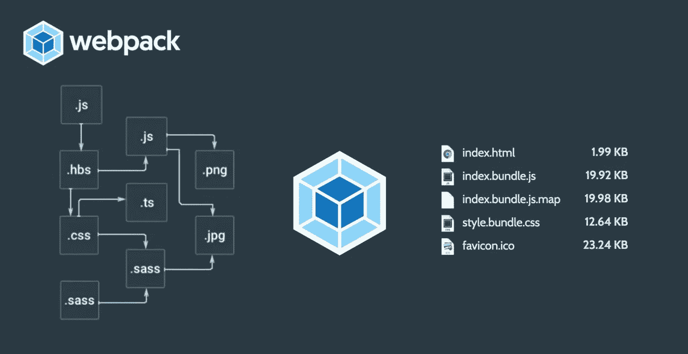
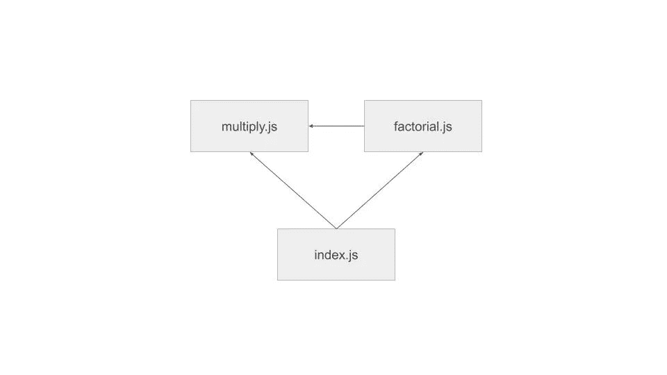

# 终极 Webpack 教程:理解现代 Javascript 魔力背后的向导

> 原文：<https://levelup.gitconnected.com/the-ultimate-webpack-tutorial-understanding-the-wizard-behind-the-magic-of-modern-javascript-a0efd12a2cdc>

在本文中，我们将了解 webpack 是什么，以及它的魔力如何革新了 React、Vue.js、Angular 等 Javascript 库和框架。我们将尝试将 webpack 作为一个独立的捆绑包，从零开始创建一个用于生产的捆绑包。



过去，浏览器在处理 Javascript 时非常得心应手。对于用户的几乎每一个动作，浏览器都会向服务器发送一个请求，服务器将处理应用程序背后的逻辑，用有限的 Javascript 构建一个新的 HTML 页面，然后将其发送回客户端。页面中包含的 Javascript 代码仅限于隐藏/显示一些元素、验证输入、处理简单计算或其他琐碎任务。

随着时间的推移，更多的任务从服务器端转移到了客户端。这极大地改善了用户体验，因为用户的每个动作，浏览器都在本地处理逻辑并相应地修改网站。向服务器发送请求的需求减少了，因此消除了请求-响应交换的时间延迟。

然而，这种改进是以代码复杂性为代价的。客户端处理的动作越多，浏览器中要执行的 Javascript 代码就越多。随着 Javascript 的增加，代码需要被分割到不同的文件中，有时需要数百个文件。这些大量的文件，在大多数情况下是相互依赖的，创建了一个非常复杂的依赖结构。

假设您正在导入所有这些相互依赖的文件。您很容易打乱导入它们的顺序，特别是当您试图在一段时间后维护代码和添加文件时。Webpack 的建立就是为了解决 web 开发中的这个主要问题。

Webpack 是一个模块捆绑器。它获取所有 Javascript 文件，为它们创建模块，构建依赖关系图，并将它们捆绑到一个 Javascript 文件中，您可以在 html 中导入该文件，而不必再担心依赖关系。这不是 Webpack 的唯一功能。通过使用加载器，它还可以将其他文件扩展名转换为常见的 Javascript，如 Typescript 和 ES6。但是我们稍后会谈到这个。换句话说，Webpack 对 React、Vue.js 和 Angular 的发展至关重要。

**区别:web pack-dev-server vs . web pack CLI**

值得注意的是 webpack 开发服务器和 webpack cli 之间的区别。前者是一个在开发过程中本地运行的服务器，它通过允许我们访问额外的特性，如热模块重载和自动绑定，使我们在开发过程中的生活变得更加轻松。热模块重装就是每次开发者修改代码时，自动重装正在开发的 app。自动绑定用于打包新的修改；它使用 webpack-cli。另一方面，webpack cli 是一个命令行工具，我们可以使用它将代码捆绑在一个文件中进行生产。

**教程:使用 webpack 从零开始捆绑一个简单的代码**

如果你曾经开发过 React 应用程序，你肯定用过 webpack。React 工具为您管理 webpack，因此您可能还没有从头开始使用它。本教程是让你开始。

如果您没有在本地安装 webpack 和 webpack-cli，您需要首先安装它们。

```
*npm init
npm install --save-dev webpack
npm install --save-dev webpack-cli*
```

让我们创建一个应用程序来计算阶乘(！)的一定数量:4！=4x3x2x1，并在浏览器的控制台中显示结果。

在项目主目录中，创建一个目录“src ”,我们将在这里放置 Javascript 源代码。我们将创建 3 个 Javascript 模块，一个定义乘法，一个定义阶乘积(取决于乘法)，一个调用特定整数参数的阶乘和乘法函数。

需要注意的是，在“index.js”中，“factorial”是在“multiply”之前以编程方式加载的。但是 webpack 会确保 multiply 会按照下面显示的依赖图加载。因此，它将忽略 index.js 中的第 2 行。



依赖图

我们还需要做一件事来捆绑我们的代码。我们需要配置我们的 webpack 才能正常工作。在 React 或其他任何库或框架中，这部分完全由 create-react-app 之类的工具管理。我们需要在项目基本目录中(而不是在“src”中)创建一个 webpack.config.js 文件。

在这个配置文件中，我们告诉 webpack 从“index.js”开始解析依赖项，并将它与它在。/dist/ directory(意思是发行版，其他人可能称之为‘build’)，在一个名为 bundle.js 的文件中。

要启动捆绑:
*web pack-tutorial % npx web pack-config web pack . config . js*

现在导入*。/dist/bundle.js* 并检查应用程序是否正常工作。

**使用装载机**

比方说，我们的 Javascript 文件是用 ES6 编写的(箭头函数)。为了能够捆绑这些文件，webpack 需要将它们转换成公共的 JS。因此，我们需要引用一个 webpack 可以用来进行这种转换的加载器。目前最受欢迎的是巴别塔。

为了使用 Babel loader，我们将需要 3 个依赖项:`babel-loader, babel-core,`和`babel-preset-es2015` ，因为我们想要处理 ES2015 代码并将其转换为 ES5。

webpack 配置文件修改如下:

您可以看到 loaders 是一个数组，这意味着我们最终可以根据应用程序的需要使用任意多的加载器。

*   `test`:这是一个正则表达式，用于捕获带扩展名的文件名。仅 js
*   `loader`:要使用的加载器
*   `exclude`:我们不希望 Babel 处理 node_modules 下的任何文件
*   `query.presets`:我们需要应用的巴别塔法则

这是对 Webpack 实际能做什么的一个小介绍。下一个明显的实验是处理。css 文件使用 css-loader，Angular 和 Typescript 文件，缩小和丑化代码。

我们越来越努力地改善用户的 UX/用户界面。随着业界大量使用不同的 Javascript 框架，我坚信 Webpack 是每个 web 开发人员的必备工具，现在比以往任何时候都更是如此。

**源代码:**[https://github.com/andgiete/webpack-tutorial](https://github.com/andgiete/webpack-tutorial)