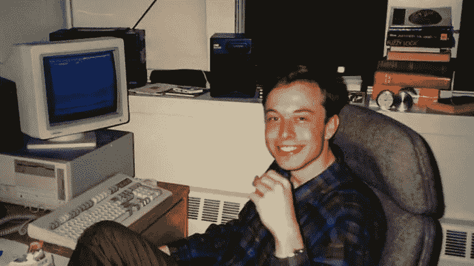
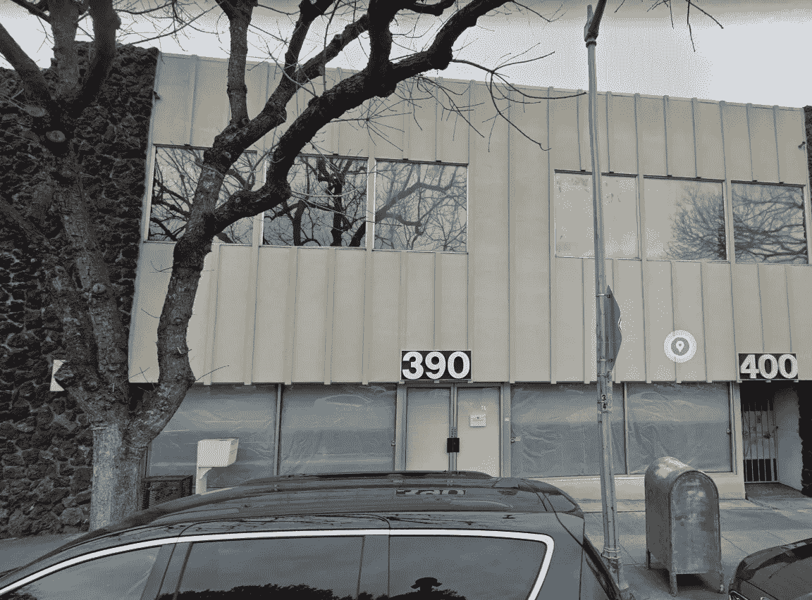
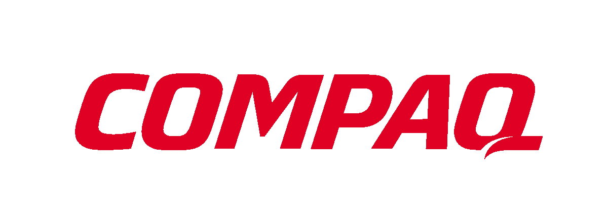

# 埃隆·马斯克第一家公司不为人知的故事

> 原文：<https://levelup.gitconnected.com/the-unknown-story-of-elon-musks-first-company-7481ef7867a3>

当谈到成功人士的背景故事时，总有比看上去更多的东西。我花了一些时间阅读了几本关于这些人的不同传记，主要是史蒂夫·乔布斯(Steve Jobs)和埃隆·马斯克(Elon Musk)，他们每个人的起源故事都比你经常听到的浅薄版本深刻得多。

对于埃隆来说尤其如此，因为很多人并不知道他为了达到今天的成就做了什么。

每个人都说，“哦，他来自一个稍微富裕的家庭，所以这并不令人印象深刻”，但他们不会去了解他为了达到这一点而经历的努力工作、不眠之夜、奉献和失败。

同时创建世界上最有价值的汽车公司和最具创新性的太空探索公司需要大量的工作，因此为什么不是每个人都能做到。

为了更多地了解埃隆·马斯克是如何实现这一疯狂壮举的，从他在美国的第一家公司的故事开始会有所帮助；Zip2。

# 一个想法。

为了开始我们的故事，我们必须回到 1995 年。

年轻的埃隆和他的哥哥金巴尔最近从南非搬到了美国，埃隆一直在加利福尼亚的硅谷地区做实习生。由于他在该领域的专业知识和兴趣，他为一些不同的科技初创公司工作。

在他的一次实习中，一名电话簿公司黄页部的销售人员走进了他的办公室。这位销售人员销售传统的黄页广告空间，但也试图让公司购买伴随传统纸质广告的在线列表。

然而，销售人员并不真正了解互联网，他对公司的推销最终失败了，因为他无法解释购买的好处。

然而，马斯克比许多人更了解万维网，因为他从很小的时候就开始研究和学习。

当他还是个孩子的时候，他说服父亲给他买了一台电脑。他的爸爸给他买了一台电脑，并附带了一本教基本编程语言的练习册。这本练习册原本需要六个月才能完成，但马斯克怀着对这个话题的极度兴趣，马不停蹄，三天就完成了。1984 年，12 岁的他甚至开发了一整套电子游戏，并以 500 美元的价格出售。

因此，当这位没有经验的黄页销售员甚至不明白他所销售的东西的价值时，埃隆有了一个主意。

他打电话给他的兄弟金巴尔，他们开始建立全球链接信息网络，后来更名为 Zip2。

# Zip2 解释道。

1995 年，互联网只是新兴技术雷达上的一个小光点。没有人真正理解它的用途，也很少有人看到它能提供的价值。

凭借其在该领域的专业知识，马斯克将试图说服实体零售企业、餐馆、沙龙和其他经常光顾的企业增加在互联网上的存在，并让世界了解自己。想想类似于 Yelp 或猫途鹰的东西，结合地图服务，指引你如何到达企业。

Zip2 会显示周围的企业，甚至帮助你到达那里。它远远领先于它的时代。

马斯克经常通过披萨的例子来解释他的新服务的概念。他会说，每个人都有权知道最近的比萨饼店在哪里，如何到达那里。

这是 Zip2 追求的概念。

# 成立公司。

当马斯克兄弟在加州帕洛阿尔托谢尔曼大道 430 号租下一间小办公室时，他们的愿景变成了现实。这间办公室大约有一室公寓那么大，绝对不是一个好位置。

但是，这里是硅谷，人们不介意在创业时弄脏自己的手。

Zip2 总部的原始位置。

从一开始，马斯克就自己完成了所有的编码工作，而金巴尔则负责销售。他们从一家 GPS 地图绘制公司获得了一些技术来访问本地地图，并使用本地目录来获取企业地址。

结合起来，这为 Zip2 的未来奠定了基础。

兄弟俩开始工作，并很快意识到创办一家公司是多么昂贵，尤其是在帕洛阿尔托。当他们得到大楼和所有需要的设备时，他们已经把钱花光了。因此，他们在接下来的三个月里住在他们的小办公室里，在当地的基督教青年会洗澡，直到他们攒够了钱，租了一套没有家具的两居室公寓。

他们最终找到了一些人加入他们的团队，并开始生产产品。1995 年年底，他们雇佣了 20 多岁的杰夫·海尔曼(Jeff Heilman)，他不知道自己想做什么，却对互联网着迷；他们还雇佣了克雷格·莫尔(Craig Mohr)，他是一名房地产经纪人，辞职从事技术工作；他们还雇佣了其他几名销售人员，收取佣金。

在产品开发过程中，这个乌合之众的团队试图在网站上销售商品。然而，该产品几乎不起作用，即使起作用，也极其缓慢。最重要的是，没有人能真正理解互联网的用途，所以当销售人员接近客户时，他们不感兴趣。

这使得 Zip2 从一开始就是一个发展非常缓慢的努力，它的边缘有点粗糙。埃隆大部分时间都在办公室，很少洗澡，早上团队来的时候，他经常趴在桌子上睡觉。

# 增长..但这是有代价的。

虽然销售并没有爆炸式增长，但产品在不断改进，这两兄弟试图实现的目标也越来越广为人知。

1996 年初，一家当地风险投资公司看到了 Zip2 作为一家公司的潜力。在埃隆·马斯克的一些平庸的演示技巧之后，风险投资公司感兴趣，并同意向他们提供 300 万美元的投资。就在那时，他们正式将自己的名字从 Global Link Information Network 改为 Zip2，并搬出了位于帕洛阿尔托剑桥大道 390 号的小办公室，搬进了一个更好的地方。他们还雇佣了一些真正的工程师来减轻 Elon 的压力，提高开发过程的效率。最后，他们决定彻底改变他们的商业模式，因为挨家挨户的销售方式并不奏效。

因此，他们利用自己的专业知识开发了一个软件包，出售给报纸，这将有助于这些报纸建立他们的房地产、汽车经销商和分类列表的在线目录。Zip2 没有让自己成为目录，而是让其他已经存在的公司有能力创建自己的目录。这是一个好得多的商业模式，并被证明比最初的愿景更有利可图。

升级后的 Zip2 地址位于剑桥大道 390 号。

马斯克被任命为首席技术官，新的首席执行官里奇·索尔金接替了他的位置。考虑到马斯克创建了这家公司并希望成为首席执行官，这并没有让他满意，但他暂时做出了决定，希望事情会自行解决。

事实证明，当其他工程师来帮助开发软件时，马斯克并不像他认为的那样是一个好的开发人员。新的团队成员不得不仔细检查并重写他的许多代码，这让他更加恼火。

但是，他的愤怒被他创办的公司新获得的成功所掩盖。看到 Zip2 的成长，他把骄傲放在一边，继续努力把公司做到最好。

# 最后的日子。

随着新战略和团队的到位，Zip2 在为其软件收购报纸方面取得了惊人的成功。事实上，他们获得了超过 50，000，000 美元，让一些知名人士加入进来，帮助他们更快地为自己的增长融资。1997 年，他们搬到了位于加州山景城卡斯特罗街 444 号的一个更大更好的办公室，并成长为一个拥有 100 多名员工的大型团队。

1998 年 4 月，据透露，Zip2 将与他们最大的竞争对手 CitySearch 合并，交易价值超过 3 亿美元。这听起来像是一次伟大的合并，但是，由于马斯克、管理团队和 CitySearch 人员之间的一些分歧，该计划最终被扼杀。

这造成了很大的紧张，加上埃隆对自己不能成为自己公司的首席执行官感到恼火，导致了很大的紧张，并使事情迅速走下坡路。该公司开始损失大量资金，人们开始争论他们是否应该专注于他们一直关注的报纸领域，或者回到他们开始的直接面向消费者的方式。

随着微软和其他公司推出地图软件，竞争越来越激烈，没有人能决定最佳路线。Elon 对他的工程师们精神枯竭越来越恼火，所以他会在他们不知道的情况下检查和改变他们的一些工作，导致更多的问题和更大的紧张。

事情看起来不妙。

但是，就在任何可怕的事情可能发生之前，一个梦想成真了。

# 卖掉公司。

1999 年，康柏出价 3.07 亿美元收购 Zip2。董事会毫不犹豫地同意了，公司出售了。

埃隆看到自己白手起家创建的公司在没有他的参与下被出售，变得很恼火。这给了他一种心态，他今天仍然不会让任何人成为他的公司的首席执行官，他可以控制和做出决定。

但是，即使有愤怒，这也是埃隆的好日子，他从收购中赚了超过 22，000，000 美元，这对当时来说是好的，并将帮助他进入更大更好的东西，如 PayPal，SpaceX 和特斯拉。