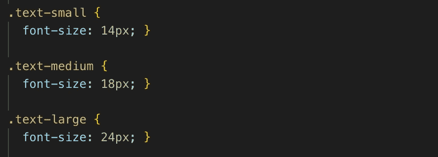

# 简而言之，有用的 SASS 特性——SASS cheat sheet

> 原文：<https://levelup.gitconnected.com/the-useful-sass-features-in-a-nutshell-sass-cheatsheet-c5767340d43b>

当设计大型应用程序时，尤其是使用普通的 CSS 时，我们都会有些沮丧。事情很容易变得非常混乱。使用 SASS 可以使事情变得容易得多。我列出了 SASS 的主要和最有用的特性，以及一些非常精确的描述和微小的代码片段。但在此之前，我假设你知道以下几点:

1.  常用的 CSS 属性
2.  对编程的基本理解(if/else，循环)

好吧！让我们开始吧。

# 变量和部分

您可以使用 SASS 中的变量特性来避免编写和修改重复的样式属性。让我们假设你有一个特定的文本颜色#000，用于网站元素的多个区域。您可以用以下方式声明变量:

`$text-color: #000`

若要使用属性，请在 SCSS 文件中的任意位置使用以下语法:

`color: $text-color`

您可以在一个单独的文件中定义公共属性，并使用`import`语句在实际的样式表中使用它们。

注意:文件名以下划线开头。这些文件在 SASS 中被称为 ***分支*** 。下划线表明 SASS 编译器不包含任何要翻译的 CSS 样式，只定义了可重用的变量或混合。我们稍后将研究 mixins。

要在实际的 SCSS 文件中导入变量，可以使用以下语法:

注意，我们既没有添加扩展名 ***。scss*** 或下划线。但是注意不要有两个同名的独立文件:一个带下划线，另一个不带下划线。将所有的部分保存在一个单独的文件夹中是一个好习惯，这样可以避免混淆。

# 混合蛋白

Mixins 对于为应用程序声明可重用的样式非常有用。

## **定义 mixin:**

假设您需要多个容器，这些容器将是一个伸缩盒，具有包装动作，并在中心对齐子容器(水平和垂直)。您可以用以下方式定义 mixin:

## **使用混音:**

那很简单。但是混血儿并不止于此。您还可以在 mixins 中发送参数和内容。

## **发送参数:**

注意上面的 mixin。我们正试图创建一个可重复使用的边界样式，可配置的边界半径和宽度。这里，4px 和 1px 分别是 border-radius 和 border-width 的默认值，以防有人错过传递参数。要使用这个 mixin，您可以参考下面的代码片段:

如果默认值对您合适，可以跳过参数部分。但是，如果您想要传递其中一个参数，很容易编写以下代码，并且它会工作:

您可以传递边界半径并跳过其他参数，因为这是第一个参数。但是我们如何跳过边框半径而只传递宽度参数呢？这样-

## 嵌套混合:

## 混合内容:

Mixins 还可以包含一些您可能想要提供的额外样式/内容，由关键字`@content`表示。

## 将 mixin 用于内容:

# **Mixin + Imports**

将您的 mixins 存储在一个不包含任何 CSS 声明的单独文件中，并使用`Import`语句来使用它们，这是一个很好的实践。

# SASS 中有用的内置函数

SASS 有很多内置函数，我列出了四个有用的函数来处理颜色和不透明度。

## **变亮:**

可以将颜色变浅到指定的百分比。

语法:

正如你所看到的，函数的第一个参数是颜色本身，第二个参数是你想让颜色变亮的百分比。

## **变暗:**

类似的参数(如“变亮”)则相反，将任何颜色变暗到指定的百分比。

很方便，不是吗？

## **透明化:**

使任何颜色透明。

上述代码会导致以下结果:

# SASS 或“Extends”关键字中的继承

您可以使用 SASS 中的关键字 *extends* 来**继承**或 **extend** 任何类或其他选择器的属性。

我们在`common-error`类中定义了一些样式，使用`extends`关键字，我们将能够在另一个类中使用相同的样式(这里是`email-error`)。

将上述代码转换成 CSS 后，会产生以下样式:

此时，您可能想知道为什么不在这里使用 mixin，或者哪种方法更好——mixin 还是 extends？我在最后包含了两个链接，强烈建议在确认任何一种方法之前仔细阅读。

# For 循环和 Each 循环:

您可以在 SASS 中使用循环来编写应用程序中使用的重复样式，例如:

**For 循环**在 SASS 中可以用来迭代数字。

使用 SASS for 循环特性，可以将上面的代码片段转换为以下代码:

这里，`$width`是每次迭代的值。注意类名中迭代值的使用。`#{$variable}` —您可以在 SASS 代码中的任何地方使用该语法将变量与其他字符串组合在一起。

SASS 中的每个循环都可以用来遍历列表。SASS 中的列表基本上是一些值的数组。我们可以有一个字符串/名称的列表并遍历它。每个循环的语法与 for 循环几乎没有什么不同。它以`@each`关键字开始，用`in`代替`through`。查看以下片段:

所以我们有一个颜色列表😜)并使用每个循环，我们可以得到以下结果:

# 萨斯的地图

Maps 是键值对的数据结构。您可以使用 SASS 遍历地图。

让我们创建一个不同字体大小的标题图:

您可以使用每个循环遍历地图，并将键值赋给一些变量。下面给出了例子:

上面的循环将转换成下面的 CSS 代码；

在 SASS 中，这些是我认为最有用的特性。还有 if/else 之类的其他特性和函数可以参考。

非常感谢你的阅读。希望这有帮助。

关于 mixins vs extends 的文章—

 [## Mixins 性能更佳

### 哈利·罗伯茨写的 CSS 魔法。目录使事情更真实的实验混合是…

csswizardry.com](https://csswizardry.com/2016/02/mixins-better-for-performance/)  [## Sass Mixins vs Extends:数据

### 最近，关于在 Sass 中使用 mixins 还是扩展的争论越来越激烈。从表面上看，他们似乎都…

tech.bellycard.com](https://tech.bellycard.com/blog/sass-mixins-vs-extends-the-data/) 

快乐的斗嘴！