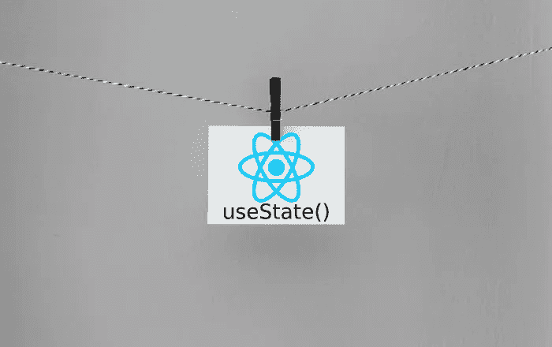

# React 中的 useState 挂钩

> 原文：<https://levelup.gitconnected.com/the-usestate-hook-in-react-e7bdaf514f7>

## 最后，一些实际上使生活更简单的东西



由 [Kelly Sikkema](https://unsplash.com/@kellysikkema?utm_source=medium&utm_medium=referral) 在 [Unsplash](https://unsplash.com?utm_source=medium&utm_medium=referral) 上的照片修改而来

总会有新的方法来做事情。有时候，实际上更好。

当我摸索到`useState` plus 功能组件组合时，我松了一口气。

是啊！这个其实更简单。

```
import { useState } from ‘react’;function philosophyComponent(){
  const [profoundInsight, setProfoundInsight] = useState(“Beauty and Truth are One.”);
  return (<div>{profoundInsight}</div>)}
```

所以语法一开始有点令人不快，但实际上非常简单。正在发生的是`useState`将两个变量放入组件函数的名称空间:一个值和一个函数。

在本例中，创建了一个名为`profoundInsight`的变量，默认值为“美与真合一”。

一个名为`setProfoundInsight`的函数也被公开，当被调用时，这个函数将改变`profoundInsight`变量的值。

记住:不要在 React 中直接改变状态变量本身(`profoundInsight`)，总是使用 setter 函数。

让我们进一步分析语法，一般形式是这样的:

`[valueHolder, setterFunction] = useState(defaultValue)`

括号是数组析构的一个例子。我个人认为这是这个想法的一个很好的例子，否则有点不靠谱。基本上，useState 返回一个两元素数组，我们将它“析构”成两个命名变量。

让我们扩展这个例子来使用 setter。你可以在这里看到这个运行的。

```
function PhilosophyComponent(){
  const [profoundInsight, setProfoundInsight]=React.useState("Truth and Beauty are One");  
  return (
    <div>
      <div>{profoundInsight}</div>
        <button onClick={() => setProfoundInsight("Life is not a problem to be solved.")}>Change Message</button>
    </div>
   );
};
```

我们添加了一个调用`setProfoundInsight` setter 函数的按钮。它只是工作。

这也很好，因为我们的功能组件有一个它们将要使用的状态列表。setter 函数实际上枚举了函数名称空间唯一可能的状态操作。

(顺便说一下，是的，我知道内联事件处理程序的可怕之处。[看这个](https://cdb.reacttraining.com/react-inline-functions-and-performance-bdff784f5578)。)