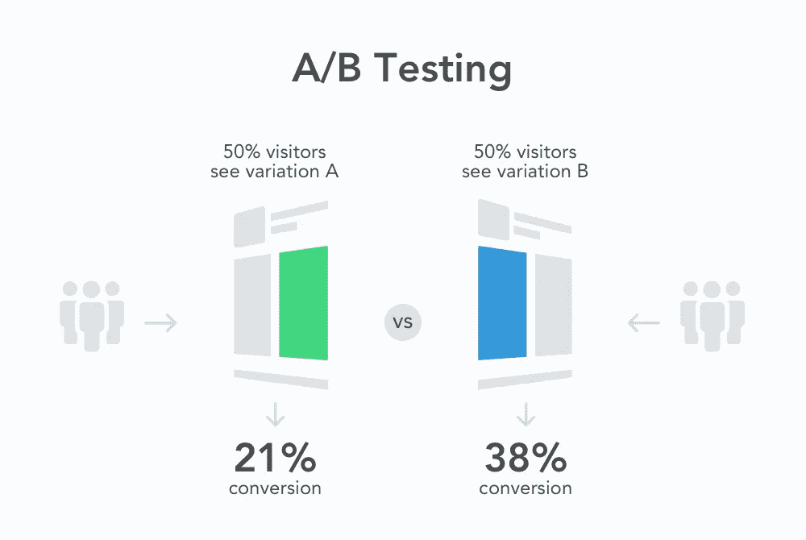

# A/B 测试在数据科学中的价值:如何使用实验来改善结果

> 原文：<https://levelup.gitconnected.com/the-value-of-a-b-testing-in-data-science-how-to-use-experimentation-to-improve-your-results-d08a66e9c23f>

A/B 测试，也称为分裂测试或随机控制试验，是数据科学家用来比较不同治疗或干预措施有效性的强大工具。通过将参与者随机分配到对照组和测试组，然后测量每组的结果，数据科学家可以确定哪种治疗更有效，并做出更明智的决定。

在本文中，我们将介绍 A/B 测试的基础知识、在数据科学中使用这种方法的优势、要避免的常见陷阱，以及 A/B 测试的实际例子。

## A/B 测试的基础

*   A/B 测试包括比较两种版本的治疗或干预，以确定哪一种更有效。
*   对照组接受标准治疗，而试验组接受实验治疗。
*   然后比较两组的结果，以确定哪种治疗更有效。
*   A/B 测试有助于识别数据中的模式和趋势，并根据经验证据做出更明智的决策。

## A/B 测试的优势

*   A/B 测试允许数据科学家确定不同治疗或干预的有效性。
*   通过比较对照组和测试组的结果，数据科学家可以确定数据中的模式和趋势，否则这些模式和趋势不会显而易见。
*   A/B 测试可以帮助数据科学家做出更明智的决策，并提高他们预测和分析的准确性。

## 在 A/B 测试中要避免的常见陷阱

*   A/B 测试中最大的缺陷之一是没有考虑到偏差。当对照组和测试组没有被适当地随机化，或者当样本量太小而不具有统计显著性时，会发生这种情况。
*   另一个常见的错误是未能正确定义假设或结果度量。没有明确的假设和可靠的结果测量，A/B 测试的结果可能不可靠。
*   为了避免这些陷阱，数据科学家应该仔细规划他们的 A/B 测试，使用足够的样本量，并仔细分析结果，以确保它们是可靠和有效的。

## 行动中的 A/B 测试示例

*   A/B 测试通常用于数据科学领域，以优化网站设计和改善用户体验。例如，一个电子商务网站可能会进行 A/B 测试，以比较产品页面的两个不同版本的有效性。
*   数据科学中 A/B 测试的另一个例子是使用实验来提高预测模型的准确性。例如，数据科学家可能会使用 A/B 测试来比较给定数据集上两种不同机器学习算法的准确性。

好了，让我们结束吧！A/B 测试对于数据科学家来说是一个非常有用的工具。它可以帮助你找出哪种治疗或干预是最好的，看到数据中的模式，并做出更明智的决定。但是如果你想从 A/B 测试中获得最大收益，你必须小心。好好计划你的实验，避免常见错误，彻底分析你的结果。

如果你想了解更多关于 A/B 测试和数据科学的知识，一定要关注我的 Medium。我分享了关于如何充分利用数据的各种真知灼见和技巧。所以不要等待，今天就开始跟随我，成为一名数据科学专家！