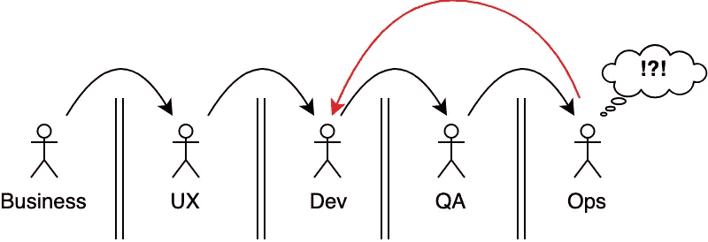
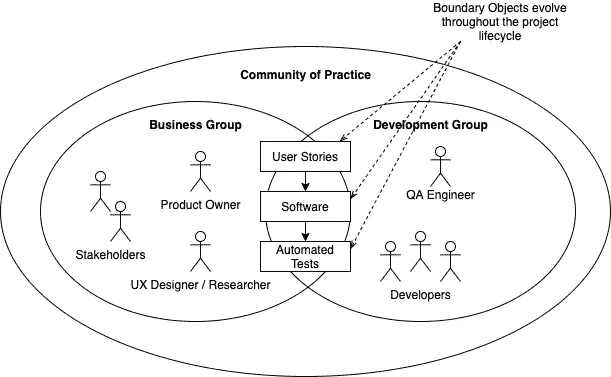
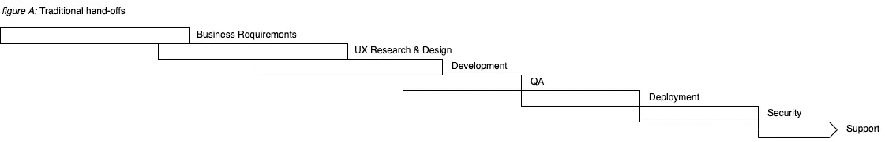
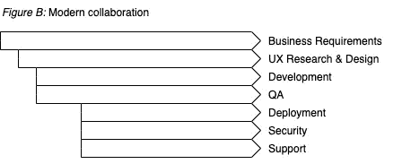

# 困惑之墙

> 原文：<https://levelup.gitconnected.com/the-wall-of-confusion-623057a4dd26>

## DevOps 必需品

混乱之墙导致浪费。

# 背景

“困惑之墙”是一个 DevOps 术语，由安德鲁·克莱·斯查费([agile roots 2009](https://www.youtube.com/watch?v=Y_u84PNrX9g)~ 17:00 mark)和李·汤普森( [Dev2Ops 访谈](http://dev2ops.org/2009/09/qa-lee-thompson-former-chief-technologist-of-etrade-financial/))推广。它指的是这样一种现象，即价值流中的一个团队在将工作传递给下一个团队时，他们的工作接近完成。

典型的例子是，开发人员将他们的代码“越过墙”扔给他们的运营同事，而忽略了必须做些什么来使他们编写的软件进入可部署状态。这通常会导致运营团队努力部署软件，导致发布的重大延迟，并增加缺陷和其他问题的风险。

然而，这种现象并不仅限于开发和 IT 运营。同样的事情也可能发生在 QA、安全运营、UX 设计、架构、法律和/或支持之间的移交。关键是墙可以存在于发生移交的任何地方，并且是工作流中摩擦的重要来源。需要理解需求，需要设计用户界面，必须进行测试(最好是自动化的)，必须编写和部署代码。当缺乏使工作顺利进行所必需的信息时，结果会更复杂，耗时更长。

结果在我们的工作流程中纯粹是浪费(参见这篇关于太极大野[七种浪费](https://kanbanize.com/lean-management/value-waste/7-wastes-of-lean/)的伟大文章)。例子包括沟通中的开销，缺陷被传递到下游导致回流，由于过度的认知负荷导致的上下文切换，以及过度设计的解决方案。从组织设计或业务角度来看，这毫无意义。

以下基本概念可以为我们提供一些可能的方向来缓解这些问题。

# 打破筒仓

好的软件组织团结在一个共同的目标周围，确保他们的产品尽可能高效地到达客户手中，并且质量完好无损。这相当于团队跨越由部分技术栈、交付工作流中的步骤以及由组织和管理创建的人为边界而工作。

这种协作可以通过多种方式进行，包括:

*   团队中最适合做这项工作的人之间的公开透明的沟通渠道。
*   由具有更广泛技能组合的人组成的跨职能团队能够更好地削减沟通开销，并更好地准备好观察所有阶段的交付。例如，具有一些操作能力的全栈开发人员，以及嵌入式 QA 人员、UX 设计人员和产品负责人，应该能够处理交付到产品所需的大量任务，而很少或没有移交。
*   团队可以使用自助工具来部署和运行他们自己的软件。这就是“你建造它，你运行它”背后的思想([原创？采访沃纳·威格尔](https://queue.acm.org/detail.cfm?id=1142065) —见 PDF，[亚特兰蒂斯文章](https://www.atlassian.com/incident-management/devops/you-built-it-you-run-it)，[亚马逊文章](https://aws.amazon.com/blogs/enterprise-strategy/enterprise-devops-why-you-should-run-what-you-build/)，
*   来自团队的代表参加彼此的敏捷仪式(例如，每日站立、演示、回顾等。).
*   团队将他们自己开发的工具作为消费者和贡献者提供给其他团队。创建成功的库比良好的意图要多得多，但是通过开始互相帮助，团队已经走上了正确的道路。

通过合作打破这堵墙。一个软件组织作为一个团队会成功或失败，所以最好作为一个实际的团队来面对交付。

## 要考虑的行动

1.  通过在需要定期协作的团队之间建立沟通渠道，跨越团队界限开展工作。团队应该留意合作的机会，并乐于互相帮助。与其他团队的主题专家结对编程、重用代码和知识共享会议都是这种情况如何发生的例子。
2.  发起跨团队项目。共同感兴趣的模块，比如共享 lint 规则、共享模块、可重用组件和项目框架/样板，都是多个团队可以维护的项目的例子。
3.  为有共同兴趣的社区建立行会(例如 JavaScript 行会、DevOps 行会)，以讨论共享的实践、建立一致性并共享知识和学习。

# 边界对象

一些首先发现困惑之墙的人引用了马里克的边界物体。这是一份很好的研究(而且很简洁！).这是由、Gal 和 Tan 进行的更深入的探讨。

这个概念相当于一种方法，确保来自不同领域的各方通过各种工件在一个问题上进行合作。当他们走到一起时，他们就形成了一个“利益共同体”,对问题达成共识。他们朝着解决方案进化——这意味着边界对象可能会随着解决方案的出现而改变。从软件的角度来看，很可能是通过工作软件和任何伴随的工件来确保软件的正确性。通过这种合作，这些利益群体可以设计出比任何一方单独行动都有效得多的解决方案。

Agile 项目设置中边界对象的可能示例。

在项目的早期阶段，快速原型或线框可能是边界对象。在后期阶段，可能是自动化测试。

敏捷用户故事是边界对象的一个著名例子。[看板卡](https://www.atlassian.com/agile/kanban/cards)是这种边界对象的另一种形式。这两种类型都被格式化得足够小，以便在系统中跟踪工作。尽管如此，它们也可以包含更深层次的信息，以[小黄瓜](https://cucumber.io/docs/gherkin/reference/)的形式、图表、模型、讨论、决策以及完成工作所需的任何其他相关信息。

这并不是说边界对象应该成为所有可能信息的转储场，而是“刚好足够”正确地完成工作，以获得下一阶段发展的解决方案。

这些类型的边界对象在许多方面都很有用:

*   所涉及的各方可以记录和跟踪完成工作所必需的细节以及任何附加的上下文，
*   在花费大量时间和精力构建解决方案之前，可以以轻量级的方式对其进行规划。
*   在构建阶段，它们可能是一个简单的参考，因为它们包含了工作成功结果的远景。
*   它们可以成为作品在整个生命周期中的历史，为后代保存下来。
*   它们可以是实现敏捷性的即时解决方案。他们不需要全面，只要每个人都得到他们需要的，并能通过系统跟踪工作。
*   他们通常非常健谈。一目了然，团队可以看到工作的亮点以及它在工作流中的位置。

熟悉敏捷的团队可能认识这些工具。它们很容易理解，也很容易被采用。

## 要考虑的行动

1.  通过敏捷框架(Scrum、看板)采用边界对象。工具由您决定，但是重点是识别团队的工作流，并在整个生命周期中跟踪工作。这将提供简单的洞察，如所做工作的数量和类型及其状态，以及更微妙的信息，如跨任务依赖性和其他瓶颈。在迈出这重要的第一步之前，工作优化不会尽可能有效。
2.  一旦工作可见，后退一步，确保团队建立实践，如限制 WIP，让团队成员在开始新工作之前解除对其他人的阻止，以及任何其他使工作流更顺畅的行动。
3.  当团队对边界对象感到满意时，就该考虑价值流图了。这是一个流程，来自价值流所有部分的代表(代表从开始到最终向客户交付价值的工作流程的连续步骤)聚集在一起，制定整个流程，并估计每个步骤的持续时间。这让整个团队对整个价值流有了更广泛的理解，并对瓶颈所在有了更深入的了解。

# 左移位

左移([维基百科](https://en.wikipedia.org/wiki/Shift-left_testing)，[智能熊文章](https://smartbear.com/learn/automated-testing/shifting-left-in-testing/))是一个可以追溯到软件工程早期的概念，最近在 DevOps 运动中获得了很多支持。

它指的是脱离串行流程，在串行流程中，部分流程(如开发、QA 和部署)仅在一个步骤完成后按顺序执行。相反，这个想法是让不同类型的工作重叠，甚至通过更早开始来完全并行地运行。所以请不要等到一个模块的功能 100%完整时再去测试它。不要等到整个应用程序完成后才运行性能测试、安全审计或实际的生产部署。尽早完成，这样团队就可以解决任何问题，到软件完成时，对产品的信心会更大。

所以传统的方法可能是这样的:

顺序工作流程导致效率低下。

向左移动应该会产生与此更接近的结果:

并行、协作的工作流效率更高，长期效果更好。

因此，左移是为了在责任方之间实现更快的整体交付和更早的合作。它还增加了整个大型团队的主人翁意识，并提供了更好的连续性。

左移的另一个重要部分是在左移时自动完成工作，并成为系统设计的一部分。这是在*凤凰计划*中引入的一个至关重要的概念(参见我的[书籍摘要](https://medium.com/@sak_to/book-summary-the-phoenix-project-42ebf68addbd))。核心思想也体现在*的第一种开发方式*中，即最大化吞吐量。通过在过程的早期转移工作领域，并鼓励领域专家之间的协作和自动化，可以获得巨大的效率和质量收益。

还有其他因素，但这将是另一篇文章的素材。

## 要考虑的行动

1.  让下游的同事参与工作流程的早期部分。他们可以洞察早期活动如何使他们的工作流程更快，甚至提供主题专业知识来增强您的工作。
2.  接受这样的观点:我们必须在价值流的每一步不惜一切代价避免将缺陷传递到下游。这意味着实现以质量为中心的测试自动化和开发实践。以这种方式工作是我们不断改进工作流程的责任所在。
3.  确定并授权下游团队的倡导者与上游团队合作，将他们的专业知识注入到流程中。例如，一个安全倡导者可以与开发人员一起工作，教导他们有关安全的问题，并帮助他们集成自动化工具以尽早发现重大问题。让这种实践成为所有团队日常工作的一部分。

# 结论

坏消息是，这些变化是一种根本性的文化转变——也就是说，它们很难实现。迎接这一挑战需要各个层次的组织齐心协力:上层管理、业务、运营、支持、开发和质量保证。这些集团需要团结起来，抛开领土争端和宿怨，专注于快速提供高质量的产品。不是组织的每个部分都能胜任这项任务。

好消息是，有许多方法可以征服这堵墙，组织的任何部分都可以从今天开始进行必要的转变。改变可以从试验不同工作方式的小组或许多小组开始。领导支持的水平将影响这里的可能性。

最终，没有对软件交付流程开发更全面的观点的软件组织将会遭受混乱之墙的后果。他们付出的代价是更慢的交付节奏(每月一次的部署或者更糟)，导致缺陷的糟糕的代码质量，定期的重组和重写，以及变革具有挑战性的文化。随着越来越多的公司开始意识到开发运维、敏捷以及相关实践和模式的好处，那些未能发展的组织将会落后太多而无法赶上并消失。

# 参考

Drew Firment 在*cloud rumbles*就同一主题写了一篇[非常棒的文章](https://cloudrumblings.io/devops-tear-down-the-wall-46656151d71d)，我在研究这篇文章时很喜欢。请检查一下！