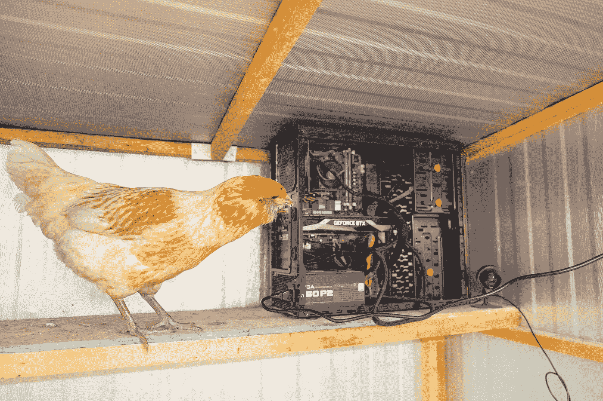

# 华尔街日报写了我的加密货币鸡

> 原文：<https://levelup.gitconnected.com/the-wall-street-journal-wrote-about-my-cryptocurrency-chickens-1665c3d72e05>

作者供图。

今天早上,*《华尔街日报》*发表了一篇关于我使用加密货币采矿计算机种植西红柿并保持我后院小鸡温暖的实验。

 [## 今年冬天冷吗？亲近挖掘比特币的电脑

### 随着冬天的临近，丹·范·德·斯特担心他每年的水电费会飞涨，因为他的五口之家…

www.wsj.com](https://www.wsj.com/articles/computer-videogame-bitcoin-mining-heat-11611072131) 

感谢《华尔街日报》的[莎拉·e·尼德曼](https://medium.com/u/3c1430340e6d?source=post_page-----1665c3d72e05--------------------------------)的精彩报道！

想深入挖掘吗？这是我在*调试器*中关于番茄实验的一篇文章，其中包含了大量关于我的挖掘设置的细节:

 [## 我用我的秘密采矿电脑的热量种植西红柿

### 任何值得设计的东西都值得过度设计

debugger.medium.com](https://debugger.medium.com/i-grew-tomatoes-with-the-heat-from-my-crypto-mining-pc-b5875489797) 

你也可以阅读我的[生活的科技捷径](https://debugger.medium.com/tagged/tech-shortcuts-for-life)关于使用 Nicehash 和任何 PC 自己挖掘一点比特币的文章。在我的番茄实验中，我使用了 Nicehash(以及现在已经不存在的 Honeyminer ),现在我用它来帮助我的鸡保持温暖。

 [## 如何在几乎任何电脑上挖掘一点比特币

### 如何在没有失去房子风险的情况下体验比特币

debugger.medium.com](https://debugger.medium.com/how-to-mine-a-little-bitcoin-on-nearly-any-pc-8a0601ec858d) 

我还用加密货币采矿来给我的家供暖。这里有一个视频:

以及详细的记录:

 [## 用加密采矿给我家供暖

### 这可能是周围最绿色的热量

medium.com](https://medium.com/swlh/heating-my-home-with-crypto-mining-137d2a29b62a) 

担心加密货币开采的环境成本(如果你不担心，你应该担心！).这里有一篇关于太阳能采矿的文章。

 [## 太阳能加密宣言

### 我把 solar 和 crypto 配对来多赚 500%。以下是我如何扩大我的概念验证。

medium.com](https://medium.com/swlh/a-solar-crypto-manifesto-95c6422802a4)