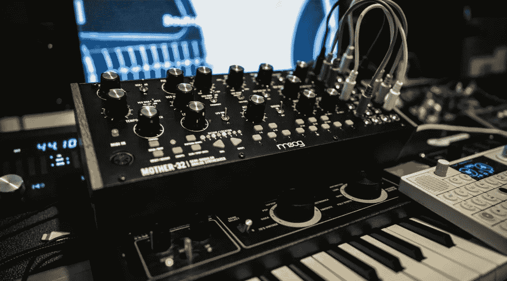

# 网络充满了反应的声音

> 原文：<https://levelup.gitconnected.com/the-web-is-alive-with-the-sound-of-react-bb0713aa1010>

## 使用 Web 音频 API 在 React 中构建音调发生器

[*Web Audio API*](https://developer.mozilla.org/en-US/docs/Web/API/Web_Audio_API) 是一款在 Web 浏览器中播放、创建、编辑和分析音频的神奇工具。使用网络音频 API 可以做很多事情。最初让我兴奋的应用程序是它可以用来生成和播放音调，允许开发人员构建基于浏览器的乐器。(关于这个很酷的例子，请看[暴力特雷门琴](https://mdn.github.io/violent-theremin/)。)

最近，我开发了一个应用程序，允许用户创建和保存多个可定制的合成器垫，并使用它们来播放音乐。在本文中，我演示了通过使用带有 React 的 Web Audio API 来创建可定制面板的方法。

我们完全可定制的 synth pad 将允许用户创建多个音调，当用户单击浏览器窗口中的一个元素时，这些音调将同时播放。

我们将使用 React 来创建这个应用程序，所以让我们从运行`npx create-react-app synth-pad`开始。在文本编辑器中打开文件夹，并导航到`App.js`。

首先，我们将设置我们的显示元素。删除`App.js`中的启动器代码，替换为:

(如果重命名 App.js，请确保重构 index.js 中的导入和呈现方法，以呈现正确的组件)

术语*“振荡器”*在上面的代码片段中频繁使用。这个术语指的是可以使用网络音频 API 创建的`[OscillatorNode](https://developer.mozilla.org/en-US/docs/Web/API/OscillatorNode)`。振荡节点是我们用来产生音调的。

现在我们已经有了页面视图的轮廓，我们可以开始编写音调发生器的代码了。

使用 Web Audio API 时需要做的第一件事是初始化我们的`[AudioContext](https://developer.mozilla.org/en-US/docs/Web/API/AudioContext)`。我更喜欢通过执行以下操作来初始化类常量:

现在，我们可以将这个类导入到我们的应用程序中，并在任何我们喜欢的地方使用音频上下文。

以`[GainNode](https://developer.mozilla.org/en-US/docs/Web/API/GainNode)`的形式初始化我们的主音量控制也很重要。由于这将连接到我们所有的振荡器，我们还将主音量初始化为类常量:

现在我们想使用`[setValueAtTime](https://developer.mozilla.org/en-US/docs/Web/API/AudioParam/setValueAtTime)` 设置`GainNode`的输出音量，并将其连接到`AudioContext`。然后，我们将声明 state 来保存`masterGainNode`的值，并在应用程序呈现时使用生命周期方法来初始化节点:

现在我们将使用类名`.master-volume`来设置范围滑块，以改变`masterGainNode`的增益值。为此，我们将设置滑块的最小-最大范围和值，然后创建一个函数来改变`masterGainNode`的音量:

现在我们可以改变`masterGainNode`的音量，这将把我们的音频输出连接到我们应用程序中的每个输入节点。如果我们将`console.log(Audio.masterGainNode.gain.value)`放在`changeMasterVolume`函数的末尾，我们会看到`masterGainNode`的增益值随着它所连接的范围滑块而变化。

既然主增益设置正确，我们就可以开始产生音调了。

我们首先创建一个函数来创建一个新的`OscillatorNode`，它将连接到自己的`GainNode`，然后每当点击“添加新振荡器”`button`时，它将连接到`masterGainNode`。然后，我们将把`OscillatorNode`、`GainNode`以及新振荡器的频率、波形和音量的值存储在一个数组中。

既然我们可以创建振荡器，我们需要能够看到它们以及它们的值。我们将把它们作为选项呈现在`.select-oscillator`元素中。然后，我们将向 select 元素添加一个`onChange`事件处理程序，它将我们的状态设置为保存所选`OscillatorNode`的索引。我们还将重构`addOscillatorNode`，将`selectedOscillatorNodeIndex`设置为新`oscillatorNode`的索引。接下来，我们可以将选中的`OscillatorNode`与 app 中的`input`和`select`元素连接起来。

最后，我们将设置`input`元素的值来反映所选`OscillatorNode`的值，并创建`OnChange`事件处理程序来更新所选`OscillatorNode`的值。完成所有这些后，我们的应用程序应该是这样的:

既然我们已经有能力创造和改变`OscillatorNodes`的价值，我们需要做的就是增加发挥它们的能力。我们将通过向`button.play`元素添加`onMouseDown`和`onMouseUp`事件处理程序来实现这一点。当按下按钮时，这些按钮使用`[setTargetAtTime](https://developer.mozilla.org/en-US/docs/Web/API/AudioParam/setTargetAtTime)`将`masterGainNode`的增益快速淡入指定的增益值，当松开按钮时，将`masterGainNode`的增益快速淡出。

我们现在有了一个工作的合成器垫，可以播放我们想要的任意多的振荡器。

`SynthPad.js`的最终版本应该是这样的:

Web Audio 等 API 使得快速创建强大而有趣的应用程序变得更加容易。我希望你喜欢你的新合成器。感谢阅读。摇滚起来。

*对于感兴趣的人，这里有一个我的 GitHub 回购的链接:*

 [## 李哥-w/合成垫

### 这个应用程序是为我在 medium 上的一篇文章开发的，标题是“网络充满了 React 的声音:构建音调发生器…

github.com](https://github.com/Lige-w/synth-pad)