# 网络排版

> 原文：<https://levelup.gitconnected.com/the-web-typography-eb92cdd9b534>

## 字体样式的 CSS 属性有哪些？

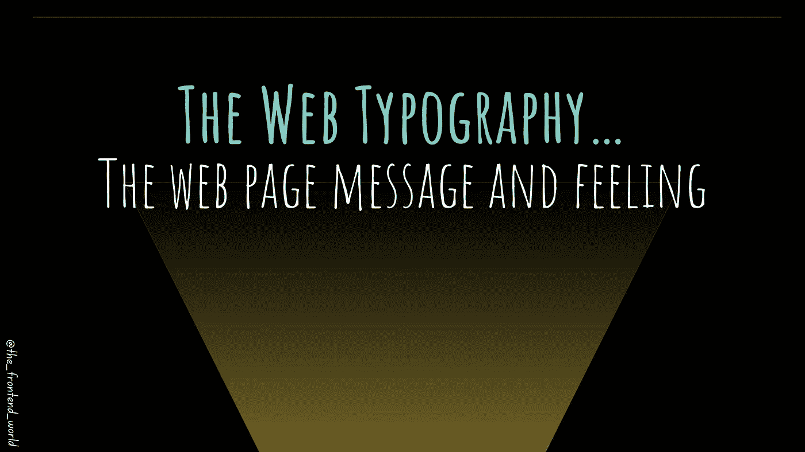

作者:FAM

这次是关于排版！

网页版式表现了我们在每个网页上看到的字母和文本。它是关于选择文本的大小和间距的样式。排版不仅是关于网页的美观，也是关于可读性和用户体验。

通过网页上的文字，你可以表达情感。因此，应该明智地选择字体，创造一种良好的感觉，与你的网页内容和信息相得益彰。

顺便说一句，当我谈论排版的感觉时，我的意思是😜

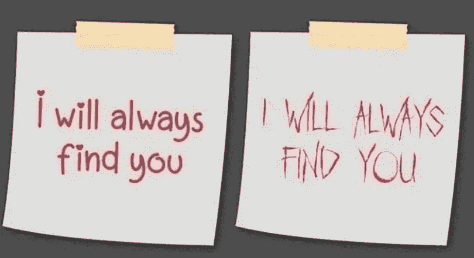

# 可用于排版的 CSS 属性

你可以使用许多工具来表达你的网页信息和感受。这些工具是 CSS 属性，允许您定义文本的颜色、大小、间距和形状。

## 颜色

定义**文本**的颜色。它可以是颜色名称。但是对于特定的颜色来说，它们通常不是很有趣。然后，您可以使用十六进制颜色(例如，`#ffffff`代表白色)或`RGB` / `RGBA`代表红色、绿色和蓝色。`a`表示颜色的不透明度:

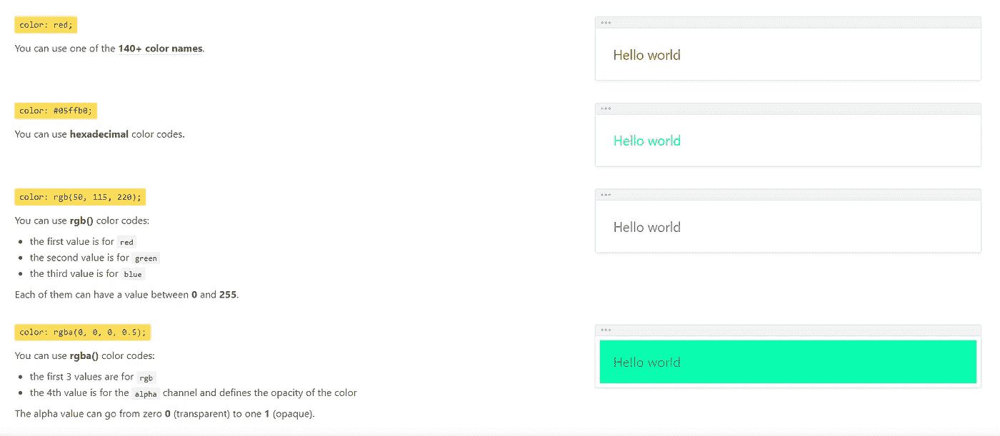

[按 CSSReference](https://cssreference.io/typography/)

## 字体系列

定义文本的字体。这里有一个例子:

```
font-family: "first-font-name", "second-font-name", sans-serif;
```

**字体系列的列表**字体(“第一字体名”、“第二字体名”)定义了浏览器选择字体系列的优先级**。如果找到第一种字体有问题，那么浏览器将显示下面的字体，以此类推。**

在这个例子中，浏览器将尝试使用可用的`first-font-name`。如果它找不到，它会尝试使用`second-font-name`。如果不可用，它将使用浏览器的`sans-serif`字体。

`first-font-name`和`second-font-name`不是真正的字体名称。这里使用它们只是为了举例说明它们的规则。

真实例子:

```
font-family: "Source Sans Pro", "Arial", sans-serif;
```

## 字体大小

定义文本的大小。

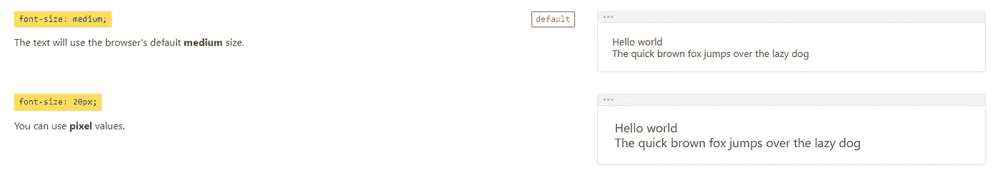

[按 CSSReference](https://cssreference.io/typography/)

您可以根据自己的体型使用其他单位，例如:

`***em***`:该值是**相对于**父**的`font-size`。**

`***rem***`:该值是相对于**根元素的** `font-size`的**。因此，文本将取决于上下文。**

`***%***`:百分比的**值是**相对于**父**的`font-size`。****

## 字形

定义文本倾斜的程度。分别是:`***normal***`、`***italic***`和`***oblique***`:

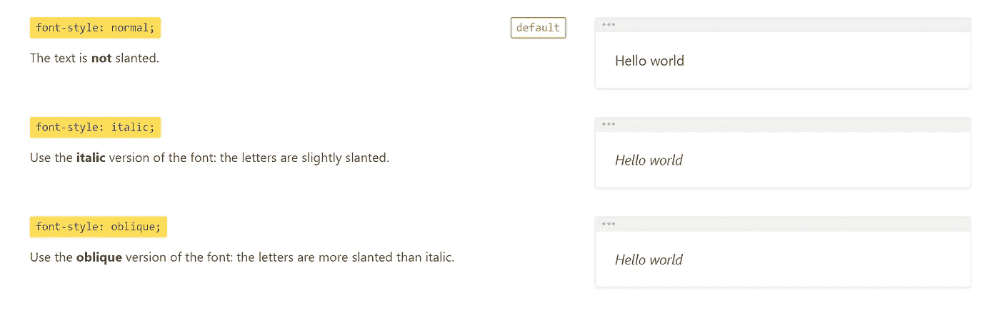

[按 CSSReference](https://cssreference.io/typography/)

## 字体变体

定义每个字母使用的字形。

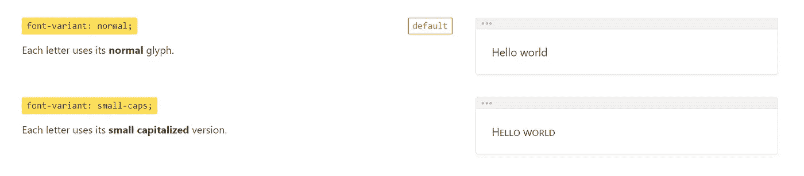

[按 CSSReference](https://cssreference.io/typography/)

## 字体粗细

定义文本的粗细。可以是`***normal***`(默认值)、`***lighter***`、`***bold***`，一个数字，

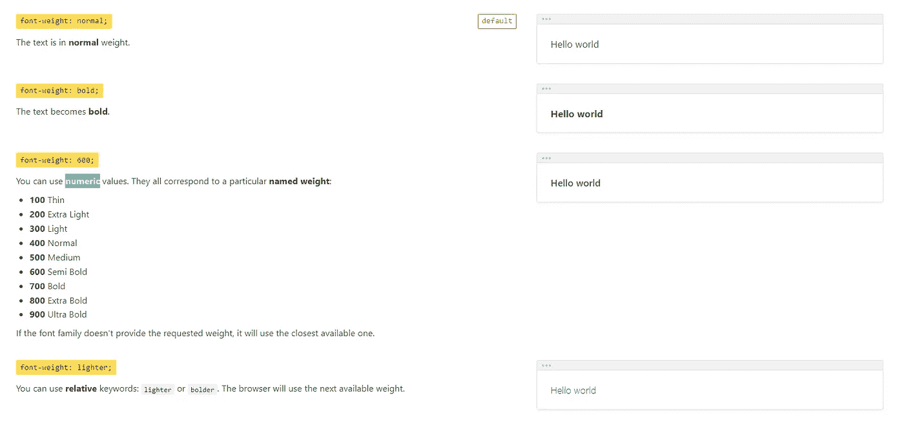

[按 CSSReference](https://cssreference.io/typography/)

## 字母间距

定义文本块中字符之间的间距。

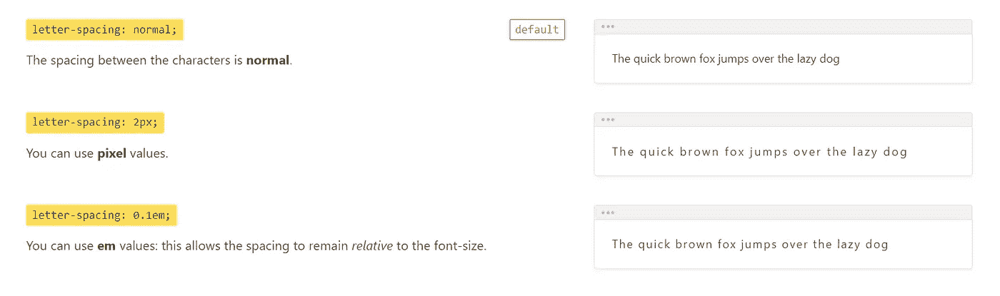

[按 CSSReference](https://cssreference.io/typography/)

## 直线高度

定义单行文本的高度。`***normal***`是没有定义灯高时的默认值。`***unitless***`值与`***font-size***` 和 pixel/em，…值相关。

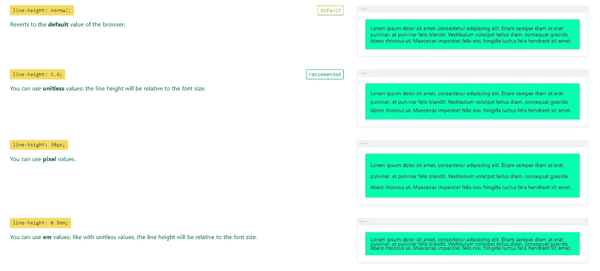

[按 CSSReference](https://cssreference.io/typography/)

## 文本对齐

定义元素的文本内容如何水平对齐:`***left***`、`***right***`、`***center***`和`***justify***`。

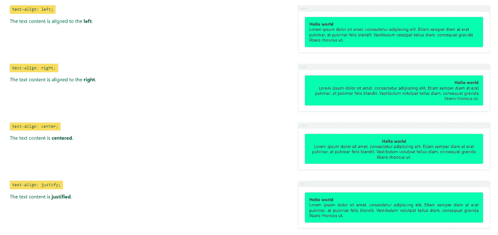

[按 CSSReference](https://cssreference.io/typography/)

## 文本装饰

定义如何修饰元素的文本内容。

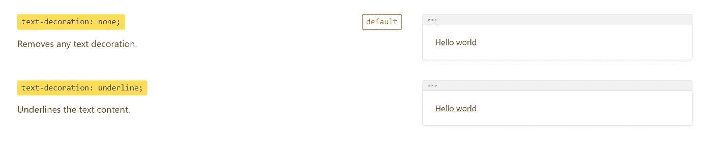

[通过 CSSReference](https://cssreference.io/typography/)

## 文本意图

定义元素首行文本的缩进。

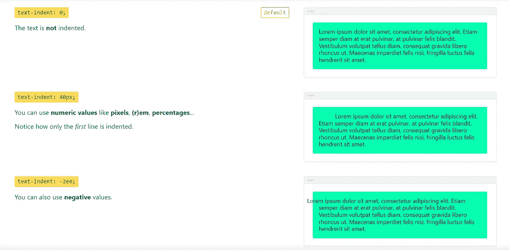

[按 CSSReference](https://cssreference.io/typography/)

## 文本溢出

定义隐藏文本内容溢出时的行为。`***clip***`值和`***ellipsis***`通常用于段落，这样你就不会让页面内容过多。

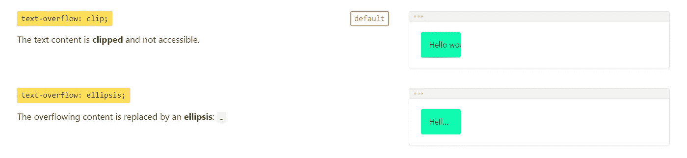

[按 CSSReference](https://cssreference.io/typography/)

## 文本阴影

定义文本内容的阴影。这个属性不经常使用，但是知道它是很好的。

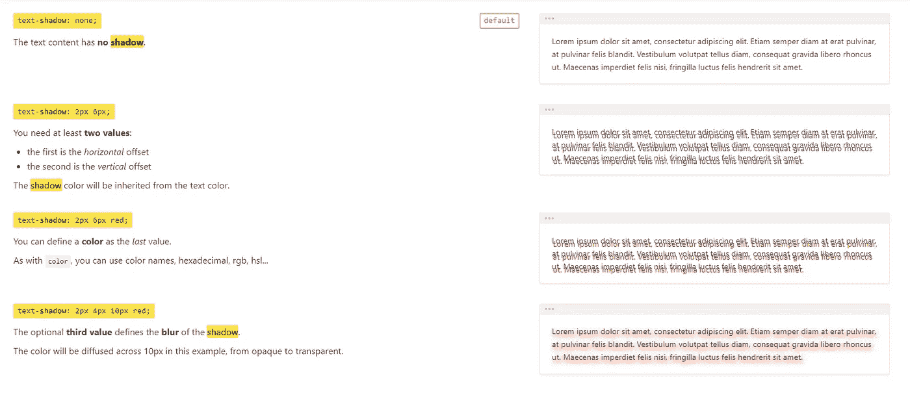

[按 CSSReference](https://cssreference.io/typography/)

## 文本转换

定义文本内容应该如何转换。可以使用的值有:`***none***` ***，*** `***capitalize***` ***，***`***uppercase***`*和`***lowsercase***`。*

*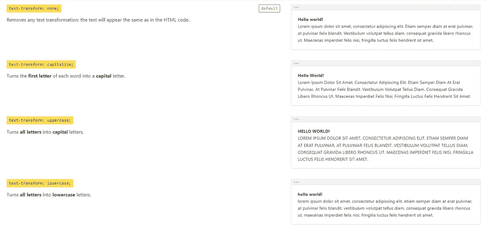*

*[按 CSSReference](https://cssreference.io/typography/)*

## *空白*

*定义如何处理元素的空白。一个必不可少的属性，它证明了网页做得有多好。字母多的时候会出现在框外，不专业。所以要时刻注意这一点。*

*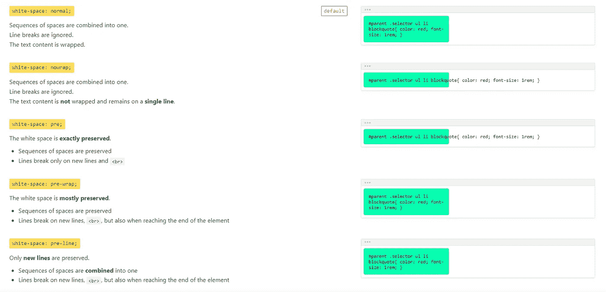*

*[按 CSSReference](https://cssreference.io/typography/)*

## *断词*

*定义到达行尾时单词应该如何换行。这同样适用于这个属性。*

*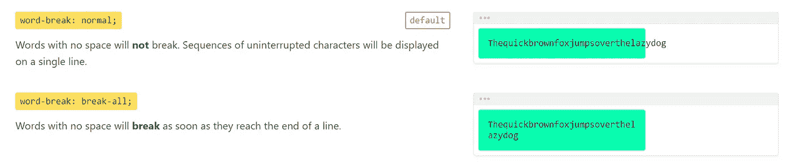*

*[按 CSSReference](https://cssreference.io/typography/)*

## *单词间距*

*定义文本块中单词之间的间距。*

*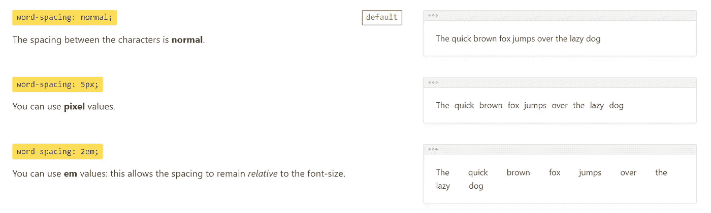*

*[按 CSSReference](https://cssreference.io/typography/)*

*今天就到这里，看阿雅🙋*

*如果您有任何问题或反馈，请点击评论或通过 LinkedIn 联系我— **我洗耳恭听！***

*[**想请我喝杯咖啡吗？☕️**](https://www.buymeacoffee.com/fatimaamzil)*

> *让我们为 2022 年打造一个更好的‘我们’！*

## *了解有关 2022 年网络快车计划的更多信息:*

*I- [网络常识](https://medium.com/geekculture/2022-web-program-chapter-n-1-is-done-499fb0707220?source=your_stories_page----------------------------------------)*

*[II-网页框架:HTML](https://famzil.medium.com/your-html-essentials-69d9b2349355?source=your_stories_page----------------------------------------)*

## *网页风格:CSS(当前章节)*

*   *[选择器(从基本到复杂)](https://javascript.plainenglish.io/selectors-from-basic-to-complex-4f4f48316731)*
*   *[箱型](https://medium.com/geekculture/box-model-b67b40bb8930)*

> ***排版***

*   *….*

*[](https://medium.com/geekculture/2022-web-program-is-launched-f38a3280af1a) [## 2022 网络计划启动！

### 改变来自心态和习惯

medium.com](https://medium.com/geekculture/2022-web-program-is-launched-f38a3280af1a) 

与想成为 web 开发人员的人分享该程序！这将有助于保持进步，并在旅途中互相帮助。

> 如果你喜欢我的文章， [**订阅**](https://famzil.medium.com/subscribe) 获取我的最新。如果你自己喜欢体验媒介，可以考虑通过[**注册会员**](https://famzil.medium.com/membership) 来支持我和其他成千上万的作家。它只需要每月 5 美元，它支持我们，作家，你也有机会用你的作品赚钱。当然，你可以随时取消会员资格。通过注册[这个链接](https://famzil.medium.com/membership)，你将直接用你的一部分费用来支持我，它不会花费你更多。如果你这样做了，万分感谢！

让我们在 [**上**取得联系****](https://medium.com/@famzil/)**[**Linkedin**](https://www.linkedin.com/in/fatima-amzil-9031ba95/)**[**脸书**](https://www.facebook.com/The-Front-End-World)**[**insta gram**](https://www.instagram.com/the_frontend_world/)**[**YouTube**](https://www.youtube.com/channel/UCaxr-f9r6P1u7Y7SKFHi12g)**或**[](https://twitter.com/FatimaAMZIL9)********

******[](https://famzil.medium.com/membership) [## 通过我的推荐链接——FAM 加入 Medium

### 作为一个媒体会员，你的会员费的一部分会给你阅读的作家，你可以完全接触到每一个故事…

famzil.medium.com](https://famzil.medium.com/membership)*******