# C++中的鲸鱼优化算法(WOA)

> 原文：<https://levelup.gitconnected.com/the-whale-optimization-algorithm-woa-in-c-5cd6d0044956>

# 算法源

米尔贾利利、塞耶达利和安德鲁·刘易斯。"鲸鱼优化算法。"*工程软件进展*，第 95 卷，2015 年 1 月 14 日，第 51–67 页。，https://doi.org/10.1155/2817.访问 2022 年 9 月 20 日。

虽然鲸鱼可以单独生活，也可以群居，但人们最常观察到的是成群结队的鲸鱼。一些种类的鲸鱼，如虎鲸，将终生生活在一个家庭中。对于座头鲸来说，这些群体动态导致了它们在狩猎或觅食时的有趣行为，包括在海洋表面附近包围大群磷虾的几种策略。鲸鱼优化算法(WOA)利用这些生物行为来解决复杂的多维优化问题。

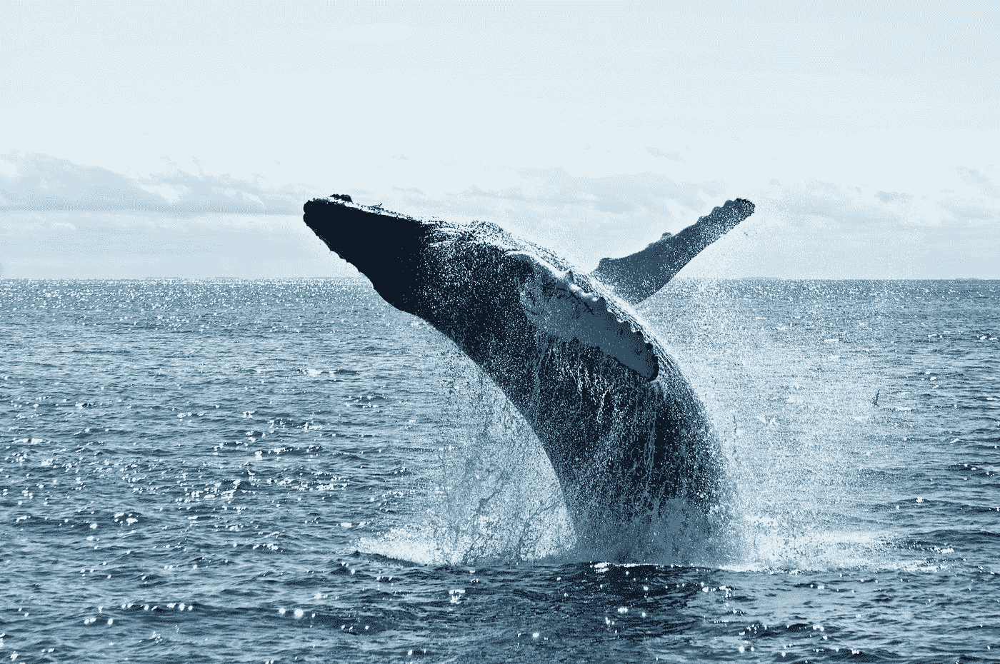

照片由[托德·克雷文](https://unsplash.com/@toddcravens?utm_source=medium&utm_medium=referral)在 [Unsplash](https://unsplash.com?utm_source=medium&utm_medium=referral) 拍摄

在这篇文章中，我们介绍并简要讨论了 WOA。该算法用 C++实现，并通过优化 Rastrigin 和 Sphere 函数给出了演示用法。该算法快速有效地优化这些函数，提供其实际最小值的优秀近似值。

# 鲸鱼优化算法

如上所述，鲸鱼优化算法是一种生物启发的算法，它利用了座头鲸的狩猎行为。在海面附近捕食磷虾(或其他小鱼群)时，座头鲸采用两种基本策略:

1.  **向上螺旋**鲸鱼向下俯冲，在猎物周围形成一个气泡螺旋形状，同时游回水面
2.  **双循环**包括三个独立的子阶段:I)围捕循环——围捕猎物的向上螺旋，ii)长尾——有点像海面上的鲸鱼尾巴(也称为锚爪), iii)捕获循环——第二次向上突进捕获被围捕的猎物。

这些操作的数学定义如下。

## 包围猎物

首先，我们将考虑*包围猎物* ( **螺旋上升** ) *。*对于那些熟悉学习算法基础的人来说，包围猎物是一种*剥削*行为。座头鲸会识别成群的猎物并包围它们，对于我们的“鲸鱼”群体来说，鱼群(优化对象)的位置是未知的，因为这是最优解。因此，我们的座头鲸会使用最接近猎物的鲸的位置，即最小化或最大化目标函数的鲸。这迫使算法群体向最优值移动。

从数学上讲，这是通过以下一组等式实现的:

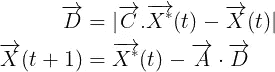

这里， **A** 和 **C** 是系数向量(下面计算)， **X*** 是目前为止得到的最佳解(最佳鲸鱼)的位置向量， **X** 是正在更新的鲸鱼的位置向量，周期算子**。**是元素式乘法。

系数向量 A 和 C 计算如下

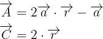

其中 **a** 在迭代过程中从 2 线性减少到 0，并且 **r** 是[0，1]中的随机向量。

## 泡沫网攻击方法

泡网攻击是利用阶段的延伸。由于座头鲸沿着一条收缩的螺旋形路径在猎物周围游动，因此需要两种方法来模拟这种类型的攻击:收缩环绕和螺旋更新。

为了模拟前者，向量 **a** (如上定义)在每次迭代中减少。由于 **A** 依赖于 **a** ，向量 **A** 也在每次迭代中减少。将 **A** 的值设置为[-1，1]中的值意味着代理的新位置可以在鲸鱼和最佳鲸鱼的当前位置之间的任何位置。

为了模拟螺旋更新，计算鲸鱼(X，Y)和猎物(X*，Y*)之间的距离。下面的螺旋方程是在鲸鱼的位置和猎物的位置之间建立的，以模仿座头鲸的螺旋运动

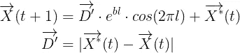

其中 **b** 是定义螺旋形状的常数(算法参数)，而 **l** 是[-1，1]中的随机数。

在自然界中，这两种行为同时发生，这在模拟中是做不到的。相反，每个单独的操作，螺旋更新和收缩环绕，在算法中以 50%的概率发生。也就是说，

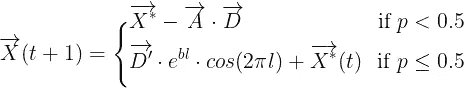

其中 **p** 是[0，1]中的随机值。

## 寻找猎物

接下来，WOA 需要处理典型的学习算法的*探索阶段*。这是通过搜索猎物模拟完成的。该算法的这一阶段与开发阶段非常相似，在开发阶段，鲸鱼(随机地)向当前的最佳解决方案靠近。不同之处在于选择当前代理将更接近的鲸鱼。在*寻找猎物*探索阶段，当前鲸鱼将随机选择一只参考鲸鱼，并向其位置靠近。下面的等式描述了这种行为，并且几乎与环绕猎物阶段的等式相同。

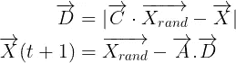

这里，X_rand 是随机选择的代理，其他变量和操作如上定义。

## 该算法

在此背景下，WOA 定义如下。

```
1\. Initialize the whale population
2\. Calculate fitness of each whale and find X_best (the best agent)while( t < maximum number of iterations )
    for each search agent:
        Update a, A, C, l, and p
        if(p < 0.5):
            if(|A|<1):
                Update current agent via Encircling Prey
            else:
                Select a random agent (X_rand)
                Update current agent via Search for Prey
        else:
            update search agent via Bubble-net Attacking
    endfor Amend the position of whales that are outside the search space            
    Calculate the fitness of each search agent
    Determing new X_best (if need be)

    t = t+1
endwhilereturn X_best
```

源文件为 WOA 提供了上述算法。在下面的实现中，添加了另一个特性，如果我们在运行时早期找到了一个最优解(或者如果我们陷入了一个低谷)，就可以缩短计算时间。该算法的参数之一是一个*不变 ITERS* 值。如果最佳鲸鱼(X_best)的适应度在这个迭代次数中没有改变，则算法被短路，并且返回当前的最佳鲸鱼。

# 履行

C++实现分为两个主要部分:一个存储鲸鱼群体成员数据的鲸鱼类，以及包含一些帮助函数和优化算法逻辑的 WOA 文件。

## 鲸鱼类

首先，我们需要一些地方来存储与我们群体中的某个个体相关的信息，例如鲸鱼。这是通过下面的代码用 Whale 类完成的

如上面的代码所示，Whale 对象非常简单。本质上，我们从鲸鱼那里需要的只是一种计算、更新和存储个体位置和适合度的方法(*update _ position*， *set_fitness，get_fitness，get_position* )，将鲸鱼保持在问题域内的功能( *amend_bounds* )，以及准确地说，一种告诉鲸鱼当前在哪里以及它离猎物有多近(最优解)的方法( *print* )。上面提供了这些方法及其实现。

重要的一点是，whale 将存储一个 *n-* 维*位置，*其中 *n* 取决于手头的问题，以及一个让算法(有时还有其他 whale)知道它离最优解有多近的适应值。最初，鲸鱼的位置被设置为我们领域中的某个随机位置，这就是初始种群是如何创建的。一旦选择了随机位置，就计算初始适应值。这一切都发生在 *Whale::initialize* 函数中，并为种群中的所有鲸鱼完成。

## 该算法

接下来，用 C++实现上面定义的优化算法。此外，贯穿整个实现的是对 matplotlibcpp 功能的引用。我在[之前的博客文章](/plotting-data-in-c-84960b63ce92)中写了更多。对于那些对绘制数据不感兴趣的人(这主要是为了这篇博文)，可以从下面的逻辑中删除对“matplotlibcpp”和“plt::”的引用，以消除这种依赖性。

如上所示，WOA 接受一组可以在代码中更新的参数，以改变算法的行为方式。

1.  **POPULATION_SIZE** :算法中使用的鲸鱼(代理)数量
2.  **维度**:自由变量的数量(即适应度函数的输入)。
3.  **MAX_ITERS** :算法停止之前的最大迭代次数
4.  **UNCHANGED_ITERS** :算法“停留”在特定最佳解上的迭代次数。经过这么多次迭代后，算法将会短路。
5.  **最大位置**:定义搜索空间的边界
6.  **MINPOS** :定义搜索空间的边界。
7.  **B** :螺旋系数
8.  **A_DEGRADE** :迭代过程中 **a** 变量的退化

# 优化函数和最优解

有两种算法被用来测试 WOA:Rastrigin 和 sphere 函数。Rastrigin 函数在数学上定义为

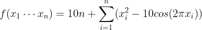

并且当所有 x_i 都是 0 时具有最小值，即当

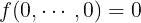

这个函数的表面如下所示。

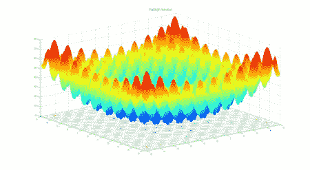

[https://www . geeks forgeeks . org/implementation-of-whale-optimization-algorithm/？ref=rp](https://www.geeksforgeeks.org/implementation-of-whale-optimization-algorithm/?ref=rp)

如此处所示，Rastrigin 函数包含许多峰值和谷值，这为优化函数在次优最小值和最大值处停滞提供了充足的机会，使其成为优化算法的良好测试。

用于测试算法的第二个函数是球面函数，数学定义为

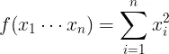

并且当所有 x_i = 0 时也具有最小值，或者


如下图所示，该函数的图形与 Rastrigin 函数的图形非常相似，最大的区别是没有“凹凸不平”的表面，而是平滑的。

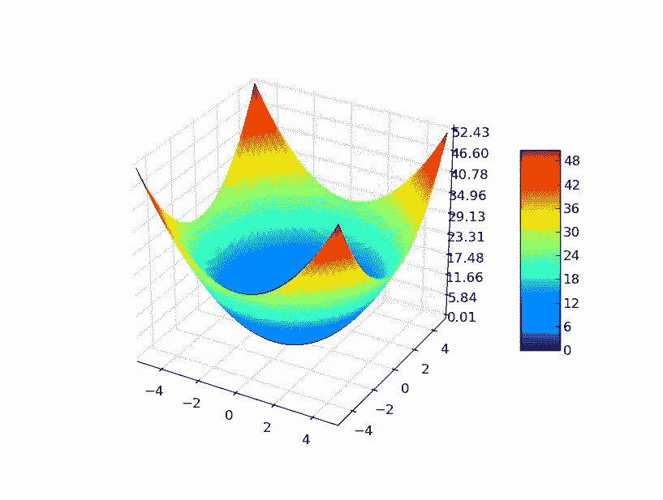

[https://www . geeks forgeeks . org/implementation-of-whale-optimization-algorithm/？ref=rp](https://www.geeksforgeeks.org/implementation-of-whale-optimization-algorithm/?ref=rp)

这些函数的实现可以在 *woa.cpp* 中包含的 lambda 函数中看到。

# 结果

如上面的代码所示，适应度函数在 C++代码中存储为 lambda 函数，以便在它们之间轻松切换。代码重复如下。

球体适应度函数。

使用球体适应度函数运行上面的代码可以快速找到(0，0，0)处的最小值，如下图所示。

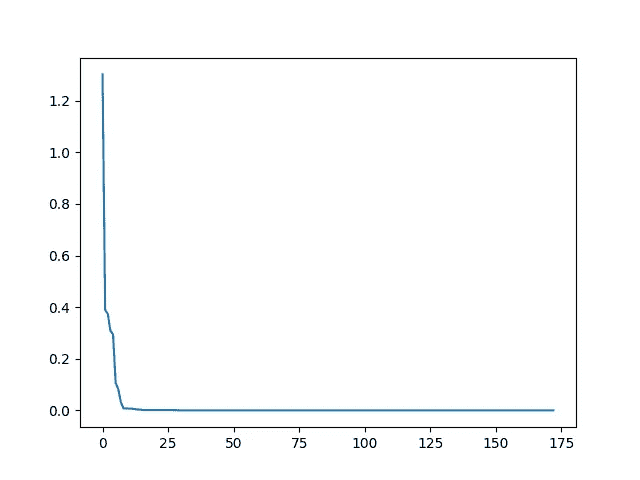

显示最佳鲸鱼的当前迭代和适应度函数值的图形。

该图显示了最佳鲸鱼的迭代次数(x 轴)和适应度函数值。球函数的最小值在点(0，0，0)处为 0。WOA 发现这个值非常快，大约。25 次迭代，并且该算法在大约 175 次迭代后短路(它被设置为最多运行 500 次迭代)。在下面的 GIF 图中，我们可以看到鲸群正在寻找最优解。

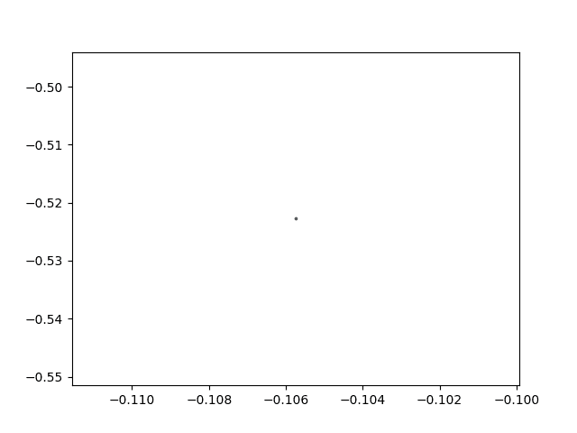

最佳鲸鱼的 X 和 Y 坐标。

这张 GIF 显示了随着算法的进行，最佳鲸鱼的 X 和 Y 值(最佳鲸鱼的位置)。正如这里看到的，鲸鱼很快接近最优解。(X，Z)和(Z，Y)坐标的图形非常相似。

接下来，我们将在 Rastrigin 适应度函数上测试该算法。

拉斯特里金适应度函数。

该函数的结果看起来非常类似于球体适应度函数的结果。下图显示，WOA 需要更长的时间来找到函数的最小值，但在大约。150 次迭代。

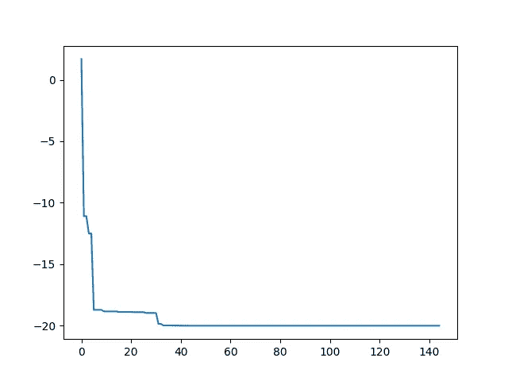

显示最佳鲸鱼的当前迭代和适应度函数值。

再次绘制最佳鲸鱼位置随时间变化的二维切片显示，鲸鱼种群很快就找到了最优解。

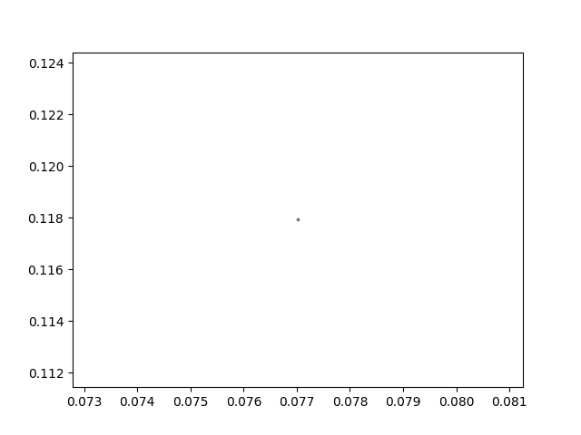

最佳鲸鱼的 X 和 Y 坐标。

# 结论

在这篇文章中，介绍了鲸优化算法(WOA ),并对运算进行了数学定义。解释了该算法，并用 C++提供了一个实现。描述了两个选择适应度函数，sphere 和 Rastrigin，并使用 WOA 来确定这两个函数的最优解。如结果部分所示，WOA 可以快速找到这两个函数的最优解。观察 WOA 在其他更复杂的适应度函数上的表现将是有趣的，以确定该算法是否是其他优化算法的可行替代。

通过成为[中级会员](https://anthony-a-morast.medium.com/membership)或者在亚马逊上购物来支持我的内容[成为更好的 C++程序员](https://amzn.to/3UNfRCw)或者[学习更多关于优化算法的知识](https://amzn.to/3UJgBbQ)。