# 白灰色黑色的树

> 原文：<https://levelup.gitconnected.com/the-white-grey-black-tree-b9a96f12e9e9>

## B+树的替代方案

## 介绍

回到 2018 年 11 月，我对不同的 [DBMS](https://en.wikipedia.org/wiki/Database#Database_management_system) 系统有点着迷，比如 MSSQL、MySQL、Oracle。在我研究这个课题的过程中，我遇到了 [OLAP](https://en.wikipedia.org/wiki/Online_analytical_processing) 数据处理和[数据仓库](https://en.wikipedia.org/wiki/Data_warehouse)。这个主题引起了我足够的兴趣，我开始着手我的项目，将数据库管理系统提升到另一个层次。我的想法是通过混合关系数据库和数据仓库来改变系统的内部架构，这将使程序员能够在利用数据仓库提供的搜索查询速度的同时保持关系数据库的结构。

我开始使用 C++编程语言开发一个原型。为了将数据从关系数据库“翻译”到数据仓库，我需要索引数据库。为了让原型工作，我实现了一个定制的 [AVL](https://en.wikipedia.org/wiki/AVL_tree) 树来完成工作。由于这是该软件的第一个版本，我唯一的关注点是让系统启动并运行，所以我并不太担心速度。我打算在某个时候用一棵 [B+树](https://en.wikipedia.org/wiki/B%2B_tree)代替 AVL 树(当时我对 B+树还不熟悉)。在一切顺利运行后，我将注意力转移到执行速度和索引系统的改进上。从那时起，我开始研究 B+树及其实现和性能。由于对自己的发现不满意，我决定开始创建自己的数据结构，这种数据结构仍然很快，但内部碎片更少，因此有更大的缓存价值信息。

## 原始树

因此，我已经开始设计一个数据结构，这是一个堆树。每个节点包含 *p* 个子节点。子节点的数量随着深度增加下一个质数。根节点有两个子节点。每个节点内的键可以比子树内的键小(最小原始树)或大(最大原始树)。

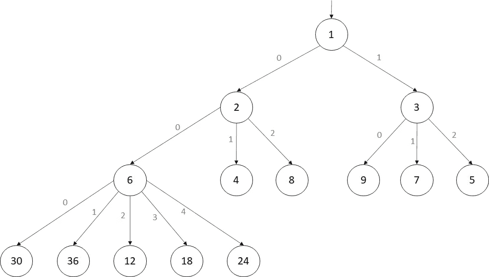

图一。最小原始树

由于节点位置是由质因数分解决定的，所以这棵树不能被平衡。例如，值 18 由三个操作定位:

1.  18 > 1 和 18 mod 2 = 0 ->插入到索引为 0 的子树中。
2.  18 > 2 和 18 mod 3 = 0 ->插入到索引为 0 的子树中。
3.  18 > 6 和 18 mod 5 = 3 ->插入到索引为 3 的子树中。

如果原始树是完全平衡的，那么数据的数量会增加一个原始的深度。[primaryal](https://en.wikipedia.org/wiki/Primorial)，用“#”表示，是一个从自然数到自然数的函数，类似于阶乘函数，但该函数不是连续地乘以正整数，而是只乘以质数。

原始定义

由于原始函数比阶乘函数增长更快，原始树的大 O 符号是一个比对数函数增长更小的渐近函数。但是这种树有一些缺点:

1.  在所需范围内过滤关键字时，没有有效的算法
2.  当分别为最大原始树或最小原始树寻找最小或最大关键字时，没有有效的算法
3.  树不平衡
4.  不平衡时，树包含的叶子可能比关键点多。对于一般大小的数据库，这可能会导致内存耗尽。

我的结论是，这棵树存储数据不可靠。因此，我需要找到一种方法来设计一个类似的树来解决这些问题。一天早上，我喝着咖啡，盯着白板，白板上画着原始树，后面是数学公式和微积分。我不想擦黑板，因为我懒得擦。与此同时，下面的电视屏幕上出现了歌曲《压力之下》的音乐视频中的一个场景。我看到了弗兰肯斯坦博士怪物。然后另一个想法来了:“我需要混合 Primorial 树和 AVL 树”。那是白灰黑树诞生的时刻。

## 白-灰-黑树

白-灰-黑树(WGB 树)是一种自我平衡和有序的树。它是 AVL 树和 Primorial 树的组合。除了 key 之外，每个节点都包含解释为一种颜色的额外信息:白色、灰色或黑色。

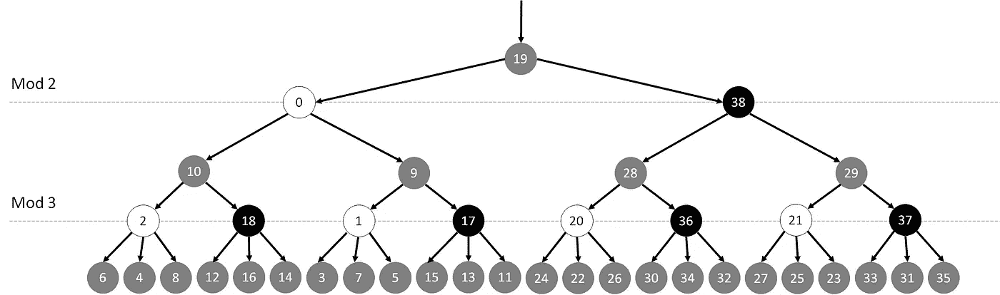

图二。平衡的白-灰-黑树

从上图可以看出，节点颜色是按深度级别切换的。所有奇数层都包含灰色节点。其他级别包含白色和黑色节点。

***灰色节点***

灰色节点用于确保树在插入和删除期间保持大致平衡。灰色节点有两个子节点:

*   白色节点作为左子节点
*   黑色节点作为右子节点

灰色节点中的键比左子树中的键大，比右子树中的键小。左右子树之间的高度差由平衡系数定义:

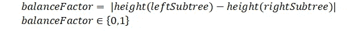

如果平衡系数超出范围，则树不平衡。如果右边的子树比左边的子树高，则执行以下三个操作:

*   从右边的子树弹出最小键
*   用最小键替换灰色节点中的键
*   从灰色节点向左侧子树插入一个键

否则，如果左子树的高度大于右子树，则执行以下三个操作:

*   从左子树弹出最大键
*   用最大键替换灰色节点中的键
*   从灰色节点向右侧子树插入一个键

***黑白节点***

白色或黑色节点的行为类似于原始树中的节点。此外，他们指向一组灰色节点。子节点的数量随着深度增加下一个质数。白色节点和黑色节点之间的区别在于，白色节点包含的键比其子树中的所有键都小，而黑色节点包含的键比其子树中的所有键都大。在基本情况下，第一个质数是 2。

***算法找到一个密钥***

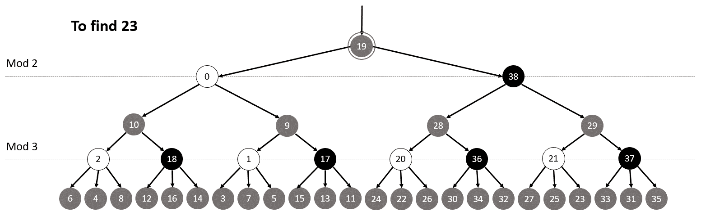

**插入密钥的算法**

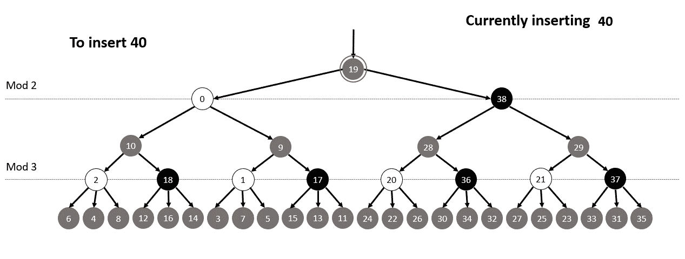

***性能***

白-灰-黑树的性能可以通过开始用大于 2 的质数划分白色和黑色节点来提高，这降低了树的高度。以质数 *p* 开始的树由 **WGB(p)** 表示。下图给出了根据第一质数 *p* 的深度比较。

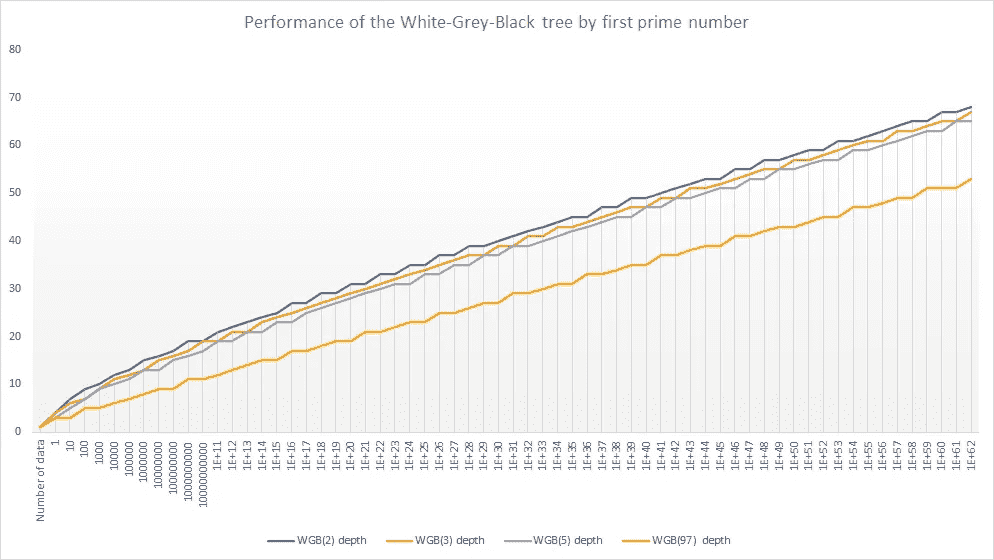

该图显示，当从 WGB(p(n))到 WGB(p(n+1))降低树高时，略有改善。这是 WGB 树的四个假设:

*   **第一个假设**是内部树碎片随着 *p.* 增加
*   **第二个假设**是一棵树的内部碎片百分比按照键的数量循环增减。
*   **第三个假设**是基于范围的搜索具有很好的性能，因为对于每个灰色节点，最大和最小键由 O(1)确定。这将避免在子树中进行不必要的基于范围的搜索。
*   **第四个假设**是 WGB(p)树的一个[大 O](https://en.wikipedia.org/wiki/Big_O_notation) 比分裂成 p 个子树的 B+树的一个大 O 更渐近。此外，B+树的障碍是每个节点内部的关键字正在被一个[二分搜索法算法](https://cs.stackexchange.com/questions/59453/why-is-b-tree-search-olog-n)搜索。

***计算 WGB②树的高度***

节点的数量并没有随着深度的增加而持续增长。键的数量通过将前一行中的键的数量乘以 2 或者乘以下一个 *p* 来增加。例如，WGB(2)树中的键的数量按深度增长，顺序如下:1、3、7、15、39、87、327 等等。

设 WGB(2)树内的键的数量表示为 *n* ，树的高度表示为*d*因此，设 *n* 和 *d* 之间的关系为:

等式 1。根据树深度/高度的数据数量

原始函数的近似:

等式 2。原始的近似值

原始函数可以用近似值代替。因此，等式 1。可以写成:

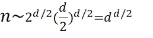

等式 3。根据树深度/高度的数据数量

方程式 3 的逆运算。是:

等式 4。树的高度取决于数据的数量

*d* 与白-灰-黑树的大 O 符号中的时间复杂度相同:

等式 5。白-灰-黑树的大 O 符号

平均相对误差约为 4.59%，如对数刻度的图表所示:

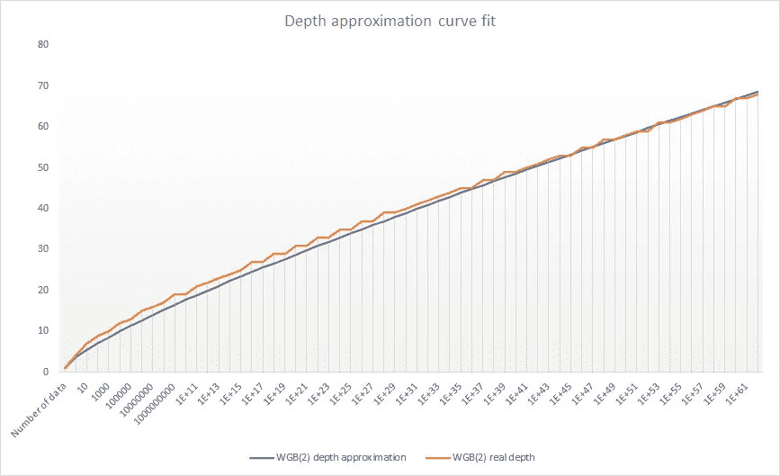

**指标**

以下指标显示了与红黑树相比，WGB(2)树的时间性能。实现是用 Java 写的。因此，红黑树使用 TreeMap 数据结构。

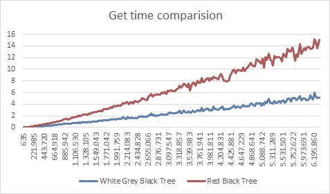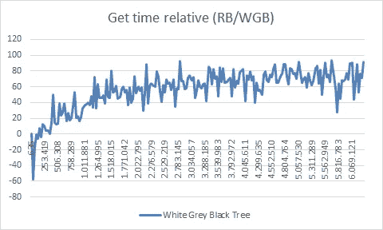

键插入图显示大量的 CPU 时间被用来平衡树。

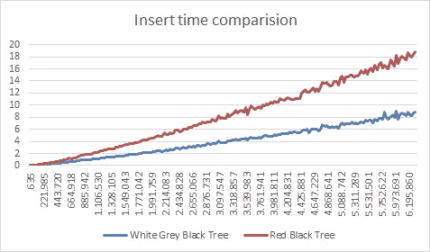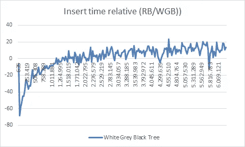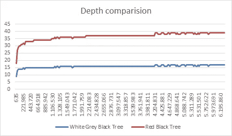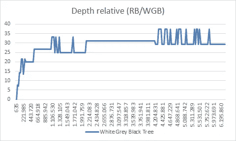

通过计算叶子的数量来确定树的内部碎片。接下来的两个图表显示了内部树碎片比较。

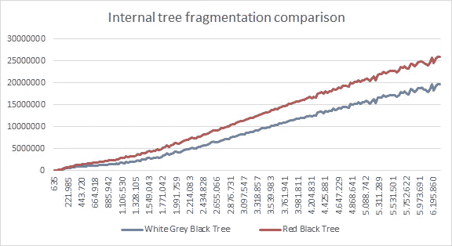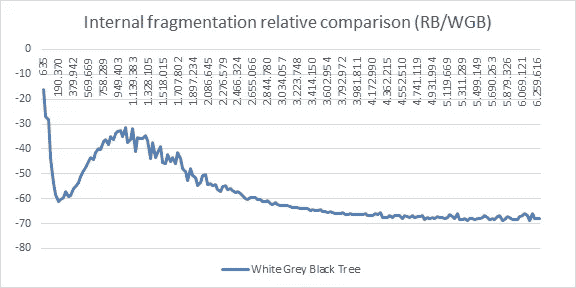

最终指标显示了根据 B+树(100 键拆分)和 AVL/RB 树的深度比较:

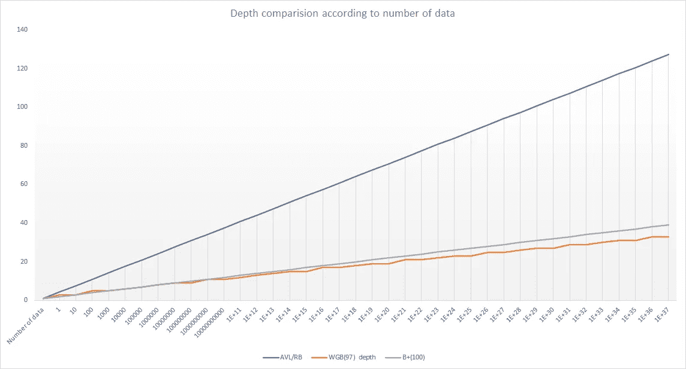

**优化**

WGB 树的实现目前存在于我的 DBMS 原型中，它有助于提高它的性能。此外，为了在节点叶不存在时不分配节点叶，对实现进行了优化。数学优化用于在以下情况下减少 CPU 时间:

*   计算下一个质数
*   通过素数 2、3、5 和 7 执行模运算

**结论&下一步**

乍看之下，树形指标表现良好，但这只是研究的开始，这些指标**不应该被认真对待**。所以这棵树以后会有更多的测试和分析。

也许将来采油树的结构或行为会改变，比如从原始采油树到 WGB 采油树。

如果您有任何问题，可以通过邮件联系我:

dsenta00@fesb.hr

或者您可以将我添加为 LinkedIn 联系人

 [## Duje Senta —克罗地亚|职业简介| LinkedIn

### 查看 Duje Senta 在 LinkedIn 上的职业简介。LinkedIn 是世界上最大的商业网络，帮助…

www.linkedin.com](https://www.linkedin.com/in/dsenta/) 

感谢您阅读这篇文章，

杜杰森塔