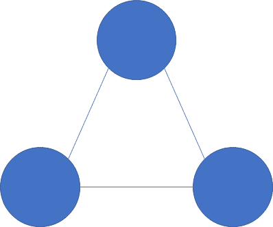
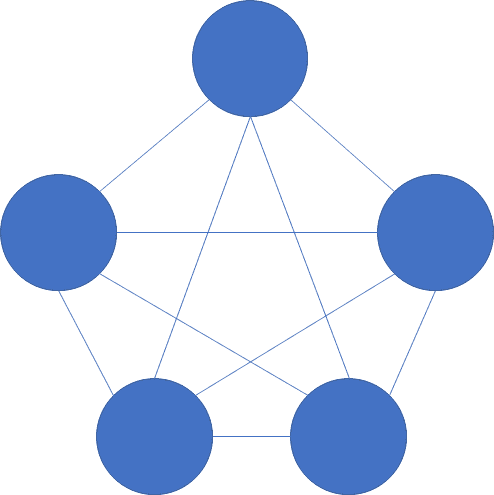
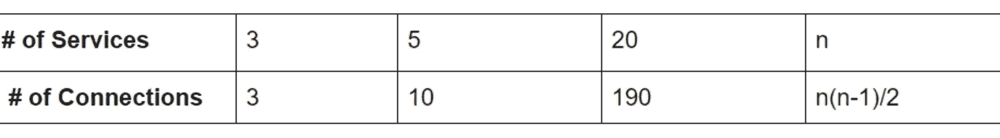
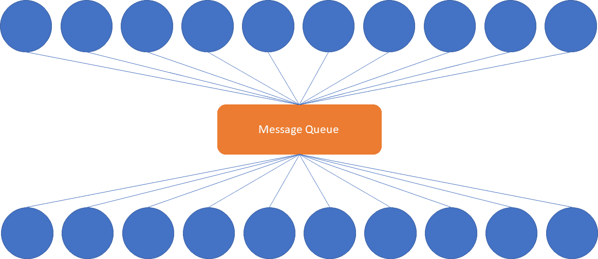
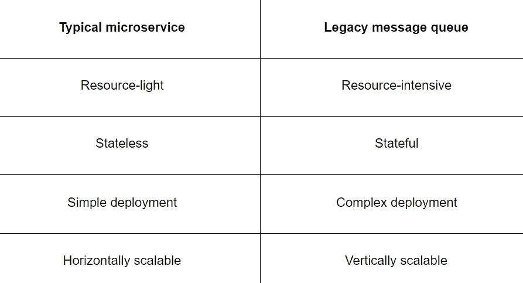

# Kubernetes 中微服务消息传递的原因和方式

> 原文：<https://levelup.gitconnected.com/the-why-and-how-of-microservice-messaging-in-kubernetes-1d54a4717bf1>

# 介绍

在 Kubernetes 中努力连接和维护您的微服务？随着微服务数量的增长，维护分布式服务的难度和复杂性也呈指数级增长。消息传递可以为这个问题提供一个干净的解决方案，但是遗留消息队列也有自己的问题。

在本文中，我将分享 Kubernetes 中消息传递的好处以及遗留解决方案可能带来的困难。我还将简要介绍 KubeMQ，它试图解决 Kubernetes 中消息传递的一些传统问题。

# 为什么用 Kubernetes 发消息？

随着基于微服务的架构的发展，将这些分布式服务连接起来可能会很困难。对于每个点对点交互，必须解决安全性、可用性和延迟问题。此外，随着服务数量的增加，潜在连接的数量也在增加。例如，考虑一个只有三个服务的环境。这三个服务总共有三个潜在的连接:

然而，当增加到比如说五个服务时，潜在连接的数量增加到 10:

对于 20 个服务，潜在的连接数是 190！请参考下表:

对于拥有大量服务组合的组织来说，这显然是不可持续的。然而，通过使用消息队列，我们可以集中这些连接。由于连接的数量等于服务的数量，这就产生了一个线性扩展的解决方案。见下文:

对于一个大型微服务群，这大大简化了安全性和可用性问题，因为每个微服务需要主要与消息队列通信。这就是在 Kubernetes 中运行大量微服务时，实现消息队列架构被认为是最佳实践的原因。因此，选择消息队列是一个至关重要的决策，因为整个体系结构将取决于该消息队列的可靠性和可伸缩性。

最后，在 Kubernetes 中部署消息队列可以避免平台锁定。主要的云提供商有许多特定于平台的消息传递解决方案，但是运行平台无关的解决方案可以让您保持微服务架构的一致性，而不管您的平台如何。Kubernetes 是事实上的编排解决方案，得到了所有主要云提供商的支持。

既然我们已经确定了为什么信息传递是有帮助的，让我们再深入一点。这似乎是一个简单的解决方案，那么有什么难的呢？

# Kubernetes 中的消息传递有什么难的？

当试图在 Kubernetes 中运行消息队列时，有许多棘手的问题。让我们考虑一下典型微服务和标准消息队列之间的区别。我在下表中总结了一些差异:

首先，微服务被设计成资源轻型的。这在某种程度上是微服务的自然结果——每个服务执行一个单一的目的，因此可以更小、更灵活。相比之下，遗留消息队列是大型的资源密集型应用程序。在撰写本文时，IBM MQ 的最新版本对硬件有很高的要求。比如> 1.5 GB 磁盘空间，3gb RAM。

此外，典型的微服务是无状态的，因为它本身不包含应用程序状态的任何部分。然而，许多传统的消息队列可以有效地用作数据库，并且需要持久存储。Kubernetes 中的持久存储最好用[持久卷 API](https://kubernetes.io/docs/concepts/storage/persistent-volumes/) 来处理，但这需要遗留解决方案的变通办法。

这些资源使用上的差异自然会引出下一点——微服务易于部署。微服务旨在作为集群的一部分快速部署。另一方面，由于它们的资源密集型性质，遗留消息队列具有复杂的部署指令，并且需要专门的团队来设置和维护。

其次，微服务被设计成可水平扩展的。水平扩展是通过部署额外的服务实例来完成的。这使得服务几乎可以无限扩展，具有高可用性，并且通常更便宜。相比之下，由于前面提到的资源需求和部署困难，遗留消息队列必须垂直扩展，换句话说，就是一台更大的机器。除了物理限制(单台机器只能有这么强大)，更大的机器价格昂贵。

这些问题通常需要大量的投资和时间来解决，从而降低了消息队列为整个体系结构提供的价值。然而，这些问题都不是消息传递所固有的；相反，它们是设计和构思主要消息队列时的产物。

那么我们如何解决这些问题呢？让我们来看一个选项:使用 Kubernetes-native 消息队列，比如 KubeMQ。

# Kubernetes-native 方法

[KubeMQ](https://kubemq.io/) 是一款试图解决 Kubernetes 相关消息问题的产品。让我们来看看它是如何做到这一点的。

首先，它是 **Kubernetes-native** ，这意味着它可以很好地与 Kubernetes 集成，并且很容易部署为 Kubernetes 集群。[操作符](https://operatorhub.io/operator/kubemq-operator)允许你自动化任务*超越【Kubernetes 原生提供的功能，随产品一起提供生命周期管理。[集群持久性](https://docs.kubemq.io/learn/cluster-scale#cluster-persistency)通过本地卷和 PVC 得到支持。Kubernetes 是本地的也意味着它是云不可知的，因此它也可以部署在本地或混合云环境中。*

此外，它是**轻量级的**——Docker 容器大约为 30 MB，与传统解决方案所需的 GB 空间相差甚远。这使得它几乎可以部署在任何地方，并支持新的使用案例，如物联网设备支持的边缘部署。尽管它很小，但它支持多种消息模式。

最后是**可扩展**。通过使用[桥](https://kubemq.io/kubemq-bridges/)、[目标](https://kubemq.io/kubemq-targets/)和[源](https://kubemq.io/kubemq-sources/)，这些预建的连接器允许 it 连接到各种其他应用和服务，减少了定制集成的需求。桥允许 KubeMQ 集群在彼此之间传递消息，使 KubeMQ 能够连接各种云、内部和边缘环境。

由于 KubeMQ 很小，您可以自己尝试使用 minikube 的[本地安装或访问任何其他 Kubernetes 集群。](https://minikube.sigs.k8s.io/docs/start/)

1.  [注册](https://account.kubemq.io/login/register)一个(免费)账户，获得一个许可证令牌。
2.  运行 kubectl apply-f[https://get.kubemq.io/deploy?token=](https://get.kubemq.io/deploy?token=)your-license-token>

您可以使用 kubectl get kubemq clusters-n kube MQ 来验证您的集群的状态。更多信息，请查看[官方文件](https://docs.kubemq.io/getting-started/quick-start)。

# 摘要

在本文中，我回顾了消息队列的好处，研究了在 Kubernetes 中实现消息传递的困难，并快速浏览了一下[kube MQ](https://kubemq.io/)——一个轻量级的 Kubernetes 原生解决方案，它提供了优于遗留解决方案的几个优点。