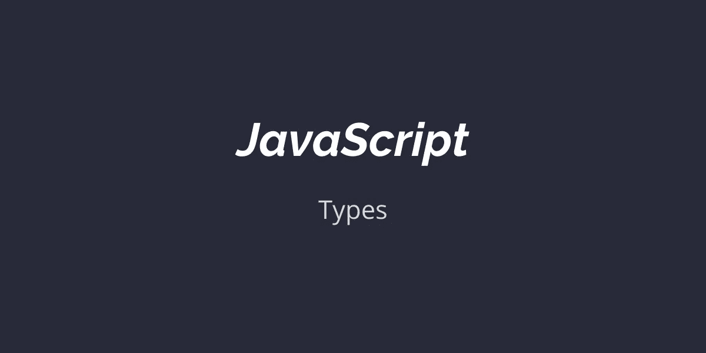

# JavaScript 奇妙的̶b̶r̶o̶k̶e̶n̶奇异世界—第 1 部分

> 原文：<https://levelup.gitconnected.com/the-wonderfully-%CC%B6b%CC%B6r%CC%B6o%CC%B6k%CC%B6e%CC%B6n%CC%B6-quirky-world-of-javascript-part-1-54cb1eba0d4f>

JavaScript 类型系统之旅。



几个月前，我开始学习如何构建 web 应用程序。我浏览了各种平台上的“全栈”课程列表，缩小到涵盖 React 和 Node 的课程，并开始浏览视频。随着我开始编写越来越多的代码，我很快意识到 JavasScript 与其他语言有多么不同。

我主要来自 Java & Go 背景，对动态类型语言非常陌生。我很快开始遇到会破坏我的代码的极端情况，有时是悄无声息的。我很快意识到，我需要先学习 JavaScript 基础，而不是学习 Node & React。在这个系列中，我将试着讲述我对 JavaScript 不同之处的认识，从**类型**开始。

# 概观

每当你在 JS 中声明一个变量时，你就隐式地定义了一个类型。例如下面的代码:

```
var name = "aditya";
var age = 18;
```

意味着名为 *name* 的变量属于类型 *string，*age 属于类型 *number* 。
JS 共有 7 种类型:(`string`、`number`、`boolean`、`null`、`undefined`、`object`、`Symbol`)。

除了对象之外的一切都被认为是原语。原语一次只能包含一个值，而对象用于定义实体。对于来自 OOP 背景的人来说，JS 对象是最接近类的东西(尽管两者之间有显著的差异)。

**空值&未定义。在编写代码时，变量常常没有值。它是不存在的，程序的流程也因此而改变。大多数语言都有一个特定的结构，我们可以用它来完成这个任务。
比如 Java 里的`null`，或者 Golang 里的`nil` 。另一方面，JS 有两个广泛用于此目的的构造:`null`和未定义的*。* 与普遍的看法相反，那两个是**不是**一样的。
`undefined`表示已经声明了一个变量，但是还没有赋值，而`null` 是 JS 中的*显式*值，习惯上用来表示没有值。以下代码的计算结果为 false:**

```
console.log(null === undefined); //false
```

# 强迫

将变量从一种类型隐式转换为另一种类型的过程称为强制。当您尝试运行以下代码时，大多数语言，甚至是动态语言，都会抛出错误:

```
console.log("aditya" + 18); //aditya18
```

在 JS 领域中，“+”运算符意味着两个事物中的一个；要么你把两个数字相加，要么你把两个字符串串联起来。由于 JS 无法将`aditya`转换成数字，所以它*将* 18 强制转换成字符串，并将它们串联起来。很漂亮吧？
没那么快。您认为以下代码的输出是什么样的:

```
console.log('18' - 8); //10
```

在 JS land 中，“-”运算符只用于从右边减去左边。由于 JS 对类型错误极其宽容，所以它不会在这里抛出错误。相反，它试图将字符串`18`强制转换为一个数字，并返回`10`。类型系统的这些问题导致了初学 JS 开发人员的一大堆错误。

JS 中的类型系统可能导致无声错误的另一个例子:

```
console.log([ 2, 10, 30 ].sort()); // [10, 2, 30]
```

为什么会这样？因为默认情况下， [Array.prototype.sort](https://www.ecma-international.org/ecma-262/#sec-array.prototype.sort) 算法通过首先将所有元素转换为字符串来比较它们，&然后在布尔上下文中对它们求值。

…..最后一个:

```
console.log(1 < 2 < 3); // true
console.log(3 > 2 > 1); //false
```

为什么会这样？第一种情况，JS 将`1 < 2` 转换为真*。*然后`(true) < 3` = > `(1 < 3)` *…..*评估为**真**。
而在后一种情况下，`3 > 2`的计算结果为真。然后`true > 1` = > `1 > 1`得出**假**。

这种语言的古怪性导致了[流](https://flow.org/)和[类型脚本](https://www.typescriptlang.org/)的出现，它们的主要目的是将开发人员从 JS 类型系统的陷阱中解救出来。

# 平等

任何熟悉编程的人都会使用`==`符号来比较两个变量。另一方面，JS 有 **2** 种方法来相互比较变量。`==`标志和`===`标志。

## 双等于(==):

`==`算法检查*是否与*相等。这意味着它只比较变量的值。如果类型不同，JS 将强制变量检查值是否相同。例如:

```
console.log(3 == '3'); // true
```

此外，

```
console.log(true == '1'); // also true!
```

这种松散的比较对于大多数用例来说是不实际的；因此 JS 引入了`===`符号。

## 三重等于(===):

现在你可能已经猜到了，`===`算法检查*严格的*相等性。简单地说，如果变量的类型不匹配，它将返回 false。
Triple Equals 在 JS 社区获得了如此广泛的欢迎，以至于 ESLint 已经[进行了检查！](https://eslint.org/docs/rules/eqeqeq)

# 真实 vs 真实

在 JS 中，**真值**是在[布尔](https://developer.mozilla.org/en-US/docs/Glossary/Boolean)上下文中遇到时被认为是`true`的值。
一些例子有`*{}*`(空对象)、`*[]*`(空数组)、`*“0”*` (带 0 的字符串)等。

类似的，还有一个 *falsy* 值的列表。只有`undefined`、`null`、`NaN`、0、`“”`(空字符串)和`false`被认为是 **falsy** 值。

这有什么关系？正因为如此:

```
console.log(true == 18);  // false
if (18) {
  console.log('This is executed'); //"This is executed"
}
```

在这种情况下，`if`语句检查 18 是否为真，而不是它是否为真。像^这样的问题导致了双非运算符的出现。

## 双非运算符(！！):

为了强制检查变量的值是否为 true/false，我们可以使用 double not 运算符。这就是为什么常见的代码是这样的:

```
function userHasName(user) {
   return !!user.name;
}console.log(userHasName({name: ''})); //falseconsole.log(userHasName({name: 'adi'})); //true
```

还是从我们之前的例子来看:

```
console.log(true == !!18);  // true
```

这里有一个关于 JS 中如何进行比较的详细解释。

# 结论

总之，JS 社区非常接受这样的细微差别，并且已经学会对这样的问题一笑置之。此外，社区正致力于采用有助于完全避免这些问题的技术。静态检查越来越受欢迎， **TypeScript** 现在被许多人认为是一种生产就绪的语言。随着时间的推移，社区也在发展。

这里有一个 Repl 来玩这个博客中的所有代码:

## 参考资料:

[1]:[https://developer.mozilla.org/en-US/docs/Glossary/Truthy](https://developer.mozilla.org/en-US/docs/Glossary/Truthy)