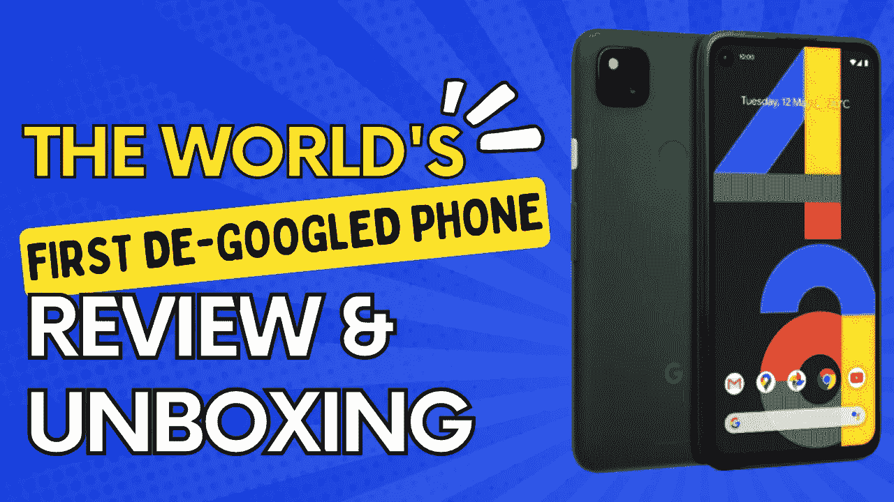
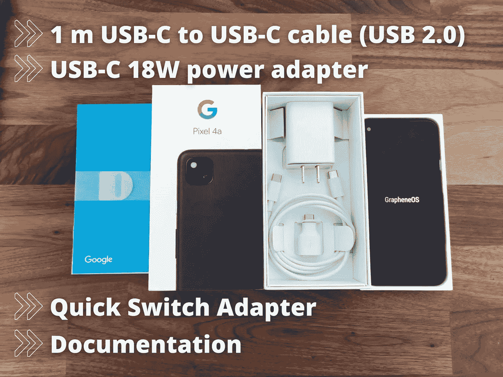
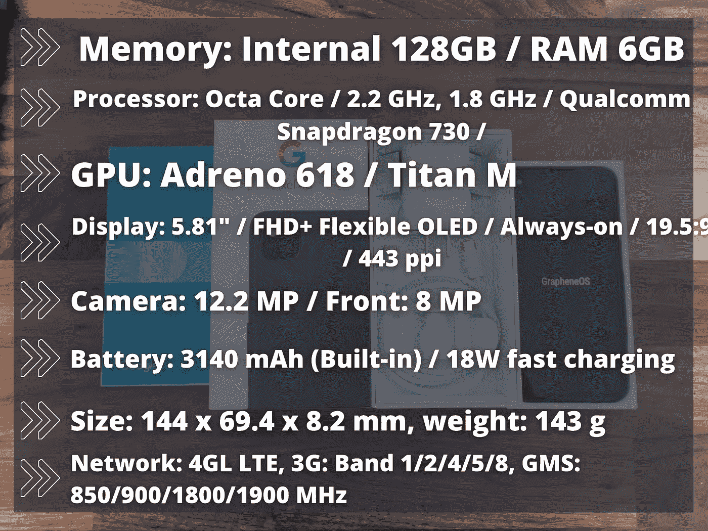

# 世界上第一个去谷歌化的电话评论

> 原文：<https://levelup.gitconnected.com/the-worlds-first-de-googled-phone-review-b03eecd2ba91>

## 不要让谷歌窃取你的数据，使用无谷歌的手机

## 拿起你的谷歌手机，为自己保留你的个人数据

自问世以来，去谷歌化的手机越来越受欢迎，而且越来越受欢迎。许多人喜欢它们，因为它们配置简单，而且不贵，因为它们没有加载臃肿的软件。问题是它们是否值得购买。

我们许多人在生活的几乎每个方面都严重依赖智能手机。从拍摄照片和录制视频到查看电子邮件、给朋友发短信和玩游戏，这些小工具已经成为个人和职业生活中不可或缺的一部分。

然而，现在的问题是，这个智能设备被用来从各种第三方应用程序中 ***窃取*** 我们的 ***个人数据*** 。这就是去谷歌化派上用场的地方。

去谷歌化的手机意味着去掉不必要的软件和其他对用户来说不必要的东西。虽然这确实意味着安装的应用和游戏更少，但也意味着手机运行速度更快。另一个好处是，它消除了可能对设备造成损害的潜在安全威胁。

我给自己买了一部谷歌手机 Pixel 4A (Sunfish ),我用了一周的时间做了一个适当的评测，这样你就可以确切地看到我使用这部手机的体验。你可以去[这个网站](https://advertizing.illusive-moose.ca/afflink/YUJBv7BcPs09yCDZdNYFagf46vs)给自己订购一部无谷歌手机。

我还做了一个拆箱视频，你会看到下面的链接。不要犹豫，留下评论，喜欢，并订阅我的 YouTube 频道。

让我们继续回顾，我将向你展示你需要知道的关于谷歌手机的一切。

# 介绍

不久前，在 2 月 5 日，我写了一篇关于第一部被谷歌搜索掉的手机的文章，我很好奇，所以我为自己订购了一部。我需要亲眼看看这个[产品提供了什么](https://de-googled.com/products/degoogled-pixel-6-pro-5g-raven?sca_ref=2400007.XdwJBy3bD8)以及它是否值得，所以这就是我决定写这篇后续评论文章的原因。

***什么是去谷歌手机？***

谷歌手机是一种由智能手机制成的设备，最初是为了运行 Android 操作系统，但经过修改后可以运行 Graphene OS 和 Calyx OS 等其他操作系统，这两种操作系统都是免费和开源的，因此社区可以审查代码。

你的手机不会再自动向谷歌的服务器发送任何数据。你将负责监控一切。如果你感兴趣，请继续阅读，了解更多关于这款手机的信息，以及我的使用体验。

## 它提供了哪些隐私功能？

丹·尼尔森在 [Unsplash](https://unsplash.com?utm_source=medium&utm_medium=referral) 上拍摄的照片

当选择从这个网站购买手机时，你有两个操作系统选项，我选择了石墨烯操作系统。我做出这个选择是因为我对这个操作系统更了解，并且想尝试一下。然而，你可以选择使用 Calyx OS，好处是一样的，只是对 UI 和其他东西做了一些小的改动。

*   对于有线移动设备，可以使用手机的 VPN 或 Tor。
*   曼陀罗防火墙给你所有的应用程序的访问控制。
*   microG 替代了 Google Play 服务的一些功能，同时保持了更多的匿名性
*   每月自动为您的设备进行无线安全更新(我可以确认在撰写本文时手机一直在更新)
*   它确保操作系统没有篡改验证启动
*   使用 OpenPGP(相当好的隐私)加密，电子邮件客户端如 Thunderbird 和 K-9 Mail 可以打开来自使用 PGP(相当好的隐私)的用户的电子邮件，这使他们可以验证发件人的身份和他们自己的签名

# 世界上第一个去谷歌化的电话评论

我通过导航到他们的网站并找到我想要的手机开始了这段旅程，这是 Degoogled Pixel 4a (sunfish)。从那里我选择了石墨烯操作系统，正如我上面所说的，我没有选择保护壳。说到付款，有几种方式可以支付这款手机。

您可以使用 PayPal、Visa、MasterCard、American Express 和 Stripe 购买这款手机。然而，如果你想保持匿名，也有一些选择支付加密。接受的加密支付是通过比特币或 Monero。

整个订购过程很顺利，没有任何问题。我输入了我的送货地址，填写了其他需要的细节，然后就完成了。付款很快就完成了，我通过电子邮件收到了购买通知。

## 船舶

该网站声称，他们在 3 至 5 个工作日内发货，在我的情况下，这就是所发生的事情。从下订单的那一刻起，到我真正拿到手机的时候，还没有超过 12 天，这太棒了！包裹密封得很好，在运输过程中没有任何损坏。

## 包裹

在包装内，你会看到手机在原来的谷歌像素盒中，你可以看到手机是全新的。你还会发现一根 1 米长的 USB-C 转 USB-C 线(USB 2.0)，一个快速开关适配器，一个 USB-C 快充 18W 电源适配器，一个从手机中取出 sim 卡的棍子，以及文档。

## 手机规格

**内存**:内置 128 GB/RAM 6GB
SIM 卡 : nano-SIM、eSIM
**处理器**:八核/ 2.2 GHz、1.8 GHz /高通骁龙 730/
**GPU**:adre no 618/泰坦显示:5.81”/FHD+柔性有机发光二极管/Always-on/19.5:9/443 PPI
**摄像头** EIS / Video: 4K UHD / **前置** : 8 MP，ф/2.0
**尺寸** : 144 x 69.4 x 8.2 mm，重量:143 g
**电池** : 3140 mAh(内置)/ 18W 快充
**连接**:插孔 3.5mm/USB Type-C 3.1 Gen 1
**无线:【中**

# 使用世界上第一部无谷歌手机一周

我从我的主要手机三星 Galaxy A71 切换到使用 De-Google Pixel 4a 一周，这是我注意到的情况。首先，我必须列出这部手机在我第一次使用时的应用程序:

*   **石墨烯应用**(在这里你可以找到操作系统提供的其他应用)，
*   **审计员申请**、
*   一个**计算器**，
*   **摄像机**应用、
*   一个**时钟**，
*   **联系人**、
*   **文件**、
*   **画廊**，
*   **消息传递**，
*   一个 **PDF 浏览器**，
*   最后是**钒**。

需要记住的一点是，当你第一次启动手机时，你会看到一个来自谷歌的屏幕，通知你正在使用与 Pixel 手机不同的操作系统。要越过这个警告，你只需要等待，石墨烯操作系统就会启动。

手机解锁后，可以在您选择的任何手机运营商上工作，如 GSM、CDMA、美国电话电报公司、T-Mobile 等。为了确保客户获得他们想要的智能手机，无论他们是生活在北美、日本、欧洲还是其他任何地方，该公司都会将他们的位置与正确的型号相匹配。

使用这款手机时，给我印象最深的是它的快速响应和流畅操作。与我的三星相比，这款手机在启动应用程序、导航和执行日常任务方面要快得多。

## 可用性

在今天这个时代，我们依赖 WhatsApp、Slack 或 Telegram 等通讯应用来完成工作，作为一名自由职业者，我有很多使用不同平台的客户。为了在这一周与大家保持同步，我必须安装这些应用程序。要做到这一点，你首先需要进入石墨烯应用程序并安装 Google Play Mirror。

从那里，我能够安装我工作和与客户交谈所需的应用程序。我安装应用程序没有任何问题，过程也很顺利。因此，如果你想在这部手机上使用谷歌 Play 商店的应用程序，你肯定可以做到。

我已经在谷歌关闭的手机上使用这些应用一个多星期了，从来没有遇到过任何问题。我能够正常地工作，毫无问题地与生活中的人交流。事实上，这种体验对我来说非常棒，因为这款手机速度非常快，而且从来不会出现卡顿或故障。

## 电池

从 4500 毫安的手机到 3140 毫安的手机，我有点怀疑，因为我经常使用手机，通常在一天结束时，电池会耗尽。然而，用这部手机，我没有这种问题。电池支持时间比我预期的要长；第一天，持续了一整天，一直坚持到第二天下午。

这是令人印象深刻的，因为我做了一些安装，我一直不停地使用我的手机。作为一个有点科技怪胎的我，我尝试了一切，做了我能用手机做的任何事情。这仍然没有迅速淹没电池。我认为可能有所帮助的一件事是操作系统，它真的被优化了，工作起来非常完美。

## 照相机

相机应用程序很好用，而且真的很快；然而，质量不是最好的。这是可以理解的，因为它只有一个 12.2 MP 的后置摄像头和一个 8 MP 的前置摄像头。然而，它能够以 1080p @30 fps 的速度捕捉视频，这很好。

## 显示

自从我的三星有 6.7 英寸的屏幕以来，我已经习惯了更大的显示屏，而这款手机只有 5.8 英寸的屏幕。然而，我很快就习惯了，而且有了永远显示功能，我开始更喜欢它了。

它对我来说不算太小，也没有任何亮度问题，尽管在阳光下和非常明亮的环境下看屏幕有点困难。

# 结束语

总的来说，如果你重视匿名和保护个人数据，这是一个非常可靠的设备。这款手机运行完美，反应迅速，我实际上正在考虑全职使用 [De-Google Pixel 4a](https://de-googled.com/products/degoogled-pixel-6-pro-5g-raven?sca_ref=2400007.XdwJBy3bD8) 而不是三星 Galaxy A71。

如果你想买一部新手机，那么一定要看看这款。这是一个很好的选择，尤其是如果你喜欢 Android 手机，但不想与谷歌分享你的个人数据。

如果你对这篇文章有任何问题或建议，不要犹豫，在评论区留下回复。喜欢你读的东西吗？为什么不关注我的媒体简讯，这样你就不会错过我未来的任何文章了？很简单，点击[这里](https://kgabeci.medium.com/subscribe)输入你的电子邮件地址，然后点击订阅。

你喜欢阅读媒体上的文章吗？考虑成为会员，有很多功能，你将获得所有创作者的内容，每月只需 5 美元。使用[这个链接](https://kgabeci.medium.com/membership)，你也帮我赚一小笔佣金；点击成为会员，并输入您的信息。