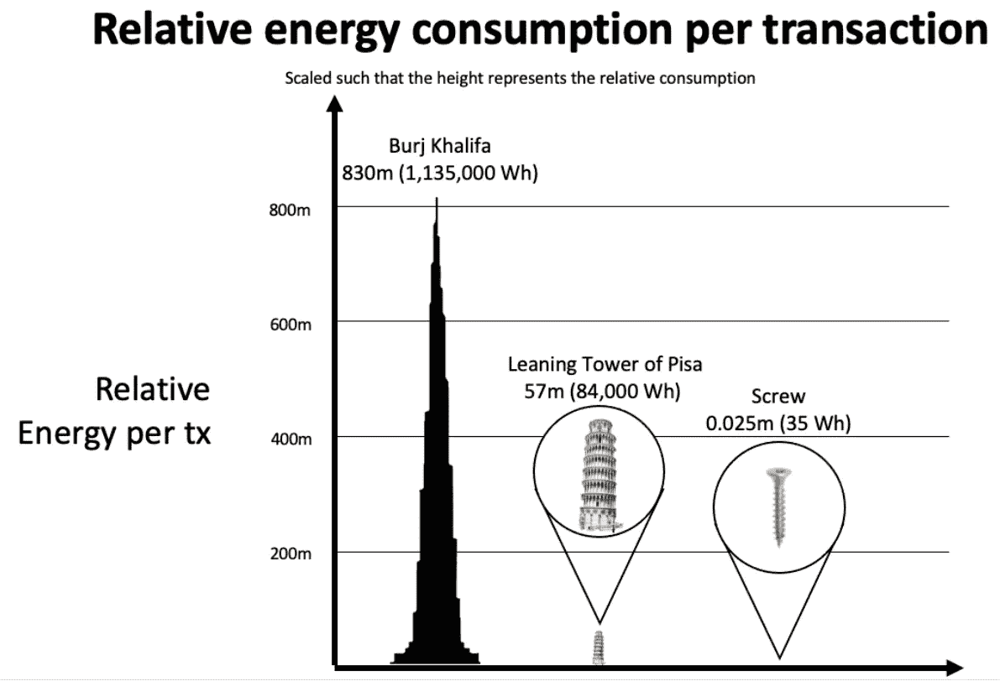
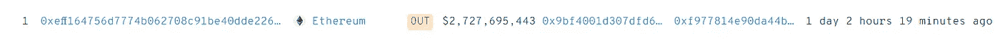

# 世界上最大的 ETH 持有者准备在合并前抛售 27 亿美元。

> 原文：<https://levelup.gitconnected.com/the-worlds-largest-eth-holder-is-ready-to-dump-2-7-billion-ahead-of-the-merge-ef36df48f5d9>

[Credit — iseekplant](https://blog.iseekplant.com.au/blog/what-is-a-dump-truck)

几周来，我一直在思考，在以太坊期待已久的合并(定于 9 月中旬)之前，是否会有一个短期交易机会。

当市场波动时，我倾向于把自己放在买入并持有的位置。但我看到了我所见过的最可靠的“买谣言卖新闻”的一招。

顺便说一句，当某人说某事是肯定的事时。从来都不是。这可以有多种方式。

对于 NFT 和 Crypto 中的重大事件，可以在事件发生之前很好地“定价”。

短线交易者通过在事件发生之前或之后抛售他们的代币来利用消息的销售势头。

因此有了这个说法。

> “买谣言，卖新闻”

下一个事件是以太坊的合并。以太坊区块链正在走向利益共识的证明。

ETH 的股权证明举措旨在提高其可扩展性，并使区块链的能耗降低 99.95%。

能源使用的差异是惊人的。

作为背景，以太坊目前每笔交易使用的能源约为普通家庭的 2.8 天。

转向验证股份将导致每笔交易的成本与运行一台电视机 20 分钟的成本相同。

比特币每笔交易消耗 38 天的能量。

非加密本地人和环保主义者诋毁区块链技术有很大的好处。

我明白了。但是，如果这次合并成功，以太坊将比网飞更节能。

你的罗杰叔叔将需要开发一个不同的叙事或被说服下载比特币基地。

下面是每笔交易的能耗差异，如果以高度来衡量，有一个鲜明的对比。

*   比特币=哈利法塔
*   工作证明=比萨斜塔
*   桩的证据=一颗螺丝钉

【Ethereum.org】[信用——T3](https://blog.ethereum.org/2021/05/18/country-power-no-more/)

Eth 2.0 可以说是自以太坊和比特币诞生以来，密码学领域最重大的事件。

短线交易者希望利用这个一次性事件。

鸣人，世界上最大的 ETH 鲸鱼，最近向币安，一个受欢迎的加密货币交易所，转移了一笔惊人的 ETH 代币。

在以太扫描和 Whalestats 上看到，转给币安的 149 万以太币是鸣人钱包里以太坊的全部。

ETH 的美元等值为 27.2 亿美元

【whalestats.com】T4

这一非同寻常的交易发生在以太坊 2.0 即将到来的合并活动的前一个月。目前还不确定以太坊鲸是否打算在币安出售代币。

虽然这确实引出了一个问题，为什么要转让那么多 ETH？

最有可能的结果是，在合并之前，我们会看到《火影忍者》钱包里的 ETH 系统化销售。

然后，有了固定金额，他们可能会利用合并后的买入窗口，这可能是在市场下跌时的“买入下跌”机会。

最终增加了他们以太坊的地位。

这完全是猜测，有时会发生与你认为会发生的完全相反的事情。

看这件事如何发展会很有趣。

> ***以上都不是理财建议。我不是一个合格的财务顾问，尽管我尽了最大努力，我也无法预测未来。***
> 
> ***NFT 空间有风险。***
> 
> ***专家说目前 99%的项目都是走向 0。***

# 分级编码

感谢您成为我们社区的一员！在你离开之前:

*   👏为故事鼓掌，跟着作者走👉
*   📰查看[升级编码出版物](https://levelup.gitconnected.com/?utm_source=pub&utm_medium=post)中的更多内容
*   🔔关注我们:[Twitter](https://twitter.com/gitconnected)|[LinkedIn](https://www.linkedin.com/company/gitconnected)|[时事通讯](https://newsletter.levelup.dev)

🚀👉 [**加入升级人才集体，找到一份惊艳的工作**](https://jobs.levelup.dev/talent/welcome?referral=true)