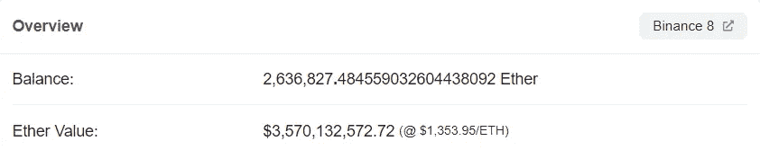

# 世界上最大的 ETH 鲸鱼——将 260 万 ETH 移到币安

> 原文：<https://levelup.gitconnected.com/the-worlds-largest-eth-whale-moved-2-6-million-eth-onto-binance-b7af0ba54903>

## 就在合并之前。事情是这样的。

美国宇航局在 [Unsplash](https://unsplash.com/s/photos/world?utm_source=unsplash&utm_medium=referral&utm_content=creditCopyText) 拍摄的照片

以太坊合并完成。

技术史上最复杂的开源软件变革，由几十个研究人员和开发人员团队协调。

这一切都顺利进行。

经过几年的计划，合并花了 15 分钟才完成。

以太坊新的“利益证明”共识提高了其可扩展性，并使区块链的能耗降低了 99.95%。

据[报道，维塔利科·布特林](https://www.coindesk.com/business/2022/09/15/vitalik-buterin-says-ethereum-merge-cut-global-energy-usage-by-02-one-of-biggest-decarbonization-events-ever/)称，合并已经减少了全球 0.2%的能源使用。

自恐龙时代以来最大的脱碳事件。(你可能需要核实恐龙的部分)。

蒂姆·贝科，以太坊基金会的开发者，在协调更新中发挥了至关重要的作用，被引述说；

> “我认为合并可以真正吸引那些对以太坊感兴趣但对环境影响持怀疑态度的人来尝试它。”

他们应该这样做。

气候争论已经结束。

以太坊现在比 Youtube、网飞和 Paypal 更节能。

[以 TW/年为单位的年能耗](https://ethereum.org/en/energy-consumption/)

对一些人来说并不奇怪。合并成功后不久，以太坊的价格暴跌。在一个经典的**“买谣言，卖新闻”**的市场反应中。

在这种情况下，短线交易者希望利用重大新闻事件的势头，在事件发生之前或之后抛售他们的代币。

因此有了这个说法。

我相信这将是一个“购买谣言出售新闻”的事件，并在这篇文章中特别提到了它；

全球最大的 ETH 持有者准备在合并前抛售 27 亿美元。

但并不是所有人都认为活动结束后会出现抛售，包括以太坊的联合创始人维塔利克·布特林(Vitalik Buterin)。

> “这次合并越来越引人注目，但仍未‘定价’——无论是从市场角度还是心理角度来看。”

当他发表声明时，以太坊正在附近徘徊；

*   1696.00 美元，最高触及 1761.32 美元
*   在出版时，它的当前价格是 1351.38 美元。

对于大多数交易者来说，现实是这一事件很可能在三个月前就已经“消化”了。

再也没有取得任何重大进展。

价格正在下跌。

下面是一个匿名钱包地址和最大的以太巨鲸如何玩合并。

两笔交易被转入他们的币安账户。

两者都发生在 9 月 15 日合并之前。

*   **716，977 ETH — 5 天 4 小时前(2022 年 9 月 14 日 06:01:03 PM +UTC)**
*   **315，184 ETH — 6 天 3 分钟前(2022 年 9 月 13 日 11:00:19 PM +UTC)**

这是 Etherscan 上的交易。

来源— [以太扫描](https://etherscan.io/address/0x9bf4001d307dfd62b26a2f1307ee0c0307632d59)

如果你进一步调查他们的交易，33 天 8 小时前，他们又转了 149 万瑞士法郎到同一个币安钱包里。

来源— [以太扫描](https://etherscan.io/address/0x9bf4001d307dfd62b26a2f1307ee0c0307632d59)

虽然很难说，但时间标记给了我们大量线索，让我们知道他们想做什么。

他们可以说是在寻求将以太坊出售给一个泵。

酪

他们的以太坊没有被卖掉，甚至没有被搬走。

以太扫描显示，他们可能一直在等待合并后的价格上涨。

他们所有的以太坊还在交易所的同一个钱包里。

来源— [以太扫描](https://etherscan.io/address/0xf977814e90da44bfa03b6295a0616a897441acec)

260 万以太币，总计 35 亿美元，就这么放在那里。

这只能让我得出一个非常推测性的结论。

这条以太坊巨鲸并不认为这一合并已被计入股价，并持有仓位，等待进一步的流动性注入以太坊。

当他们第一次将以太坊转移到币安交易所时，这是他们可能出售以太坊的价格。

*   **2022 年 9 月 14 日—ETH 价格—1642.16 美元**
*   **2022 年 9 月 13 日— ETH 价格—1745.78 美元**
*   今日价格— **$1351.38(发布时间)**

随着通货膨胀率达到历史最高水平，利率上升，欧洲爆发战争，经济衰退迫在眉睫，很难相信一种不稳定的资产会在如此重大的事件后保持其价格。

事后我说这个也毫不费力。

马后炮是件美好的事情。

在 [Medium](https://t.co/0WsCUfngD2) 、 [LinkedIn](https://www.linkedin.com/in/jayden-levitt-aa93511b9/) 或 [Twitter](https://twitter.com/JaydenLevitt) 上关注我。

*本文仅供参考；不应将其视为财务、税务或法律建议。在做出任何重大财务决定之前，请咨询财务专家。*