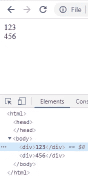
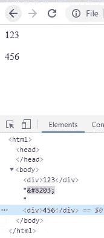
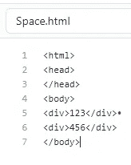

# 零宽度空间

> 原文：<https://levelup.gitconnected.com/the-zero-width-space-77543a28c984>

## 一个看不见的角色如何毁掉你的网页

由[杰里米·帕金斯](https://unsplash.com/@jeremyperkins?utm_source=medium&utm_medium=referral)在 [Unsplash](https://unsplash.com?utm_source=medium&utm_medium=referral) 上拍摄的照片

看看这两个简单的 HTML 页面:

## 第 1 页

## 第 2 页

它们看起来完全相同，但是看看浏览器中呈现的内容:

## 第 1 页渲染

## 第 2 页渲染

如你所见，在第二页的“123”和“456”之间有一个间隙，但在第一页没有。

## 这是怎么回事？

前几天我工作的时候也遇到过这种情况。

出于某种原因，除了一些文本外，两个几乎相同的页面显示不同。一个有随机的空格分隔一些文本，而另一个没有。

结果，不知怎么的，一个叫做“零宽度空格”的字符进入了 html 文件。

## 这有什么意义？

代码`&#8203`是零宽度空间的 [HTML 代码](http://www.fileformat.info/info/unicode/char/200b/index.htm)。

来自 [ptiglobal](https://www.ptiglobal.com/2018/04/26/the-beauty-of-unicode-zero-width-characters/) :

> 当使用不使用空格分隔单词的语言时，零宽度空格可用于在长单词中启用换行。

## 你怎么能看到一个隐形的角色？

这个空格在 Visual Studio/Notepad 甚至 Notepad++这样的普通文本编辑器中都不会出现。

我肯定有文本编辑器可以显示这些字符的位置，但一个简单的方法是将文本粘贴到浏览器的 URL 中，然后按 enter 键。

浏览器将其转换成 URL 编码格式`%E2%80%8B`:

GitHub 在编辑代码时也会显示字符:

如果你的网页中出现奇怪的空白，请注意 DOM 中的这个狡猾的字符。

*如果你觉得这篇文章有帮助，请考虑通过* [*请我喝咖啡*](https://www.buymeacoffee.com/dklempfner) *来支持我。*