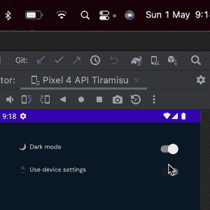

# 使用 Jetpack Compose 中的数据存储进行主题管理

> 原文：<https://levelup.gitconnected.com/theme-management-with-datastore-in-jetpack-compose-c10c043ab276>

在你的应用程序上使用暗/亮模式可能会有点混乱，但通过一些工具，我们将能够匹配所需的外观和感觉。

## 包装纸

为了能够轻松切换，我们将使用自定义主题管理器来包装我们的应用程序，这将允许我们处理主题的状态。

包装器将有一个对数据存储的引用，以检查它何时发生变化，并让整个应用程序知道正在发生变化。当数据改变时，应用程序也会改变。

为了方便起见，我们将使用 Twitter 在其应用程序上使用的方法，基本上，您可以选择使用您的配置，或者使用系统的配置。



设置演示应用程序。

我们还将依赖于材料设计主题组件，它有所有的工具来使这个变得简单一点。

```
@Composable
fun AppTheme(
    content: @Composable () -> Unit,
) {
    val context = *LocalContext*.current
    val viewModel = *remember* **{** ThemeViewModel(context.*dataStore*) **}** val state = viewModel.state.*observeAsState*()
    val value = state.value ?: *isSystemInDarkTheme*()

    *LaunchedEffect*(viewModel) **{** viewModel.request() **}** *DarkThemeValue*.current.value = value
    *MaterialTheme*(
        colors = if (value) *AppDarkColors* else *AppLightColors*,
        typography = *AppTypography*,
        shapes = *AppShapes*,
        content = content
    )
}

@Composable
@ReadOnlyComposable
fun isDarkTheme() = *DarkThemeValue*.current.value

@SuppressLint("CompositionLocalNaming")
private val *DarkThemeValue* = *compositionLocalOf* **{** *mutableStateOf*(false) **}**
```

## 数据存储/视图模型

我将减少这一串只是为了得到的想法，基本上，对于这个例子，我们将只保存一个值真/假，根据这个值的变化，用户界面将重新呈现。这种基本的视图模型使用实时数据与用户界面交流并保持最新。

```
class ThemeViewModel(
    private val dataStore: DataStore<Preferences>
) : ViewModel() {
    private val forceDarkModeKey = *booleanPreferencesKey*("theme")

    val state = MutableLiveData<Boolean?>(null)
    fun request() {
        *viewModelScope*.*launch* **{** dataStore.data.collectLatest **{** state.*value* = **it**[forceDarkModeKey]
            **}
        }** }

    fun switchToUseSystemSettings(isSystemSettings: Boolean) {
        *viewModelScope*.*launch* **{** if (isSystemSettings) {
                dataStore.edit **{
                    it**.remove(forceDarkModeKey)
                **}** }
        **}** }

    fun switchToUseDarkMode(isDarkTheme: Boolean) {
        *viewModelScope*.*launch* **{** dataStore.edit **{
                it**[forceDarkModeKey] = isDarkTheme
            **}
        }** }
}
```

由于某些特殊原因，这里有三个函数，其思想是监听数据存储上的更改，这些更改将传播到 UI。

## 调色板/用户界面

现在我们有了工具，我们可以开始在我们的屏幕上使用它，首先我们可以创建一些颜色和一个根据主题状态设置颜色的工具。

```
val *DarkBlue* = Color.*fromRGB*("#0B1729")
val *Silver20* = Color.*fromRGB*("#E5E5E5")
val *SilverLight* = Color.*fromRGB*("#F8F7F8")

@Composable
fun backgroundColor() = *DarkBlue orInLightTheme SilverLight* @Composable
fun captionColor() = *Silver20 orInLightTheme DarkBlue*@Composable
@ReadOnlyComposable
infix fun <T> T.orInLightTheme(other: T): T = if (*isDarkTheme*()) this else other
```

`orInLightTheme`只是一个不在 app 周围写 if/else 的花哨功能。

现在，您可以对所有组件进行主题化:

```
*CustomText*(
    text = "\uD83C\uDF19  Dark mode",
    color = *captionColor*(),
)
```

## 设置屏幕/示例

要查看完整示例，请访问 https://github.com/go-cristian/compose_theme。

这是一个你如何处理它的快速例子，当然在生产中，你需要改变这里的一些东西。