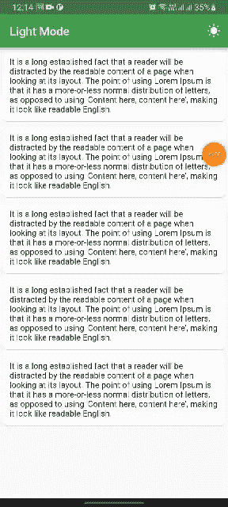
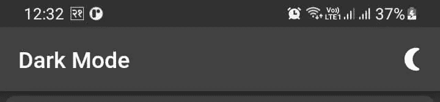
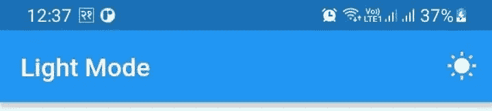
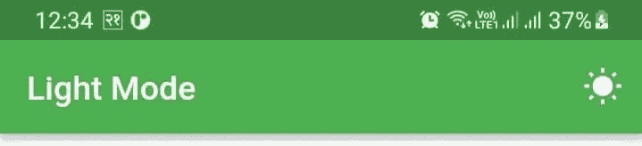

# 在颤动中改变主题

> 原文：<https://levelup.gitconnected.com/theme-switcher-with-provider-f84f947b9044>

在应用程序开发领域，切换主题是趋势特征之一。改变主题可以减少用户的眼睛疲劳，也可以减少电池寿命。

在这里，我们将学习如何开发一个可以动态改变主题的应用程序。



活生生的例子

在颤动中改变主题

在这个项目中，我们将使用两个包[](https://pub.dev/packages/provider)**和[***shared preferences***](https://pub.dev/packages/shared_preferences)***。*****

*   ****Provider:** 它是著名的用于依赖注入和状态管理的包之一。**
*   ****SharedPreferences:** 共享首选项允许我们将最少量的原始数据作为键/值对存储在设备上的一个文件中。这里我们用它来存储当前的主题，这样用户在关闭并返回应用程序后也能得到相同的主题。**

**我们可以通过两种方式实现这一点:一种是添加一个自定义选项，另一种是根据系统设置自动切换主题。**

**在 Flutter 中，我们可以借助 ***MaterialApp*** 构造函数中的 ***ThemeData*** 来改变整个 app 的主题。当没有提供主题时，默认主题将在整个应用程序中共享。**

```
**MaterialApp(
   theme: ThemeData( ... ), // to declare the theme to throughout the application
);**
```

**[**theme data**](https://api.flutter.dev/flutter/material/ThemeData-class.html)**是用来配置整个 app 的外观。它由大量属性组成，用于在我们的应用程序中声明主题。****

******ThemeData.dark()** 负责在整个应用程序中提供 dart 主题。****

```
****MaterialApp(
   theme: ThemeData.dark(),  // default dark the theme 
);****
```

********

****黑暗主题****

******主题数据**。 **light()** 给出了浅蓝色的主题，这是每个 flutter 应用的默认主题。****

********

****轻音乐主题****

****我们也可以改变主题的 ***primaryColor*** 。我们可以获得如下结果:****

```
****MaterialApp(
   theme: ThemeData(
           brightness: Brightness.light,
           primaryColor: Colors.green,
           primarySwatch: Colors.green
),);****
```

********

****浅色主题颜色****

# ****让我们开始吃吧****

## ****1.将该包添加到****publibsec . YAML***文件中。*****

```
*****dependencies:
   provider: ^6.0.3
   shared_preferences: ^2.0.15*****
```

## *****2.为**共享偏好**创建类*****

*****创建一个名为***mytheme _ preference . dart .***的文件，这里我们创建了两个方法，分别是 ***getTheme()*** 和 ***setTheme()*** ，分别用于获取主题和保存主题。*****

## *****3.为主题状态创建提供程序*****

*****创建名为***model _ theme . dart .***的文件，在这里我们更改主题的状态，并将其保存到我们的共享首选项中。*****

*   *******_isDark** 是提供主题状态的布尔值*****
*   *******_preferences** 是 MyThemePreferences 变量的一个实例。*****
*   *******notifyListeners()** 方法更新变量 **_isDark** 的值并重建 UI。*****
*   *******getPreference()** 方法从共享首选项加载主题状态，并将其设置为 **_isDark。*******

## *****4.将提供程序添加到 MaterialApp*****

## *****5.主页*****

*****这里我们添加了**消费者**来监听和更新 UI。*****

*****我们可以通过向**主题**参数提供亮**主题数据**和向**暗主题**参数提供暗**主题数据**来根据系统偏好改变主题。*****

```
*****theme: ThemeData.light(), // Provide light theme.
  darkTheme: ThemeData.dark(), // Provide dark theme.
  themeMode: ThemeMode.system, //to follow the system theme*****
```

# *****让我们连接起来*****

*****我们可以成为朋友。在[脸书](https://www.facebook.com/nabin.dhakal.714/)、 [Linkedin](https://www.linkedin.com/in/nabindhakal/) 、 [Github](https://github.com/nbnD) 、 [Youtube](https://www.youtube.com/channel/UCW6oYt_3QSl7J2HSHNqwXWw) 、 [BuyMeACoffee](https://www.buymeacoffee.com/nabindhakal) 和 [Instagram](https://www.instagram.com/nbn_d_/) 上查找。*****

*****拜访:[颤振结](https://flutterjunction.com/)*****

*******投稿:** [购买咖啡](https://www.buymeacoffee.com/nabindhakal)*****

# *****结论*****

*****希望这篇文章对你有所帮助，让你学到新的东西。我在这篇文章中使用了一些对你们中的一些人来说可能是新的东西。*****

*****如果你学到了新的东西或者想提出一些建议，请在评论中告诉我。*****

*****如果你喜欢这篇文章，请点击👏图标，它为您提供了传递所有新事物的动力。*****

*****此外，关注令人兴奋的文章和项目的更新。*****

*****通过分享学习对学习过程产生了巨大的影响，并使社区越来越大。*****

*****分享是吸引其他爱好者的磁石。*****

*****因此，让我们朝着扩大我们的学习社区迈出一小步。*****

*****与你的朋友分享这篇文章，或者如果你喜欢这篇文章，就在推特上发表评论。*****

# *****在以下时间吃饱:*****

*****[](https://github.com/nbnD/theme_switcher) [## GitHub - nbnD/theme_switcher:动态改变 app 主题的 flutter 应用。

### 一个新的颤振项目。这个项目是颤振应用的起点。一些帮助您入门的资源…

github.com](https://github.com/nbnD/theme_switcher)***** 

# *****分级编码*****

*****感谢您成为我们社区的一员！更多内容见[级编码出版物](https://levelup.gitconnected.com/)。
跟随:[推特](https://twitter.com/gitconnected)，[领英](https://www.linkedin.com/company/gitconnected)，[通迅](https://newsletter.levelup.dev/)
**升一级正在改造理工大招聘➡️** [**加入我们的人才集体**](https://jobs.levelup.dev/talent/welcome?referral=true)*****