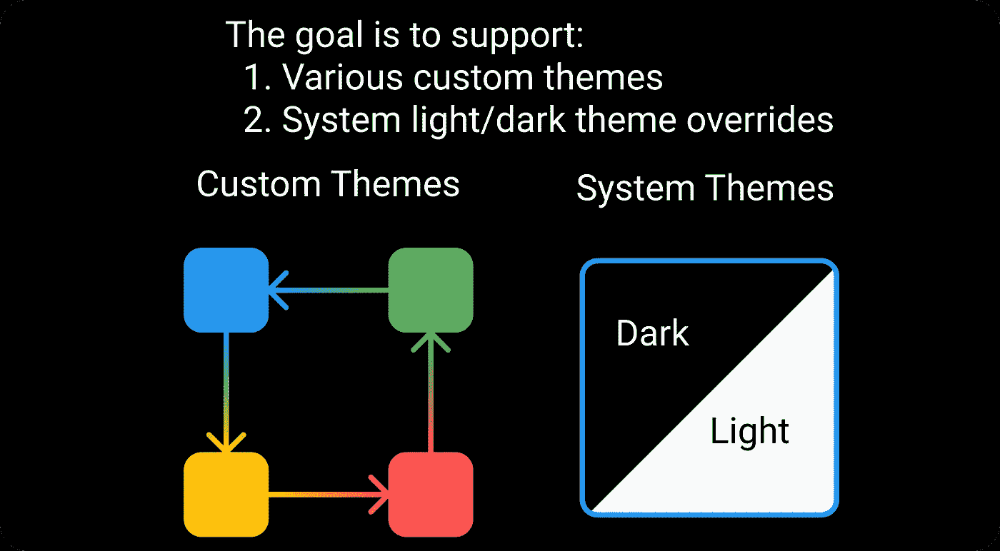
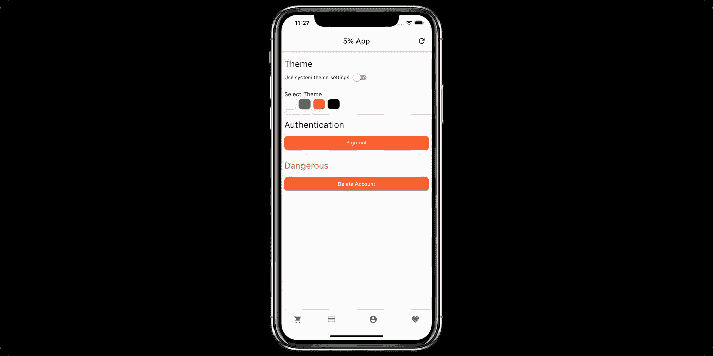

# 带颤动的主题系统

> 原文：<https://levelup.gitconnected.com/theme-system-with-flutter-91e14f9a3302>

## 为您的应用提供丰富多彩的用户体验指南

由 [Ricardo Resende](https://unsplash.com/@rresenden?utm_source=unsplash&utm_medium=referral&utm_content=creditCopyText) 在 [Unsplash](https://unsplash.com/s/photos/colorful?utm_source=unsplash&utm_medium=referral&utm_content=creditCopyText) 上拍摄

随着跨平台框架(例如 React Native 和 Flutter)及其设计模式的成熟，构建功能变得比以前更容易，这使得人们更加关注构建用户体验。

主题在用户体验中扮演着重要的角色，因为它出现在应用程序的每个屏幕上。

然而，建立一个用户友好的主题系统是一项重要的工作，包括:

*   使其动态化(在应用程序中的主题之间切换)。
*   构建用于配置主题的 UI
*   使主题配置持久和可用

当我为我的副业项目构建一个主题系统时，在研究了现有的关于构建主题系统的教程后，我发现它们中的大多数只涵盖了故事的一个方面，这可能导致实践中不必要的反复试验。

此外，大多数现有的教程假设一个新的应用程序对学习者来说很好，但对开发者来说不切实际，因为 UI/UX 通常在核心功能之后。

这篇文章是在现有的 Flutter 应用中构建主题系统的一步一步的教程。

以下是重构后的应用预览:

# 构建主题系统的分步指南

## 步骤 0:在服务中包装主题

在 Flutter 中，主题以对象的形式存在，作为顶级应用程序的参数:

在上面的例子中，我们可以看到很难(或不可能)在不同的主题之间动态切换，因为只有当应用程序重新加载时才会重建。

更好的方法是将主题包装在服务中，而不是硬编码:

## 步骤 1:实现系统主题设置的逻辑

在 Flutter 中，系统主题设置是可访问的，所以用户可能更喜欢系统主题设置而不是本地主题设置。

我们可以通过向主题服务添加一些逻辑来轻松实现这一点:

在上面的代码片段中，我们使用了一个布尔标志`useSystem`，来控制应用程序是否应该遵循系统主题设置。

## 步骤 2:实现 UI 来与主题设置进行交互

有了上面的主题服务，我们可以通过调用`theme.setTheme()`来动态切换主题。

下一步是构建一个 UI，让用户与动态主题进行交互:

上面的代码为我们提供了一个类似这样的用户界面，用户可以在不同的主题之间进行选择，或者使用系统主题设置:

添加上述代码后的 UI

## 步骤 3:实现设置持久性

通过前面的步骤，我们有了一个动态变化的主题，并且可以很好地配合系统主题设置，但是如果我们的用户必须在每次应用程序重新加载时重新配置主题设置，那就不是很好了。

有几种持久化数据的方法，包括远程数据库、本地 SQL 数据库等。

为了优化应用程序加载时间和简化开发，我们将使用 Hive，一个本地键值存储库。

添加了配置单元支持后，我们的主题设置可以在重新加载之间保持不变:

## 万岁！主题系统现在完成了！黑客快乐！

(奖金)这里有一个现场编码会议，引导你如何按照本文的步骤建立一个完整的主题系统([在 YouTube 上观看](https://youtu.be/UO8s7a_R5OI)以获得更好的时间表):