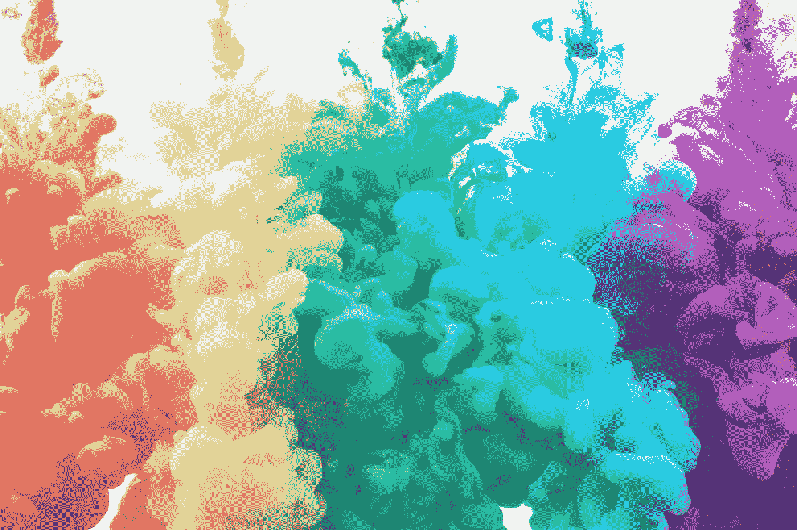

# 带有 CSS 自定义属性的主题化样式组件

> 原文：<https://levelup.gitconnected.com/theming-styled-components-with-css-custom-properties-e60050237741>



最近，我从 Vue 过渡到 React(这里有更多关于它的信息)。有了 Vue，我习惯用老派风格的标签写纯 CSS。现在随着过渡反应，我想体验一些不同的东西，所以我决定给[样式组件](https://styled-components.com/)一个尝试。老实说，到目前为止我喜欢它。它有助于保持易于重构和扩展的可维护风格。唯一的缺点是，如果你过度使用他们的道具系统，你的造型会变得不那么可读和凌乱。这正是我喜欢 CSS 自定义属性(变量)的原因，它们可以帮助你保持 CSS 的整洁，尤其是在主题化的时候！

# CSS 自定义属性

> *就像你知道的任何其他可变系统一样*

CSS 自定义属性通常称为 CSS 变量，包含可以在整个应用程序中重用的值。就像你知道的任何其他可变系统一样。它们在 94.75%的浏览器市场份额上受到支持，因此它甚至可以投入生产。

定义一个自定义属性就像设置一个 CSS 属性，唯一的区别是你需要加上前缀`--`。

```
:root {
  --theme-primary: #F5005E;
}
```

在上面的例子中，我初始化了一个名为`theme-primary`的新自定义属性，并将其值设置为`#151618`。`:root`伪类用于确保新的定制属性在整个文档中都可用，而不仅仅是在特定的范围内。
现在要使用`theme-primary`，我们可以使用 CSS 函数`var`。让我们看看实际情况:

要了解更多信息，[查看 MDN 文档](https://developer.mozilla.org/en-US/docs/Web/CSS/Using_CSS_custom_properties)。

# CSS 自定义属性与样式化组件属性

> *CSS 自定义属性将保持你的代码整洁易读，而样式化组件属性更加灵活*

您已经掌握了什么是 CSS 自定义属性。但是样式组件也有一个道具系统。那么我们如何决定哪一个对我们更好呢？简而言之:CSS 自定义属性将保持代码的整洁和可读性，而样式化组件属性则更加灵活。让我们深入研究一下。

一方面，我们有 CSS 自定义属性，为您提供所有现成的 CSS 功能。变量自动向下游传递给子元素，您可以用更具体的规则覆盖它们，并像任何其他 CSS 属性一样动态地更改它们。样式也保持整洁和优雅(稍后将详细介绍)。但是说到底，它们只是线，你不能用它们做任何花哨的事情。

另一方面，样式化组件道具拥有 JavaScript 的力量。您可以像使用任何其他 JavaScript 变量一样使用它们，并相应地更改样式。您可以对用户事件做出反应，根据 react 组件属性设置值，验证，设置类型，以及基本上所有的事情。问题是，使用道具的样式更难阅读，最终的捆绑会更大。

主题属性通常是静态设置的，几乎可以被应用程序中的任何组件访问。它为 CSS 自定义属性提供了一个完美的用例。传递主题是我们免费获得的，我们不需要验证或应用任何复杂的规则。

# 样式-组件全局样式

styled-components 专注于创建具有范围样式的组件。但有时，我们需要对所有组件应用全局样式。例如，如果我们想重置浏览器的默认样式，或者在我们的情况下，如果我们需要应用一个全局主题。
由于这个具体原因，我们可以使用助手函数`createGlobalStyle`。让我们更新之前的例子，使用样式化组件和`createGlobalStyle`。

# 主题

我们差不多完成了，这是过程的最后一步。在这里，我们将整合我们所学的一切，为我们的 React 应用程序创建一个可维护的主题系统。为了创建主题，我们需要用不同的值多次设置相同的 CSS 自定义属性。例如，假设我们有一个深色主题(默认)和一个浅色主题。默认情况下，暗值将在`:root`伪元素中设置，亮值可在`html.light`中设置。如果 html 元素打开了 light 类，它将覆盖默认值。

让我们看看它的实际效果吧！

看多简单啊！一旦自定义属性被更改，它会自动传播到每个组件。

为了便于比较，我用样式化组件内置解决方案创建了相同的演示。(更多信息[点击此处](https://styled-components.com/docs/advanced#theming))

在我看来，这种实现有两个缺点。首先，我发现它可读性较差，解决方案也不够优雅，因为它包含了太多的字符串插值。第二，输出包更大，因为样式化组件为道具的每个值创建一个类。如果您在切换主题时打开 DevTools，您将看到 button 类发生了变化。

最终，由您决定您更喜欢哪个解决方案。没有对错之分。

# 奖励:转换主题变化

你已经成功了，这是个不错的奖励。平滑地过渡 UI 变化总是更好的，对主题也是如此。我们所要做的就是切换主题，添加一个过渡。这将确保每个属性都平稳过渡。请小心使用，因为在某些情况下它可能会导致性能问题。

仅此而已！我很高兴你通过了。请在下面的评论中告诉我你的想法👇

*这篇客座博文是❤️与*[***daily . dev***](https://r.daily.dev/gitconnected)*合作向*[*git connected*](https://levelup.gitconnected.com/)*社区发布的。daily.dev 在每个新标签页提供最好的节目新闻。它将为您排列数百个合格的来源，以便您可以侵入未来。*

[](https://r.daily.dev/gitconnected)