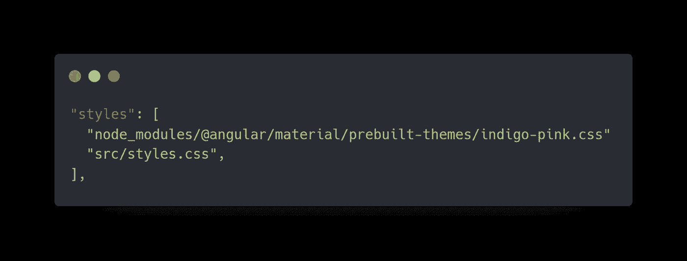
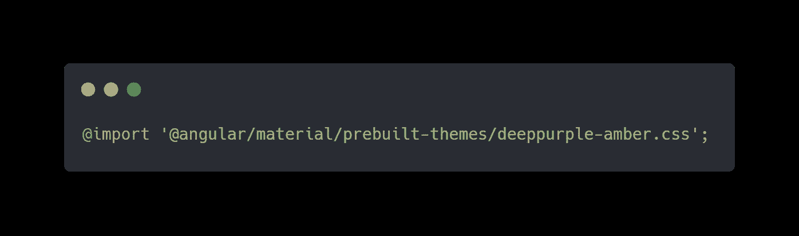
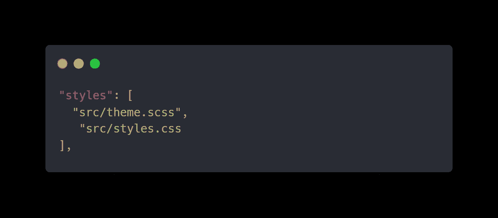
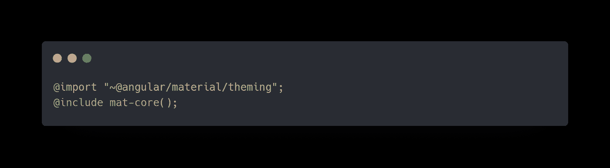
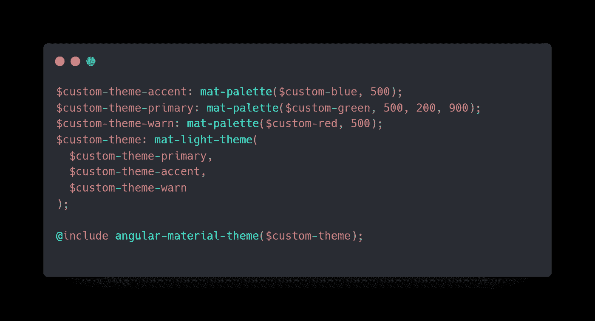
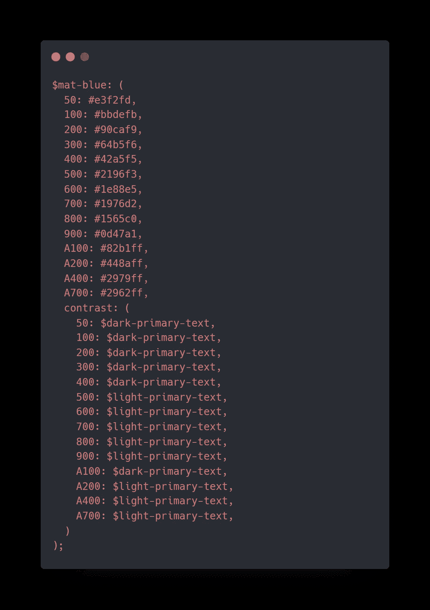

# 使用有棱角的材料制作主题

> 原文：<https://levelup.gitconnected.com/theming-using-angular-material-a056e18b9d1c>

## 用更好的主题保持你的网站的感觉

莎伦·麦卡琴在 [Unsplash](https://unsplash.com?utm_source=medium&utm_medium=referral) 上的照片

Angular Material 是 Google 创建和设计的 UI 组件库。它包含 30 多个可重用的、经过良好测试的、可访问的 UI 组件，这些组件有助于开发有吸引力的、一致的、功能性的网页和 web 应用程序。

棱角分明的材质支持主题。主题是应用于角形材质组件的一组颜色。它有助于维护应用程序的一致性。Angular Material 中的主题是通过组合多个调色板来创建的，Angular Material 带有自己预定义的主题，但用户也可以选择创建自己的自定义主题。

## 使用预先构建的主题

如前所述，Angular Material 附带了几个预置的主题，位于**@ Angular/Material/pre build-themes**。有四种预设的材质主题，它们是:深紫琥珀色、靛粉色、粉蓝灰色和紫绿色。如果您正在使用 Angular CLI，将主题导入到您的应用程序中就像在您的 **angular.json** 文件中包含一行一样简单。

一个 ngular.json

或者，您也可以通过将以下代码添加到您的 **styles.css** 文件中，将预定义的主题导入到您的应用程序中。

[styles.css](https://carbon.now.sh/?bg=rgba(0%252C0%252C0%252C0)&t=one-dark&wt=none&l=application%252Ftypescript&ds=true&dsyoff=20px&dsblur=68px&wc=true&wa=true&pv=56px&ph=56px&ln=false&fl=1&fm=Hack&fs=14px&lh=152%2525&si=false&es=2x&wm=false&code=%252540import%252520'%252540angular%25252Fmaterial%25252Fprebuilt-themes%25252Fdeeppurple-amber.css'%25253B)

但是在大多数情况下可能不是这样，您可能希望使用您的颜色主题来开发您的应用程序。放心吧！正如我上面提到的，角状材料给了我们这个选择，来建立我们自己的定制主题。现在让我们看看如何做到这一点。

## 使用你自己的自定义主题

使用棱角分明的材料创建自定义主题就像使用预先构建的主题一样简单。主题是通过组合多个调色板来创建的。

*   *主调色板:*所有屏幕和组件中使用最广泛的颜色。
*   *强调调色板:*用于浮动动作按钮和交互元素的颜色。
*   *警告调色板:*用于传达错误状态的颜色。
*   *前景调色板:*文本和图标颜色。
*   *背景调色板:*用于元素背景的颜色。

自定义主题是一个 Sass 文件，在这个文件中，我将它命名为 **theme.scss** ，并将其放在我的应用程序的 **src** 文件夹中。如果您没有使用 Sass，而使用的是 Angular CLI，请不要担心，您只需将 theme.scss 文件包含在 angular.json 中的样式列表下，如下所示，它将负责将 Sass 编译为 css。如果您没有使用 Angular CLI，您可以使用现有的 Sass 构建工具(如 node-sass)来构建文件。

[angular.json](https://carbon.now.sh/?bg=rgba(0%252C0%252C0%252C0)&t=one-dark&wt=none&l=application%252Ftypescript&ds=true&dsyoff=20px&dsblur=68px&wc=true&wa=true&pv=56px&ph=56px&ln=false&fl=1&fm=Hack&fs=14px&lh=152%2525&si=false&es=2x&wm=false&code=%252522styles%252522%25253A%252520%25255B%25250A%252520%252520%252522src%25252Ftheme.scss%252522%25252C%25250A%252520%252520%252520%252522src%25252Fstyles.css%252520%252520%252520%252520%252520%252520%252520%252520%252520%252520%252520%252520%252520%252520%252520%252520%252520%252520%252520%252520%252520%252520%252520%252520%252520%252520%252520%252520%252520%252520%252520%252520%252520%252520%252520%252520%252520%25250A%25255D%25252C)

下面是 theme.scss 文件的样子:

[theme.scss](https://carbon.now.sh/?bg=rgba(0%252C0%252C0%252C0)&t=one-dark&wt=none&l=application%252Ftypescript&ds=true&dsyoff=20px&dsblur=68px&wc=true&wa=true&pv=56px&ph=56px&ln=false&fl=1&fm=Hack&fs=14px&lh=152%2525&si=false&es=2x&wm=false&code=%252540import%252520%252522~%252540angular%25252Fmaterial%25252Ftheming%252522%25253B%252520%252520%252520%252520%252520%252520%252520%252520%252520%252520%252520%252520%252520%252520%252520%252520%252520%252520%252520%252520%252520%252520%252520%252520%252520%252520%252520%252520%252520%252520%252520%252520%252520%252520%252520%252520%252520%252520%252520%252520%252520%252520%252520%25250A%252540include%252520mat-core()%25253B)

在这种情况下，您首先从 Angular Material 导入主主题 Sass 文件，以包含所有的基本样式。接下来，您必须使用 mat-palette 函数在自定义调色板中声明*原色*、*强调色*和*警告色*的值。mat-palette 函数将颜色的名称作为第一个参数，默认值、较亮的值和较暗的值分别作为第二、第三和第四个参数。在声明了这些主题之后，scss 看起来会像这样:

[theme.scss](https://carbon.now.sh/?bg=rgba(0%252C0%252C0%252C0)&t=one-dark&wt=none&l=application%252Ftypescript&ds=true&dsyoff=20px&dsblur=68px&wc=true&wa=true&pv=56px&ph=56px&ln=false&fl=1&fm=Hack&fs=14px&lh=152%2525&si=false&es=2x&wm=false&code=%252524custom-theme-accent%25253A%252520mat-palette(%252524custom-blue%25252C%252520500)%25253B%25250A%252524custom-theme-primary%25253A%252520mat-palette(%252524custom-green%25252C%252520500%25252C%252520200%25252C%252520900)%25253B%252520%252520%252520%252520%252520%252520%252520%252520%25250A%252524custom-theme-warn%25253A%252520mat-palette(%252524custom-red%25252C%252520500)%25253B%25250A%252524custom-theme%25253A%252520mat-light-theme(%25250A%252520%252520%252524custom-theme-primary%25252C%25250A%252520%252520%252524custom-theme-accent%25252C%25250A%252520%252520%252524custom-theme-warn%25250A)%25253B%25250A%25250A%252540include%252520angular-material-theme(%252524custom-theme)%25253B%25250A)

好的，如何定义 mat-palette 函数中使用的调色板？我们必须手工构建它们吗？答案取决于你的要求。棱角分明的材质几乎每种颜色都有预定义的调色板，你可以在 [***官方材质颜色系统指南***](https://material.io/design/color/the-color-system.html) 中找到。让我们快速看一下蓝色调色板是如何定义的。

[http://carbon.now.sh/a6e26e05-40ab-4ee7-83b6-dfddc2b73a52](https://carbon.now.sh/?bg=rgba(0%252C0%252C0%252C0)&t=one-dark&wt=none&l=application%252Ftypescript&ds=true&dsyoff=20px&dsblur=68px&wc=true&wa=true&pv=56px&ph=56px&ln=false&fl=1&fm=Hack&fs=14px&lh=152%2525&si=false&es=2x&wm=false&code=%252524mat-blue%25253A%252520(%25250A%252520%25252050%25253A%252520%252523e3f2fd%25252C%25250A%252520%252520100%25253A%252520%252523bbdefb%25252C%25250A%252520%252520200%25253A%252520%25252390caf9%25252C%25250A%252520%252520300%25253A%252520%25252364b5f6%25252C%25250A%252520%252520400%25253A%252520%25252342a5f5%25252C%25250A%252520%252520500%25253A%252520%2525232196f3%25252C%25250A%252520%252520600%25253A%252520%2525231e88e5%25252C%25250A%252520%252520700%25253A%252520%2525231976d2%25252C%25250A%252520%252520800%25253A%252520%2525231565c0%25252C%25250A%252520%252520900%25253A%252520%2525230d47a1%25252C%25250A%252520%252520A100%25253A%252520%25252382b1ff%25252C%25250A%252520%252520A200%25253A%252520%252523448aff%25252C%25250A%252520%252520A400%25253A%252520%2525232979ff%25252C%25250A%252520%252520A700%25253A%252520%2525232962ff%25252C%25250A%252520%252520contrast%25253A%252520(%25250A%252520%252520%252520%25252050%25253A%252520%252524dark-primary-text%25252C%25250A%252520%252520%252520%252520100%25253A%252520%252524dark-primary-text%25252C%25250A%252520%252520%252520%252520200%25253A%252520%252524dark-primary-text%25252C%25250A%252520%252520%252520%252520300%25253A%252520%252524dark-primary-text%25252C%25250A%252520%252520%252520%252520400%25253A%252520%252524dark-primary-text%25252C%25250A%252520%252520%252520%252520500%25253A%252520%252524light-primary-text%25252C%25250A%252520%252520%252520%252520600%25253A%252520%252524light-primary-text%25252C%25250A%252520%252520%252520%252520700%25253A%252520%252524light-primary-text%25252C%25250A%252520%252520%252520%252520800%25253A%252520%252524light-primary-text%25252C%25250A%252520%252520%252520%252520900%25253A%252520%252524light-primary-text%25252C%25250A%252520%252520%252520%252520A100%25253A%252520%252524dark-primary-text%25252C%25250A%252520%252520%252520%252520A200%25253A%252520%252524light-primary-text%25252C%25250A%252520%252520%252520%252520A400%25253A%252520%252524light-primary-text%25252C%25250A%252520%252520%252520%252520A700%25253A%252520%252524light-primary-text%25252C%252520%252520%252520%252520%252520%252520%252520%252520%252520%252520%252520%252520%252520%252520%252520%252520%252520%252520%252520%252520%252520%252520%252520%25250A%252520%252520)%25250A)%25253B)

然而，如果你想在 Angular 提供的官方调色板之外使用你的自定义主题，你也可以这样做。有多种在线工具可以通过提供一种颜色来生成调色板。为此我个人最喜欢的是 [***材质设计调色板生成器***](http://mcg.mbitson.com/#!?customred=%23b71540) 。简单到从下拉中选择你想要的颜色，复制 Angular JS 2(素材 2)的代码。

酷吧？😎

最后一步，通过在 **mat-light-theme 函数**中包含原色、强调色和警告色定义，创建一个名为 **$custom-theme** 的变量。

你可以在这里找到创建自定义角度材质主题[的最终代码。](https://gist.github.com/Nethmi96/f8273c8b57bf370dcba3a019fac93fff)

## 最后的话

Angular Material 是 Angular 的顶级设计语言。角度材质的主题化能力非常高，并且非常容易设置、使用和修改。通过使用有角度的材质主题，我们可以让材质组件的外观与整个应用程序的感觉相匹配。

感谢您的阅读。请在下面的评论区告诉我你的想法👇。

**快乐编码！**