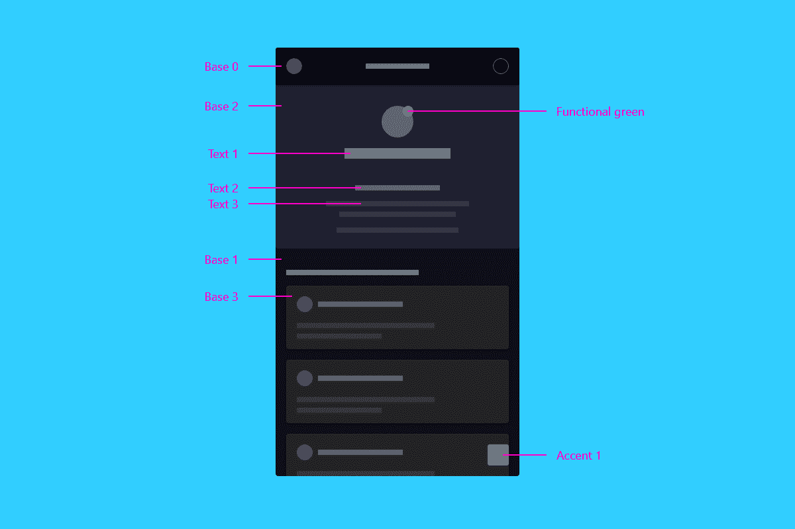

# 使用 Kor UI 进行主题化

> 原文：<https://levelup.gitconnected.com/theming-with-kor-ui-1a843b27bbda>

# 🗺️概述

主题化应用主要服务于两个目的:**增强品牌表达**和**改善用户体验**。在本指南中，我将分享一些使用 [Kor UI](https://kor-ui.com/) 创建和应用自定义主题的最佳实践，以在这两个方面改进您的应用程序。

## 增强品牌表达

对于基于 Kor UI 等开源设计系统开发应用的公司来说，UI 组件的视觉外观通过字体或颜色等元素来表达品牌身份是非常重要的。

虽然组件和模式的重用减少了用户的学习曲线，但拥有一个与其他类似产品过于一致的 UI 可能会错过品牌表达的机会。

## 改善用户体验

主题化是一种强大的方法，可以提高色盲或其他类型的视觉障碍用户的可访问性，甚至可以提高在环境光过多或过少的地方使用的应用程序的文本可读性。

如今，当使用网络或移动应用程序时，用户希望能够自动(例如，基于首选浏览器或操作系统主题)或手动(例如，通过用户首选项设置)设置首选配色方案。

# 🎨第 1 部分:自定义颜色

作为理解如何定制颜色的起点，让我们看一下默认主题是如何定义的，哪些变量是可用的:以及它们是如何分类的:

以下是自定义 6 种现有颜色类别时的一些提示:

*   中性色应该考虑到主题的亮度。如果主题大部分是深色的(例如深蓝色)，将`--neutral-1`设置为白色(或另一种浅色)，将`--neutral-2`设置为黑色(或另一种深色)。
*   强调色应该传达行动号召，因此与背景色有足够的对比。使用与功能性颜色(红色、绿色、蓝色)相冲突的颜色并不是好的做法，因为这会导致用户的错误或困惑。
*   基色用作容器的背景，默认情况下遵循分层方法，这意味着最深的层(`--base-1`)比靠近表面的层(`--base-4`)更暗。如果你的应用程序不打算使用分层，你可以只设置所有的基色相同。
*   功能性颜色应该向用户传达意义(例如，发生了错误)，因此不建议大幅度改变它们。在更新可访问性或安全标准时，一定要寻找它们，以避免用户忽略错误消息。
*   文本颜色也应该从最浓(`--text-1`，标题文本)到最淡(`--text-3`，禁用文本)。
*   阴影颜色按照`box-shadow`定义(`offset-x | offset-y | blur-radius | color`)定义。例如，如果你想用轮廓代替阴影，你可以定义为`0 0 1px rgba(0, 0, 0, .4)`。

## 修改与创建主题

Kor UI 带有两个预定义的主题可供使用:亮和暗。当创建一个新的主题时，你应该决定你是想要修改这些默认值还是从头开始创建另一个。

如果采用第一种方法，您可以选择只修改几个变量，而保持其他变量不变，如果采用第二种方法，您需要定义所有变量:

创建新主题后，您可以像使用默认主题一样使用它:

# 🗛第 2 部分:自定义字体

Kor UI 中的字体定义是在文档级完成的，可以声明两个字体族:一个用于标题(显示)，另一个用于正文。

修改默认字体的步骤如下:

*   如果您没有使用标准浏览器或系统字体，请导入字体。这些文件应该作为应用程序的资产提供，并使用`[@font-face](https://www.w3schools.com/cssref/css3_pr_font-face_rule.asp)`规则通过 css 导入。
*   更新变量以匹配新导入的字体。变量的定义遵循 css `font`定义(`font-weight | font-size/line-height | font-family`)。如果希望正文和标题字体相同，只需对所有四个变量使用相同的字体系列。
*   将默认的`html`字体系列指定为您新定义的正文字体。

# 🏁结论

在这篇文章中，我介绍了在 Kor UI 中定制主题的基础知识。通过将 CSS 应用到组件本身(例如，修改按钮的边框半径)，可以进行进一步的定制，使其更符合您的品牌身份。