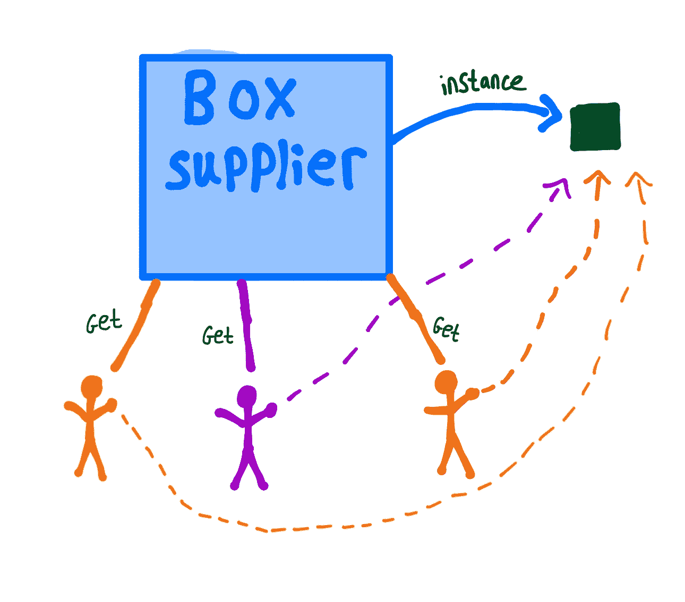

# 只能有一种:单例设计模式

> 原文：<https://levelup.gitconnected.com/there-can-be-only-one-the-singleton-design-pattern-bf1d47e43a24>

## 单例模式的一个例子以及为什么使用它


# 什么时候使用单例模式？

当你一次只需要一个对象的实例时，使用单例模式。

这种模式有用的一个例子是数据库的访问点💾。在一个应用程序中，拥有一个数据库入口点比拥有多个入口点更有利(就像使用构造函数的常规类一样)。



在上图中，我们有三个用户想要一个盒子📦，我们的盒子服务给它们指向同一个实例的指针，而不是为每个实例创建新的指针。如果创建一个“盒子”是一个昂贵的或长时间的任务，这是有用的⏱️，使用 singleton，我们只需要创建一个。

# 个案研究

我们将创建一个小应用程序，其中我们有一个 DBAccessor 类，我们只希望一次存在一个。我们将有两个客户端请求使用访问器，并确认它们使用的是同一个访问器。

## 单身者

这是一个单例类的例子，我们通过显式声明一个私有构造函数来去掉默认构造函数，这样它就不能被调用了🚫课外。

如果一个客户想要获得 DBAccessor 的实例，他们必须使用 *getInstance()* 方法。

这里我们创建了两个 dbAccessors，它们实际上指向同一个对象。

```
Query number 1
Query number 2
```

当我们查询两个“不同”的对象时，我们实际上是在查询同一个对象，所以它先递增 1，然后递增 2。如果我们有不同的实例，我们会看到…

```
Query number 1
Query number 1
```

singleton 模式是最简单和最容易理解的设计模式之一，对于如何实现它，以及什么时候和为什么你想要使用 Singleton 而不是一个带有公共构造函数的常规对象，有一个清晰的理解。