# 你的网站应该看起来像脸书、Kickstarter、Linkedin 等等，这是有原因的。

> 原文：<https://levelup.gitconnected.com/there-is-a-reason-why-your-website-should-look-like-facebook-kickstarter-linkedin-etc-87db4459a94a>

软件工程

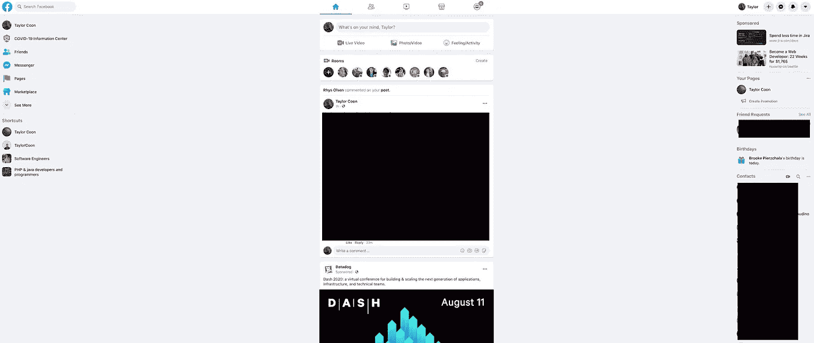

# 这适用于以用户上传内容为特色的网站

看看这个网页。是脸书。只是一个普通的脸书网页。

如果你正在创建一个以用户生成内容为特色的网站，你的网页应该是这样的。我说的不是空洞、苍白、没有灵魂的设计。我说的是布局。

对于一个设计师来说，你可能会说这很丑。对于一个工程师来说，这是梦想成真。为什么？因为这种设计更容易构建、维护和交付给新工程师。

这种设计可以防止网站所有者与用户上传的内容发生冲突，而用户上传的内容是所有这些 web 应用程序的核心。例如，如果你是 LinkedIn 的所有者，你不会希望你的网站设计与用户上传的图片发生冲突。那会破坏整个目的。

这个设计有两个主要部分要看。对于初学者来说，页面中央有一个不可见的规范化框，两边有两个空白边。

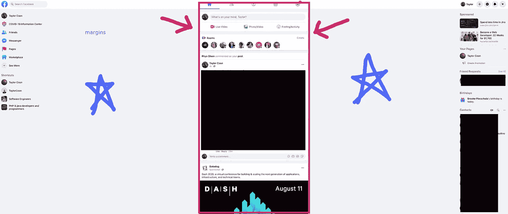

任何附加特征都被裁剪到视口的侧面。

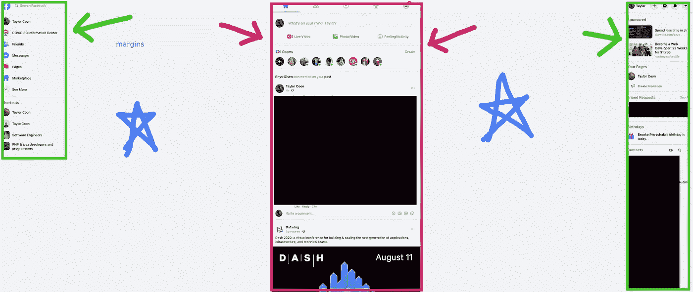

# 这种惯例几乎出现在每一个以用户上传内容为特色的应用程序中，只是有一些小的偏差。

## 推特

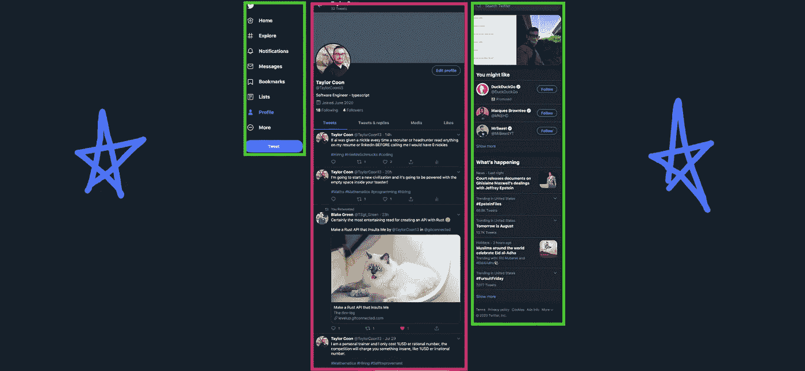

## 商务化人际关系网

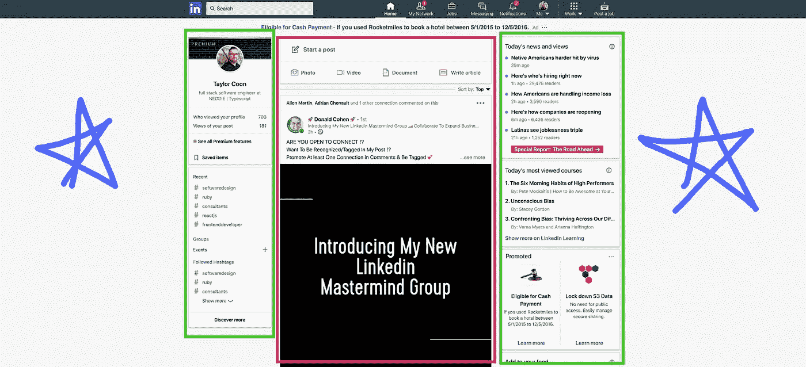

## 照片墙

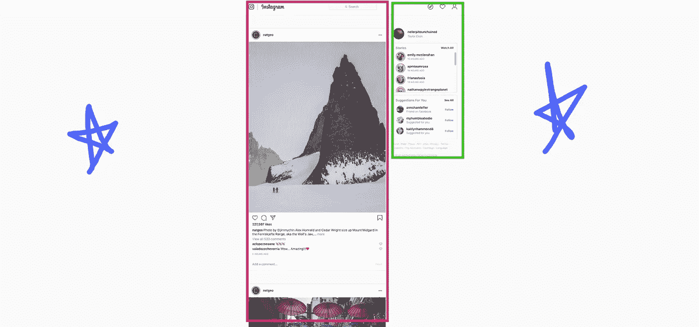

## 中等

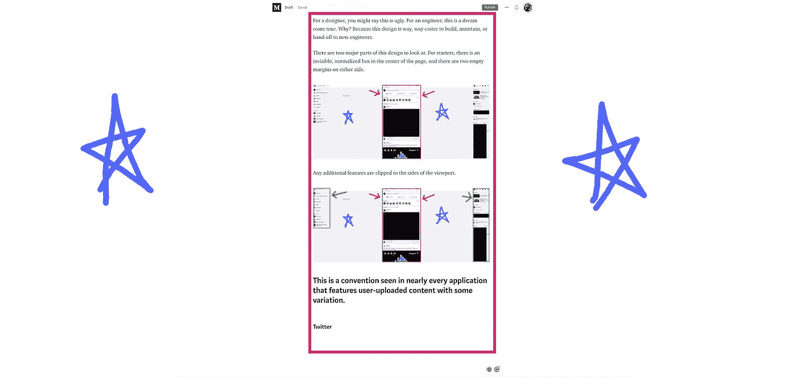

## 不调和

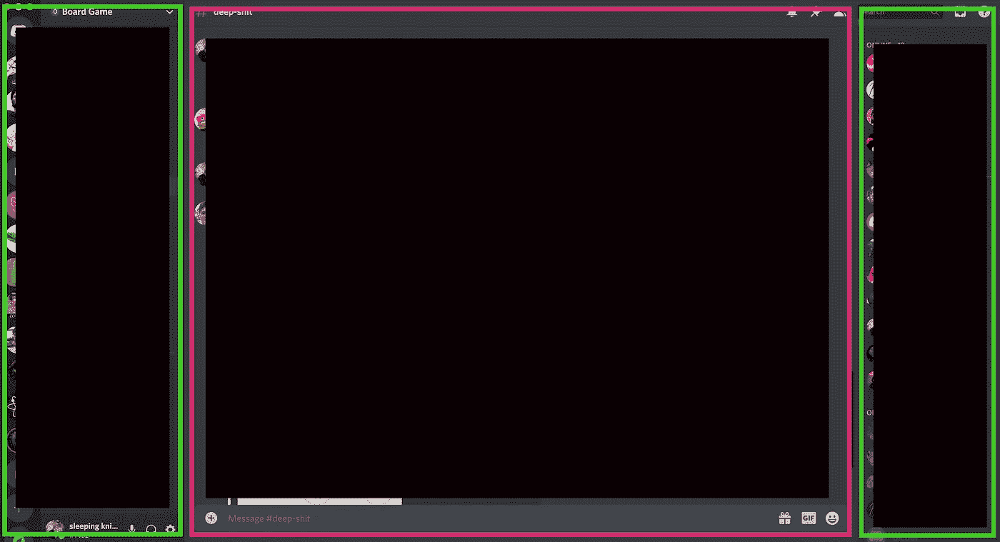

## Kickstarter

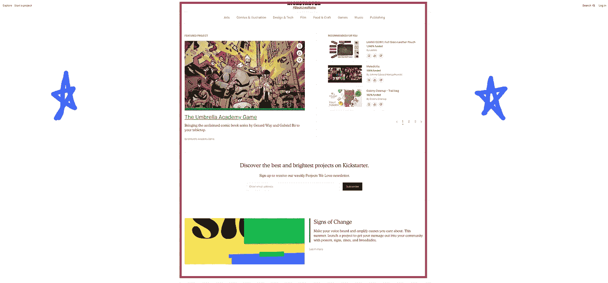

## Tumblr

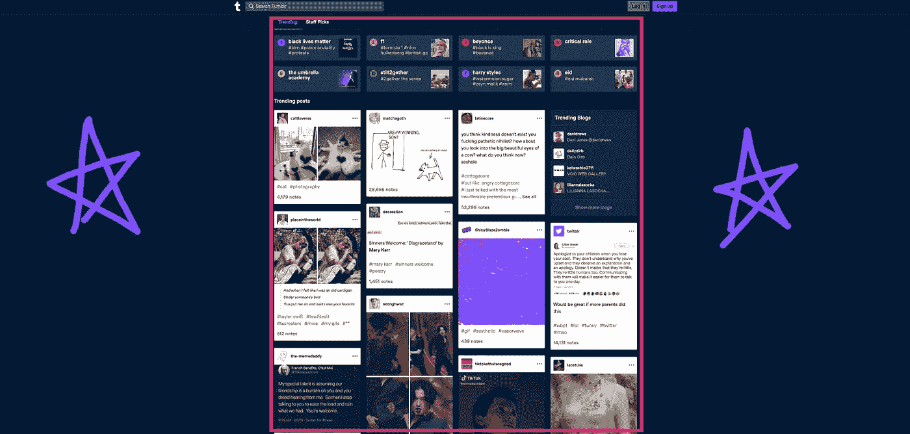

## 油管（国外视频网站）

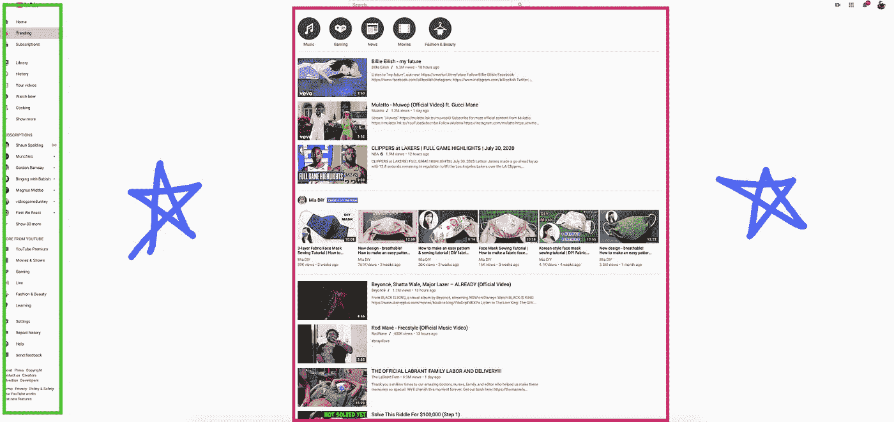

# 那为什么呢？为什么每个以用户上传内容为特色的网站都独立地移植到了相同的设计惯例上？

它与内容维护和屏幕尺寸有关。如今，电子设备的屏幕尺寸超过 10，000 种。图像可以是任何形状或任何大小。

此外，只需调整浏览器窗口的大小，即可实时修改视口。我们可以肯定地说，屏幕尺寸的变化是无限的，因为实际上是存在的。

如果一个网站所有者想要接收一组无限的图像大小变化，并在一组无限的视口大小变化上完美连续地显示它们，他们的工程师将永远无法再看到他们的家人，因为他们将花费所有的时间处理边缘情况，他们将继续处理边缘情况，直到他们的骨头变成灰尘。

# 我们如何正常化？我们如何将无限量的工作转化为合理的工作量？

规范化有两个主要步骤。

## 首先，在上传图片之前，强迫用户进行裁剪、调整大小或者两者都做。

这就是为什么大多数网站在你上传东西的时候会通过裁剪组件来强制使用特定的图片尺寸或图片形状。

这解决了一个主要障碍。它使我们所有的图像正常化，但是视窗呢？我们所有的图像现在都是 100 像素乘 500 像素，但是我们的视窗仍然是一个无限变化的集合。现在怎么办？

## 第二，实施非常严格的显示尺寸范围。

由于控制视窗是不可能的(除非你能召集世界上所有的硬件公司，强迫他们发布标准屏幕尺寸的产品)，我们能做的就是控制视窗内的**显示**。这就是上面所有红色盒子的作用。

调整视口大小时，显示框的变化很小。任何剩余部分都被汇集到保证金中。如果你对我上面列出的任何一个网站的窗口大小有所改动，你会注意到它们中的每一个都不会在调整窗口大小时调整组件的大小，几乎没有例外。

其中一些网站会根据视口大小使红框稍微变宽或变窄，但即使这样，组件也有一些上限和下限。

当视窗变得太小时，其中一些网站会移除绿框。

# 这是一个游戏规则的改变

有了这两项措施，工程师**就不用**考虑所有的屏幕尺寸。他们只需要考虑红盒宽度的偏差，根本不用担心图像的变化**。**

听听某个人的看法吧，他目前是一个企业项目的工程师，该项目以用户上传的内容为特色。如果你的网站不执行这两点，你将会给你现在和未来的工程师带来难以置信的工作量。

# 对于所有的艺术家来说

不要绝望。这种设计没有您想象的那么严格。例如，你可以用各种各样的调色板来发挥创造力。另一个想法是将纹理添加到规范化的框或边距的背景中。

# 如果你的网站没有用户上传的内容

如果你能控制网站上的所有内容，那么你就可以随心所欲地设计。你甚至可以用 SVG 制作蒙娜丽莎。

下次见。