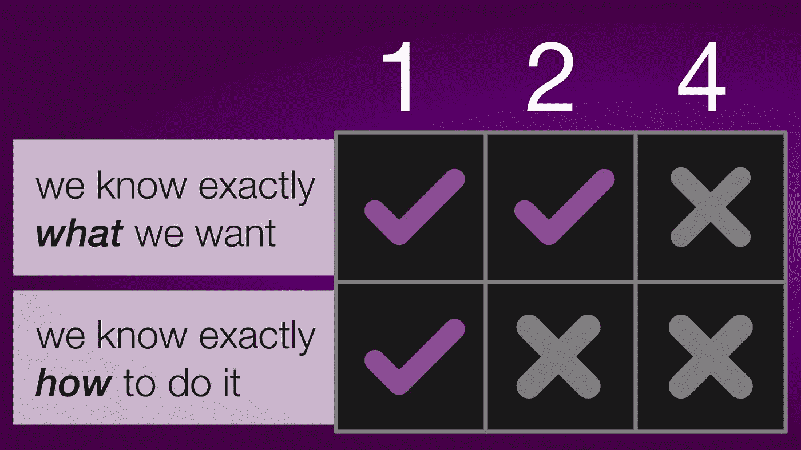

# 有一种更简单的方法来指出 Scrum 故事

> 原文：<https://levelup.gitconnected.com/theres-a-simpler-way-to-point-scrum-stories-b026cf1907e3>

## 斐波那契不再是唯一的选择

当你停下来想一想，Scrum Pointing session 有点奇怪。为什么我们要在一个数字里放这么多信息？为什么这个数字在斐波纳契数列上？为什么互联网要开发者如此激烈地争论这个数字？我们在玩扑克？？原来还有另一种方法，一种消除所有猜测的方法。

# 首先，什么是指点？

指点环节是您为票证指定难度级别的地方。通常使用斐波纳契标度(1，2，3，5，8…)，这样更大的票之间就有更多的间隙。现在，你可能想知道等级是如何选择的，这是一个没有真正答案的好问题。有些人选择一个“基线”标签作为 1，然后根据它来衡量所有其他任务。其他人将风险、时间和复杂性等因素平均在一起。这个想法是，这个数字有点模糊，所以开发人员将战斗，对不起，”*辩论*“它和新的信息将会曝光。

# 这个系统的问题是

有时，人们会争论字面上的*数字*，而不是实际的特征。如果你称一个特性为复合体，开发者会同意，但是一个认为它是 5，另一个认为它更接近 8，所以现在你必须再讨论 10 分钟。但是数字连*是什么意思*？问题出在单元上:他们故意缺乏具体的价值观。这个数字可以包含很多数据。

# 简单点:街区的新成员

我最近与另一个团队交谈，被他们基于这种风格的指向系统所震惊。在他们的版本中，只有两件事重要:**你知道我们想要什么**和**你知道怎么做**:

**1——你确切地知道自己想要什么*****你确切地知道如何去做**。这些事情包括运行脚本、更新数据库、进行简单的前端更改、向 API 添加基本属性。*

*你很清楚自己想要什么，但是你不确定如何去做。大多数特征都属于这一类。您将收到一个功能请求，因此您知道您希望它做什么，但是您不确定如何让它工作*

***4 —** *你不确定自己想要什么*或者*怎么做*。这是最模糊的，所以它是分配给大多数错误和尖峰。*

**

# *“这似乎太简单了”*

*这是整个问题的关键。编程中最伟大的范例之一是“单一责任原则”当流程处于最佳状态时，它们只做一件事。试图将诸如复杂性、风险、时间等因素纳入一个数字会引发很多争论。对我来说，很少感觉时间花得值。因为反正只是一个估计，所以连*那个*都不重要。感觉敏捷已经变得专注于数字，因为这是一种**仪式。**例如，有[指向扑克](https://www.mountaingoatsoftware.com/agile/planning-poker)，如果人们得到正确的数字，他们就可以“赢”。这绝对感觉像是注意力不集中。*

# *那么这些信息都去了哪里呢？*

*在票里！如果有高风险的任务，把它写在票里！过于复杂？写一个警告，并链接到任何让你相信这一点的例子。不要在数字上争论，花时间在票据上添加有用的注释和资源。通过把这样的事情放进单词里，它释放了数字来集中传递特定的信息。新戴夫？坚持 1s。寻找新功能？浏览 2。想去捉虫子吗？d4y 的 4s。*

# *你应该开始使用这个系统吗？*

*如果您发现您的指点会话效率越来越低，我真的会鼓励您尝试 SimplePoint(它在技术上没有名字，我只是喜欢这个名字)。但老实说，如果你有一个紧密的团队，斐波那契工作得很好，不要觉得你必须急于改变事情。只有在确实存在问题的情况下才寻找解决方案。*

*大家编码快乐，*

*麦克风*