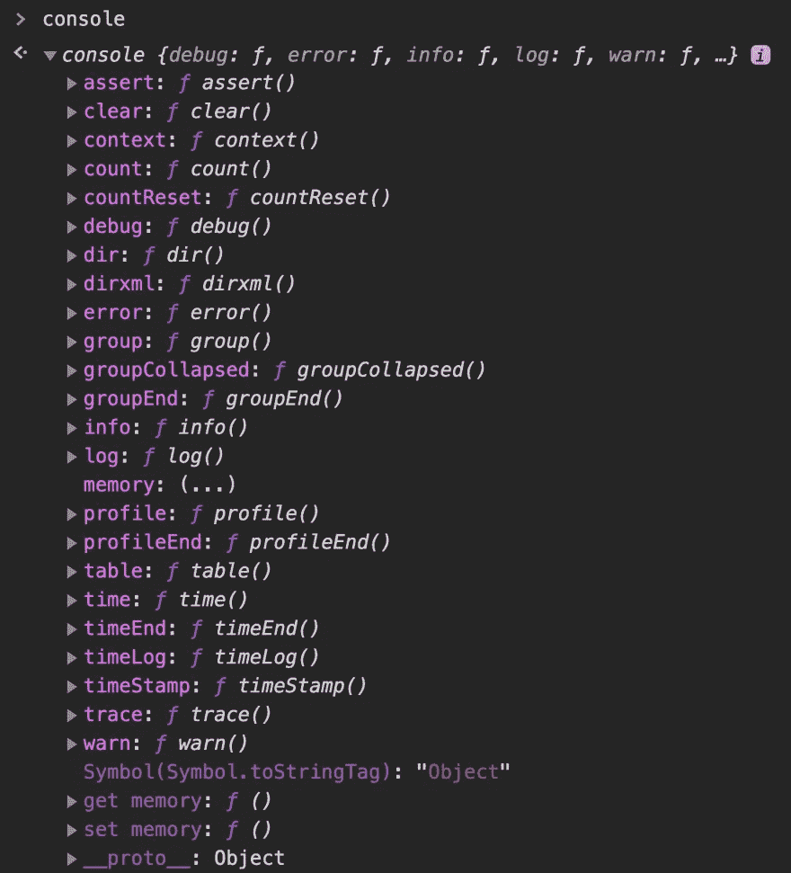
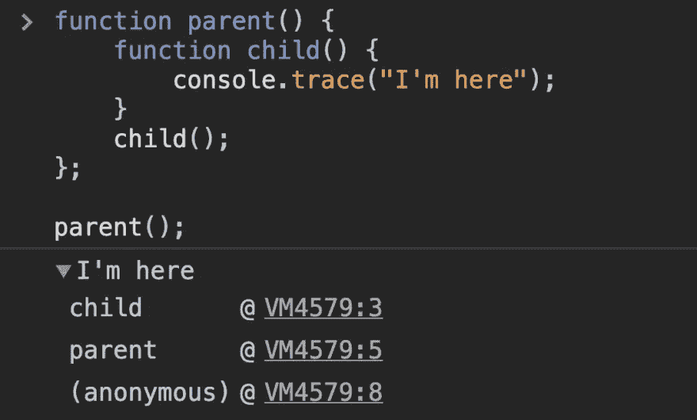

# 不仅仅是 console.log()

> 原文：<https://levelup.gitconnected.com/theres-more-than-just-console-log-aac71c2345f4>

不仅仅是 console.log

## 主控控制台对象

`console`是 JavaScript 开发人员调试的首选方式。因此，如果您打算使用控制台进行复杂的调试，我们不妨对您可以使用控制台做的一些很酷的事情有更多的了解。控制台不仅仅是一个简单的`console.log`命令。在这个视频/帖子中，我将向您展示一些仅使用日志的替代方法，以便您可以获得更有用的控制台输出。

你可以在这里观看我的视频解释或者继续阅读。💜

⏱如果你查看视频的描述，视频中有每种方法的时间戳。

# 介绍

控制台不仅仅有一个日志方法。让我们看看控制台对象内部的东西的数量。👇

惊讶吗？我知道我是第一次探索这个`console`对象。

# 警告和错误

在控制台中以纯文本方式显示重要消息的最简单方法之一是使用控制台，即 warn 或 error 方法。

因此，如果我们使用`console.warn`，我们会看到这个黄色输出，这表示一个警告，然后`console.error`以红色显示。如果您打算向其他开发人员公开某些警告和错误，这将非常有用。

# 目录

在我看来，当在简单的对象上使用 console.log 时，几乎没有什么有用的区别。
我们先来看看我们用户上 log 和 dir 的区别。

正如你所看到的，除了显示它是一个对象，没有什么有用的区别。

但是有趣的是当我们开始使用 DOM 节点时。那么我们来看看在`document.body`上使用`dir`和`log`时的区别。

先用`console.log(document.body);`。

然后用`console.dir(document.body);`。

注意:

*   console.log 在类似 HTML 的树中打印元素
*   console.dir 在类似 JSON 的树中打印元素

具体来说，console.log 对 DOM 元素进行了特殊处理，而 console.dir 没有。当试图查看 DOM JS 对象的完整表示时，这通常很有用。

# 数数

使用`console.count`，我们可以做一些非常常见的用例，检查某个东西被调用了多少次。在这个例子中，当我们迭代时，我想数一数我们有多少爱好。

`console.count`接受一个可选的标签参数，如果你不传递任何东西，它默认为`"default"`。

通过使用`console.count`,我们可以避免使用变量来计算我们调用一个函数的次数。

# 维护

使用`console.assert`，如果断言中的评估值为 falsey，我们给出一个断言消息，然后我们可以将一个标签作为第二个参数传递给它，这个参数将显示在我们的断言消息中。

在这个例子中，我们将使用与在`console.count`例子中相同的`user`对象来确定一个爱好的存在。

通过使用`console.assert`,我们可以只在很多时候出现问题时才显示消息(就像在这种情况下没有发现什么),这对于我们每次运行时不显示 console.log 非常有用。

# 桌子

使用`console.table`,你可以打印一个视觉上很好的表格来表示一个对象，每个对象的属性都有标签行。你甚至可以点击这些列来对它们进行排序。

每当我接触到一个新的 API 或者任何包含很多值的东西时，我都会滥用这个方法(是的，一把是计算机科学术语，不用查了)。

# 时间、时间日志和时间结束

如果您怀疑某件事情花费的时间比预期的长，并且需要确认，那么这些对于一些性能测试来说是非常方便的。

*   `console.time("label");`启动计时器。
*   `console.timeLog("label");`记录启动定时器后的时间。
*   `console.timeEnd("label");`停止定时器并记录定时器启动后的时间。

在这个例子中，我创建了一个函数来显示每个时间方法的用法。

标签是可选的，默认为`"default"`。只要确保在使用标签时，它们正确地相互对应，否则您可能会遇到一些问题，比如启动和停止默认或其他计时器(如果您正在记录多个计时器)。

# 找到；查出

用`console.trace()`我们可以输出一个堆栈跟踪到你调用它的地方。这是一个非常有用的特性，能够看到调用堆栈，以确保您能够按预期获得一段代码。

如果你看到这个例子，我有一个函数调用一个函数，你可能需要仔细检查它是否在预期的地方被调用。

# 组、组结束和组折叠

好了，现在我们的控制台里有了无数不同的信息，我们应该学会如何组织东西并保持整洁。使用`console.group`命令，我们可以创建可嵌套的可扩展日志列表。

*   console . group(" label ")；开始分组。
*   console . groupend()；结束分组。

让我们来看看实际情况。

默认情况下，我们仍然在控制台中占据同样多的行，所以如果我们想默认折叠我们的分组，我们使用`console.groupCollapsed`。在本例中，我们将使用`groupCollapsed`来显示差异。

最后，我想展示一个嵌套组的例子。

所以有一大堆不同的方法可以通过。我知道每个人都会用`console.table`，但是你认为在这里什么是最有用的？🤔

编码快乐！💜