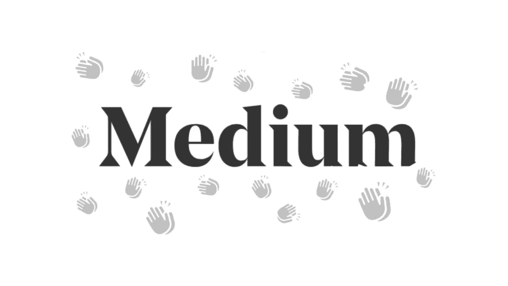

# 这些方法会增加你在媒体上的参与度

> 原文：<https://levelup.gitconnected.com/these-methods-will-increase-your-engagement-on-medium-53ddce59f385>

## 做到这一点，媒体将奖励你！

## 在你的文章中使用这些方法来获得更多的参与度！

在这篇文章中，我将向你解释如何通过使用一些平台上最流行的标签来增加你在 Medium 上的参与度。

如果你是一个新作家，甚至是一个经验丰富的作家，你正在努力获得你的作品应该得到的关注，那么请继续阅读这篇文章。

这不像生活帮或者试图获得系统。一切都是有机的，结果无可挑剔。

> **如果这是你所期望的，你不会得到捷径**！

# 是什么让一篇文章在媒体上传播开来？

Medium 有一套复杂的系统来选择将哪篇文章推送给其平台读者。你被策划或选择去分发，因为它现在已经改变了。

这是一个很好的问题！

答案很简单，你需要写出**高质量的**文章。

> 不要为成功而奋斗，而要为有价值而奋斗。—阿尔伯·爱因斯坦

如果你赋予读者价值，他们会喜欢你写的东西。从而增加他们以鼓掌或评论的形式与文章互动的机会。

# 如何增加你的媒体文章的参与度？

没有什么快速的方法或捷径，但是，考虑使用这些标签，你更有可能被注意到。

即使它们是媒体上最受欢迎的标签，如果你的文章质量好，写得好，你也会得到一些关注。

> 时间比金钱更有价值。你可以得到更多的钱，但你不能得到更多的时间。吉米·罗恩

你也要尽量主动，试着阅读和评论别人的博客帖子，鼓掌，关注，强调。这会让你引人注目。

[真诚媒体](https://unsplash.com/@sincerelymedia?utm_source=medium&utm_medium=referral)在 [Unsplash](https://unsplash.com?utm_source=medium&utm_medium=referral) 上拍摄的照片

## 以下是 Medium 上最受欢迎的标签

1.  寿命— 618k
2.  区块链— 563k
3.  诗歌— 538k
4.  生活课程— 521k
5.  启动— 519k
6.  加密货币——444k
7.  健康——429k
8.  政治- 427k
9.  技术— 416k
10.  爱——409k
11.  书写— 398k
12.  自我提升— 395k
13.  商务—37.1 万英镑
14.  教育——364k
15.  企业家精神——36.1 万英镑
16.  旅行 359k
17.  营销— 324k
18.  设计— 285k
19.  社交媒体— 267k
20.  关系— 266k

请记住，只有当这些标签适用于您的文章时，您才需要使用它们。误用它们保证你的文章不会被策划。

如果这些话题是你可以写的，那就考虑改变你的内容来配合它们。

我经常写关于**区块链**、**初创公司**、**加密货币**和**技术**的文章，因为这些标签都在**前 20 名之列，所以结果很棒。**

# 结束语

我希望这些建议能帮助你提高对 Medium 的参与度。最重要的是给读者带来价值，所以只要你这样做，并遵循我上面提到的方法，你就会很好。

如果你对这篇文章有任何问题或建议，请不要犹豫，在评论区回复。喜欢你读的东西吗？为什么不关注我的媒体简讯，这样你就不会错过我未来的任何文章了？很简单，点击[这里](https://kgabeci.medium.com/subscribe)输入你的邮箱地址，按订阅。

你喜欢阅读媒体上的文章吗？考虑成为会员，有很多功能，你将获得所有创作者的内容，每月只需 5 美元。使用[这个链接](https://kgabeci.medium.com/membership)你也可以帮我赚一点佣金，点击成为会员，输入你的信息。