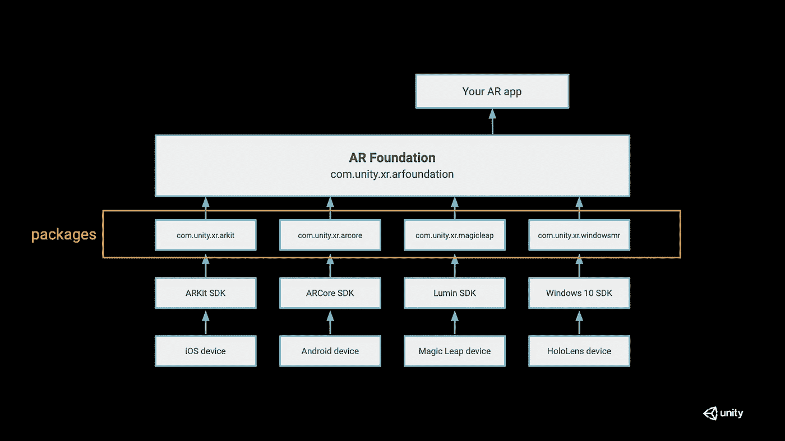
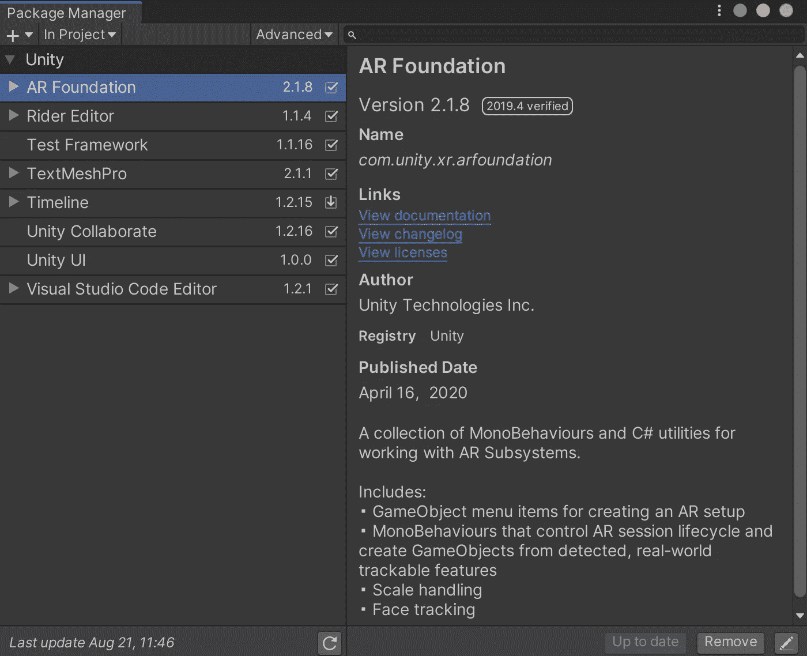
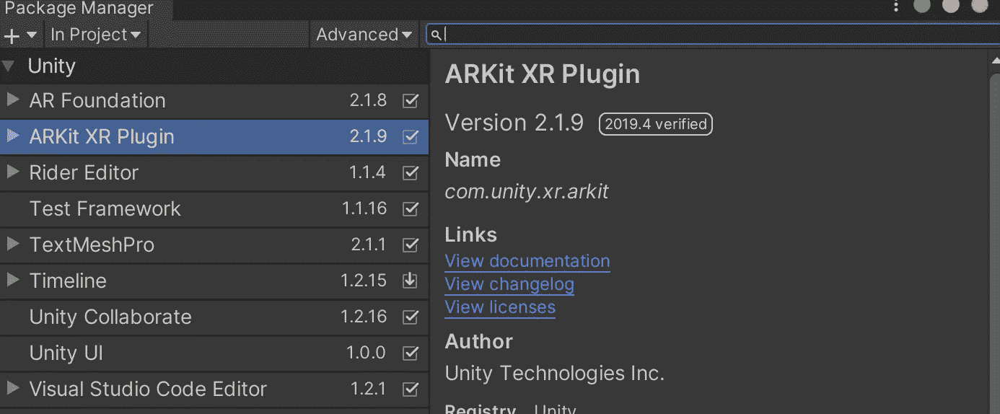
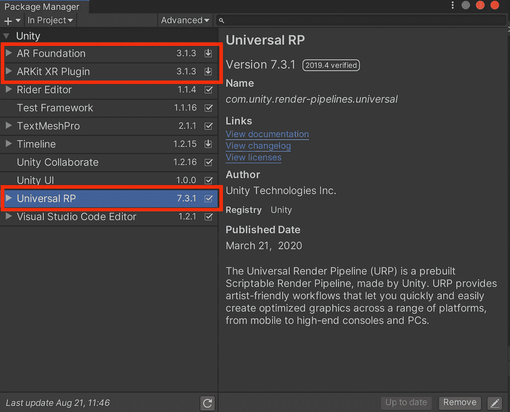
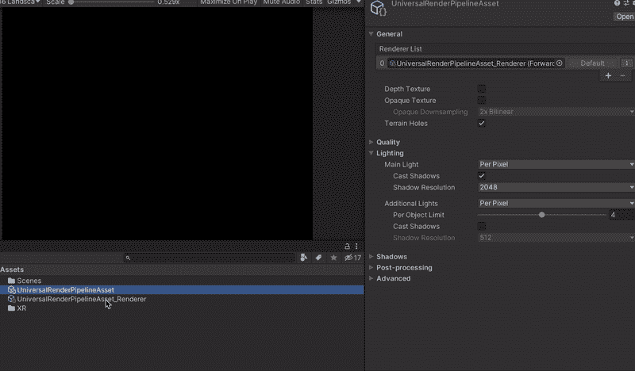
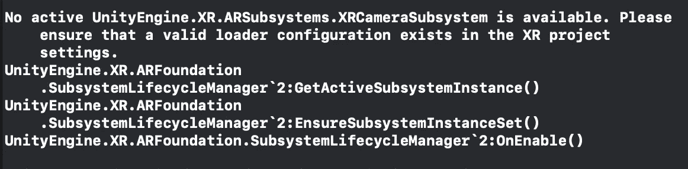
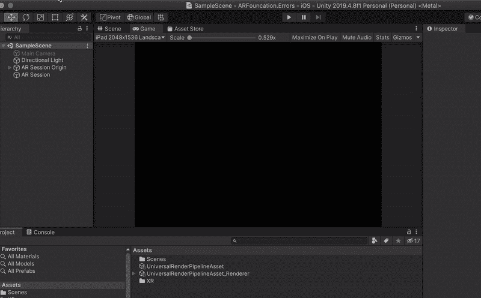

# 这些错误会让你的 AR 基金会 App 显示黑屏

> 原文：<https://levelup.gitconnected.com/these-mistakes-can-make-your-ar-foundation-app-display-a-black-screen-3b5b505c28b1>

丹尼尔·弗兰克在 [Unsplash](https://unsplash.com/s/photos/augmented-reality?utm_source=unsplash&utm_medium=referral&utm_content=creditCopyText) 上的照片

在近几年，AR 技术发展迅速。继去年发布令人惊叹的 ARKit 3 之后，今年苹果在 WWDC 2020 上发布了 ARKit 4。Unity 还扩展了其 AR 基础，以快速添加 ARKit 3.5 和 ARKit 4 的这些新功能。随着 AR 技术的发展，越来越多的开发者使用 Unity 的 AR 基础来开发运行在不同平台上的 AR 应用。

Unity 中的 AR 基金会

但是，作为一个使用 Unity 的 AR 基础的开发者，在开发一个 AR 应用时，有一些错误可能会让你感觉很糟糕。这篇文章将详细介绍导致 AR 应用程序在手机上显示黑屏的 4 个常见错误。

# 错误#1 你没有为特定的平台安装平台包

我认为这是 AR 开发者在 Unity 中使用 AR Foundation 开发 AR 应用时可能遇到的最常见的错误。从上面 Unity 中 AR 解决方案的架构可以看出，你会发现 AR Foundation 只是开发者使用 C#编程语言在 Unity 中开发自己 AR App 的一个抽象层。

如果您仅通过 Unity 软件包管理器安装 AR 基础软件包，它不会自动为您安装特定平台上所需的平台软件包。你必须手动安装它/它们。

比如你想在 ***iOS 平台*** 上创建一个 AR app，那么你需要安装 ***ARKit XR 插件*** *。*

# 错误#2 设备不支持 AR 功能

和第一个错误类似，但是很容易被开发者忽略，就是设备本身的能力。

我们再来看看 AR 基金会的架构。是的，有一个比 Unity 的平台包更低的层次，就是设备提供的 SDK 层。

这种错误在 Android 设备上比在 iOS 设备上更常见，比如不能安装 Google 的 AR Core SDK 的 Android 手机，或者设备的 Android OS 版本不符合 AR Core SDK 的要求。

# 错误 3:通用渲染管道设置不正确

如果你想使用通用渲染管道而不是 Unity 内置的渲染管道，那么你需要将你的 AR 基础包和对应的 ARKit XR 插件包更新到 3.0.0 或更高版本，因为 Unity 2019.x 上 AR 基础包的默认验证版本是 2.x.x。

接下来，安装通用 RP 包，并将 UniversalRenderPipelineAsset 设置为项目的图形设置，以替换内置的渲染管道。构建你的 AR 应用在你的 iPhone 上运行，然后你会看到一个黑屏。

除了升级您的 AR Foundation 版本，您还需要正确设置通用渲染管道，以成功替换内置渲染管道。对于 AR 应用程序，我们需要将 AR 背景渲染器功能添加到 URP 渲染器中。可以看下面的 gif。

# 错误#4 更新到 AR Foundation 4.0.x 并且没有正确设置

想必上面的错误你都改正了，可能还会遇到第四个错误导致黑屏。

现在，让我们将 AR 基础包和相应的平台包(ARKit XR 插件)更新到 4.0.2，其他所有设置保持不变。构建应用程序并在您的 iPhone 上运行，您将得到另一个黑屏，并显示以下错误信息。

修复这个错误并不难，你只需要在 XR 插件管理面板中检查插件提供者。但是在 AR Foundation 4.x 之前不一定要做。

现在，您的应用程序应该可以按预期运行了。

# 我的新书！

嘿，朋友们，我非常兴奋地宣布，我的新书已经可以在亚马逊上预购了！

 [## 游戏开发与统一。NET 开发者:用 Unity 创建游戏的终极指南…

### Amazon.com:使用 Unity 进行游戏开发。NET 开发者:用 Unity 和…创建游戏的终极指南

www.amazon.com](https://www.amazon.com/Game-Development-Unity-NET-Developers-ebook-dp-B09P5R4QPS/dp/B09P5R4QPS) 

在本书中，我们将探索如何使用 **Unity 游戏引擎**和**微软游戏开发**，包括**微软 Azure 云**和**微软 Azure PlayFab** 服务，来创建游戏。