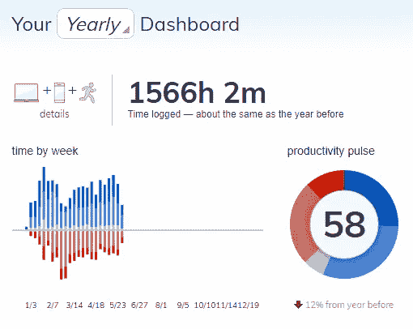
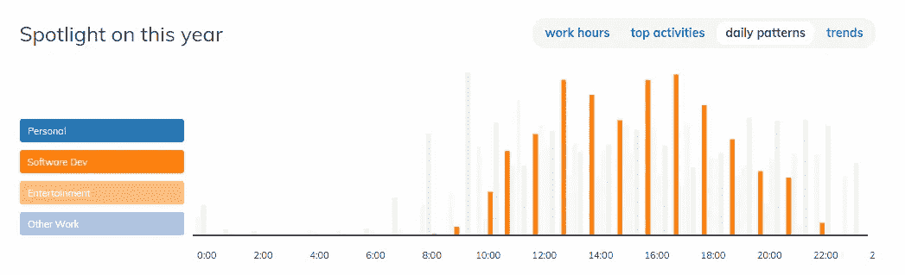
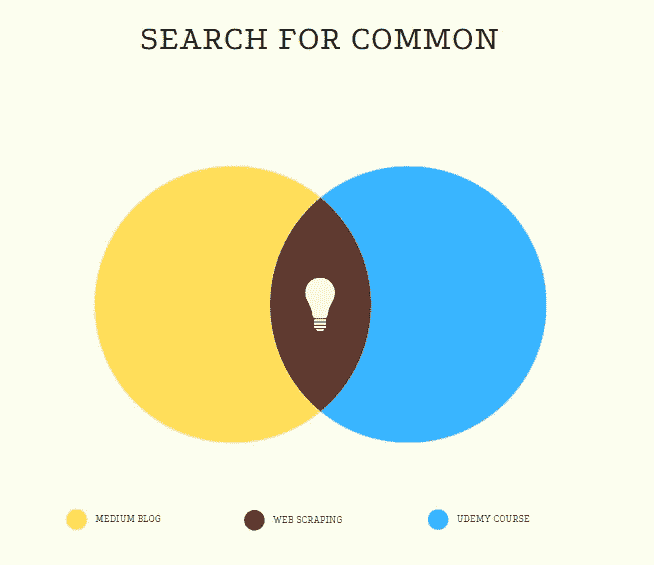
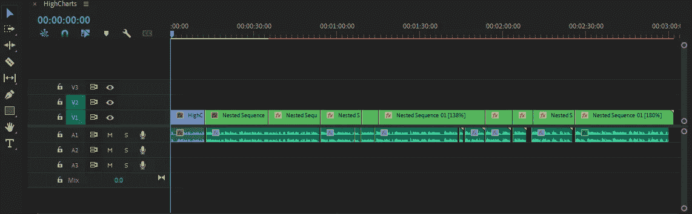
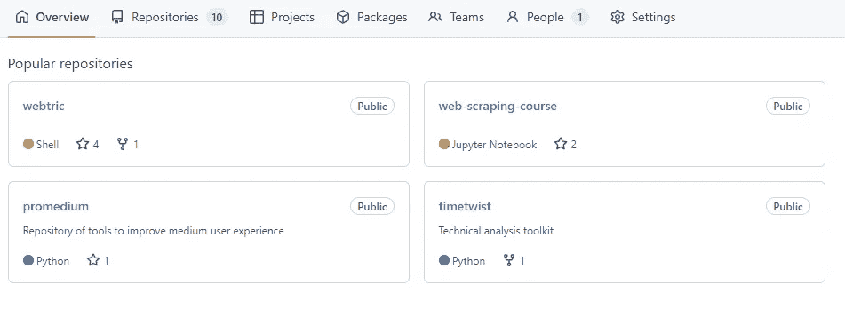

# 这些工具帮助我为喜爱的项目争取时间

> 原文：<https://levelup.gitconnected.com/these-tools-help-me-get-time-for-pet-projects-98b169b48fbc>

## 你也许最终能够完成你在 notes 应用程序中的想法

伊万·迪亚兹在 [Unsplash](https://unsplash.com?utm_source=medium&utm_medium=referral) 上的照片

编码是一项孤独的活动。你坐在你的电脑前，翻遍一行行的代码，试图让它们工作。这会令人沮丧，尤其是当你被一个问题困住的时候。但是有一种方法可以让编码变得更有趣和更有回报——通过从事宠物项目。

一个宠物项目是一个你纯粹为了享受而开发的软件或项目。你不需要向全世界发布，甚至不需要向任何人展示。这只是你为了好玩而做的事情。这就是为什么软件开发人员应该有宠物项目。他们可以帮助打破编码的单调，教你各种新技能。

*但是如何找到时间呢？*

# **不能衡量，就不能提高**

关于时间管理，有一句老话“如果你不能衡量它，你就不能改进它”，这句话在今天和过去一样适用。我们这一代人“有幸”拥有时间追踪器、指示器和可穿戴设备，可以将你的生活变成数字。

我通过安装 RescueTime 开始了我的时间管理之旅，它已经对我有了三年的帮助。

我的 2022 年年度仪表盘

从我写日记的经验来看，我发现我经常过多地关注日常事务，关注细节，而不是看到整体进展。RescueTime 让我最直观地缩小，就像你在上面的图片中看到的那样。跟踪进度变得更加容易，因为您可以浏览箱线图，并在图中的红色部分看到下降趋势。

然后是基于应用的报告。在它的帮助下，你可以了解你一天的效率模式，并估计你的最佳工作时间。这些通常是从你的生物节律演变而来的。如果不改变你的身体状况(例如，改变睡眠时间、饮食习惯，甚至居住地点)，很难改变它们，所以你应该听从指导。

我在 2022 年软件开发的日常模式

我不是一个早起的人。我也不是一个夜猫子。在 RescueTime 的帮助下，我发现我在下午 1 点和 5 点左右有两个生产率高峰，所以我有意地试图将我的工作时间从上午 10 点转移到晚上 7 点，以最大限度地利用这种趋势。

这些知识也帮助我组织我的课外活动，如博客和教育。例如，我发现我的创造力水平在早上是最好的，所以现在我每天花 1-2 个小时去做这些兼职。

个人时间模式

# 联合并征服

当我写这篇文章的时候，除了我的主要职业之外，我至少还有两个活跃的副业:

*   [在 Medium 上的这个博客](https://medium.com/@destiq)，我在这里分享数据科学、机器学习和加密的编码教程；
*   [Udemy](https://www.udemy.com/course/practical-web-scraping-course/?referralCode=8EDD61CDBBB81B6998CA)上的网页抓取课程，在这里我只分享与网页抓取相关的东西。

有了文氏图，上面这些句子看起来会像这样:

交集部分代表了我可以提高两倍效率的那部分时间，因为我的工作成果可以用于两个宠物项目。这个概念的第一个想法让我意识到，聪明的计划开启了在同样的 24 小时内做不同事情的可能性。

在文章的这一部分所描述的思想背后是一个框架的概念。这个术语与 React 或. NET 等技术术语一起更为软件开发人员所知。在现实生活中，拥有一个框架意味着拥有一套要遵守的规则。虽然它看起来像是一种限制，但规则通常有助于追求结构，并帮助您保留宝贵的决策资源。

例如，我想加快课程录制的过程，对我来说，突破性的改进是为演示文稿获得了一个漂亮的 PowerPoint 模板。在那之后，我开始为我需要记录的每一课制作几张幻灯片。后来，我发现将材料分成幻灯片(不一定是 PowerPoint 幻灯片)对视频编辑很有帮助，所以我开始将我的音频录制为一组静音的电影旁白。

Adobe Premiere Pro 中用于课程录制的“音频幻灯片”

# 不要重新发明轮子

在做你喜欢的项目时，你不能在无聊的事情上花费时间。pet 项目的全部本质是享受乐趣，而不是配置另一个 Webpack 构建过程或处理 Selenium 安装。因此，如果您使用工具来完成这项工作，将会有所帮助。

我可以在我推给 GitHub 的项目中重用的工具。

一个很好的例子就是创建-反应-应用程序。这个包包括一个命令行界面，可以帮助创建项目的初始结构，它还附带了一组脚本，可以用来构建、测试和启动应用程序。使用这个包的好处之一是它附带了一个 Webpack 配置文件，可以用来优化构建过程。此外，该软件包包括一个巴别塔预置，有助于将 JSX 代码转换成 JavaScript。

> 在不到 24 小时的时间里，我用 create-react-app 和 Docker [完成了 SaaS 项目。](/how-to-create-saas-within-24-hours-part-1-46ab9d32d1f6)

下一个技巧——Docker 的使用对于原型制作非常有用。如果你不熟悉 Docker，它是一种打包应用程序的方法，这样它可以在任何环境下运行。这意味着你可以在你的电脑上制作原型，然后轻松地把它转移到服务器上。当你尝试新的想法或试图让一些东西快速运行起来时，这是很有帮助的。由于 Docker 容器是相互隔离的，您不必担心一个原型会影响另一个原型。因此，如果你正在寻找一种快速简单的方法来尝试新事物，Docker 是值得考虑的。

像 Github Copilot 这样的工具可以改变你的编码效率。它旨在通过为开发人员的所有编码任务提供一个统一的界面来帮助开发人员提高工作效率。使用 Github Copilot，您可以使用人工智能生成的代码。该工具仍处于测试阶段，但它已经极大地影响了我的编码方式，因为我最近不怎么去 StackOverflow 了。我得说，进步真大！

# **我能理解**

作为一名软件开发人员，为自己喜欢的项目找时间是一件很有挑战性的事情。在朝九晚五的工作和处理日常事务之间，时间似乎永远不够用。也没有脑力来使用。但是如果你想看到你的事业成功，为副业和爱好腾出时间是很重要的。

我希望我的一些为你的激情项目挤出时间的建议有所帮助。