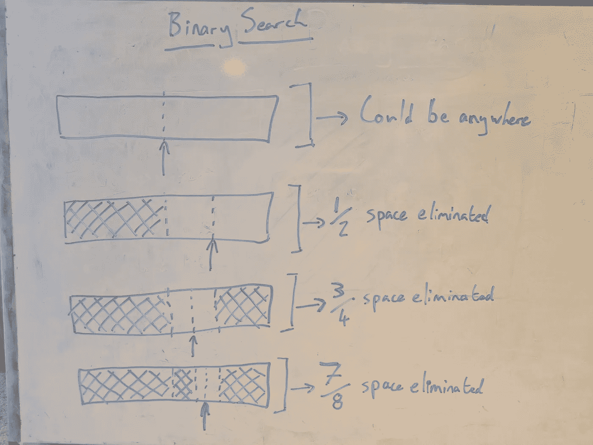
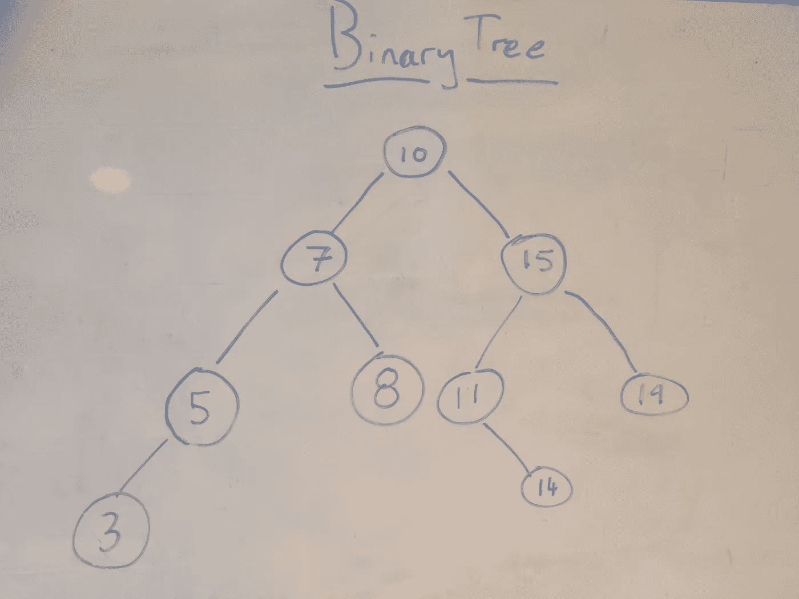

# 每个软件工程师都应该知道的事情:二分搜索法

> 原文：<https://levelup.gitconnected.com/things-every-software-engineer-should-know-binary-search-f39977fbee30>

# 泰勒:博士

二分搜索法是一种算法，允许你在 O(Log(N))时间内从列表中找到元素。

列表中的元素需要以某种方式排序。

该算法通过导航到剩余搜索空间的中间元素并将该元素与正在被查询的元素进行比较来不断地将搜索空间减半。

二分搜索法使用的概念被用于实现许多数据库索引的二分搜索法树。

# 什么是二分搜索法？

二分搜索法概述了一种在有序列表中查找内容的方法。

排序对于搜索工作是必不可少的，列表中的每个元素都需要有某种形式的相关排序，并且列表中的元素需要按顺序排列。

例如，如果列表中的元素是整数，整数有一个非常明显的顺序，我们可以根据整数的内在值来排序。

更真实的例子可能是包含金融交易的列表。每笔金融交易都有交易发生的时间，因此交易列表可以根据交易时间进行排序。一旦事务处理就绪，就可以使用二分搜索法来查找特定的事务。

## 为什么要为一个算法而烦恼？

用二分搜索法有什么意义？理解算法需要时间，这增加了代码库的复杂性，也意味着我们可能不得不对数据进行昂贵的排序。

我们可以遍历列表，检查每个元素，看看它是否是我们感兴趣的。一段很简单的代码写出来，容易理解。

使用二分搜索法的主要原因是:

很快。

在这个故事的后面，我会更详细地介绍它到底有多快。现在，我们只能说，与遍历列表中的每个元素相比，它要快得多。

如果你处在一个[需要编写快速软件](https://medium.com/swlh/how-to-write-fast-software-7cb4c10631bf)的情况下，那么使用二分搜索法可以是你解决瓶颈的选择之一。

# 它是如何工作的？

现在这是一个有点过时的参考，但是，想象一下电话簿，一个密集的页面集合，上面有姓名及其相关的电话号码，按姓名升序排列。现在想象一下，这个电话簿没有索引/目录，并且你不知道电话簿中姓名的分布，可能有 90%的人姓名以 a 开头。

您如何在这本电话簿中找到“乔·史密斯”这个名字？你可能不会从《食蚁兽阿巴森》开始。鉴于你不知道名字的分布是什么，你不能聪明地猜测名字在哪里。所以你可能会打开电话本，看看你在哪里登陆。

假设你在中间找到了“西蒙·格雷”，你现在知道电话簿的后半部分不包含“乔·史密斯”，因为电话簿是有序的。现在我们拿起电话簿的前半部分，选择前半部分的中间点。假设我们找到“Beth Logger”，我们现在知道“Jo Smith”在 Beth 和 Simon 之间，所以他们在电话簿的第二部分。

然后，我们可以通过继续在剩余电话簿的中心查找来将我们正在搜索的空间减半。这，本质上就是二分搜索法。

如果我们要从电话簿转移到一个更一般的例子，算法工作如下:

1.  查看剩余搜索空间中心的元素
2.  如果这是我们正在寻找的元素，返回它
3.  如果这不是我们要找的元素，那么我们要找的元素是在这个元素之前还是之后？
4.  根据元素是在前面还是在后面，删除一半的搜索空间。
5.  回到步骤 1。

# 时间复杂度

早些时候，我提到二分搜索法很快，但是多快才算快呢？

通常，使用“大 O”符号来衡量算法的性能。大 O 是一种表达方式，在最坏的情况下，性能如何随着所涉及的数据量的变化而变化。

对于二分搜索法来说，时间复杂度是 O(Log2(N))，这是“N 的对数基数为 2 的大 O”。这意味着，如果我们有一个包含 N 个元素的列表，并且我们在该列表上运行二分搜索法，最坏的情况是采取与 Log2(N)成比例的步骤。

作为比较的基础:

*   N = 10，Log2(10) ~ 3.3
*   N = 100，Log2(100) ~ 6.6
*   N = 1,000，Log2(1000)~ 10
*   N = 1，000，000，Log2(1，000，000) ~ 20
*   N = 1，000，000，000，Log2(1，000，000，000) ~ 30

所以，如果你有一个包含一百万个元素的列表，你想找到某个东西，你可以遍历所有一百万个元素，或者，你可以使用二分搜索法，在*中找到你要找的东西，最差的情况下*，大约 20 步。

你可以做大约 30 个步骤，而不是检查 10 亿个元素。

这就是我所说的快速，你可以在 10 亿个元素中搜索，搜索时间是对它们运行 for 循环时间的 0.000003%。

那么为什么二分搜索法的时间复杂度是 O(Log2(N))呢？这涉及到数学。数学虽然有趣，但对有效使用二分搜索法并不重要。如果你渴望看到对时间复杂性更深入的解释，可以在这里找到[。](https://en.wikipedia.org/wiki/Binary_search_algorithm#Performance)

# 二分搜索法有什么好处？

二分搜索法最擅长的就是搜索。我们都很惊讶。

这对于我们有一个有序的元素列表并想快速找到其中一个元素的情况很有用。

[地图呢？](https://medium.com/swlh/things-every-engineer-should-know-hashmaps-b354088206b5)如果你想根据某个特定值的存在找到一个元素，我们可以只使用一个地图。例如，查找与姓名相关的电话号码，我们可以使用地图来解决这个问题。

如果你只想在完全平等的基础上找到一些东西，地图是不错的，但二分搜索法允许你做更广泛的搜索。

**前缀搜索** —如果我们在电话簿中寻找“克里斯托弗”，但我们只知道他们是“克里斯”，该怎么办？使用二分搜索法，我们可以缩小范围，在有序列表中查找以“Chris”开头的所有结果，并返回这些结果。有了地图，我们需要准确地搜索“克里斯托弗”。

**寻找最接近的匹配** —如果我们正在处理一个交易列表，每个交易都有它发生的时间。我们希望找到上午 9 点以后发生的第一笔交易。交易是不断发生的，在各种随机的时间，所以我们通过猜测得到准确时间的几率基本上是 0。使用二分搜索法，我们可以找到上午 9 点以后发生的交易，然后选择第一个。

二分搜索法的强大之处在于，它能够利用元素列表的排序来返回匹配像< and >这样的操作符的列表子部分。它可用于返回单个结果，但也可用于查找范围。

## 二分搜索法树

他们可以有自己的故事，但二叉树在二分搜索法的上下文中值得一提，因为它们使用相同的基本原理，即不断将搜索空间减半，以实现更快的搜索。

它们的基本结构是从一个根节点开始，在一个树形结构中有一系列节点连接到 0、1 或 2 个其他节点。

每个节点最多可以有两个子节点，左边和右边，左边的节点比右边的节点保存的值少。树中来自右节点的每个值都大于树中来自左节点的每个节点。有了这种结构，每次选择一个新节点时，向左或向右选择允许搜索空间减半。

前提是树是平衡的，正如前面提到的，二叉树本身就是一个主题。最基本的是，它们是一种数据结构，允许以非常类似于二分搜索法的方式进行搜索。

关于二分搜索法树的另一件重要的事情，也是我在这里提到它们的主要原因，是许多数据库索引都使用它们。

如果你了解二分搜索法，你就会理解有多少数据库索引工作的基本概念。

在一些流行的基于 SQL 的数据库引擎中，默认情况下，当在列上创建索引时，它被实现为二叉树。参见 [PostgreSQL](https://www.postgresql.org/docs/9.5/indexes-types.html) 、 [MySQL](https://dev.mysql.com/doc/refman/8.0/en/mysql-indexes.html#:~:text=Most%20MySQL%20indexes%20(%20PRIMARY%20KEY,described%20in%20the%20following%20discussion) 或 [Oracle](https://docs.oracle.com/cd/B19306_01/server.102/b14200/statements_5010.htm#:~:text=An%20index%20is%20a%20schema,creates%20B%2Dtree%20indexes.)) 的文档。

同样在一些 NoSQL 数据库中，以 MongoDB 为例，默认情况下，它按照文档将索引创建为二叉树[。](https://docs.mongodb.com/manual/indexes/)

二叉树，以及二分搜索法，非常有用，被许多使用某种形式的数据库的项目所使用

# 二分搜索法不擅长什么？

二分搜索法没有太多特别不擅长的事情，这就是为什么它被默认用于数据库，这是一个安全的选择。

二分搜索法不起作用的情况是，不可能定义某种形式的秩序。我正在努力想出一个这样的例子，因为几乎所有的数据结构都是由更小的原始数据类型组成的，比如字符串和整数，而且几乎所有的原始数据类型都有某种形式的自然排序。

二分搜索法不擅长的事情往往会被其他类型的索引所利用。例如，查询地理空间数据，虽然可以使用二分搜索法分别查询纬度和经度，但很难查询纬度和经度范围内的点。

或者，更复杂的文本搜索，如果你想搜索的文本不是前缀搜索，那么有专门设计的索引来执行这些操作。

# 摘要

二分搜索法是一种算法，它通过检查剩余搜索空间的中间来不断地将搜索空间减半。

它只对那些定义了某种顺序的元素列表有效。

它的时间复杂度是 O(Log2(N))这是快速的，Log2(十亿)~ 30。

同样的基本原理也用在二分搜索法树中，它是许多数据库索引的默认实现。

# 关于作者

大家好，我是多戈尔，我是一名技术主管，花了几年时间从几位非常有才华的人那里学习软件工程，这些故事是我努力向前回报的方式。

在我担任技术主管期间，我指导过许多新的软件工程师，我发现经常有这样的情况，工程师不知道他们不知道什么。所以这个“每个软件工程师都应该知道的事情”系列是我在做软件的第一年给自己的信息的备忘单。

软件是一个很大的主题，黄金法则是任何问题的答案都可以以“视情况而定…”开头，因此，这些故事中的信息是不完整的。它试图给出最基本的信息，所以当你读这些故事时，请记住兔子洞比这里展示的主题更深。

可以在[脸书](https://www.facebook.com/doogal.simpson/)、[领英](https://www.linkedin.com/in/doogal-simpson-b9b98350/)或 [Doodl.la](https://doodl.la/) 上找到我。

 [## 编写面试问题

### 掌握编码面试的过程

技术开发](https://skilled.dev)