# 每个软件工程师都应该知道的事情:链表

> 原文：<https://levelup.gitconnected.com/things-every-software-engineer-should-know-linked-lists-4841f75614ba>

# TL:DR

链表是节点的有序集合。每个节点指向列表中的下一个和上一个节点，并包含列表中的一个项目。该列表保存到第一个/最后一个节点的链接，并且可以通过从这些节点中的一个开始，然后沿着到更多节点的链接来遍历该列表。

他们擅长在列表的开头/结尾添加/删除项目，但不擅长需要随机访问列表中的项目的操作。

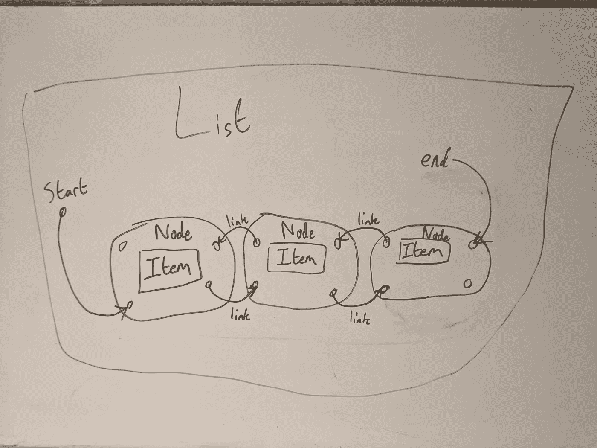

# 谁死了？

大家好，我是 Doogal，我是 Babylon Health 的技术负责人，我是 doodl.la 的创始人，我也花了几年时间从几个非常有才华的人那里学习软件工程，这些故事是我努力向前回报的方式。

在我担任技术主管期间，我指导过许多新的软件工程师，我发现经常有这样的情况，工程师不知道他们不知道什么。所以这个“每个软件工程师都应该知道的事情”系列是我在做软件的第一年给自己的信息的备忘单。

软件是一个很大的主题，黄金法则是任何问题的答案都可以从“视情况而定……”开始，因此，这些故事中的信息是不完整的。它试图给出最基本的信息，所以当你读这些故事时，请记住兔子洞比这里展示的主题更深。

# 基本结构

链表就是一个列表。这意味着它是以特定顺序添加的对象的集合，并且我们希望保持该顺序(例如，与集合相反，集合是一种没有排序的集合)。

链表使用链接来创建有序对象的集合。它通过创建一种节点“链”来做到这一点。每个节点都知道去哪里寻找下一个节点，下一个节点知道去哪里寻找下一个节点，依此类推。每个节点内部都有一个存储在链表中的对象。

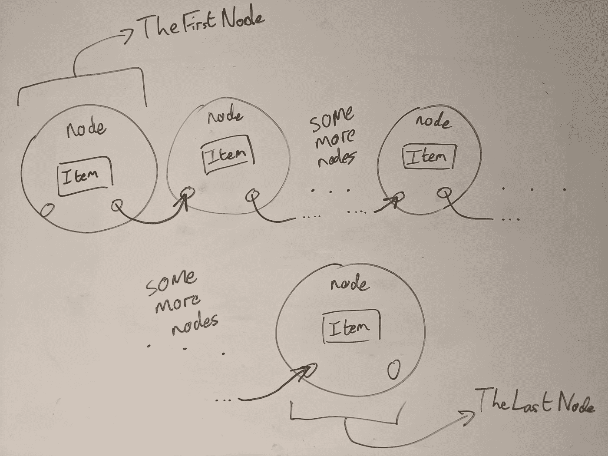

所以为了遍历一个链表，你必须从第一个节点开始，然后使用它包含的链接把你带到下一个节点。在下一个节点，你跟随它的链接到达下一个节点。最终您将到达列表的末尾，这是没有链接到下一个节点的节点。

还有“双向链表”的概念。这是一个链表，其中每个节点都知道在哪里可以找到下一个节点，但是它们也知道在哪里可以找到前一个节点。

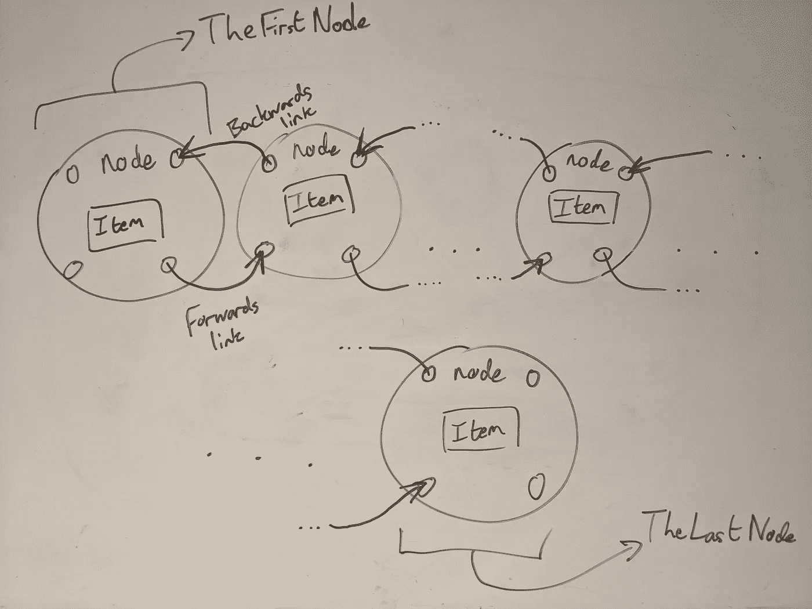

双向链表允许从头到尾遍历链表，就像普通链表一样，但也可以从头到尾遍历。为了这个故事的目的，当提到链表时，假设它是一个双向链表，因为一些编程语言使用双向链表作为标准的链表实现。

值得指出的是，一些编程语言不会把链表叫做链表，它们有自己的名字。在 Java 和 C#中，有一个类“LinkedList”，这是一个双向链表。在 Python 中，有添加链表的库，比如“llist”。在 Javascript 中，没有内置的链表，但是有模块可以将它们添加进去。

# 基本操作

## 获取索引 I 中的项目

从长度为 N (N 大于 I)的链表中获取位置 I 的项。要做这个操作，我们从第一个节点开始，但是第一个节点在哪里呢？链表保存到第一个节点的链接，但不保存到第二个节点(或更远的节点)的链接。我们依靠第一个节点找到第二个节点，以此类推。

因此，要找到位置 I 中的项目，我们从第一个节点开始，沿着它链接到第二个节点，沿着第二个节点的链接到第三个节点，依此类推。我们需要记录我们跟踪了多少个链接，这样我们就知道我们何时遍历到了正确的节点。

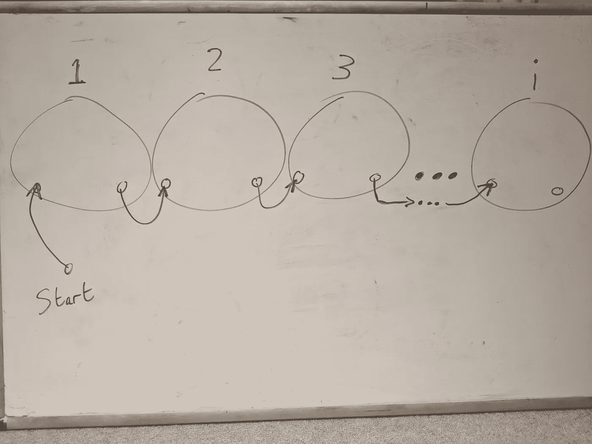

这个操作的时间复杂度呢？

是 O(N)。这意味着这个操作花费的时间与链表的长度成正比。这是因为我们需要潜在地遍历整个列表，以便找到位置 I 处的项目。随着列表变大，查找列表中位置 I 处的项目将花费更长的时间，因为我们有可能遍历更长的列表。

## 将项目添加到列表的末尾

要将一个项目添加到链表的末尾，我们需要获取对链表中当前最后一个节点的引用。如果链表在实现中没有保存对最后一个节点的引用，那么我们需要从头开始遍历整个链表来找到最后一个节点。幸运的是，大多数链表实现都保留了对最后一个节点的引用。

一旦我们有了对最后一个节点的引用，我们需要更新最后一个节点，以指向我们希望添加到列表末尾的新节点，并使用我们的新节点作为新的最后一个节点来更新链表。就这样，只是更新几个链接。

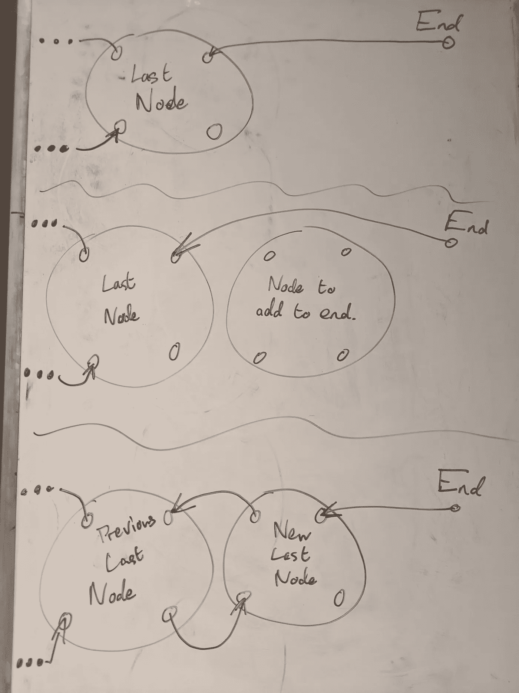

时间复杂度是 O(1)，这意味着做这个操作所花的时间不随链表的长度而变化。这是因为我们只是更新了列表末尾的几个引用，我们不需要知道列表其余部分的任何信息。

## 从列表末尾移除项目

从链表的末尾移除一个条目与添加一个条目非常相似。我们需要转到列表中的倒数第二个元素，并将链接更新为不指向任何下一个节点。因为我们假设我们在一个双向链表中，我们可以通过导航到最后一个节点，然后跟随链接到前一个节点来实现。我们还需要记住将列表中最后一个节点的链接更新为新的最后一个节点。

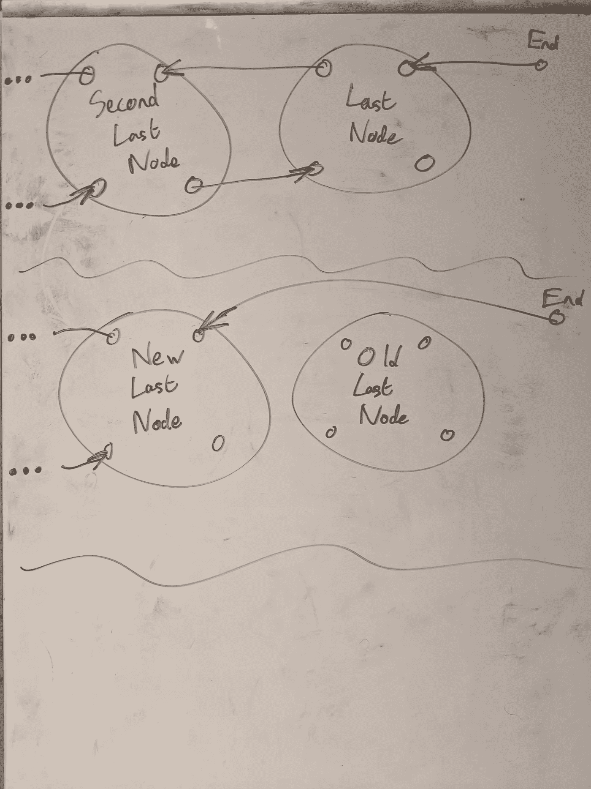

时间复杂度是 O(1)，类似于在列表末尾添加一个元素，这是因为我们不需要担心倒数第二个节点之前会发生什么。在倒数第二个节点之前，列表可以很长或很短，我们不会受到影响。

## 将项目添加到列表的开头

将元素添加到链表的开头与将元素添加到链表的末尾遵循相似的模式。我们创建新第一个节点，添加从新的第一个节点到旧的第一个节点的链接。旧的第一个节点现在是第二个节点，因此我们还需要确保它指向新的第一个节点。我们还需要确保新的第一个节点是我们的列表在寻找它的第一个节点时指向的节点。

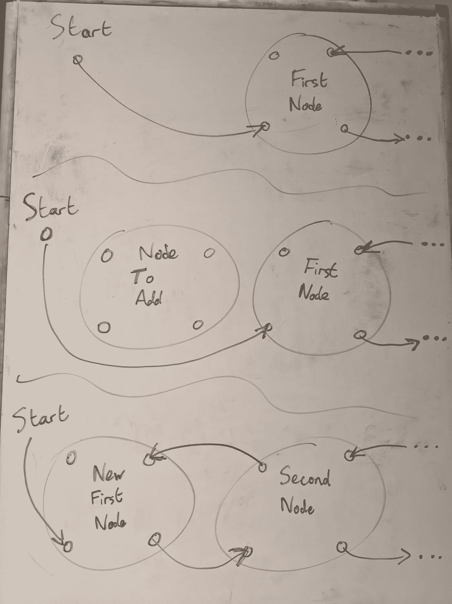

时间复杂度是 O(1)，类似于结束操作，这是对有限数量的链接的操作，这些链接很容易从列表中获得，所以我们不需要对列表的其余部分进行修改。

## 从列表的开头移除项目

从链表的开头删除一个元素，与从链表的结尾删除一个元素非常相似，我们遍历第二个节点，更新它，使它没有到第一个节点的链接，并更新列表，使它指向这个节点作为我们新的第一个节点。

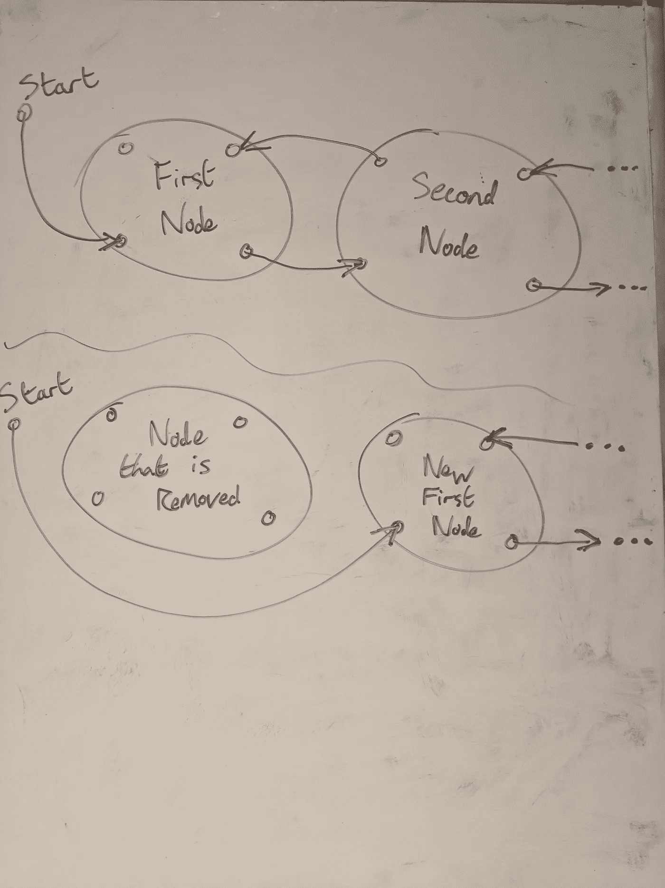

时间复杂度是 O(1)，同样，我们操作的是少量的链接，我们不需要担心第二个节点以外的任何东西。

## 将项目插入列表中的某个位置

您可能认为在列表中的某个位置插入一个条目与在链表的开头或结尾添加一个条目非常相似，您是对的。它确实涉及到操纵一系列链接来指向和来自我们的新节点。

然而，生活并没有那么简单。不幸的是，首先，我们必须找到我们想要插入条目的列表部分。这包括遍历列表中的节点，直到我们找到想要插入节点的列表部分。一旦我们在列表中找到了那个位置，我们就更新将要位于新节点两侧的节点上的链接，以指向和来自新节点。我们还需要确保我们的新节点指向位于它两侧的节点。

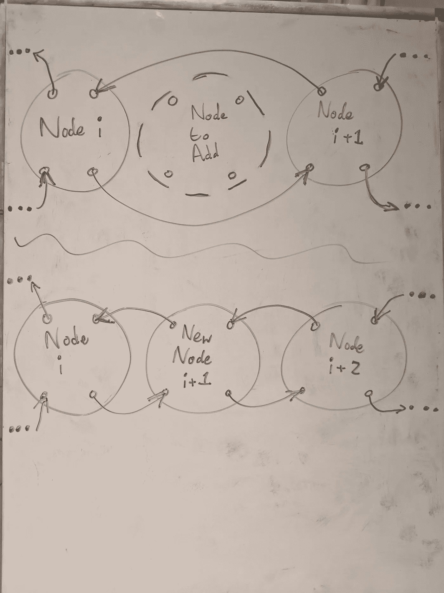

将项目插入链表的时间复杂度由两个操作组成。

1.  遍历到我们想要插入的列表部分，这是 O(N)，类似于在位置 I 获取一个项目的操作。
2.  更新链接，使我们的新节点成为列表的一部分，这是 O(1)，类似于从列表的开头/结尾添加/删除。

当我们组合这些时间复杂度时，我们得到 O(N+1)，这只是 O(N)，因为随着我们的列表变大，N 也变大，我们不关心“+1”，因为它被大 N 淹没了。

例如，如果 N 是 1，000，000，1，000，000 和 1，000，001 之间的差异非常小，对于大多数实际应用程序，我们只对“大约一百万”项的长度感兴趣。

## 从列表中的某处移除项目

与在链表中插入一个条目非常相似，从链表中的某个位置移除一个条目包括两个步骤。首先，我们遍历列表中要删除某项的部分，然后，我们更新链接，以便在遍历列表时跳过要删除的节点。

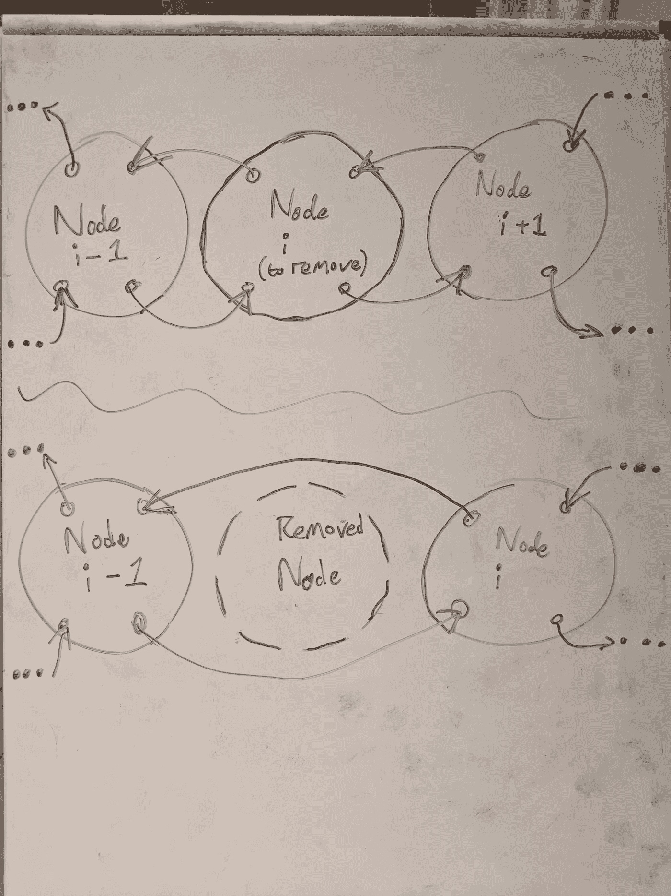

时间复杂度非常类似于在链表中的某处插入一个条目，它是 O(N + 1)，我们称之为 O(N)的原因与大 N 压倒常数因子的原因相同。

# 链表有什么好处

所以链表有这些操作当然很好，但是它们有什么用呢？人们应该在什么时候以及如何使用这些东西？

通常，它们用于需要从列表的开头/结尾添加和删除大量项目的作业。

## 行列

队列可能是一个单独故事的主题，队列是一种数据结构，被称为先进先出(FIFO)。也就是说，放入数据结构的第一个元素是第一个出来的。它们是你在商店里看到的队列的软件体现，顾客首先加入队列，他们是第一个购买商品的人，在第一个人之后加入队列的人依次出现，按照他们加入队列的顺序一个接一个。

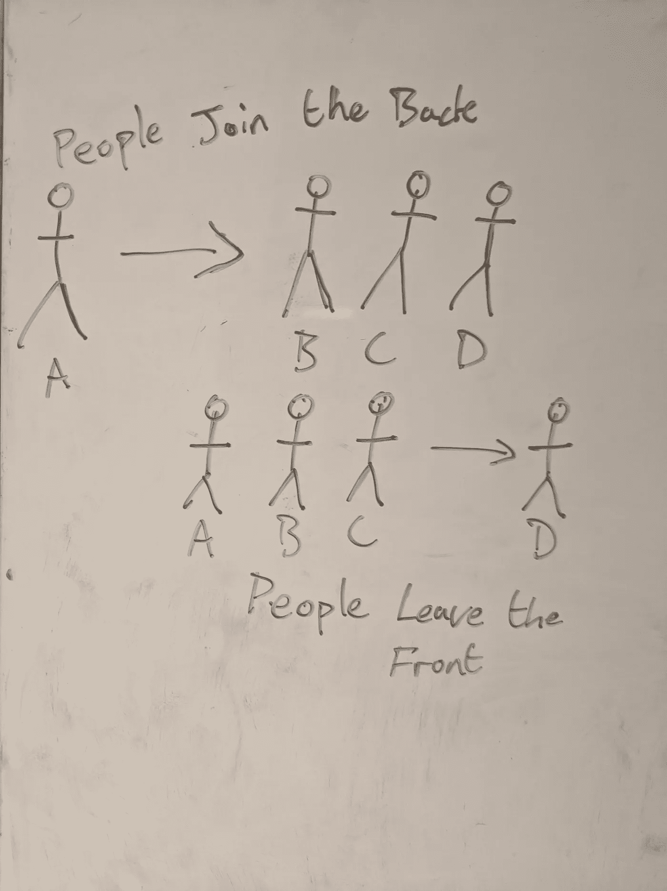

队列大量使用添加到末尾和从开头移除的操作，这是链表擅长的，因为这些操作都具有 O(1)的时间复杂度。

更多关于排队的信息可以在[维基百科](https://en.wikipedia.org/wiki/Queue_(abstract_data_type))上找到。

## 大量

同样，它们可以成为自己故事的主题，栈是一种数据结构，被称为后进先出(LIFO)。也就是说，最近添加到堆栈中的项是第一个项，它将是下一个被移除的项。如果队列是商店队列的体现，那么堆栈就是一堆需要挂起来的衣服的体现。物品被一件一件地添加到堆里，然后当你把它们挂起来时，你从堆的顶部拿衣服，直到你到达底部。

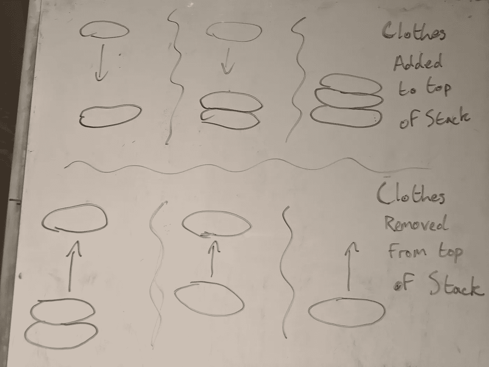

栈大量使用了从开始添加/删除的操作，这也是链表非常适合的，因为这两种操作都是 O(1)。

更多关于书库的信息可以在[维基百科](https://en.wikipedia.org/wiki/Stack_(abstract_data_type))上找到。

# 链表不利于什么

链表不擅长需要你导航到列表中的随机项目。从列表中的某个地方获取/添加/移除都是时间复杂度为 O(N)的操作。这并不是世界上最糟糕的事情，但是通常情况下，如果您需要执行大量此类操作，您会希望考虑其他选项。备选方案将是[数组列表](https://en.wikipedia.org/wiki/Dynamic_array)或[地图](https://en.wikipedia.org/wiki/Associative_array)。

# 摘要

链表是一种数据结构，是一系列链接在一起的节点。该列表保留了到第一个和最后一个节点的链接，然后从这些节点可以遍历到列表中的任何其他项。

他们擅长在列表的开头/结尾添加/删除，但不擅长做需要随机访问列表中的项目的事情。

感谢您的阅读，我打算在这个系列中再写几个故事，然后将它们链接在一起，形成一个单一的资源，工程师可以用它来学习所有工程师都应该知道的东西。