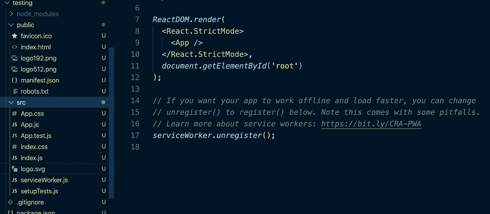
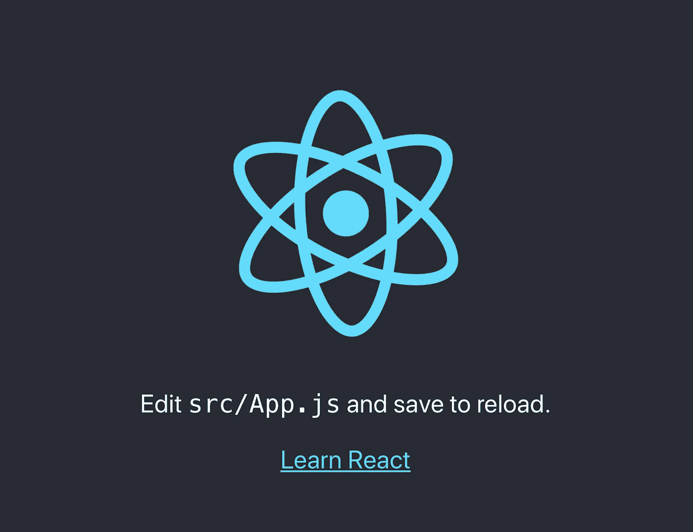
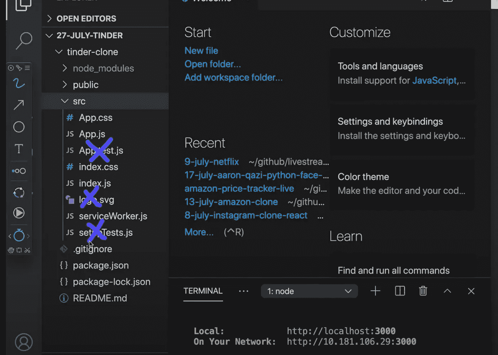
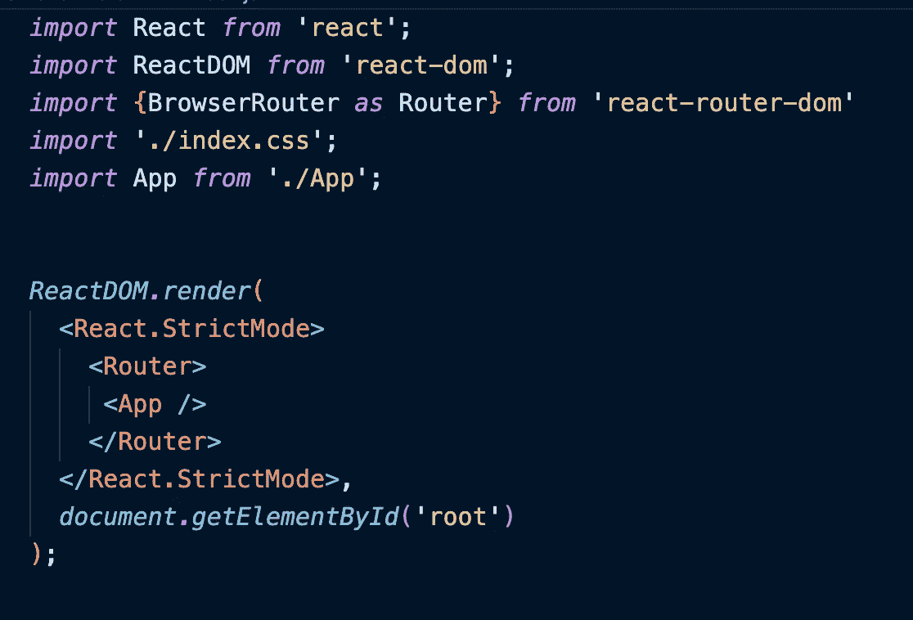
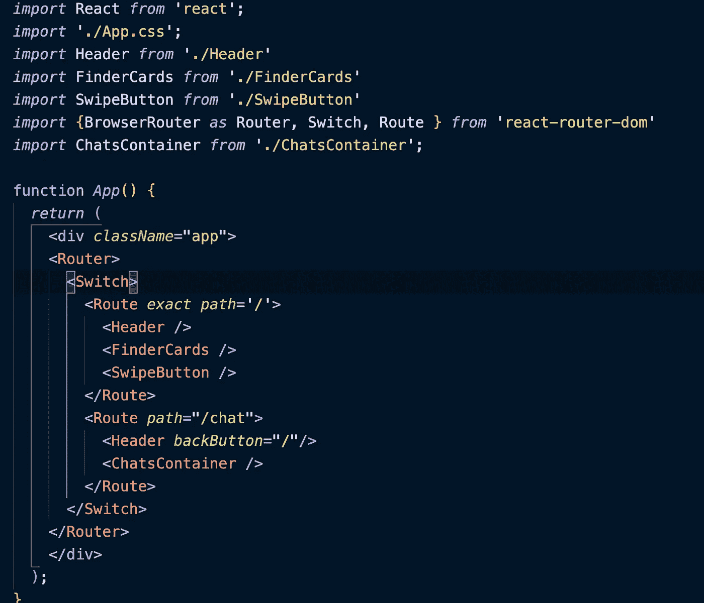
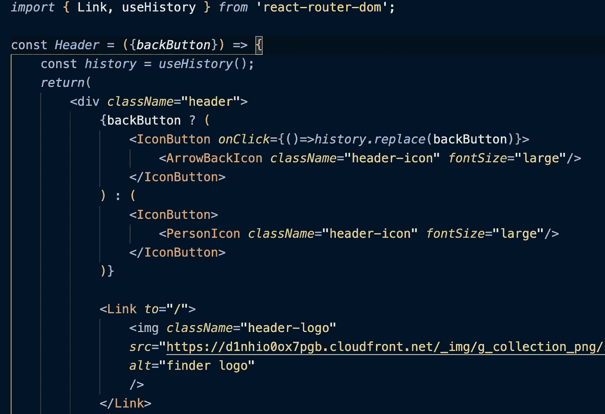

# 我在用 React 构建项目时学到的东西

> 原文：<https://levelup.gitconnected.com/things-i-have-learned-while-building-projects-with-react-8d0249e52446>

JavaScript 是前端开发人员最流行的编程语言之一，也是学习技术堆栈的基础之一。但是仅仅学习 JavaScript 是不够的，大多数时候当程序员从事一个项目时，我们需要使用某种框架来支持普通的 JavaScript。React 是与 Angular 和 Vue 一起最流行的 JavaScript 框架之一。也就是说，每个框架都有自己的优点和缺点。React 是一个较小的库，作为初学者更容易开始，而 Angular 是一个较大的框架，有许多用 TypeScript 编写的代码。让我们更深入地了解 react，以及我在用 React 构建项目时学到了什么技巧。

首先，要开始构建一个新的 react 项目，最方便的方法是使用终端命令`npx create-react-app`后跟项目名称。React 由脸书开发，使用起来非常简单，附带非常详细的说明和文档，通过 create-react-app，react 为我们提供了许多结构化文件和设置，我们可以尽快减轻并开始构建我们的项目。从下面的代码片段中我们可以看到，react 已经为我们的项目构建了 DOM render 以及一些 starter 徽标图像和测试文件。请注意，顶部显示的是 node_modules 文件夹，它是灰色的，node modules 是包含 React 所有库的文件夹，该文件夹不会上传到 GitHub，因为它是一个包含数百个文件的非常大的文件夹，在将文件上传和保存到 GitHub 时会消耗大量时间。(查看我的另一个关于 [Git & GitHub 教程](https://medium.com/swlh/git-github-beginner-tutorial-b5885882a380)的博客)。关于这一点，create-react-app 给了我们一个名为。gitignore，顾名思义，它在使用 git 命令时会忽略这些文件。(node_modules 是将文件上传到 GitHub 时将被忽略的文件夹/文件之一)。

在创建我们的新项目之后，我们需要做的下一件事就是运行它，`npm start`命令将完成这个任务。我们可能会注意到，一个带有`localhost:3000`的网页将会打开，react 徽标图像将会旋转，显示我们的项目已经成功启动。是的，它看起来超级酷，但它不是我们正在建立的。因此，我们需要调整和修改`create-react-app`给我们的一些文件。

首先，对于一个初学者项目，我们根本不需要 app.test.js 和 setupTests.js 这两个单元测试文件来帮助我们测试代码。虽然 react 徽标看起来很酷，但我们并不需要它来构建我们的项目，因此删除徽标并编辑调用徽标图像的 app.js。建议清理 app.css 中的代码，因为 React 给了我们一些默认的 css 样式，我们可能不想使用。

清理了起始代码之后，我们就可以开始构建我们的项目了！在我最近的学习和遵循聪明程序员的教程指南中，我学到了很多关于 React 的知识，以及使用 React 的一些最佳实践。例如，在构建项目时，文件结构可能是一个问题。在开始的时候，我们可能会简单地将所有文件放在 src 文件夹中，这在开始时是可以管理的，但是随着项目越来越大，如果我们将所有文件都塞在 src 文件夹中，这对于文件管理来说是不高效的。更好的文件管理系统可以使用基于组件和容器的文件夹来分离和跟踪所有文件。另一种流行的管理文件的方式是基于组件的，任何相关的组件和它的 CSS 文件都放在一个文件夹下，在整个项目开发阶段都可以很容易地跟踪。

关于 CSS 文件，我们通常希望每个组件都有一个单独的 CSS 文件，除非有两个功能可以共享和使用相同的样式，否则我们通常希望将其样式分离到自己的 CSS 文件中，这样在需要时可以很容易地跟踪和修改它。如果我们在 app.css 文件中有所有的样式，这可以工作，但是当不同的功能有不同的样式时，它会导致一些混乱，使文件变得如此之大，当我们想要修改一个功能的一些样式时，我们必须浏览 app.css 中的所有混乱，以找出我们想要修改的样式。

在我最近学习构建 tinder-clone 应用程序的过程中，我意识到在 react 中设置路由器有不同的方式。路由器基本上允许我们根据点击的按钮选择不同的页面。从路由器开始，我们需要用命令`npm install react-router-dom`安装 react-router。一旦安装了这个包，我们就可以通过在 index.js 文件中设置它来开始我们的路由，如下面的代码片段所示。

我最近了解到的是，不要把路由器放在 index.js 文件里，我们也可以把路由器设置在 app.js 文件里面，这样更直接，也更容易理解。在下面显示的代码片段中，我们有一个导入 BrowserRouter 并在 app.js 上设置路由器的示例，将路由的路径从主页'/'切换到我们应用程序的聊天页面路由'/chat '。我喜欢使用的一个巧妙的技巧是在`<Route exact path='/'>`行中，我使用了单词 exact path，它只允许应用程序在没有指定任何路线的情况下进入主页面。在这种情况下，如果我们键入'/chat '，它会将我们带到聊天页面，只有当我们不指定这是什么路线时，它才会被定向到主页面。

react-router-dom 的另一个很酷的特性是我们可以使用它的 link。假设我们的应用程序有一个徽标图像，我们希望确保当我们单击徽标时，它会将我们带到应用程序的主页面。我们很乐意使用 react-router-dom 这样做，如下面的代码片段所示。从 react-router-dom 导入链接，然后使用<link to="" our="" main="" page="">将其与我们的应用程序的徽标图像附加在一起。

下面的视频是一个例子，我用一个链接在应用程序的主页和聊天页面之间来回移动。

总而言之，关于 React.js，我们可以学习的东西有很多，我当然没有面面俱到。还有更多的东西要学，我很高兴每天都投入其中，并与世界分享我所学到的东西！感谢您阅读我的文章，有关主题的更多信息，请查看以下链接:

 [## 海环辰/发现者-项目

### 类似 tinder 的应用模拟器。在 GitHub 上创建一个帐户，为 haihuan Chen/Finder-项目开发做出贡献。

github.com](https://github.com/haihuanchen/Finder-Project)  [## 创建新的 React 应用程序- React

### 用于构建用户界面的 JavaScript 库

reactjs.org](https://reactjs.org/docs/create-a-new-react-app.html)  [## React 路由器:React 的声明式路由

### 学习一次，路线无处不在

reactrouter.com](https://reactrouter.com/web/guides/quick-start)