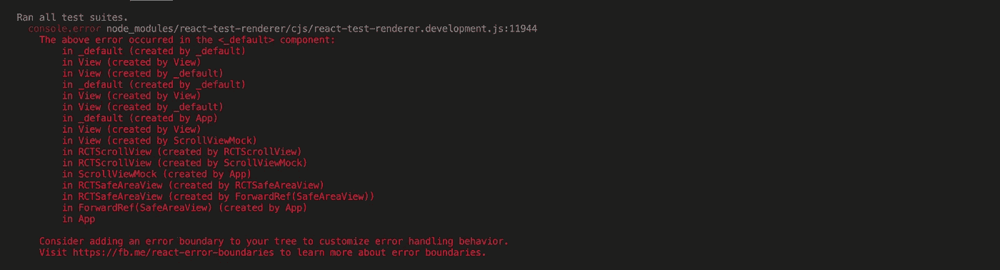
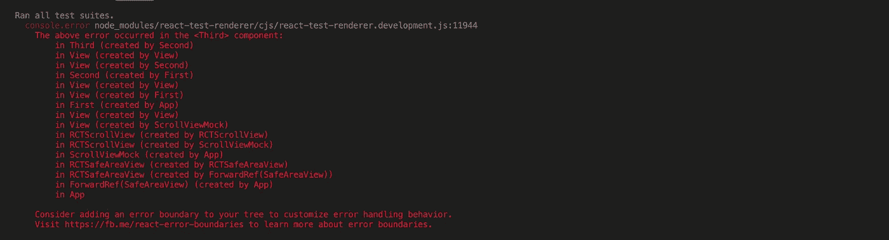
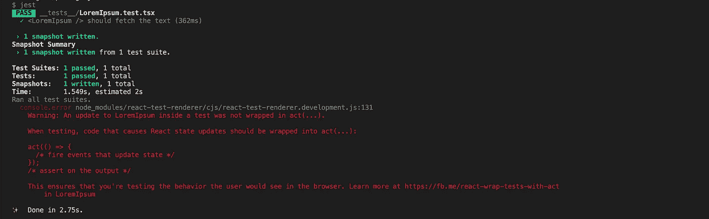
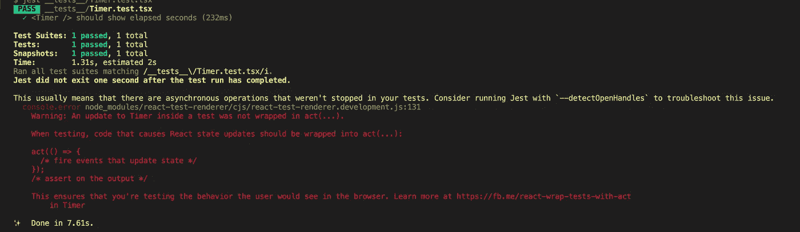

# 我希望在测试反应之前知道的事情(原生)

> 原文：<https://levelup.gitconnected.com/things-i-wish-i-knew-before-testing-react-native-3916736dd0bc>


诺亚·多米尼克·西尔维奥在 [Unsplash](https://unsplash.com?utm_source=medium&utm_medium=referral) 上拍摄的照片

对我来说，编写测试一直是开发过程中具有挑战性的一部分。总是有新的案例来找出测试或模仿的方法。我一直在开发一些 React 本机应用程序，并遇到了一些这样的问题。当然，我花了一些时间后设法解决了它们，它们并不容易解决。但是现在我回头看，它们在我看来非常明显！所以，我决定分享这些经历，这样下一个人就不用再经历这些事情了。

# 命名组件

避免导出没有名称的组件。例如`export default () => {}`或`export default function() {}`。如果出现问题，并且您正在导出没有名称的组件，您的控制台将显示如下内容:



没有名称的默认导出元件的 Jest 日志

如您所见，没有办法找出哪个组件引发了错误，因为它们都是`_default`。现在看一下具有正确组件名称的相同情况:



名为的默认导出元件的 Jest 日志

# 测试`useEffect`

使用`useEffect`钩子获取数据并使用该数据更新组件的状态是非常常见的。

为该组件编写快照测试的一种非常常见的简单方法是:

这个测试将会通过，但并非没有抱怨:



原因是组件状态的更新正在`useEffect`中发生。为了测试，对组件状态的每次更新都应该包装在一个`act`回调中。

这是在`useEffect`中测试异步状态更新的正确方法。我们还可以模仿`fetchText`函数来使测试变得更容易(稍后会详细介绍)。

# 发现漏洞

如果运行测试的持续时间不一致，可能会有一些松散的 IO 操作，例如 http 请求或超时。检测这些漏洞的最佳方式是使用`—-detectOpenHandles`选项。Jest 还会警告你使用这个选项，以防它检测到松散的结尾。



# 重新思考测试设计

对于单元测试的正确方法，只关注当前文件中的功能是非常重要的。所有进口的东西都应该被嘲笑。重新思考组件最初的设计方式总是一个好的做法。通过做一些小的重构，可能会使编写测试变得容易得多。让我们考虑以下组件:

这个组件将在几个`randomDelay`毫秒后揭示一个秘密。为了测试这个组件，我们必须使用`jest.useFakeTimers`方法。对此的完整测试将是延迟前后的测试。让我们试试这个:

当然，我们可以模仿`Math`中的`random`方法，每次都返回一个常数(这是以后的事)，但我们正在寻找一个更好、更简单的解决方案。如果我们将`delay`作为`props`传递给`Reveal`组件会怎么样。这将使`Reveal`组件更简单，更容易测试。

记住这一点也将导致你考虑分离关注点的方式的转变。假设我们有一个组件处理一些数据并调用一个 API。如果我们在同一个组件文件中实现它，测试将会更加困难，而不是将它移到一个单独的`service`文件中。那么在测试组件时，服务文件中的所有内容都可以被模仿。

为了测试`Enhappy`组件内部的`enhappy`功能，我们应该:1)触发按钮上的`onPress`，2)模拟`fetchText`，3)通过`tree.root.findByType(Text).props.children`检查`text`。然而，如果我们将`enhappy`方法移动到一个单独的文件中，进行适当的单元测试将会容易得多。

# 嘲弄的

**嘲讽外来进口**

通常推荐的简单方法是在包含`jest.mock("module", () => { ...`的`__mocks__`目录中创建一个同名文件。如果这不起作用，我们可能需要用以下方法之一来模拟它:

*   模拟测试文件中的模块

我们可以给每个测试块单独添加一个模拟部件，或者在`beforeAll`块内部进行。例如嘲弄`react-native-camera`:

*   使用安装文件

有时候不仅仅是这样。比如嘲讽`react-native-fs`就不会这样。在这些情况下，我们必须模拟`setupFiles`中的模块。在 jest config 中，如果该部分不存在，则添加它(如果存在，只需将条目添加到数组中):

```
"setupFiles": [
  "<rootDir>/path/to/jest-mocks.ts"
],
```

然后在`jest-mocks.ts`中，将所有不起作用的模拟放到`__mocks__`目录或之前的方法中:

**嘲讽全局**

对于这一节，我考虑过嘲笑`Date`构造函数。以下函数将以字符串形式返回当前日期:

为了测试这一点，我们需要模拟全局`Date`对象来控制它的输出。使用`jest.spyOn`方法模仿全局`Date`非常容易。

也有可能窥探一个对象的特定方法。例如，嘲笑`Date.now`就像`jest.spyOn(Date, "now")`。

**嘲讽内部进口**

为了模拟内部模块，需要导入整个文件，然后我们可以模拟方法、类或常量。对于这一部分，我们将模拟以下模块中的方法:

这里有一个测试函数的多个参数的快速技巧。为了测试`enhappy`功能，通常的方法是:

在这种情况下，对于每个新的测试，我们必须写完整行。对于这个具体的例子来说，这看起来并不难，但是相信我，在有些情况下，这并不容易。然而，如果我们创建一个新的测试数据结构，这可以通过一个简单的 for 循环来完成:

让我们回到嘲讽的部分。该模块有两个导出方法:默认导出和命名导出。对于模拟部分，我们必须将该模块作为`import * as happy from "../rel/path/to/happy.ts"`导入，然后我们可以模拟每个方法:

```
// mocking default export
happy.default = jest.fn()// mocking named export
happy.enhappyNoMatterTheCase = jest.fn()
```

让我们看看单元测试`Enhappy`组件的操作:

在这个测试中，我还提到了测试命名的导出并在一个`Button`上触发`onPress`事件。

# 其他有用的选项

有两个有用的选项可以为您节省大量时间:

1.  `--showConfig`这将显示用于运行测试的最终配置对象。如果您想调试为什么自定义更改没有生效，这是非常方便的。
2.  当您运行测试时，您可能会看到意想不到的行为(虽然不经常，但还是会发生)。没有意义的事情，那么你就知道是时候清空缓存了。

# 快乐测试；)

*如果我做错了什么，或者有更好的方法，* ***请*** *告诉我！*