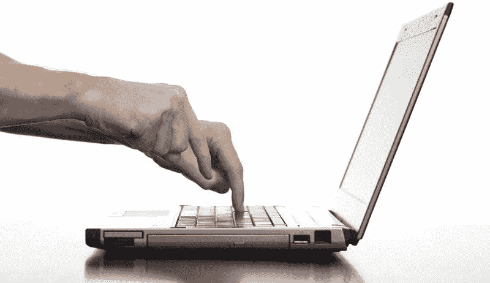
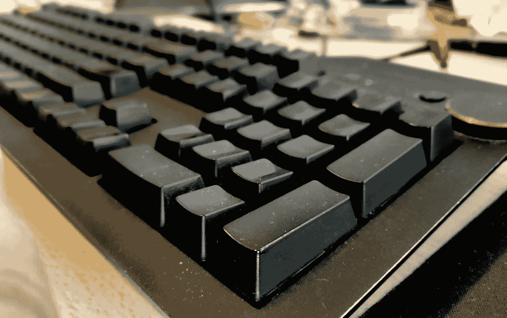

# 让我工作更出色的事情

> 原文：<https://levelup.gitconnected.com/things-that-made-me-better-at-my-job-3c08ddf5576f>

这是一个完全主观的列表，列出了让我在开发工作中做得更好的事情。没有两个职业是相同的，所以你的里程可能会有所不同。但是在我职业生涯的最后二十年里，这些东西都帮助了我。也许他们会帮助你。

# 学会触摸打字

双指打字([股票媒体](https://www.freeimageslive.co.uk/free_stock_image/learningtotypejpg))

听着，我认识一些用两个手指打字的优秀程序员。但对我来说，寻找键盘上的按键不再是我想的事情了。每个键的位置——不仅仅是 26 个字母数字，而是所有 104 个键——都被编入我的肌肉记忆中，包括击键、组合键等等。这是第二天性。

对我和我的大脑来说，我需要尽量减少分心。因为我可以触摸打字，所以我的注意力不需要从大脑转移到眼睛，再到按键，再到屏幕。我的大脑和屏幕之间有一条直线，我的注意力可以集中在手头的问题上。

# 买一个好的键盘

我的尘土飞扬，值得信赖的 Das 键盘终极版。十年来我的代码伴侣。

听着，你不需要像我一样炫耀，有一个空白的键盘。你不需要*有*闪光灯，自定义键帽，或者直线布局。但是如果你整天打字是有报酬的，那么你应该为自己买一个带机械开关的键盘。

调平你的键盘可以是一个很深很深(读作:昂贵)的兔子洞，但你不需要成为一名绝地，并建立自己的光剑。尽管你想的话可以。

三十秒初级读本:如果你在家工作，买蓝色开关；如果你在办公室工作，买棕色开关。理想的情况是买一个带有 Cherry MX 开关的键盘，但是 Gateron 开关也很有名。有很多好品牌，包括 Filco，Ducky，Varmilo，Leopold。或者很多游戏键盘都有机械开关，从雷蛇到罗技或者海盗船。

你*可能*想尝试一种没有数字键盘的“无十键”(TKL)键盘，但这也可能会扰乱你的肌肉记忆(见最后一点)。

调平指南:研究键帽轮廓、不同的开关类型(用开关测试仪测试)、可选的按键布局和 DIY 板。

还有，我不会假装我是一颗纯洁的心。当我的同事意识到他们不能在我的键盘上打字时，我总是喜欢他们敬畏和怀疑的眼神。比起我拥有的任何其他物品，这个键盘是我的图腾:安静地说，我是个坏蛋。一个安静，不引人注目，代码忍者。

# 学习写作

[贝洛里约工作室](https://unsplash.com/@beloriostudio?utm_source=unsplash&utm_medium=referral&utm_content=creditCopyText)在 [Unsplash](https://unsplash.com/s/photos/writing?utm_source=unsplash&utm_medium=referral&utm_content=creditCopyText) 拍摄的照片

作为一名开发人员，你写的东西比他们在高中告诉你的要多得多。我曾经认为这一切都是关于`x = x + 1`、`for`循环和编写聪明的算法。在这个行业工作了 20 年，我意识到写**单词——常规的、人类的、英语单词——和写代码一样重要。**

不是每个开发人员最终都会写一本书或者成为一名科技记者。但是人类可读的文字无处不在:代码中的注释、最终用户的文档、项目计划、引用、规范、报告、API。待办事项列表。会议纪要。通过电子邮件、Slack 或 Hipchat 进行日常交流。许多伟大的开源项目都有精彩的书面文档，可以让你在任何时候从 0 到 60。甚至你的代码也需要清晰、简洁的呵护。尽管我们有完美代码完全可读的柏拉图式的想法，但是一个适时的、写得好的注释对理解一个类、一个方法和一段代码可能试图实现的目标有很大的帮助。

你不必是一个专家作家。你不必拥有丰富的词汇，写机智的对答或赢得拼字比赛。但是*有没有*想出怎么把几个词串起来？想办法解释你的意思。学习写作。

你是怎么做到的？写吧。将文字放在页面上或屏幕上。它们不一定要完美，也不一定要发表。言语产生言语。

# 做瑜伽

我的观点是每个超过三十岁的人都需要做瑜伽。对于所有整天坐在办公桌前的人来说，无论男女，都是如此。社会告诉我们，我们需要健身房、HIIT 和交叉健身。但是现在我进入了我的第四个十年，我有比用我的体格给人们留下深刻印象更重要的事情要做。门槛更低了，但任务更高了:我只想让我自己的身体在接下来的四十年里尽可能好地工作。

你还可以做其他的事情，我已经尝试了很多，但是在我看来，有一个突出的练习最值得我花时间去做。这叫瑜伽。

开始真的很容易，但它可以进展到非常困难的反演，需要大量的灵活性。不同的体式给了你灵活性和伸展性，同时也增强了你的核心力量。你可以在大多数健身房找到一个课程，但你也可以下载一个应用程序，在自己家里舒适地进行。对于我来说，我的应用程序是 [Down Dog](https://www.downdogapp.com/) ，它有很大的进步性，有很多可变性，并让你能够专注于某个领域，例如臀部屈肌伸展，对于我们所有久坐的办公桌骑手来说。高弓步和蜥蜴式对我的屈臀肌产生了奇迹。

另一个好处是:瑜伽教会了我呼吸和静止。呼吸仍然是人类生存的基础，然而不知何故，思考它，关注它仍然带给我如此多的价值。每天，它都帮助我为精神健康和理智而战。它帮助我更好地工作和生活。

# 好好学 Git

没有人能写出完美的代码。每个人在某个时候都需要被称为版本控制的神奇的时间机器。

找出 Git，并把它硬塞进你的肌肉记忆里。弄清楚版本控制的魔力以及分布式版本控制是如何工作的。找出分支、合并和重组。算出 Git。Linux 是 Linus Torvalds 写的最著名的东西，但 Git 可能是最好的。

弄清楚一个好的 Git 工作流如何为你和你的时间工作。当事情出错时，找出解决问题的方法——这是不可避免的。

指针:[哦，该死的饭桶](http://ohshitgit.com/)挽救了我的生活和工作，时间多得我都数不过来。

官方的 Git 文档还不错，但是我真的很喜欢 [Atlassian Git 教程](https://www.atlassian.com/git/tutorials)，因为它们有很好的图表，比如它们关于[重写历史](https://www.atlassian.com/git/tutorials/rewriting-history)的系列。

# 了解流动状态

照片由 [kazuend](https://unsplash.com/@kazuend?utm_source=unsplash&utm_medium=referral&utm_content=creditCopyText) 在 [Unsplash](https://unsplash.com/s/photos/river?utm_source=unsplash&utm_medium=referral&utm_content=creditCopyText) 上拍摄

这个是私人的。

我了解到每个开发人员都有不同的想法，我也了解到我自己属于开发人员中非常有创造力的那一类，也就是说我不擅长有条不紊和遵守纪律。

我需要的是一种叫做*心流状态的东西，米哈里·契克森米哈在他的 [Ted 演讲中对](https://www.ted.com/talks/mihaly_csikszentmihalyi_flow_the_secret_to_happiness?language=en)*做了最好的描述。它包括在我的一天中划出一些不受打扰的时间，这样我的大脑就可以专注于一个问题并解决它。

我创造了一个惯例:做一杯浓浓的黑咖啡，坐在我的办公桌前。戴上耳机。没有音乐——只是为了屏蔽周围的噪音。浏览新闻标题。清除我在社交媒体上的信息。关闭我个人使用的浏览器。在我的小本子上写下我要做的事情。然后开始工作。如果我能在上午 10 点到中午之间锁定这个时间，我就能在很短的时间内完成堆积如山的工作。

这对我来说很难，但也是必要的，因为我喜欢在办公室聊天，我有多动症的倾向，所以我很容易分心。如果我能在下午重复这一点——这在会议等场合并不总是可能的——那么我在两个 2 小时的时间里度过了非常富有成效的一天。

# 全天关闭社交媒体

和你一样，我也热衷于所有的社交媒体。我和妻子在 Facebook Messenger 上交流。我的社区，如我的教堂和我的桌游小组通过脸书与我联系。我通过 Twitter 和 LinkedIn 有职业关系。

但是当我试图思考一个严重的编码问题时，我需要集中注意力(见最后一点)。

所以我把手机调成静音。有时候，我会屏蔽我电脑上的社交媒体。有时我的朋友讨厌它，有时我错过了今天的 Twitter 风暴，但它对我的功能是必要的。

# 午餐时间出去

尽管我的初衷是好的，但在办公桌前或办公室吃午饭从来不会像我计划的那样。虽然我可以在家里愉快地花几个小时在网上闲逛，但在我的办公桌前，我不可避免地被 Hipchat、不和谐或懈怠，或我的工作电子邮件通知拉回到工作中。在工作午餐桌上，我总是被发现并被叫过去。

相反，我关掉手机通知，戴上耳塞，出去散步，听播客。或者我拿着我的 Kindle 和我的午餐去公园吃。或者我在午餐时间去跑步。

工作是一种模糊的气体，它会充满任何和所有可利用的空间。但是一天九个小时在上*会消耗你的精神机器。关掉电视一小时对你的精神健康有好处。让你的大脑休息一下。给你的潜意识一个机会去处理，疗愈，给自己加油，并准备好下一轮。内啡肽有帮助。维生素 D 有帮助。保持心率会有所帮助。换个环境会有帮助。阅读一本书使用我大脑的不同部分，并让其他部分休息一下。重置，充电，你整个下午都会更有效率。*

这个列表可能不是你从一个长期开发者那里所期待的。

有很多文章解释了如何编码和如何思考编码。如何学习这种语言或那种语言。和其他行业一样，这个行业的细节非常重要。

但最终，上面的教训是让我留在这个行业的东西，也是我每天都要回归的教训。当我结束一天的工作，写下这些话时，这些是我现在仍在应用的经验。我在家工作，不得不强迫自己离开书房去吃午饭。这些经验教训让我成为一个更好的开发人员，一个更好的人。也许他们也会帮助你。

*浩然是*[*Trendspek*](https://trendspek.com)*的开发主管和首席开发人员，这是一家利用无人机图像制作高质量 3d 模型的初创公司。*