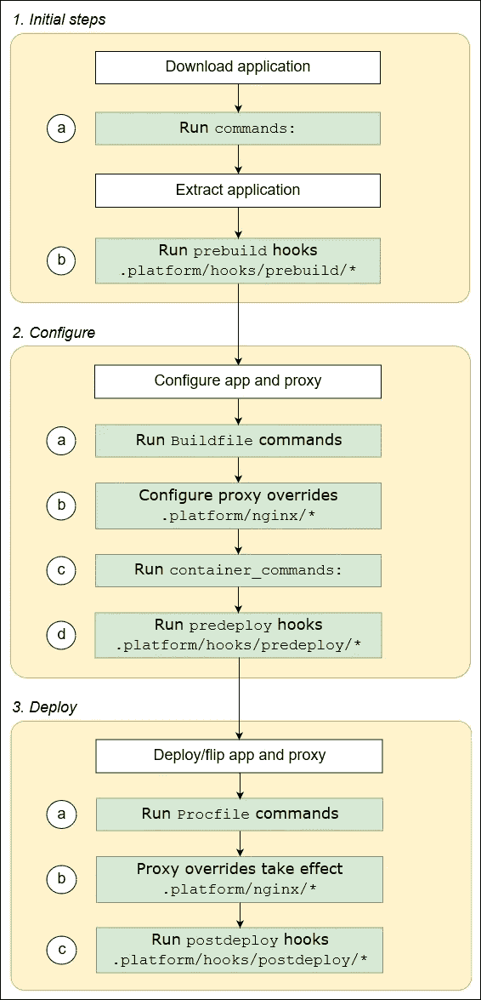
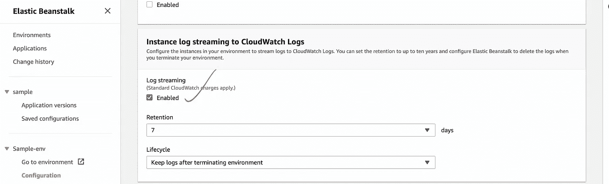
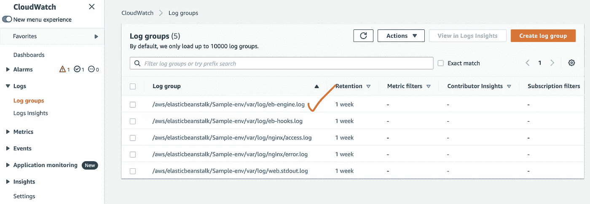
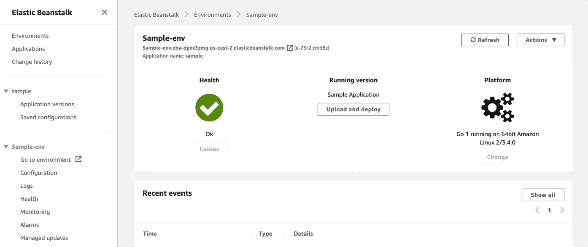
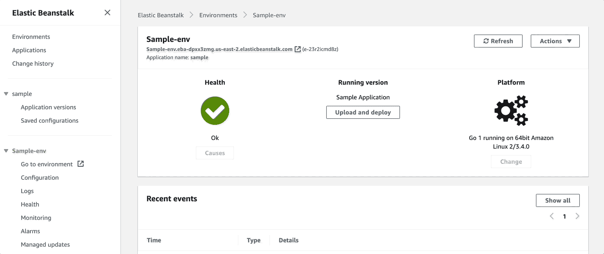

# 部署到 Elastic Beanstalk 时需要记住的事项

> 原文：<https://levelup.gitconnected.com/things-to-keep-in-mind-while-deploying-to-elastic-beanstalk-b5742a7561a>

Elastic Beanstalk 是 AWS 的 PaaS(平台即服务)解决方案。它可以部署 Java、Python、Golang、NodeJS、Docker 应用。作为 AWS 的旗舰产品，它拥有 AWS 提供的所有软件架构特性。


照片由来自 [Pexels](https://www.pexels.com/photo/woman-wearing-white-top-while-doing-thumbs-up-3790805/?utm_content=attributionCopyText&utm_medium=referral&utm_source=pexels) 的[安德里亚·皮亚卡迪奥](https://www.pexels.com/@olly?utm_content=attributionCopyText&utm_medium=referral&utm_source=pexels)拍摄

当部署一个应用程序的时候，要记住所有的事情，这真的很容易让人不知所措。AWS 文档很好，但是很庞大。当我们将应用程序上传到 Elastic Beanstalk 时，会发生很多事情。

在这篇文章中，我将试着指出一些要点，这些要点在解决任何问题或检查 Elastic Beanstalk 中的问题时非常有用。

# 1.应用程序文件夹

ec2 框中的应用程序文件夹(代码将在其中提供)是:

```
/var/app
```

将有 2 个文件夹。

## 当前(/var/app/current)

当前部署在 EB 环境中的代码。

## 暂存(/var/app/staging)

当部署任何新代码版本时，将创建此目录来承载新代码，如果代码部署成功完成，此文件夹将被重命名为当前文件夹，旧的当前文件夹将被移除。

如果由于某种原因，代码部署无法成功完成，这个文件夹将可供我们调试。

# 2.应用程序生命周期

为了提供在应用程序部署期间运行的平台挂钩，将文件/脚本放在您的源代码包中的`.platform/hooks`目录下，在以下子目录之一中。



[https://docs . AWS . Amazon . com/elastic beanstalk/latest/DG/platforms-Linux-extend . html](https://docs.aws.amazon.com/elasticbeanstalk/latest/dg/platforms-linux-extend.html)

*   `**prebuild**`**–下载和解压缩之后，应用服务器设置之前。**
*   **`**predeploy**`**–在应用服务器设置之后，在最终运行时位置部署之前。****
*   ****`**postdeploy**`**–应用程序和代理服务器部署后。******

> ******钩子文件可以是二进制文件，也可以是以包含解释器路径的`#!`行开始的脚本文件，比如`#!/bin/bash`。所有文件都必须有执行权限。使用`chmod +x`来设置你的钩子文件的执行权限。******

# ******3.日志******

******确保在配置中启用日志流。默认情况下，它不启用。在此启用它:******

************

******每个 beanstalk 环境将创建几个日志组。这是他们在云中的观察******

************

********eb-engine.log** :提供平台日志。从下载开始到部署。这是调试最重要的日志文件。******

********

> *******从 Elastic beanstalk 环境中访问日志时，会显示上述所有日志组的日志。*******

# ****4.对服务器的 SSH 访问****

****总是有理由登录到服务器并查看其中的日志或检查应用程序文件夹。 ***ssh*** 访问 b 默认不启用。****

****要启用对服务器的 ***ssh*** 访问，请在此处选择 ***ssh*** 键。****

********

****启用对 EC2 服务器的 ssh 访问****

# ****5.应用程序版本生命周期****

****当我们部署一个新代码时，Elastic Beanstalk 会创建一个新版本。在新代码部署中出现任何问题时，让代码的运行版本具有适当的标记并恢复到它是一个好的做法。****

****请访问此处了解更多信息:****

 ****[## 管理应用程序版本

### 每当您上传源代码时，Elastic Beanstalk 都会创建一个应用程序版本。这通常发生在您创建…

docs.aws.amazon.com](https://docs.aws.amazon.com/elasticbeanstalk/latest/dg/applications-versions.html)**** 

# ****6.部署****

## ****一次完成(一次性完成部署)****

*   ****最快的****
*   ****需要停机，因为有一段时间没有可用的实例****
*   ****非常适合开发中的快速迭代****
*   ****没有额外费用****

## ****旋转****

*   ****一次更新几个实例，然后继续下一步****
*   ****不需要停机****
*   ****有时会部署两个版本的代码****
*   ****没有额外费用****
*   ****部署时间长****

## ****与其他批次一起滚动****

*   ****像上面一样，但是旋转新的实例来移动批处理****
*   ****不需要停机****
*   ****应用程序总是满负荷运行，有时会超负荷运行****
*   ****更长的部署****
*   ****额外实例的一些额外成本****
*   ****有利于生产****

## ****不变的****

*   ****在新 ASG 构建新实例，将版本部署到这些新实例，然后在运行状况良好时交换所有内容****
*   ****不需要停机****
*   ****应用程序永远不会耗尽容量，有时它会以两倍的容量运行****
*   ****新 ASG 一段时间的高成本****
*   ****最长部署****
*   ****一个很大的优势是我们可以在出现故障时快速回滚(只需终止新的 ASG)****

## ****蓝色/绿色部署****

*   ****零停机时间和释放设施****
*   ****创建一个新的登台环境，并在那里部署 v2****
*   ****新环境可以单独进行验证****
*   ****可以设置 53 号路线来执行加权策略，将少量流量重定向到舞台环境****
*   ****完成环境测试后，使用 Beanstalks“交换 url”****

****学习愉快，感谢您的访问。****

****以下是 AWS 上的一些相关帖子:****

****[](/deploy-an-application-in-elastic-beanstalk-with-nginx-with-ssl-without-acm-d7216a2956d5) [## 使用 Nginx 和 SSL 在 Elastic Beanstalk 中部署应用程序，不使用 ACM

### 我喜欢弹性豆茎。这是一个非常棒的 PaaS 解决方案，它使应用程序部署变得轻而易举，并具有自动…

levelup.gitconnected.com](/deploy-an-application-in-elastic-beanstalk-with-nginx-with-ssl-without-acm-d7216a2956d5) [](https://medium.com/geekculture/debug-lambdas-locally-without-sam-docker-or-anythin-eb68761dd9c4) [## 在本地调试 lambdas，不需要 SAM、Docker 或任何东西

### 最近我在 AWS 中做了很多 lambda 编码。在做了很多网络服务后，我真的很想念…

medium.com](https://medium.com/geekculture/debug-lambdas-locally-without-sam-docker-or-anythin-eb68761dd9c4)****