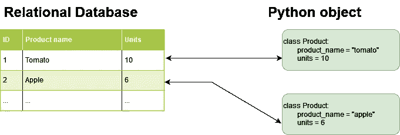

# 关于姜戈要事先知道的事情

> 原文：<https://levelup.gitconnected.com/things-to-know-about-django-beforehand-f93e4e3319ed>

选择合适的技术堆栈并不容易，如果能早点知道某个框架是否适合您的用例就好了，对吗？在这篇文章中，我将向你介绍 Django 框架，它的特点，我将解释 Django 适合做什么。

由[凯利·西克玛](https://unsplash.com/@kellysikkema?utm_source=medium&utm_medium=referral)在 [Unsplash](https://unsplash.com?utm_source=medium&utm_medium=referral) 上拍摄的照片

## 姜戈是什么

Django 是一个基于 Python 的高级 web 开源框架。正如 Django 官方网站上所说，Django 框架鼓励快速开发，强调干净的代码。Django 可以被定义为“重型框架”,因为它采用了一种包含电池的哲学(T7 ),这意味着所有需要的通用功能都必须与框架一起提供，而不是作为额外的库。

## 为什么是姜戈

Django 背后的目的是使 web 开发过程更容易、更快。该框架可以被视为开发人员在开发 web 应用程序时可以使用的组件工具包。通过使用 Django，开发人员可以专注于他们站点最独特的特性，让 Django 处理其余的(如认证、安全、缓存、URL 路由等)。).

Django 最重要的一点是它的灵活性。Django 几乎可以用来构建任何类型的 web 应用程序，从烹饪博客到社交网站或电子商务平台。

## MVT 设计模式

MVT 代表模型视图模板，是一种软件设计模式。在某些方面，MVT 类似于另一种叫做 MVC 的模式[1]。但是在模型视图模板模式中，控制器部分是由框架本身处理的。作为一个以*模型为中心的*系统，Django 的模块具有高度的可修改性和可扩展性。这种设计模式潜在地带来了其他优势，比如**并发支持**和**解耦架构**。[1]

# 姜戈的品质

当谈到技术和 web 框架时，特性可以判断它们是否适合某个项目。Django 特别具有一些相关的功能特性，我们将在下面的章节中进行分析。

## 安全性

Django 将对象关系映射器( **ORM** )用于每个与数据库相关的操作。通过这种方式，应用程序不依赖于所使用的数据库，同时提供了针对 SQL 注入攻击的内置保护。由于*强类型查询*，以及可以额外编写的特殊验证器，Django 的 ORM 阻止了 SQL 注入。Django 的模板引擎部分阻止了跨站脚本(XSS)攻击，因为它处理 HTML 字符的转义，将它们视为不安全的字符。XSS 保护只是部分的，这意味着其他载体可以利用这种技术(例如 cookies)。

使用 Django 的设置可以启用其他安全功能，如 HTTP 到 HTTPS 升级、HTTP 严格传输安全和仅 HTTPS cookie。

## 可量测性

Django 采用了[无共享架构](https://en.wikipedia.org/wiki/Shared-nothing_architecture) (SN)。这种架构在 web 开发中很流行，它将每个组件分开，这样每个组件都是相互独立的。SN 架构使 Django 能够根据运营需求轻松扩展，因此随着用户群的增长，可以添加缓存服务器、数据库服务器和其他组件。

## 可维护性

像许多其他编程语言一样，Python 支持并鼓励模块化。作为内置的 Python，Django 信奉这种哲学，它鼓励开发可维护和可重用的代码。Django 采用了“不重复自己( **DRY** )的原则，这意味着代码不会被复制，而是会被重用。这个概念允许减少代码库，也允许开发者之间更好的协作。

# 对象关系映射程序

*对象关系映射*是一种提供抽象层的技术，用于与来自 PostgreSQL、MySQL 或 SQLite 等不同关系数据库的应用数据进行交互。由于这种抽象，开发人员不必编写 SQL 代码。他们可以使用 pythonic 语法进行 CRUD 操作。ORM 的主要优点是快速开发和可移植性。

Django ORM —作者图片

在 Django 中，每个数据库表都被映射到一个继承自 [*模型的 Python 对象。模型* Django 类](https://docs.djangoproject.com/en/4.0/topics/db/models/)。创建表的 SQL 由 ORM 自动生成。

# 适合

为了了解 Django 的能力，看看在产品中使用该框架的现有公司是很有用的。正如 Django 官网上所说，Django 框架被不同的大型科技公司使用，如 *Instagram* 、 *Mozilla* 、 *Pinterest* 等。Django 也被用来建立国家地理杂志和麦克阿瑟基金会的网站。社交网络、网络浏览器、视频娱乐和私人基金会网站只是几个例子，但是 Django 可以用来实现几乎所有的网络应用。但是在某些情况下，Django 并不是一个好的选择，在下一节中，我们将讨论这些情况。

## 限制

Django 可能不是小型 web 应用程序的正确选择。例如，如果你必须像一个简单的博客一样建立一个功能有限的网站，Django 就不是最好的选择。由于涉及到大量的源代码，Django 会在 CPU 使用和带宽方面引入不必要的开销。Django 通常用于中型或大型项目，这些项目涉及多种功能以及可伸缩的解决方案，因此对于小型项目，您可能希望看看其他框架解决方案，如 Flask microframework。

Django 的另一个限制是它是一个单一的框架。在软件架构中，monolith 是一个软件应用程序，它的模块不能单独执行。一个整体可以被视为一个单一的大型应用程序，必须全部或全部部署。由于这种架构选择，Django 受到一些问题的影响。其中最相关的一个是，其中一个模块的单个更改会迫使整个应用程序重新启动。[2]

# 结论

Django 是一个完善的基于 Python 的 web 框架，具有丰富的有用特性和优秀的学习资源。虽然与其他现代常用的 web 框架相比，该框架相对较老，但采用它仍然有好处，但这取决于具体的用例。

谢谢！😄

# 参考

[1]: Jhonny Mertz 和 Ingrid Nunes。2017.理解 Web 应用程序中的应用程序级缓存:对最新方法的全面介绍和调查。ACM 计算机。Surv。9、4、第三十九条(2017 年 3 月)，32 页。DOI: 0000001.0000001。从 https://arxiv.org/pdf/2011.00477.pdf[取回](https://arxiv.org/pdf/2011.00477.pdf)

[2]:尼古拉·德拉戈尼、萨维里奥·贾洛伦佐、阿尔韦托·伊卢奇·拉富恩特、曼努埃尔·马扎拉法布里奇奥·蒙特西、鲁斯兰·穆斯塔芬、拉里萨·萨芬娜。(2017).微服务:昨天，今天，明天。从 https://arxiv.org/pdf/1606.04036.pdf[取回](https://arxiv.org/pdf/1606.04036.pdf)