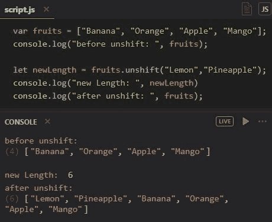

# 作为一个初学 JavaScript 的开发者，我们应该知道的事情

> 原文：<https://levelup.gitconnected.com/things-we-should-know-as-a-beginner-javascript-developer-801dc58e74d6>

今天我要讲一些所有初学者都应该知道的重要 JavaScript 话题。


在 [Unsplash](https://unsplash.com?utm_source=medium&utm_medium=referral) 上由 [Mazhar Zandsalimi](https://unsplash.com/@m47h4r?utm_source=medium&utm_medium=referral) 拍摄的照片

# **类型**

## **1)相等和比较**

在 JavaScript 中，我们可以用两种方式检查等式:

a)相等运算符“==”

这将检查两个操作数的值是否相同。它不会检查数据类型。它只检查值是否相等。示例:

```
 0 == “” // true
 0 == “0” // true
 false == “false” // false
 false == “0” // true
 false == undefined // false
```

b)严格相等运算符“===”

这将检查两个操作数的值是否相同。它还会检查数据类型是否匹配。只有当值和数据类型完全匹配时，它才返回 true。示例:

```
 "" === "0" // false
 0 === ""// false
 0 === "0" // false
 false === "false" // false
 false === "0" // false
 false === undefined // false
```

## **2)一个对象的类**

我们只能用一种方法来确定一个对象的[[Class]]值，那就是使用 Object.prototype.toString。

```
'[object '+ valueOfClass + ']', e.g [object String] or [object Array]
```

在下面的例子中，Object.prototype.toString 被调用，其中[的值 this](http://bonsaiden.github.io/JavaScript-Garden/?fbclid=IwAR2e20gx1u-UtS9WJLCU92ZuIcREUXLfyTLuevNdS2a_3hoO-M8SfGW6nTU#function.this) 被设置为应该检索其[[Class]]值的对象。

```
function is(type, obj) {
  var clas = Object.prototype.toString.call(obj).slice(8, -1);
  return obj !== undefined && obj !== null && clas === type;
}

is('String', 'test'); // true
is(‘String’, new String('test')); // true
```

## **3)使‘type of’操作符有用的唯一情况**

下面提供的代码将检查“bar”是否被声明。

```
console.log(typeof bar !== 'undefined') //false
```

仅引用“bar”会导致 ReferenceError。

```
console.log(bar) //error: Uncaught ReferenceError: bar is not defined
```

## **4)铸造类型**

类型转换的最佳选择是显式转换为三种可能类型中的一种。

**a)浇铸到管柱上**

通过在前面添加一个空字符串，可以很容易地将值转换为字符串。

```
 '' + 10 === '10'; // true
```

**b)铸造至编号**

使用一元加号运算符可以转换为一个数字。

```
+'10' === 10; // true
```

**c)铸造到布尔**

通过在一个值前使用两次 not 运算符，可以将该值转换为布尔值。

```
!!'foo'; // true
 !!''; // false
 !!'0'; // true
 !!'1'; // true
 !!'-1' // true
 !!{}; // true
 !!true; // true
```

## **5)为什么我们不应该使用 eval()**

我们不应使用 eval，因为:

a)eval()的任务可以用其他备选方案来完成，并且 eval()也比备选方案慢

b) eval()使用调用者的权限执行它传递的代码。这真的很危险！

c)使用可能受到恶意方影响的字符串运行 eval()

## 6)未定义

“未定义”是指已经声明但尚未赋值的变量。以下是返回未定义值时的一些示例:

*   访问已声明的*但未初始化的*变量。
*   由于缺少 return 语句而导致的函数隐式返回。
*   没有显式返回任何内容的语句。
*   查找不存在的属性。
*   没有传递任何显式值的函数参数。
*   任何被设置为 undefined 值的东西。
*   任何形式的表达都是无效的(表达式)

## **7)吊装**

如果我们在函数中的任何地方使用 var 关键字声明一个变量，javascript 会认为该变量是在该函数范围之上声明的。所以我们可以在变量声明语句之前访问它。这叫吊装。示例:

```
function showSomething(){
  console.log(x,y,z) //undefinded undefined undefined
  var x = 10;
  var y = 5;
  if(true){
    var z = 100;
  }
  console.log(x,y,z) //10 5 100
}showSomething()
```

在这里，由于提升，我们可以在声明为一个`undefined`变量之前访问所有三个 x、y、z 变量。

## **8)块级声明**

块级声明意味着在块范围内声明的变量不能从外部访问。要在块级声明变量，我们使用两个关键字:

**a)让**

let 声明类似于 var 声明，但是不同之处在于 let 声明不在作用域的顶部。它只在我们声明它的块中有效。示例:

```
function showSomething(){
  console.log(x) //ReferenceError
  console.log(y) //ReferenceError
  console.log(z) //ReferenceError
  let x = 10;
  let y = 5;
  if(true){
    let z = 100;
    console.log(z) //100
  }
  console.log(x) //10
  console.log(y) //5
  console.log(z) //ReferenceError
}
```

我们不能重新声明一个已经用`let`关键字声明的变量。但是使用`var`关键字是可能的。示例:

```
function showSomething(){
  var x = 100
  console.log(x) //100

  var x = 20
  console.log(x) //20 let y = 19
  console.log(y) //19 let y = 18 // error: Identifier ‘y’ has already been declared
}showSomething()
```

**b)常量**

`const`声明也是像`let`声明一样的块级声明，但是区别在于我们不能改变用`const`声明的变量的值。同样，如果我们用 const 声明一个变量，但不赋值，就会出错。

```
// Valid constant
 const maxItems = 30;//TypeError: Assignment to constant variable
 maxItems = 20;// Syntax error: missing initialization
 const name;
```

# **字符串**

## 9) **包含():**

Includes 是 String 对象的函数，它检查字符串是否包含指定的字符串/字符，如果存在则返回 true，如果不存在则返回 false。示例:


## 10) **endsWith():**

endsWith()是 String 对象的一个函数，它检查一个字符串是否以指定的字符串/字符结尾，并基于此返回 true 或 false。示例:


# **编号**

## 11) **伊斯南()**

isNaN()是 Number 对象的函数，它检查一个值是否“不是数字”，并根据结果返回 true 或 false。示例:


# **阵列**

## **12)**凡()

every()是 Array 对象的一个函数，它检查数组中的每个元素是否都通过了测试。示例:


## **13)**lastIndexOf()

lastIndexOf()是 Array 对象的一个函数，它在数组中搜索一个元素，从末尾开始，并返回它的位置。示例:


## **14)**shift()

shift()是 Array 对象的一个函数，它删除数组的第一个元素，并返回该元素。示例:


## **15)**un shift()

unshift()是 Array 对象的一个函数，它向数组的开头添加新元素，并返回新的长度。示例:



## **16)**拼接()

是 Array 对象的一个函数，用于在数组中添加/删除元素。示例:


# **对象:**

## **17)**冻结()

freeze()是对象的一个功能，用于防止向其添加新属性。此外，它还防止现有属性被删除，并防止现有属性的值被更改。示例:


## **18)**印章()

seal()是 Object 的一个函数，它从一个字符串中提取两个指定索引之间的字符。示例:


## 19)“括号符号”比“点符号”有优势

假设我们有一个如下所示的对象:

```
let obj = {
  name: 'Carrot',
  details: {
    color: 'orange',
    size: 12
  }
}
```

在这里，我们不能使用“点符号”访问属性“for ”,因为在运行时它会给我们一个错误，即“for”是一个保留关键字。但是，如果我们试图访问使用'括号符号',那么我们可以访问属性，因为我们传递的关键作为一个字符串，这就是为什么它不会给出任何错误！

obj.for = ' Shadab//语法错误，因为“for”是保留关键字
obj[' for ']= ' Shadab '；//成功了

# **破坏**

## **20)对象破坏**

对象析构语法在赋值操作的左侧使用对象文字。例如:

```
let node = {
  type: “Identifier”,
  name: “foo”
};let { type, name } = node;console.log(type); // “Identifier”
console.log(name); // “foo”
```

在这段代码中，`node.type`的值存储在名为`type`的变量中，`node.name`的值存储在名为`name`的变量中。

## **21)数组解构**

数组析构语法在赋值操作的左侧使用数组文字。例如:

```
let colors = [ “red”, “green”, “blue” ];
let [ firstColor, secondColor ] = colors;console.log(firstColor); // “red”
console.log(secondColor); // “green”
```

这里，数组析构从颜色数组中取出值“红色”和“绿色”，并将它们存储在`firstColor`和`secondColor`变量中。选择这些值是因为它们在数组中的位置。

## **22)析构参数**

当 JavaScript 函数带有大量可选参数时，我们可以创建一个`options`对象，其属性指定附加参数，如下所示:

```
// properties on options represent additional parameters
function setCookie(name, value, options) { options = options || {}; let { secure, path, domain, expires } = options; // code to set the cookie
}// third argument maps to options
setCookie(“type”, “js”, {
    secure: true,
    expires: 60000
});
```

在这个函数中，`name`和`value`参数是必需的，但是`secure`、`path`、`domain`和`expires`不是必需的。因为其他数据没有优先级顺序，所以只使用带有命名属性的`options`对象比列出额外的命名参数更有效。

# 功能

## **23)带有默认参数的功能**

我们可以创建带有默认参数值的函数。这意味着如果我们没有从函数调用中传递参数值，那么它将使用我们在函数声明期间为该参数设置的默认值。示例:

```
function add(x, y=5){
  console.log(x + y)
}add(10) //15
```

这里，我们将函数声明期间的参数 y=5 的值设置为默认值。

## **24)块级功能**

如果一个函数声明出现在一个块中，那么它被称为块级函数。块级函数被提升到定义它们的块的顶部。示例:

```
if(true){
  function hello(){
    return “hello world”
  }
  console.log(hello()) //hello world
}console.log(hello()) //hello world
```

## 25)关闭

如果我们在另一个函数 A()中声明了一个函数 B()，那么即使函数 A()执行完毕，函数 B()也可以访问函数 A()中声明的所有变量，但是函数 B()仍然可以访问它的变量。这叫做闭包。例如:

```
function a(x) {
  return function(y) {
    return x + y;
  };
}
var add5 = a(5);
var add20 = a(20);
console.log(add5(6)); //11
console.log(add20(7)); // 27
```

这里，add5()和 add20()函数仍然可以访问函数 a()的值 x，但是 a()已经完成了它的执行。

# 客户端存储

## 26)使用 Web 存储 API 存储数据

我们可以通过存储一些必要的数据来利用客户端浏览器的 web 存储 API，这可以提高我们的 web 应用程序的性能。web 浏览器中有两种类型的类对象存储。这两种存储都可以使用键值对来存储数据。我们可以存储的数据类型有字符串、数字等。这些存储是:

a)本地存储—这种存储长期存储数据。b)会话存储—只要浏览器处于打开状态，此存储就会存储数据。

我们使用 3 种类型的函数来设置、获取和删除这两种存储类型中的数据。

a) setItem(key，value)——这个函数帮助我们在这些存储器中保存我们想要的数据。例如，如果我们想在 sessionStorage 中存储 username，我们必须编写以下代码:

```
sessionStorage.setItem('userName', 'Shadab');
```

b) getItem(key) —该函数帮助我们从存储器中获取保存的数据。我们将键作为参数传递，它返回保存在该键下的数据/值。例如

```
localStorage.getItem('cart');
```

c) removeItem(key) —此函数帮助我们从存储器中删除保存的数据。我们将该键作为参数传递，它会删除保存在该键下的数据/值。例如

```
localStorage.removeItem('cart');
```

# 跨浏览器测试

## 27)跨浏览器测试

跨浏览器测试的任务是测试我们开发的网站/web 应用程序在不同浏览器之间的兼容性。

跨浏览器测试步骤:

a)首先我们要在我们的开发机器上，通过在不同的浏览器上运行来测试我们的网站。

b)如果应用程序的结构和设计看起来不错，那么我们必须测试所有的前端功能，如动画，响应等。工作正常。c)如果可能的话，我们必须在像电视这样的大型设备上测试这些东西，因为现在人们也在电视上浏览互联网。

d)现在，我们必须检查智能手表、手机、平板电脑等较小设备上的应用程序的响应能力，以及其他功能是否正常工作。

# **错误处理**

## **28)**试一试……抓住……最后

它是这样工作的:

首先，执行 try {…}中的代码。

如果没有错误，那么 catch(err)将被忽略:执行到达 try 的末尾并继续，跳过 catch。

如果出现错误，try 执行将停止，控制将转到 catch(err)的开头。err 变量(我们可以使用它的任何名称)将包含一个 error 对象，该对象详细描述了所发生的事情。

如果 finally 块存在，它将在所有情况下运行:

a)在尝试之后，如果没有错误，

b)在 catch 之后，如果有错误。

示例:

```
try {
  alert( 'try' );
  if (confirm('Make an error?')) BAD_CODE();
} catch (e) {
  alert( 'catch' );
} finally {
  alert( 'finally' );
}
```

# **DOM 树**

## **29)**什么是 DOM？

**文档对象模型** ( **DOM** )是一个跨平台和独立于语言的接口，它将 XML 或 HTML 文档视为一个树形结构，其中每个节点都是一个表示文档一部分的对象。DOM 表示一个带有逻辑树的文档。树的每个分支都以一个节点结束，每个节点都包含对象。DOM 方法允许对树的编程访问；有了它们，人们可以改变文档的结构、风格或内容。节点可以附加事件处理程序。一旦事件被触发，事件处理程序就会被执行。

示例:

**HTML**

```
<!DOCTYPE HTML>
<html>
 <head>
  <title>About elk</title>
 </head>
 <body>
  The truth about elk.
 </body>
</html>
```

DOM 将 HTML 表示为标签的树形结构。它看起来是这样的:

**DOM 树**

```
HTML
>>> HEAD
    >>> #text 
␣␣␣␣
    >>>TITLE
       >>>#text About elk
    >>> #text 
␣␣␣␣
>>> #text 
␣␣␣␣
>>> BODY
    >>> #text The truth about elk.
```

以下是关于 DOM 树的一些要点:

每个树节点都是一个对象。是父节点，和是其子节点。

元素内的文本形成文本节点，标记为#text。它只包含一个字符串。它可能没有孩子，永远是一片树叶或一棵树。

文本节点中的特殊字符:

A)换行符:
(在 JavaScript 中称为\n)

b)一个空间:␣

只有两种顶级排除:

a)忽略前的空格和换行符。

<root>b)如果我们在</root>内部。所以

**DOM 修改**

**30)例子由 createElement()**

让我们通过一个例子来看看如何创建一个新元素和修改现有的页面内容或 DOM。

我们有一个网页，我们想显示一个信息。但是我们不想显示 alert()，而是创建一个元素来显示消息。

我们的消息将显示在一个 div 中，该 div 的类将是“alert”。

```
<script>
   let div = document.createElement('div');
   div.className = "alert";
   div.innerHTML = "<strong>Hi there!</strong> You've read an   important message.";
</script>
```

为了显示 div，我们需要将它插入到文档中的某个位置。例如，在 document.body 中

有一个特殊的方法 append:document . body . append(div)。

```
<script> let div = document.createElement(‘div’); div.className = “alert”; div.innerHTML = “<strong>Hi there!</strong> You’ve read an important message.”; document.body.append(div);</script>
```

# **面向对象编程**

## 面向对象程序设计及其核心概念

面向对象编程(OOP)是一种计算机编程范例，其中我们使用“对象”的概念来表示数据和方法来编写计算机程序。

这里列出了在谈论面向对象编程(OOP)时最常用的概念:

*   包装
*   抽象
*   可重用性/继承性
*   多态性

**a)封装**

封装意味着隐藏信息或数据。它指的是对象执行其功能而不向调用者透露任何执行细节的能力。我们使用私有字段和方法来实现封装。示例:

```
class Book{
   #title = '';
   #author = ''; constructor(title, author){
     this.#title = title;
     this.#author = author;
   }

   summary() { 
     console.log(`${this.#title} written by ${this.#author}.`);
   } 

}const book1 = new Book('Hippie', 'Paulo Coelho');
book1.summary();
console.log(book1.#title) //error
```

**b)抽象**

抽象意味着实现隐藏。这是一种隐藏实现细节的方式，只向调用者显示基本特性。换句话说，它隐藏了不相关的细节，只显示了对外部世界必要的东西。缺乏抽象会导致代码可维护性的问题。示例:

```
class Foo {
   constructor(text){
       this._text = text;
   }

   //Implementation optional
   genericMethod() {
       console.log('running from super class. Text: '+this._text);
   }

   //Implementation required
   doSomething() {
     throw new Error('You have to implement the method doSomething!');
   }
}
```

**c)继承**

继承是一种允许我们使用现有类创建新类的机制。这意味着子类继承了父类的所有属性和行为。示例:

```
class Person{
   constructor(props){
     this.name = props.name;
     this.age = props.age;
   } getPersonInfo(){
     return {
         name: this.name,
         age: this.age
     }
   }
}class Student extends Person{
   constructor(props){
     super(props);
     this.id = 10;
   } getStudentInfo(){
     return {
       id: this.id,
       name: this.name,
       age: this.age
     }
   }
}let student = new Student({ name: ‘pip’, age:20})
console.log(student.getStudentInfo())
```

**d)多态性**

对不同的对象调用相同的方法并让每个对象以自己的方式响应的能力被称为多态性。

```
class Person{
   constructor(props){
      this.name = props.name;
      this.age = props.age;
   } getInfo(){
      return {
         name: this.name,
         age: this.age
     }
   }
}class Student extends Person{
    constructor(props){
      super(props);
      this.id = 1 + Math.random()*10;
   } getInfo(){
     console.log(‘info of: ‘+ this.name)
   }
}let student1 = new Student({ name: ‘pip’, age:20})
let student2 = new Student({ name: ‘pop’, age: 22})student1.getInfo()
student2.getInfo()
```

# **功能编程**

## 什么是函数式编程

函数式编程是一种编程范式，通过应用和组合函数来构造程序。它是一种声明式编程范式，其中函数定义是每个返回值的表达式树，而不是改变程序状态的命令性语句序列。

## **33)纯功能**

纯函数是具有以下性质的函数:

1.  对于相同的参数，它的返回值是相同的。(不随局部静态变量、非局部变量等变化。)
2.  它的求值没有副作用(没有局部静态变量、非局部变量、可变引用参数或 I/O 流的突变)。

示例:

```
let array = [1,2,3]//pure function
 function addToArray(arr, x){
     return […arr, x];
 }let newArray = addToArray(array, 4);
console.log(array)
console.log(newArray)
```

## **34)功能不纯**

不纯函数是在其词法范围之外变异变量/状态/数据的函数。示例:

```
let array = [1,2,3]//impure function
 function addToArray(arr, x){
     arr.push(x);
 }addToArray(array, 4);
console.log(array)
```

## 不变性

不可变对象是在创建后其状态不能被修改的对象。示例:

```
const obj = Object.freeze({id: 100})//this will have no effect
obj.id=20
obj.name="shadab"console.log(obj)// { id: 100 }
```

## **36)功能组成**

功能组合是将两个或多个功能组合起来产生一个新功能的过程。将函数组合在一起就像将一系列管道连接在一起，让我们的数据流过。

简单地说，函数` *f`* 和` *g`* 的组合可以定义为 *`f(g(x))`，*从内到外(从右到左)求值。换句话说，评估顺序是:

1.  *`x`*
2.  *`g`*
3.  *`f`*

关于函数组合的几个要点:

1.  我们可以组合任意数量的函数(不限于两个)。
2.  组合函数的一种方法是简单地从一个函数中取出输出，并将其传递给下一个函数(即 f(g(x))。

示例:

```
// h(x) = x + 1
// number -> number
 function h(x) {
     return x + 1;
 }// g(x) = x²
// number -> number
 function g(x) {
     return x * x;
 }// f(x) = convert x to string
// number -> string
 function f(x) {
     return x.toString();
 }// y = (f ∘ g ∘ h)(1)
 const y = f(g(h(1)));
 console.log(y); // ‘4’
```

## **37)高阶函数**

高阶函数是以其他函数为自变量的函数*或*返回函数作为结果。

将另一个函数作为参数通常被称为*回调函数*，因为它被高阶函数回调。这是 Javascript 大量使用的一个概念。

例如，数组上的*映射*函数是一个高阶函数。*映射*函数将一个函数作为参数。示例:

```
const double = (n,index) => arr[index] = (n *= 2)const arr = [1, 2, 3, 4];arr.map(double)console.log(arr) // [ 2, 4, 6, 8 ]
```

**Currying 是这样一个过程:获取一个带有多个参数的函数，然后返回一系列带有一个参数的函数，最终解析为一个值。**

```
function curry(f) { // curry(f) does the currying transform
  return function(a) {
    return function(b) {
      return f(a, b);
    };
  };
}// usage
function sum(a, b) {
  return a + b;
}let curriedSum = curry(sum);
console.log( curriedSum(1)(2) ); // 3
```

# ****并发&事件循环****

## ****39)调用堆栈****

**调用堆栈是一个简单的数据结构，它记录了我们当前所在的代码。因此，如果我们单步执行一个函数调用，它将被推送到调用堆栈。当我们从一个函数返回时，它被弹出堆栈。**

**示例:**

```
function multiply(x,y) {
     return x * y;
}function squared(n) {
    return multiply(n,n)
}function printSquare(n) {
    return squared(n)
}let numberSquared = printSquare(5);
console.log(numberSquared);
```

**首先，当代码执行时，运行时将通读每个函数定义。但是当它到达调用第一个函数 **printSquare(5)** 的那一行时，它会将这个函数推入调用堆栈。**

**接下来，这个函数将执行。在返回之前，它将遇到另一个函数， **squared(n)，**，因此它将暂停当前操作，并将该函数推到现有函数的顶部。**

**它执行函数(在这种情况下是平方函数)，最后遇到另一个函数 **multiply(n，n)。**然后它挂起当前的执行，并将该函数推入调用堆栈。函数 multiply 执行并返回相乘后的值。**

**最后，squared 函数返回并弹出堆栈，printSquare 也是如此。最终的平方值被分配给 numberSquared 变量。**

**我们再次遇到函数调用(在本例中是一个 console.log()语句),因此运行时将它推送到堆栈中。这将执行它，从而在控制台上打印平方数。**

## ****40)事件循环****

**事件循环是一个不断运行的过程，它检查调用堆栈是否为空。我们可以把它想象成一个时钟，每当它*滴答*时，它就会查看调用堆栈，如果它是空的，它就会查看事件队列。如果事件队列中有正在等待的东西，它将被移动到调用堆栈中。如果不是，那么什么都不会发生。**

**今天到此为止。快乐编程。:)**