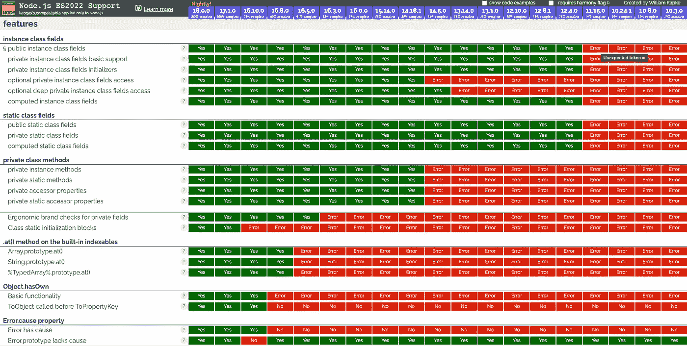
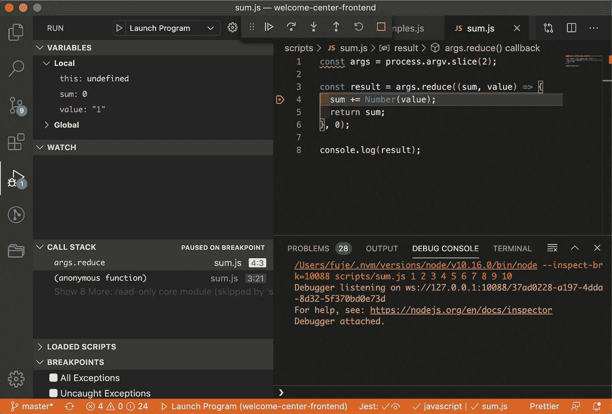

# 用 NodeJS 编写和调试 JavaScript

> 原文：<https://levelup.gitconnected.com/think-and-write-javascript-with-nodejs-88ce9e728eb8>

用 NodeJS 代替浏览器编写和调试 JavaScript 的指南。

什么是 [NodeJS](https://nodejs.dev/) ？它是一个开源的跨平台 JavaScript 运行时环境。它可以互换地称为 node.js、nodejs 或 node。NodeJS 有一个独特的优势，因为数百万为浏览器编写 JavaScript 的前端开发人员现在可以在编写客户端代码的同时编写服务器端代码，而无需学习完全不同的语言。

在为客户端编写了大量 JavaScript 代码之后，我最近一直在从事 NodeJS 中间层的工作。我想分享一些我在 NodeJS 生态系统中编写 JavaScript 的经验。这类似于为浏览器编写 JavaScript 代码，但又不完全相同。

# 1.该命令由节点启动

首先，您以不同的方式启动代码。假设您的应用程序的名称是`app.js`，现在您运行的命令是`node app.js`，而不是`npm start`。

或者，您可以向应用程序提供参数。

`node app.js system.log`

`process.argv`可以读取命令行信息:

如果你有复杂的参数，你可以考虑安装`[minimist](https://github.com/substack/minimist)`，一个参数解析器。

# 2.您可以完全控制 NodeJS 环境

如果你为浏览器编写 JavaScript，客户可能会使用不同版本的不同浏览器。但是，在 NodeJS 环境中，您可以完全控制使用哪个 NodeJS 版本。

查看此表了解 ES2015、ES2016、ES2017、ES2018、ES2019、ES2020、ES2021 或 ES2022 的特性。您将确切地知道哪个节点版本支持哪个 ECMAScript APIs。



如果你想使用 BigInt，很明显你必须使用 NodeJS 10.8.0+。

# 3.您拥有系统访问的完全控制权

在浏览器中，为了安全起见，JavaScript 是沙箱化的。但是 NodeJS 可以完全访问你的系统。它允许直接读写文件系统、无限制地访问网络和执行软件。小心电源。

以下是文件系统实用程序的一个示例:

# 4.NodeJS 使用 CommonJS 模块系统

浏览器中的 JavaScript 使用异步模块定义(AMD)，RequireJS 是最流行的实现。ES6 模块也越来越受欢迎。

NodeJS 使用 CommonJS 模块系统。实际上，这意味着导入和导出的编码不同。

# 5.NodeJS 使用全局对象

在 NodeJS 环境中，没有全局的`window`和`document`，以及浏览器提供的所有其他对象。NodeJS 中的一个全局对象是`global`。从 ES2020 开始，`globalThis`将取代`window`和`global`。

类似于`window`，你不需要给一个全局对象加上前缀`global`。

`process`是一个`global`对象，提供关于当前节点进程的信息并对其进行控制。作为一个全局变量，它总是可用于 NodeJS 应用程序，而无需使用`require()`。

# 6.您可以通过 VSCode 调试 NodeJS 的 JavaScript

在 NodeJS 环境中，没有浏览器的检查工具来调试代码。VSCode 可能是一个有用的调试工具。

我们有这个叫做`sum.js`的 JavaScript 代码:

用 NodeJS 运行它:

```
$ node sum.js 1 2 3 4 5 6 7 8 9 10
55
```

怎么才能调试呢？

在`<rootDir>/.vscode`下创建 launch.json:

在第 12 行，所有输入的数字都必须加上引号。这对于命令行执行是不需要的。

在以下代码的第 4 行设置一个断点。然后我们可以为每次迭代检查`value`和`sum`。



# 结论

JavaScript 运行在浏览器和 NodeJS 环境中。它们很相似，但有一些不同。如果您使用 JavaScript 开发客户端幻灯片代码，您也会喜欢使用 JavaScript 开发服务器端代码。

这项工作的一部分是由乔纳森马贡献。

感谢阅读。我希望这有所帮助。你可以在这里看到我的其他媒体出版物。