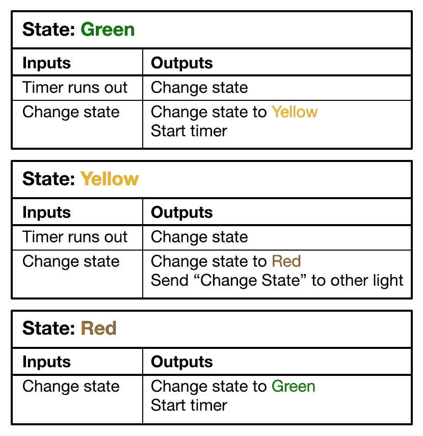
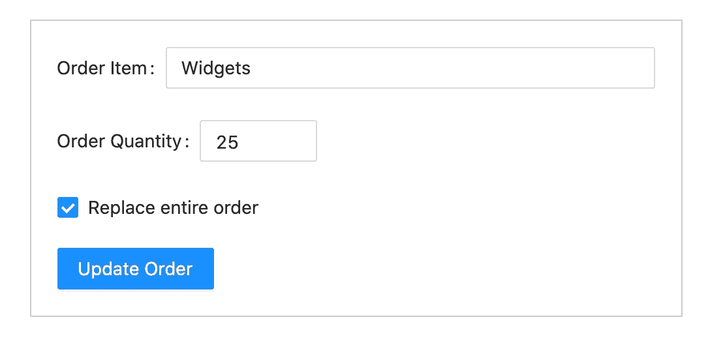
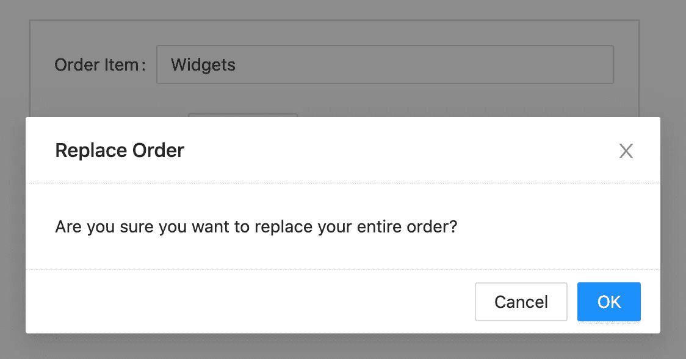
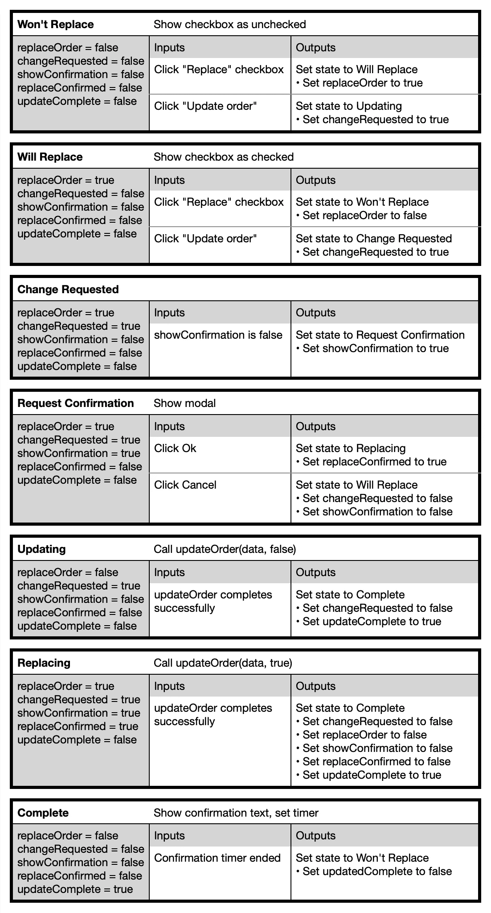

# 将 React 组件视为状态机，而不是函数

> 原文：<https://levelup.gitconnected.com/think-of-react-hooks-as-state-machines-not-functions-39cf9d086a94>

由 BlurryMe 在 [ShutterStock](https://www.shutterstock.com/image-photo/traffic-lights-green-go-one-way-1097039099) 上拍摄

当 React 组件从类转移到函数时，所有的讨论都是关于从面向对象编程过渡到函数式编程。函数式编程有两个目标:

1.  当你给一个函数提供相同的输入时，你会得到相同的结果。
2.  该函数的唯一目标是创建一个输出。它并不试图在一旁做事。(影响自身输出之外的功能被描述为产生*副作用的功能。*

如果一个函数能够满足这两个准则，则称之为*纯函数。你可以全天运行相同的输入，并且总是得到相同的输出，而不需要跟踪其他任何东西。*

功能成分刚引入反应时，是纯功能。他们只能根据自己的投入产生产出。

然后是钩子。

有了钩子，功能性组件就会左右产生副作用。您可以保存和更改状态。您可以缓存数据。你可以使用一个名为`useEffect`的钩子来创建副作用。所有这些因素对输出的影响超出了输入告诉我们的内容。功能组件现在离纯粹的功能已经很远了。

那么，如果功能组件不再遵循面向对象或函数式编程范式，还剩下什么呢？

请允许我向您介绍有限状态机的概念。

# 有限状态机:旧状态+输入=新状态

有限状态机的概念早在 1943 年由沃伦·麦卡洛克和沃尔特·皮茨在一篇神经科学论文中向世人介绍。他们试图基于这样的想法来模拟行为，即如果你有一组特定的输入，你可以根据系统的当前状态来定义一组特定的可能状态。当状态由于输入的改变而改变时，状态机经历所谓的*转换。*当状态机接收到转换消息时，它将进入有限数量的其他状态之一，这取决于该消息是什么。

用一段话来概括这一点有点太多了，所以让我们来看一个经典的现实世界的例子:交通灯。

交通灯有三种特定的状态:绿色(通行)、黄色(注意)和红色(停止)。当灯变绿时，计时器开始倒计时。当计时器超时时，它告诉灯进入下一个状态:黄色。它复位，倒计时，然后告诉灯进入下一个状态:红色。在这一点上，它还告诉另一条路上的灯进入下一个状态，从红色到绿色，并为另一条街的交通灯启动相同的循环。

我们可以看到的是，当交通灯被告知改变状态时，它是根据特定的规则这样做的。您可以为一个停止灯创建一个*事件表*，以显示正在发生的事情。

交通灯有限状态机的事件表

比方说，交通信号灯不会从绿色变成红色，或者从黄色变成绿色。在任何给定的时间点，交通灯可用的状态是有限的。一个状态唯一可以改变的时候是当它被告知要转换的时候，无论是计时器还是其他街道的灯。

# 钩子作为状态机

那么，了解有限状态机如何帮助我们更好地理解钩子呢？

如果我们看看钩子，我们会发现它们分为三类:

*   更新时触发重新渲染的钩子(`useState`，`useContext`)
*   值改变时更新缓存的钩子(`useMemo`，`useCallback`)
*   值改变时触发效果的钩子(`useEffect`，`useLayoutEffect`)

(没错，`useRef`不属于这几类，但是很奇怪的鸟。)

所有这些都接受指示它们需要执行转换的输入。你可以说 React 钩子是状态机，响应转换事件。它们不是严格意义上的有限状态机，因为它们可以作用于特定的值来产生不同的东西。但是我们可以通过定义特定的输入和产生狭义的输出来使它们有限。

# 一个真实世界的例子:确认模态

考虑一个组件，它允许用户更新订单，可以选择追加到现有订单，也可以用新信息完全替换它。如果他们选择替换它，我们希望在继续之前显示一个确认模式。

如果我们看看我们自己的组件，我们可以根据我们需要保持的不同状态来看它:

*   用户想要替换整个订单吗？
*   用户是否提交了订单更改请求？
*   确认模式是否可见？
*   如果需要，他们是否确认了替换？
*   更新完成了吗？

通过查看这些不同的状态片段，我们可以看到哪些片段应该引起哪些变化，并定义我们的组件可以处于的不同状态:

更新订单组件状态

通过查看我们的变量如何定义状态机，我们可以获得三个优势:

1.  我们将 32 种不同的可能变量组合(对或错，5 种不同的方式)简化为 7 种不同的成分状态。我们可以考虑“组件现在要做什么？”而不是“什么是真的”和“什么是假的”
2.  从这 7 种状态中，我们可以清楚地定义一种状态如何变成另一种状态。从“不会取代”我们只能去“会取代”或“更新。”从“将替换”我们只能转到“不会替换”或“请求更改”如果我们以某种方式结束了一些奇怪的变量组合，我们知道出了问题，并从那里调试。
3.  也许最重要的是，状态机让我们通过检查组件的数据来管理用户流，而不是通过跟踪功能流。处理程序专注于改变数据，而不是管理流。这使我们能够保持以数据为中心的反应模型，而不是试图恢复到一个强制性的、基于流程的模型。(注意我们如何使用`showConfirmation`作为裸值来显示我们的模态，而不是将其 setter 包装在`showModal()` / `hideModal()`函数中，这可能是保持命令式思维的一种诱人方式。)

诚然，我们需要这五个布尔变量来驱动七个状态，这一开始可能并不明显。但是，如果我们看看我们需要说明什么，需要发生什么步骤，我们就可以算出我们需要的状态，跟踪状态变化所需的变量，以及将我们从一个状态转移到另一个状态的触发器。

所以，我们有我们的状态，和驱动它们的变量。现在怎么办？

输入`useEffect`。

# useEffect 作为有限状态机转换管理器

`useEffect`可以很容易地用于驱动有限状态机中的转换，这要感谢依赖数组。每当数组中的一个状态改变时，就会触发效果，让我们更新变量来定义一个新的状态。

如果我们将上面的事件表转换成事件处理程序和`useEffect`挂钩，我们会得到如下结果:

这有点冗长，我没有显示与实际数据相关的依赖关系，也没有为函数创建回调，但是您可以看到每个处理程序或钩子是如何致力于管理状态之间的转换的。当用户点按复选框或按钮时，当效果的依赖关系改变时，或者当服务器调用完成时，会发生过渡。

没有尝试直接将一个处理程序与另一个处理程序、一个状态与另一个状态、一个转换与另一个转换联系起来。每个代码块都致力于改变状态，但它并不关心状态转换何时发生。

通过将更改与状态联系起来，当前数据如何影响用户的行为变得更加清晰，而不是试图通过模仿命令式编程流程来定义行为。这有助于我们保持 React 鼓励的“跟随数据”的心态。

一旦我们了解了各个状态是如何转换的，我们就可以将一些代码组合起来，使其更加简洁:

我不认为这很简单，尤其是当我有命令式编程背景时。但是，通过考虑应用程序状态而不是时间点，您可以创建各种各样的流，否则在纯粹考虑功能时，这些流可能会变得更加杂乱。

完整的、功能齐全的示例可以在[https://r4dll.csb.app/](https://r4dll.csb.app/)找到。