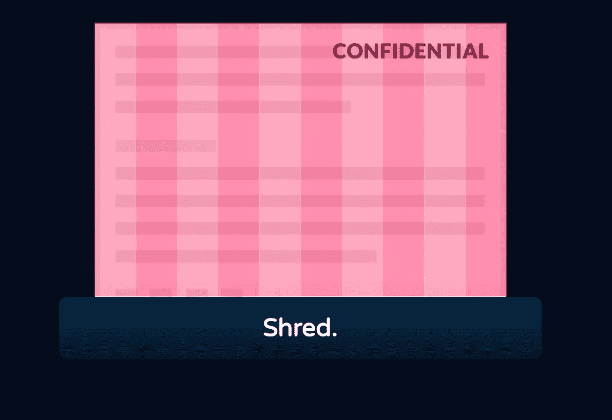

# 以为自己懂 CSS？除非你创建了一个 CSS 粉碎机

> 原文：<https://levelup.gitconnected.com/think-you-know-css-not-until-you-create-a-css-shredder-3cbf50487c9d>

大约 7 年前，我写了一篇关于如何只用 CSS 创建碎纸机效果的文章。从那时起，我认为有一些事情可以做得更好一点，所以我决定再试一次，改进我以前做的事情，并写出如何实现这种效果。

不是那种碎纸机！

这个技巧只需要一点 javascript，以及大量利用 clip-path()属性。Clip 在 CSS 中不太受欢迎，但是你可以用它做一些非常酷的 3D 动画。

让我们从一些简单的 HTML 开始

第二招是用位置:绝对。“碎纸”中的所有碎片都是完全一样的。我们将**复制**主 div，并将它们完全放置在彼此之上。因为“碎纸”将是相对的，它不会出现好像有多个 div，而是只有一个。

**下一步是关键的**——我们迭代。内容分割和复制它 9 次，每次我们剪辑一部分，所以我们最终与'切片'的纸。此图像描述了我们想要实现的目标，我们的原始 div 的切片相互重叠放置:

我们想如何切纸

这就是我们在 Javascript 中的做法。这段代码只做两件事:

*   首先，它将复制主要的。内容 div 直到我们在 **repeatNum 中定义的次数。**这是使用 createElement 完成的。在这一阶段，我们还将以编程方式添加 clip-path() CSS，因此我们不必重复键入它。
*   其次，我们将向。shred-me 按钮，这样当它被点击时，我们会在 main 中添加一个名为' **animate** 的类。碎纸部。

最难做好的部分是动画。我们有一些 CSS 动画，它们都是在“animate”类被添加到。碎纸部。我们主要有 5 个动画:

*   **当碎纸机碎纸时晃动的动画**
*   动画**移除了。内容 div 缓慢**。当纸张通过碎纸机时。内容 div 将覆盖顶部，并消失以显示碎纸。我们有一点缓冲，因为碎纸机掩盖了过渡，但我们需要随着运动的下降及时揭示这一点
*   **旋转单张纸的动画**。我们有两个——一个用于一种方式的动画，另一个用于另一种方式
*   最后**动画将纸片向下移动**。

就这样，现在你有一个 CSS 碎纸机来粉碎你所有的重要文件。

使用 clip-path()，有如此多的可能性，尤其是现在的普通计算机比 7 年前我最初写这篇文章时要强大得多。虽然 GPU 处理 three.js ( [，我在另一个教程](https://medium.com/javascript-in-plain-english/making-an-animated-html5-canvas-gradient-effect-62e7f84d7c2f)中介绍)要快得多，但 clip-path()非常适合轻松进入网站的 3D 动画。

## 内容链接

*   [Github 回购](https://github.com/smpnjn/css-shredder)
*   [Codepen 链接](https://codepen.io/smpnjn/pen/RwGWByY)