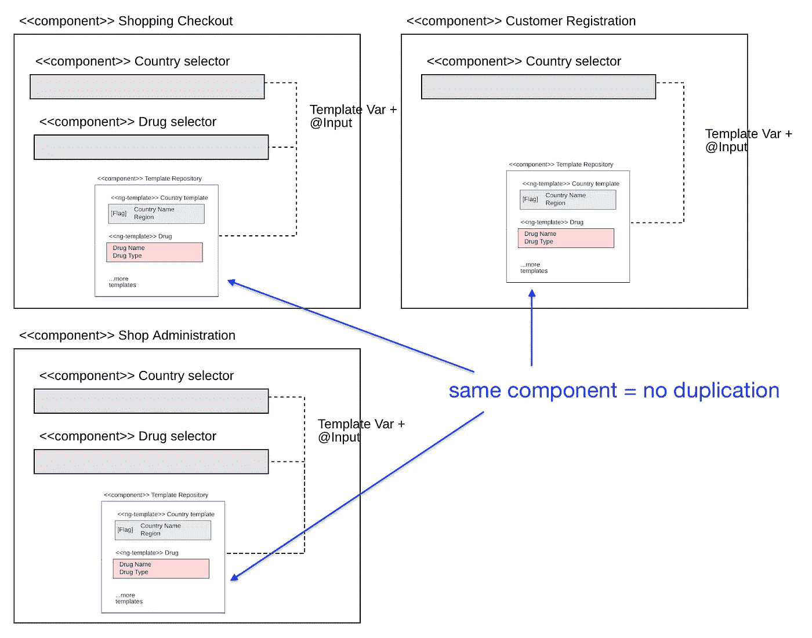

# 这种角度技术将显著降低大型项目中的代码重复

> 原文：<https://levelup.gitconnected.com/this-angular-technique-will-significantly-lower-code-duplication-in-big-projects-28fd62c3eadd>

## 告别大型项目中 ng 模板的代码重复和性能问题

图片由来自 [Pexels](https://www.pexels.com/cs-cz/foto/dovolena-voda-modra-hotel-189296/?utm_content=attributionCopyText&utm_medium=referral&utm_source=pexels) 的 [Donald Tong](https://www.pexels.com/cs-cz/@donaldtong94?utm_content=attributionCopyText&utm_medium=referral&utm_source=pexels) 提供

# 🏢大型应用和角度

Angular 的生态系统是一致的，并且符合其*的面向对象的观点*，它肯定是一个开发长寿命大规模企业应用程序的伟大框架。然而，过了一段时间，当每个应用程序增长时，几个不太被提及的问题出现了，最常见的是*代码重复*和*模块结构的不适当粒度*。在本文中，我将描述我们在 Angular 项目中遇到的这样一个问题，并提出一个简单而优雅的解决方案。

# ♨️的问题

我们的应用程序有几个所谓的*不可知组件*——具有来自外部的可定制 HTML 部件的组件——即下拉菜单，它允许我们将 ng-template 传递给它的输入，并以这种方式定制呈现。从长远来看，不可知组件确实是减少代码重复和提高组件灵活性的好方法。

不可知的组件及其用例

在我们的项目规模达到大约 200，000 行代码后，我们有几次对话，我们需要内容完全相同的 *ng 模板，在使用它们的每个父组件中复制。*

在评估了这些代码副本后，他们有几个共同的特征:

*   每个 ng 模板总是绑定到*呈现一个特定类型的对象*(例如，它呈现一个国家类型的实体)，
*   每个 ng-template 在一个有限的范围内被复制*——例如，在一个懒惰模块中，*
*   在我们的组件中使用 ng-template 会导致我们的应用程序出现严重的*减速*(有时)。

让我们假设我们正在建立一个简单的角药店。在下图中，有三个组件可以想象成屏幕。这些屏幕包含用户应该使用下拉组件(灰色框)选择国家和/或药品的表单。红框是用于呈现下拉列表中药品实体的 ng 模板，蓝框是用于呈现下拉列表中国家实体的 ng 模板。显而易见，这种使用 ng 模板定制组件的方法在代码复制方面并不是最佳的。

ng-模板复制图解

# 💡我的解决方案

作为一名软件工程师，我喜欢阅读和思考编程模式，所以我决定自己创建一个。

我的主要灵感来源是著名的永恒书籍*中的 Flyweight 模式:设计模式:可重用的面向对象软件的元素*，如果你还没有这样做的话，我推荐你去读一读。Flyweight 模式用于*性能密集型/内存密集型对象在其他几个使用它们的对象之间共享的情况*。

轻量级模式— UML (Gamma 等人，1995 年，第 198 页)

轻量级模式本质上是这样工作的:

> 一个客户端调用 FlyweightFactory 来获取一个 ConcreteFlyweight(所有的 concrete flyweight 共享相同的一组公共方法，但是它们的状态不同)。FlyweightFactory 决定是构建一个新的 ConcreteFlyweight 还是重用一个现有的 ConcreteFlyweight，以便节省系统资源(CPU/RAM)。在这两种情况下，客户机都获得了一个 ConcreteFlyweight 的实例，并根据需要进一步使用它。

回到角度。让我们将用例映射到 Flyweight 模式:

*   *客户端*将是我们的业务组件，
*   *具体的 Flyweight* 将是一个名为*模板库*的组件，它将扩展*抽象模板库(映射到 Flyweight)* 并包含我们想要共享的 ng 模板。
*   *Flyweight Factory* 将是一个名为*模板池*的服务，包含*模板库*，它将提供业务组件所需的模板。
*   业务组件将使用一些模板，通过@Inputs 将它们传递给其子组件。

模板池模式— UML

由于已经存在一些术语，例如*连接池*和*线程池*，它们做的事情非常相似，但是在不同的上下文中，我决定将我的小角度编程模式 ***模板池模式*** 。

它在业务组件中的用法非常简单:

模板池使用—控制器

模板池用途— HTML

现在让我们*将*缩小一点，看看这个解决方案的全貌:

使用模板池和模板库可以有效地消除 ng 模板复制

利用模板池模式的架构优点

## 更简单的选择

顺便说一下，我还考虑过使用包含所有模板的子组件，然后使用模板变量(#templatePool)将模板传递给下拉输入。

简化的模板池—演示

下图描绘了该解决方案的总体情况:

减少 ng 模板重复的 ViewChild 方法

如您所见，这是一个比基于服务的模板池简单得多的解决方案。然而，这种方法有几个缺点，即性能问题——当您将一个新的充满模板的子组件放入消费者组件时，该子组件*将有自己的生命周期* —这意味着这不仅会给模板带来*的一点重复*(当将该组件包含到消费者组件模板中时),而且还会降低应用程序的性能。

此外，当构建*数据驱动解决方案*时，如果您希望将 ng 模板传递给数据驱动组件的属性，这种基于 TemplateRef 的解决方案被证明是相当笨拙的*，因为它需要在控制器中创建一个 ViewChild 属性，并在引用模板库的某个组件中初始化这些数据驱动解决方案。*

# 🔌使用

这是我的解决方案的一个片段。也可在我的 [GitHub](https://github.com/radekbusa/ng-template-pools-demo) 上获得。

## 1.创建模板存储库

首先，您的定制模板存储库应该扩展*abstracttemplatereportory*。

对于编写存储库的代码，有几个重要的注意事项:

*   储存库应该是*无状态的*(这意味着除了 ViewChild TemplateRefs 之外，控制器成员变量中不应该有任何东西)因为*它与变更检测*断开连接，
*   储存库*的 HTML 模板应该只包含带有模板引用变量*的 ng 模板，
*   储存库的控制器内部的 TemplateRefs，由 ViewChild decorator 注释，应该以“Template”/“Template”为前缀/后缀。该约定被强制执行以确保良好的命名约定(没有上述前缀/后缀的 TemplateRefs 将*不能*在消费者组件中访问)。

模板存储库— HTML

模板存储库—控制器

## 2.为注入设置模板池

很简单，只要把它包含到你选择的模块中。也有可能为每个惰性模块/每个注入器声明一个模板存储库。对于这样的用例，我实现了 forRoot/forChild 模块工厂模式。

将 TemplatePoolModule 导入您的应用程序

如果您对 Angular 中的模块化结构感兴趣，即核心模块和共享模块之间的*微妙但重要的细微差别*，请查看这篇文章:

 [## “我该把它放在哪里？”-核心模块与角度共享模块

### 核心模块与共享模块的角度，专业的提示和技巧，加上一个经验法则，以确定哪个模块放置您的…

levelup.gitconnected.com](/where-shall-i-put-that-core-vs-shared-module-in-angular-5fdad16fcecc) 

## 3.在组件中使用模板池

API 和模板池的初始化是完全同步的过程——这很好，因为它们不会给开发过程带来不必要的摩擦。

模板池用途— HTML

模板池使用—控制器

如果需要，您甚至可以将 ng 模板传递给 Angular 服务中的模型驱动组件:

模板池也非常适合配置模型驱动的组件

就是这样！*享受您共享的 ng 模板，无需性能开销。*

# 👍优势

*   *降低 ng 模板的复制*，
*   *集中式*用于商业实体渲染的不可知角度组件的真实来源，
*   *没有性能开销* —模板存储库不监听来自传统视图的变更检测调用。

# 👀限制

*   限于*每个注射器一个模板库*。这个*大概就是*的意思，在根应用模块中有一个模板存储库，每个惰性特性模块有一个模板存储库(除非使用高级的 DI 技术，比如组件提供的服务和令牌)，
*   必须仔细执行代码审查，尤其是在修改模板库以保持代码整洁的情况下。

# 📦结论

您已经看到了我如何使用一个简单而强大的解决方案来解决大型企业应用程序的典型问题。它极大地简化了我们的应用程序代码，让我的队友们在实现他们常用的东西时更加开心。

如果你喜欢这个解决方案，在你自己的项目中采用了它，对它做了一些有趣的改进，或者不喜欢它的一些技术方面，请在评论中告诉我！

# 👓值得一看的文章

 [## 正确处理角度应用中的负载指示器

### 一个优雅的，没有麻烦的方式来摆脱无意义的技术管道在您的业务角组件。

levelup.gitconnected.com](/handling-loading-indicators-in-angular-applications-the-right-way-11ff8b8896ba)  [## 像专业人士一样自动退订角度组件

### 快速处理 unsubscribe()调用的 5 个技巧

levelup.gitconnected.com](/auto-unsubscribing-in-angular-components-like-a-pro-742220b01d0c) 

# 🔥实例+下载

该解决方案的 StackBlitz 演示可作为下面的嵌入。如果你看起来有问题，这里有链接: [StackBlitz](https://stackblitz.com/edit/ng-template-pools-demo?file=src%2Fapp%2Fapp.component.html) 。或者，你可能想直接查看 GitHub 上的代码。

# 📚参考

伽马，埃里希；理查德·赫尔姆；约翰逊，拉尔夫和 Vlissides，约翰(1995 年)。设计模式:可重用的面向对象软件的元素。艾迪森-卫斯理。

# 分级编码

感谢您成为我们社区的一员！[订阅我们的 YouTube 频道](https://www.youtube.com/channel/UC3v9kBR_ab4UHXXdknz8Fbg?sub_confirmation=1)或者加入 [**Skilled.dev 编码面试课程**](https://skilled.dev/) 。

 [## 编写面试问题+获得开发工作

### 掌握编码面试的过程

技术开发](https://skilled.dev)