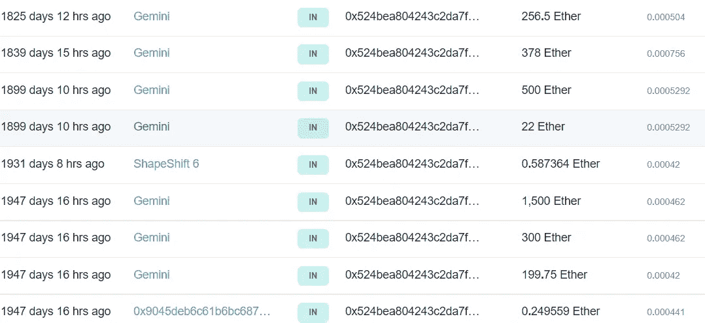

# 这个密码朋克 NFT 刚刚以 3,300 ETH 的价格售出——让卖家获利 430 万美元

> 原文：<https://levelup.gitconnected.com/this-crypto-punk-nft-just-sold-for-3-300-eth-making-the-seller-4-3million-profit-e661bca37d31>

这就是为什么它可以卖更多的原因。

来源— [密码朋克机器人](https://twitter.com/cryptopunksbot/status/1575238937081221128?s=20&t=vM57ejIVBzobxMvkRyxinA)

如果你第一次看到这种像素化艺术的图像，并想知道如何或为什么任何头脑正常的人会买它，我会试着为你解释清楚。

在 NFT，密码朋克是圣杯。

他们经常被认为是开创了 2021 年 often】热潮以及早期项目，如[无聊猿游艇俱乐部](https://en.wikipedia.org/wiki/Bored_Ape_Yacht_Club)。

伦敦朋克场景激发了两人团队在 2017 年启动实验项目。

10，000 个密码朋克集合中没有两个字符是相同的；

*   **6039 人——男性**
*   **3840 名女性**

创始人通过计算机代码生成艺术算法，使每一个 NFT 独一无二。

当该系列发布时，他们可以自由地为任何拥有以太坊钱包的人索赔。

某些特征和类型的人物比其他人更罕见。与其他项目相比，它们的功能并不复杂。

这 10，000 个 NFT 中的大部分是人类。

## 还有三个独特罕见的特质:

> 僵尸朋克(88-Supply)
> 
> 猿朋克(24-供应)
> 
> 外星朋克(9-Supply)

在此之上，还有 [87 个附加属性](https://en.wikipedia.org/wiki/CryptoPunks#cite_note-13)。

## 昨天的销售是一个猿朋克；

> 在收集的 10，000 只 NFT 中，只有 24 只猿。
> 
> 作为对稀有性的额外发挥，这个猿朋克以帽衫为特色，这是 87 个属性中最令人向往的特征之一。

> 我写了一整篇关于人类为什么收集东西的文章 Want 收藏家不想听到的令人不安的真相。

据[以太扫描](https://etherscan.io/address/0x524bea804243c2da7f114bbd07fc7131bb78d7fc)报道，购买密码朋克的钱包已经休眠了五年。

在加密朋克社区中有一种半开玩笑的猜测，购买 NFT 的人是否意识到以太坊与五年前相比的当前价格。

这是他们在以太扫描上的钱包。

来源— [以太扫描](https://etherscan.io/address/0x524bea804243c2da7f114bbd07fc7131bb78d7fc)

尽管卖家只花了**71，403** 美元就买下了 NFT，赚了一大笔钱，但他们之前拒绝了多个报价。其中之一是这个**1706 万美元**的请求，最终在四个月后被撤回，没有被接受。

来源——[隐朋克。App](https://cryptopunks.app/)

伪匿名卖家 [Seedphrase](https://twitter.com/seedphrase) 最终接受了**440 万美元、**1260 万美元的报价，仅比两个月前下降了。

这是接受的提议；

来源— [密码朋克。应用程序](https://cryptopunks.app/)

Seedphrase 是一名兼职 DJ，拥有 20 个其他的[密码朋克](https://opensea.io/DANNYSECURE?tab=collected&search[sortBy]=LAST_SALE_PRICE&search[query]=cryptopunk)，包括最稀有和排名第一的密码朋克。

你可以在这里查看他的钱包。

龅牙隐朋克在幼虫实验室的网站上以令人垂涎的 2 亿美元挂牌出售。

它被广泛认为是 NFTs 的蒙娜丽莎，至今仍在他手中；

来源— [Opensea](https://opensea.io/assets/ethereum/0xb47e3cd837ddf8e4c57f05d70ab865de6e193bbb/8348)

对你的日常生活来说，这些数字是疯狂的。

但是，人们相信 NFT 是将加密货币商业化并在未来 50 年甚至更长时间内承载文明的技术。

每个企业都会发布一个 NFT 项目，就像他们发布一个脸书页面一样。

我们将继续利用 NFTs 的智能合约功能，进入一个更加数字化的沉浸式世界。

加密朋克开启了 NFT 革命，因此高端收藏家们寄希望于这些“精美艺术品”，它们是可以被视为数字文艺复兴时期的艺术品。

如果这仍然毫无意义，但是你想开始学习 NFTs，我在这里写了一整篇文章— [这里是你如何向你的祖母解释 NFTs。](/heres-how-you-explain-nfts-to-your-grandmother-57fa3b54cbe2)

> 如果你想在 Web3 上阅读更多我的观点，可以考虑成为会员。你的会员费直接支持你读的作家。如果你用我的链接注册，我会赚一小笔佣金。

本文仅供参考；不应将其视为财务、税务或法律建议。在做出任何重大财务决定之前，请咨询财务专家。