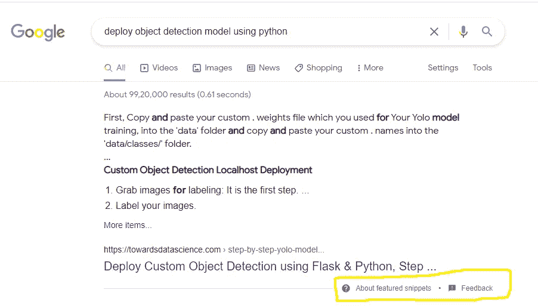

# 这个数据科学项目让我成为了真正的自由客户

> 原文：<https://levelup.gitconnected.com/this-data-science-project-made-me-real-freelance-clients-71f4c7298f40>

## 数据科学自由职业者的时候到了

塞巴斯蒂安·赫尔曼在 [Unsplash](https://unsplash.com?utm_source=medium&utm_medium=referral) 上的照片

我是一名数据科学家，也是一名作家，喜欢尝试并与更广泛的受众分享实用的数据科学方法。回到 2020 年 9 月，我做了一个自我项目，并在我的一篇文章中分享了相同的项目想法及其最终结果。

我在项目中使用的技术有点新，互联网上只有一些可用的资源。所以，这篇文章上了谷歌趋势榜。而且，现在[的同一篇文章](https://www.google.com/search?q=deploy+object+detection+model+using+python)出现在了谷歌的顶级精选和推荐部分。

根据我的观察，在过去的三个月里，对数据科学家的需求急剧增加。许多技术爱好者现在正试图将他们的职业生涯转向数据科学领域。

大量技术爱好者试图将职业生涯转向数据科学领域，这是一个很大的原因。根据来自今日商业的消息，到 2022 年，大型 IT 公司将裁员 300 万人。裁员的原因是自动化。

大多数任务单调的工作现在将使用 RPA 工具来完成。RPA 工具帮助我们根据特定条件安排作业运行顺序。

总的来说，我们可以说，由于对数据科学人才的高需求和 IT 部门的裁员，使得更多的人学习数据科学。

这最终导致我的文章获得了更多的视图，最终，这些视图转化为实际的客户。

# 该项目

[项目理念](https://towardsdatascience.com/step-by-step-yolo-model-deployment-in-localhost-using-python-8537e93a1784)是使用 python 和 flask 部署对象检测模型。在这里，用户将上传一张带有某个对象的图片。

该模型将首先检测图像中的对象，基于对象检测，用户可以对检测到的图像应用不同的计算机视觉技术。

此外，用户还可以上传任何房屋的视频，该模型将返回一个 excel 表或 JSON 文件，其中包含用户可以用于决策的对象数量。

[这个项目使用](https://towardsdatascience.com/step-by-step-yolo-model-deployment-in-localhost-using-python-8537e93a1784)YOLO(你只看一次)来探测物体。在检测到的项目上，它使用其他计算机视觉技术，如 CNN，进行其他与图像相关的决策。

# 为什么对这个项目有很高的需求

大多数行业都需要计算机视觉，这种需求有一个很大的原因。今天，大多数真实世界的用例要么使用计算机视觉，要么使用自然语言处理。

自然语言处理主要用于聊天机器人、文本生成、文本摘要、假新闻检测以及其他与文本处理相关的领域。但是，当我们谈论自由职业客户时，大多数客户都需要他们正在进行的项目或应用程序创意方面的帮助。

大多数可用的 Android 或 IOS 应用程序都利用了计算机视觉工具。你很难找到任何提供文本摘要功能的应用，但是你可以找到大量使用计算机视觉的应用。

一些应用程序可能会利用 GANs 制作您童年的图像或将任何图像转换为实时视频。

我从事的对象检测项目可以在任何地方使用。可以制作一个车牌检测系统，并根据检测到的区域；您可以应用 [pytesseract](https://pypi.org/project/pytesseract/) 算法来读取车牌。此外，您可以将您的模型连接到任何 wifi 或有线闭路电视摄像机，以实时监控机动车辆。

我正在研究的另一个用例——检测任何地方的任何异常。这个项目可以帮助更广泛的受众摆脱频繁的入店行窃问题。

# 我如何获得更多的自由职业者

我已经在一个以数据科学相关内容为特色的出版物上发表了我的文章。我在写作中使用的方法是新的——市场上只有少数教程。

而且，大部分教程都涵盖了实现部分。没有人介绍在现实世界中使用这个项目的端到端方法。

作者截图

最后，感谢谷歌把我的文章放在了谷歌结果页面的顶部，最终让我有了更多的读者。

# 摘要

在文章中，我们讨论了为什么在数据科学领域存在大量炒作，以及为什么我们应该开始关注数据科学的实践方面。数据科学工作的大量涌现和对数据科学的热情最终会导致更多的自由职业任务。

我们需要找到一个更好的地方，让我们的想法到达更广泛的受众，以获得更多的客户。我们还讨论了计算机视觉领域的奇妙范围及其用例。

希望你喜欢这篇文章。更多精彩文章敬请期待！

谢谢你的阅读！

觉得这个故事有趣？如果你想向我咨询私人问题，请通过 Linkedin 联系我。如果你想直接通过邮件获得更多关于数据科学和技术的令人兴奋的文章，那么这里有我的免费简讯: [Pranjal 的简讯](https://mailchi.mp/4d33914bb328/pranjals-newsletter)。