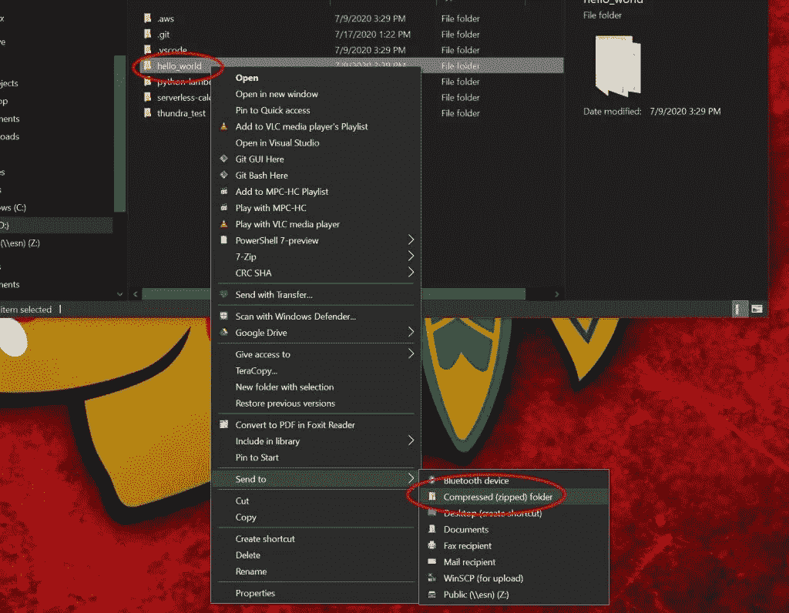
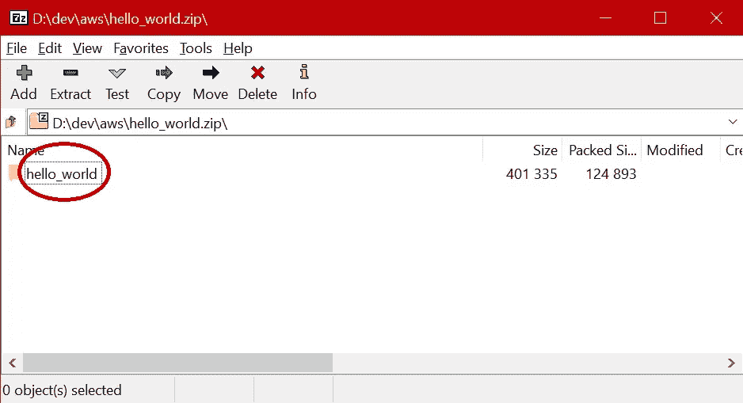
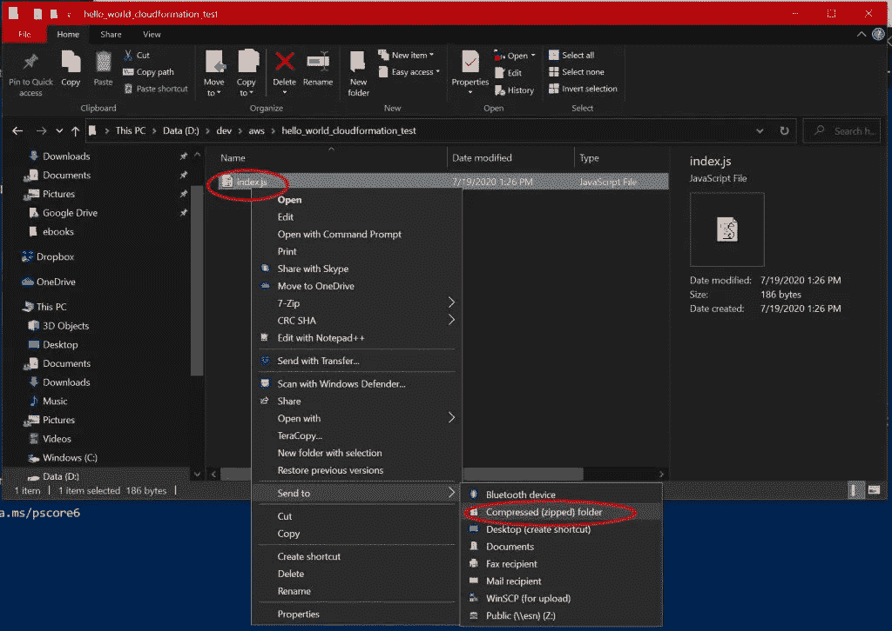
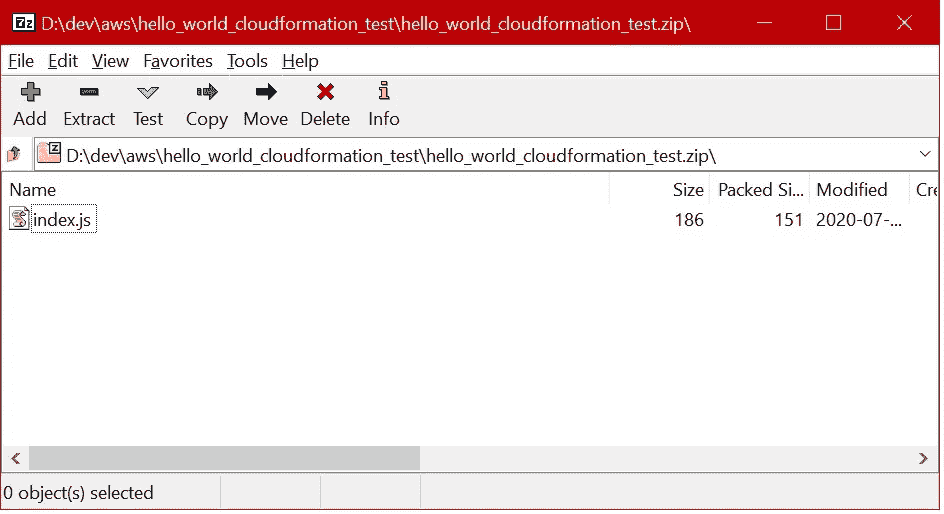

# 这就是如何使用 CloudFormation 部署 AWS Lambda 函数

> 原文：<https://levelup.gitconnected.com/this-is-how-to-deploy-your-aws-lambda-functions-with-cloudformation-a21e7bbdb052>

## 来自 AWS 专家的提示和技巧

由 IOD 专家[马特·比洛克](https://iamondemand.com/blog/author/mattbillock/)

AWS Lambda 是开发无服务器应用程序和按需工作流的强大工具。然而，这种能力在灵活性和易于部署方面是有代价的，因为 AWS Lambda 推荐的手动部署过程可能容易出错并且难以扩展。

CloudFormation 革新了这一过程，[用可靠且可重复的基于模板的部署方案取代了复制的 zip 文件](https://aws.amazon.com/blogs/infrastructure-and-automation/deploying-aws-lambda-functions-using-aws-cloudformation-the-portable-way/)。有了 CloudFormation，您的 Lambda 函数将更易于维护，更易于开发人员理解，并且随着应用程序的增长更易于扩展。

# 审查 AWS Lambda 部署

AWS Lambda 函数部署基于文件处理——也就是说，将代码压缩到归档文件中，然后将文件上传到 AWS。其核心是，所有 AWS Lambda 函数都遵循这种模式:

**创建一个 zip 文件。上传到 S3 桶。将功能设置为激活。**

无论您是手动部署代码，将部署外包给工具，还是遵循任何介于两者之间的协议，都会发生这种情况。

一旦文件被接收，AWS 将你的代码解压到适当的文件夹结构中，使得它可以在 Lambda 容器启动时运行。这种方法是我们讨论 Lambda 部署时要记住的一个关键点，也暴露了手动部署过程中的第一个漏洞——AWS Lambda 函数有一个您需要遵循的未声明的结构。

简单地说，您不希望右键单击一个文件并创建一个归档；否则，当您试图运行部署的 Lambda 代码时，会遇到错误。以下截图说明了这个问题:

如果您检查由上述方法生成的 zip 文件，您会发现它们的根级别由您的代码文件夹组成:

这带来的问题与 AWS Lambda 如何部署代码特别相关，也就是说，它只是将提供的代码存档解压缩到一个可执行文件夹，然后将调用请求路由到在该文件夹中找到的应用程序代码。当您在根级别提供一个带有文件夹的 zip 存档，而不是应用程序代码本身时，AWS Lambda 不知道该做什么并抛出错误。因此，请确保压缩文件夹内容本身，如下所示:

当您这样做时，您的代码被放在 zip 文件夹的根级别。这允许 AWS Lambda 轻松部署您发布的代码:

每个 Lambda 函数都是独立存在的，这意味着您不能轻易地在 Lambda 函数之间共享资源——共享库、源数据文件和所有其他需要包含在您上传的 zip 存档中的信息源。这种额外的脆弱性和复制可以用λ层来解决。Lambda 层为您的函数提供了一个公共基础，让您可以轻松地部署共享库，而无需在仅使用基础容器时进行复制。

虽然您可以建立一个可脚本化和可维护的部署过程，但是一旦项目规模增长，上述步骤的脆弱性将很快变得明显。AWS CloudFormation 通过将基础设施归类为代码来解决这个非常复杂的问题；这使得您的开发人员和开发运营团队可以通过简单的配置文件修改来创建、部署和拆除资源。这些配置文件是人类可读的，并且可以在任何文本配置、编程语言或用户界面工具中进行修改。

此外，CloudFormation 允许您集中部署基础设施，为您的无服务器功能创建一个可重复和可预测的构建过程。

# 通过云形成改进 Lambda 部署

从容易出错的 Lambda 手动部署过程转移到超级强大的 CloudFormation 模型，是一个将您的功能基础设施需求转化为适当的 CloudFormation 模板语言的简单过程。CloudFormation 允许您将应用程序的不同资源部署整合到一小组配置文件中，允许您的基础设施与应用程序代码一起维护。

总而言之，CloudFormation 使得部署 AWS Lambda 函数变得极其简单。

从创建定义资源的模板文件开始。这将是你的代码的工作文件夹。接下来，在适当的文件中为您想要的 Lambda 运行时创建您的函数。最后，创建一个 S3 桶，并将其地址提供给 Lambda 函数；一旦你做到了这一点，你可以简单地通过复制你的 zip 文件到正确的 S3 桶来部署函数。

CloudFormation 将是一个工具，它将您的功能所需的所有资源联系在一起。在 CloudFormation 中，您将定义函数、函数的 IAM 角色、函数在 S3 的代码库以及执行策略，以确保您的函数可以在 AWS 生态系统中做它需要做的一切。CloudFormation 进一步将这些资源收集在一起，将所有的基础设施定义集中在一个模板文件中，与您的代码放在一起。

# 运行示例部署

在本节中，我们将快速浏览一个为 AWS Lambda 功能创建云信息驱动的部署流程的示例。从下面的节点开始。使用 nodejs12.x 运行时创建简单 Lambda 函数的 JS 代码:

`exports.handler = async (event) => {`

`// TODO implement`

`const response = {`

`statusCode: 200,`

`body: JSON.stringify('CloudFormation deployment`

`successful!'),`

`};`

`return response;`

`};`

这段代码非常简单，允许您突出显示部署过程本身。一旦您创建了功能代码，您就可以开始创建允许您使用 CloudFormation 部署和运行代码的所有项目。

首先，在函数所在的目录下创建一个新文件。这些说明假设您的文件将被命名为 template.yml。一旦您创建了空模板文件，就开始包含运行您的函数所需的资源。首先，您可以定义一个 S3 存储桶来存放您的功能代码:

`AWSTemplateFormatVersion: '2010-09-09'`

`Description: 'Example Lambda zip copy'`

`Resources:`

`LambdaZipsBucket:`

`Type: AWS::S3::Bucket`

**然后，创建函数所需的资源，包括 IAM 角色和函数定义本身:**

`MyFunctionRole:`

`Type: AWS::IAM::Role`

`Properties:`

`AssumeRolePolicyDocument:`

`Version: '2012-10-17'`

`Statement:`

`- Effect: Allow`

`Principal:`

`Service: lambda.amazonaws.com`

`Action: sts:AssumeRole`

`ManagedPolicyArns:`

`-`

`arn:aws:iam::aws:policy/service role/AWSLambdaBasicExecutionRole`

`MyFunction:`

`DependsOn: CopyZips`

`Type: AWS::Lambda::Function`

`Properties:`

`Description: Example`

`Handler: index.handler`

`Runtime: nodejs12.x`

`Role: !GetAtt 'MyFunctionRole.Arn'`

`Timeout: 300`

`Code:`

`S3Bucket: !Ref 'LambdaZipsBucket'`

`S3Key: !Sub '${QSS3KeyPrefix}/lambda.zi`

一旦创建了模板文件并对其进行了修改以反映上面的资源，您就可以通过一个简单的调用从命令行部署您的功能:

`aws cloudformation deploy --template-file template.yml`

`--stack-name your-stack-name-here`

这个基本配置允许您在将函数上传到函数定义中指定的 S3 存储桶后进行部署。现在，您可以在这个基本的部署功能集的基础上，自动化您的堆栈创建的任何方面。对于一个全功能的部署示例，您可以从 AWS 克隆优秀的[快速启动 repo。](https://github.com/aws-quickstart/quickstart-examples/tree/master/patterns/LambdaZips)

# 一些提示和附加资源

当你在 Lambda 开发管道中使用 CloudFormation 时，你肯定会遇到令人头疼的问题。这里有一些小技巧，可以帮助你避免不必要的沮丧，因为这篇 [AWS 博客文章的主题是](https://aws.amazon.com/blogs/infrastructure-and-automation/deploying-aws-lambda-functions-using-aws-cloudformation-the-portable-way/):

> 您知道可以部署内嵌 Lambda 代码吗？简单地包括你的(小的)Lambda 函数代码，作为附加在 zipfile 键后面的行。

如果您只需要将您的功能发布到 AWS 区域的一个小的子集，那么您可以提供一个区域存储桶的列表来填充您的代码；定义源 Lambda zip 文件时，只需展开资源列表。

通过简单的名称格式策略和一些自定义代码，您可以创建一个系统，允许您上传一次 S3 文件，然后将其发布到任何支持 AWS Lambda 的 AWS 地区。

除了上面的 AWS 博客帖子，我的 IOD 专家同事也有一些关于实现无服务器部署 zen 的最佳方法的想法:

**Mikhail Shilkov 写了一篇精彩的总结文章，介绍了为无服务器应用选择最佳部署工具的途径******。**他对主题的深入探究是指导您决策过程的强大资源。**

****斯洛博丹·斯托亚诺维奇详细概述了他简化 Lambda 部署的途径******；**这是一个将 Lambda 部署转换成更易于维护的模式的很好的案例研究。****

****同样，AWS 提供的优秀 Quickstart repo 也提供了一个有用的云信息驱动的工具，用于从一个桶跨多个区域部署 AWS Lambda 代码。****

# ****摘要****

****AWS Lambda 部署非常脆弱，开箱即用时容易出错，需要您费力地通过大量用户界面和对话流来创建您的函数、关联的执行角色以及托管您的可部署代码所需的资源。****

****使用 CloudFormation，您可以将所有这些手动配置转换成一个模板文件，该文件能够描述整个应用程序堆栈。CloudFormation 用一个可重复、可维护的过程取代了复杂且容易出错的手动部署 Lambda 函数的过程，该过程可以与您的代码一起维护。****

*****这位专家定期为 IOD 博客写稿，这是一份面向开发者的科技内容周刊。* [*退房更像这样*](https://iamondemand.com/blog/) *。*****