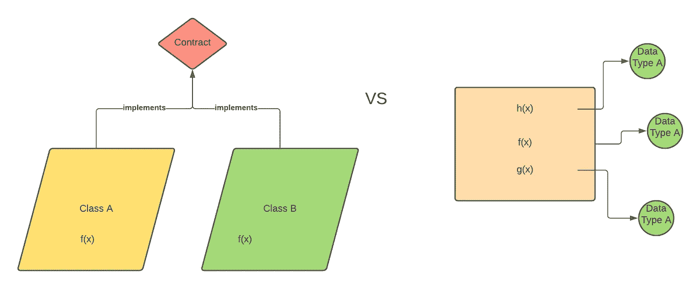

# 这是用函数式编程和面向对象编程编写应用程序的主要区别

> 原文：<https://levelup.gitconnected.com/this-is-the-main-difference-of-writing-applications-in-functional-programming-vs-3ee9d9de7ea3>

## 它不是不变性或继承性，而是更多地取决于如何构建您的应用程序

由作者提供

代数数据类型有其优点和缺点。它使您能够以类型安全的方式编写应用程序——当您进行模式匹配时，它将为您穷尽所有的数据类型。但是，如果数据类型不断变化，使用 ADT 也有一个缺点。

我将开门见山地告诉你不同之处——当你用函数式编程范式编写应用程序时，一切都是按操作分组的。当我们以面向对象的方式编写程序时，一切都是基于对象的一组。

对我来说，这是一个巨大的发现！这解释了为什么 ADT 有时会很痛苦。

我将说明这是什么意思——这可以让你大致了解我认为用函数式编程和面向对象编程编写程序的真正区别。

让我们把它变成树数据类型。在我们第一次尝试创建树时，它会是这样的:

然后，我们希望有一个计算树的高度的函数。让我们在这里做吧:

然后，我们希望有一个计算所有分支总和的函数:

从上面的两个函数中，我们注意到，一旦我们创建了 ADT，我们将需要在每个 ADT 上实现用例— `height`和`sum`需要实现基于两种数据类型—`Branch`和`Leaf`的操作。

如果我们想以面向对象的方式实现它，我们将把方法放在`Tree`接口中:

在面向对象的方式中，我们基于每个类对我们的操作进行分组。所以`Branch`会有自己的`height`和`sum`的功能，`Leaf`会有自己的`height`和`sum`的功能。

这是构建应用程序的两种方式，它们会对您如何构建它们产生不同的影响。让我们来看看这种结构的利弊。

# 添加新的数据类型

我们希望扩展`Tree`以获得另一种数据类型，“Empty”，表示应用程序中的一个空的子元素。

如果我们最初用 ADT 实现我们的树类型，并在操作中对它们进行分组，我们将需要遍历每个操作，并在模式匹配情况下添加一个`Empty`。

如果我们的应用程序中有许多基于`Tree`数据类型的函数，我们必须遍历每个函数并添加一个新的`Empty`用例。

然而，如果我们以面向对象的方式来做，我们只需要实现一个新的类`Empty`，它扩展了`Tree`特征。

在这种情况下，如果您根据数据类型对应用程序进行分组，添加新的数据类型将会很麻烦，因为我们需要更改应用程序中的所有操作，以包含另一种情况。但是，在面向对象的方式中，由于每个函数都是基于对象分组的，所以添加新的数据类型需要实现`Tree`接口。

# 添加新操作

我们想在`Tree`中添加一个名为`isEmpty`的新操作。

如果通过分离函数和数据类型来对应用程序进行分组，那么创建一个`isEmpty`函数就相对简单了。

另一方面，如果我们以面向对象的方式实现我们的应用程序，我们需要遍历应用程序中的所有文件并实现`isEmpty`函数，因为我们改变了我们的接口。

这在 Java 中一直是个问题。如果我们有多个嵌套继承，我们需要改变所有实现接口的类。

在这种情况下，以结构化应用程序代码的有用方式添加新操作的更改是局部的。然而，在以面向对象的方式构建应用程序时，添加新的进程将会深刻地改变应用程序的结构。

# 我们在这里学到了什么？

明智地构建您的数据模型！我们永远不知道我们正在构建的应用程序的未来。因此，灵活性至关重要。

设计软件一部分是艺术，一部分是技术。因此，每个开发人员都有自己构建应用程序的风格。

关于构建代码的最佳实践是什么，网上一直有一个话题。但是，我认为最好的方式是基于你目前的应用和业务逻辑。

如果您知道您的数据类型将来会不断变化，那么以面向对象的方式创建值可能会更加灵活。如果您知道您的数据类型很可能会保持不变，那么从功能上构建您的数据模型对未来会有好处，因为新功能的添加会多于新数据类型。

**感谢阅读！如果你喜欢这个帖子，你可以关注** [**中的**](https://medium.com/@edwardgunawan880) **来获得更多类似的帖子。**

*原载于*[*https://edward-huang.com*](https://edward-huang.com/functional-programming/programming/2021/02/22/this-is-the-main-difference-of-writing-applications-in-functional-programming-vs-object-oriented-programming/)*。*