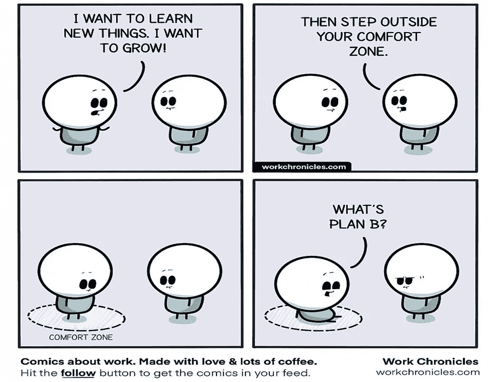

# 这就是为什么大多数程序员没能成为高级开发人员

> 原文：<https://levelup.gitconnected.com/this-is-why-most-programmers-fail-to-become-senior-developer-143bc8c1342d>

## 证明你还没有为下一个角色做好准备的 5 个习惯

信用: [Pixabay](https://pixabay.com/photos/soccer-player-sad-fail-failure-6678725/)

每个入门级程序员都希望有一天成为高级开发者。

随着程序员进入要求更高的高级职位，他们的责任也随之增加，这是很常见的。然而，人们在这些新的挑战中失败也并不少见。

往往程序员认为自己需要积累一定年限的经验，擅长编码才能成为高级开发者。虽然这些参数是必要的，但是成为一名高级开发人员需要付出更多的努力和行为转变。

关于这一点，让我们看看为什么大多数程序员无法成为高级开发人员的五个最常见的行为。

# 1.没有做出积极的决定

程序员花大部分时间为他们的业务编码和实现解决方案。然而，在工作几年后，他们需要对自己的职业发展做出更积极的决定。

成为高级开发人员没有明确的途径。这并不像你从大学毕业，花几年时间做一个初级开发人员，然后自动成为组织中的高级开发人员。

程序员需要时间往上爬。即使你展示了非凡的技能，根据你的竞争对手，你可能要等很长时间才能成为高级开发人员。因此，你需要学会做出积极的决定来保持竞争力。

许多程序员认为照顾员工的成长是他们经理的工作，这是不正确的。经理可以为你的职业决策提供便利和支持。但是他们不能帮助你，除非你自己努力。

要成为一名高级开发人员，你需要根据自己的经验承担适当的风险，并在机会到来时采取行动。陷入一份没有前途的工作，期望你的领导会注意到并推动你前进，这注定会让你失望。

# 2.变得舒适，不拥抱变化

信用:[工作时间](https://workchronicles.com/)

对于那些想成为高级开发人员的程序员来说，呆在舒适区而不学习新事物可能是灾难性的。作为初级开发人员，他们可能做得不错；但是，几年的停滞会扼杀他们的动力，让他们对自己失去信心。

如果不小心的话，优秀的开发人员经常会落入舒适的陷阱。

他们最初努力工作，以便很好地掌握他们的项目。它帮助他们理解应用程序，了解代码，高质量地实现需求，并且比其他人更快地修复缺陷。

他们的主动性和快速学习的能力帮助他们比同龄人表现得更好。他们成为团队中最好的开发人员之一。

最终，这些程序员被卷入了日常的漩涡，不再关注他们的技能建设。他们只是遵循流程，并在对他们来说容易的时候交付。他们相信自己的职业发展得很好，没有必要改变什么。

这样的开发人员不再想学习新的东西，这意味着将他们自己推出他们的舒适区。

几年后，他们发现自己陷入了困境，失去了对长期目标的关注。接受新的变化对他们来说变得很有挑战性。

因此，作为一名开发人员，坚持学习总是明智的。主动接受具有挑战性的任务，以保持最佳表现。如果你想被认可为高级开发人员，就要有意识地努力不断进步。

# 3.逃避承担所有权和责任

对于新程序员来说，这是一个典型的错误，大多数人在他们的职业生涯中都在犯这个错误。

作为一名程序员，你需要对你写的代码负责。你应该坦然承认自己的缺陷并改正它们。必要时，你必须准备好为自己的选择辩护。

要成为一名高级开发人员，你必须对整个项目负责。你需要为你团队的问题想出解决方案。你还需要投入战斗，主动帮助解决升级问题。

然而，大多数程序员都避免承担额外的责任。他们这样做要么是出于懒惰，要么是害怕后果。

懒惰的开发人员想做最起码的事情来维持他们的工作。但与此同时，他们不想降低自己的期望。

这种人试图依赖别人的工作，让自己远离麻烦。他们想要出风头和利益，但他们不想做实现这些所需要的工作。

短期内逃避责任听起来是个好主意。然而，这样的行为阻止了程序员在工作中学习。他们仍然害怕被问责。最终，他们对自己承担下一级角色失去了信心。

# 4.不停地抱怨工作环境

程序员擅长通过他们的代码解决问题。但他们往往缺乏解决职场问题的能力。

当开发人员不得不用次优的工具和过程工作时，他们发现很难专注于他们的工作。如果团队不协作，程序员就更难交付成果。

当面对工作场所的问题时，有两种选择——解决问题或抱怨问题。

缺乏情感成熟度的开发者选择了后者。他们发现很容易回避问题，而不是努力解决问题。而且，当问题没有自行消失时，他们会责怪团队或管理层没有提供健康的工作环境。

这样的开发人员在他们的职业生涯中不会成长。领导更多地将他们视为问题制造者，这损害了程序员的成长。

创造性地解决工作场所限制并交付高质量产品的开发人员成长得更快。他们获得了职业生涯中最好的机会。领导者更喜欢这样的人成为他们团队的一部分，并迅速将他们提升到高级职位。

# 5.缺乏专业纪律

对于任何想成为高级开发人员的程序员来说，一个训练有素的软件开发方法是必备的。

有纪律的交付的一些重要元素是——履行承诺、遵守时间表、协作、根据需要授权、需要时寻求帮助等。

这些标准听起来很容易，但是你会惊讶有多少软件工程师没有遵守它们。他们面临着挑战，因为他们缺乏知识或意愿来加强他们的游戏，成为一个更好的开发人员。

这些属性都是成为高级开发者的必备条件。但是，如果不付出必要的努力，你不可能自动地擅长所有这些。

为高级角色做好准备的开发人员努力工作以满足截止日期。他们很清楚自己的能力，并做出相应的承诺。团队相信这样的开发人员会履行他们的承诺。

另一方面，缺乏纪律的开发人员成为瓶颈。他们懈怠的态度伤害了团队和他们自己的生产力。最终，缺乏一个训练有素的软件开发方法会延迟这些程序员成为高级开发人员。

# 最后的想法

上面提到的五个习惯通常会让开发者付出高昂的代价。这正是为什么大多数程序员不能很快成为高级开发人员的原因。

如果你认识到这些特征中的任何一个，你就需要评估并努力改进它们。一开始打破习惯可能会让人感到畏惧。但是，如果你坚持不懈，我相信你可以克服它们，实现你的职业目标。

谢谢你的阅读。如果你喜欢我的文章，[你可以通过访问这个链接](https://lokajit-tikayatray.medium.com/membership)成为一个媒体成员来支持我的写作。

**你可能也喜欢阅读:**

 [## 你想成为最有效的程序员吗

### 根据我的经验，我有目的地避免工作场所的某些行为，以保持作为一名程序员的效率，并成为…

lokajit-tikayatray.medium.com](https://lokajit-tikayatray.medium.com/?p=aa29890cec73)  [## 高度成熟的软件开发人员的 5 个标志

### 这些特征很容易识别，但很难实践

levelup.gitconnected.com](/5-signs-of-a-highly-mature-software-developer-a23285e5cf1b)  [## 年度 15 个最搞笑的编程笑话

### 准备好大笑吧，看看这个精心策划的编程笑话列表

levelup.gitconnected.com](/15-funniest-programming-jokes-of-the-year-e048d972b0ef)