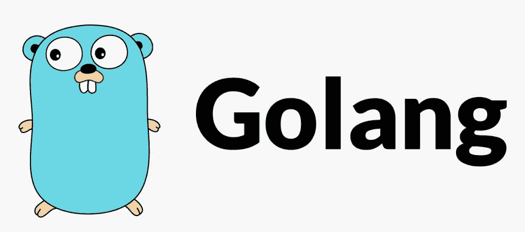

# 这就是为什么你应该学习 Golang

> 原文：<https://levelup.gitconnected.com/this-is-why-you-should-learn-golang-639b646320>



*图片由* [*刘霈*](https://www.kindpng.com/userpngs/469/) *在 KindPNG 上*

# 介绍

Golang 是最年轻的编程语言之一。在这篇文章发表之前，目前稳定的 Golang 版本是 1.17.2。除此之外，它被认为是开发人员中流行的编程语言。它可以在许多平台和环境(抱歉，是 Java)上构建和运行，与可靠的支持性内置包捆绑在一起，等等。

我使用 Golang 是因为它缺乏语言的魔力，冗长、结构化、简洁。在这篇文章中，你会发现为什么你应该考虑学习 Golang。我不打算将 Golang 与其他编程语言进行比较，因为我认为那将会烟消云散。所以先从语言结构本身说起。

# 语言结构

```
package mainimport ( "errors" "fmt")type Numbers []intfunc (n Numbers) Repeat() error { if n == nil { return errors.New("Numbers is nil") } for i, e := range n { fmt.Printf("%02d => %3d\n", i+1, e) } return nil}func main() { if err := Numbers(nil).Repeat(); err != nil { fmt.Println(err) } _ = Numbers([]int{1, 99, 100}).Repeat()}
```

我不会涵盖所有的语言语法，但上面的代码是 Golang 代码的一个例子。现在不需要理解，但是可以从作为代码范围的`package`、`import`、`func main`作为入口点、`if-else`、`for loop`作为控制结构之一、`types`、`nil`、`errors`等开始学习代码的结构。

它是`strictly typed`，使用`curly braces`作为作用域，即使你只写了一行控制结构，使用`nil`而不是`null`(你在这里节省了 1 个字符)，并且只使用分号来分隔语句，而不是结束它。综上所述，Golang 的语法是初学者友好的，至少我是这么认为的。

你不会害怕写一个肮脏的代码语法或任何东西，因为 Golang 不仅有自己的[指南](https://golang.org/doc/effective_go)来写得更好，它还有自己的`linter`和`formatter`来告诉你什么变量是未使用的。这就是你将要知道的。

# 内置支持

Golang 自带工具来构建优秀的应用程序。Linter？格式化程序？测试员？你把[命名为](https://pkg.go.dev/cmd/go)吧。它还有一个`garbage collector`，原生支持[并发](https://gobyexample.com/goroutines)，和一个[游乐场](https://play.golang.org/)。除此之外，Golang 还有支持性的内置包。可以不用任何第三方模块编写一个 [web 应用](https://gobyexample.com/http-servers)、[命令行界面应用](https://gobyexample.com/command-line-arguments)，甚至 [Web 组装应用](https://github.com/golang/go/wiki/WebAssembly#getting-started)。但是，如果你想创建一个 Golang 模块呢？大家说说吧。

# 组件

您可以在本地和远程轻松创建 Golang 模块。只需执行`go mod init <module-name>`，然后像往常一样编码。Golang 模块支持 git 开箱即用，您可以将 Golang 模块推送到 git 存储库，然后将其导入到您的代码中。例如，如果您想导入一个 Postgres 插件或我的数据库凭证旋转器模块，您只需输入 git repo 名称即可导入。

```
import ( "context" "database/sql" "log" "time" "github.com/ClavinJune/rotator" "github.com/lib/pq")
```

# 构建结果

二进制！Golang 将你的代码编译成二进制文件。如果你在 Windows 上，它会把你的代码编译成可执行文件，如果你在 Linux 上，它会编译一个 ELF 文件，等等。此外，您可以通过仅使用环境变量来控制构建。假设你在一台 Linux 机器上，但是你想为 windows 创建一个可执行文件，告诉它就行了。

```
$ lsmain.go$ GOOS=windows GOARCH=amd64 go build main.go$ file main.exemain.exe: PE32+ executable (console) x86-64 (stripped to external PDB), for MS Windows$ GOOS=darwin GOARCH=amd64 go build main.go$ file mainmain: Mach-O 64-bit x86_64 executable
```

您还可以创建 Web 程序集模块:

```
$ GOOS=js GOARCH=wasm go build -o main.wasm main.go$ file main.wasmmain.wasm: WebAssembly (wasm) binary module version 0x1 (MVP)
```

# 结论

我知道我没有涵盖所有的语言规范。以上所有的理由对我这个开发者来说都是相当主观的，你可以通过参考 [FAQ 页面](https://golang.org/doc/faq)或者 [specification 页面](https://golang.org/ref/spec)找到你对 Golang 的兴趣。此外，Golang 正在开发第二个版本[和](https://go.googlesource.com/proposal/+/master/design/go2draft.md)，它将支持通用和更好的错误处理。

感谢您的阅读！

*原载于 2021 年 10 月 27 日*[*https://clavinjune . dev*](https://clavinjune.dev/en/blogs/this-is-why-you-should-learn-golang/)*。*