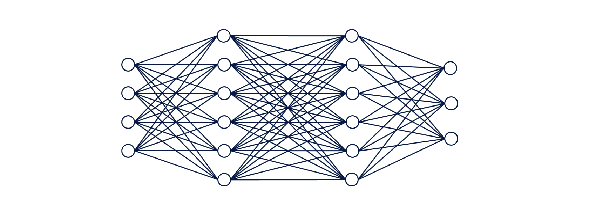

# 这是你的大脑…这是你的大脑作为一个神经网络

> 原文：<https://levelup.gitconnected.com/this-is-your-brain-this-is-your-brain-as-a-neural-network-fa50dd3e582d>

## [机器学习](https://towardsai.net/p/category/machine-learning)

## 人工神经网络是如何松散地模仿你的生物学的基础

Y 欧可能在想:*神经网络！这些听起来很复杂，虽然我知道它们很受欢迎，但我不确定如果没有深厚的科学或技术背景，我是否能够理解它们……*

继续读下去——这篇文章是给你的。其他人也一样。

Bret Kavanaugh 在 [Unsplash](https://unsplash.com?utm_source=medium&utm_medium=referral) 上拍摄的照片

## 一些生物学概念

在你的大脑中，有处理信息的神经元。它们接受新的信息，进行处理，然后传递电信号和化学信号。(如果你有生物学背景，我为这里发生的过度简化道歉。)

神经元通过轴突相互连接。这是你的大脑:数十亿个神经元连接在一起形成一个复杂的网络。信息通过多个相连的神经元传递，对你身体接收到的刺激做出反应。刺激的一个例子是，你的手触摸了一个热炉子的燃烧器，这很快就会触发神经元传递一个信号，从而触发你的身体做出把手缩回的反应。

大脑神经元放电[来自 GIPHY.com 哈佛大学](https://giphy.com/gifs/harvard-brain-neuron-9N2UvCx7wXLnG)

为了让你对这个复杂的神经元网络的规模有所了解，这里有一段摘自《TensorFlow 2 和 Keras 的深度学习》一书的摘录:

> “……我们的眼睛与大脑中被称为视觉皮层(V1)的区域相连……据估计，V1 由大约 1.4 亿个神经元组成，神经元之间有数百亿个连接。然后，V1 与其他区域(V2、V3、V4、V5 和 V6)相连，进行越来越复杂的图像处理，并识别更复杂的概念，如形状、面部、动物等等。据估计，大约有 160 亿个人类皮层神经元，大约 10-25%的人类皮层用于视觉[7]。(古利，安东尼奥，卡普尔，前岛亚美，帕尔，苏吉特，点燃位置 955-959)。

## 把东西拿到电脑上

现在，不要把一个神经元想象成你大脑中的一个小细胞，让我们把它想象成[一种功能，它接收其他神经元的输出，并输出一个介于 0 和 1 之间的数字](https://www.youtube.com/watch?v=aircAruvnKk&list=PLZHQObOWTQDN52m7Y21ePrTbvXkPaWVSg&index=3&t=0s)。

就像上图中多个*真实*大脑神经元是如何相互连接的一样，多个*人工*神经元也是相互连接的。

下面 GIF 中的每一列神经元(用圆圈表示)称为一个*层。*在最后一层，每个神经元的 0 到 1 之间的数字(用蓝绿色阴影表示)代表观察值被某个标签分类的可能性有多大。通过观察，我指的是变量 1-4 的集合，也就是表中的一行。

人工神经网络神经元放电(摘自 SydneyF 的 Alteryx 博客文章)

那么如果输入是变量，输出是观察的标签，那么中间层是什么呢？这些被称为隐藏层，描述它们的最简单的方式是将分类问题分解成更小的部分来处理。

**这是你的大脑作为神经网络。**可能有数千、数十万或数百万个这样处理的观察结果。

再次从[深度学习用 TensorFlow 2 和 Keras](https://www.amazon.com/Deep-Learning-TensorFlow-Keras-Regression/dp/1838823417) :

> “深度学习从人类视觉系统基于层的组织中获得了一些灵感:早期的人工神经元层学习图像的基本属性，而更深的层学习更复杂的概念”(古利、安东尼奥、卡普尔、前岛亚美、帕尔、苏吉特、Kindle Locations 955–959)。

然而，与你的大脑不同，我们可以很容易地改变层的数量和每层中神经元的数量，以提高算法的性能。由于隐藏层的数量超过 1–3，人们将该算法称为*深度学习*(而不是简单的神经网络)*。*自 2000 年代中期以来，深度学习越来越受欢迎，部分原因是计算能力和大型数据集的可用性越来越高。

## 最后

现在你已经掌握了基础知识，我希望你有足够的兴趣想了解更多！你可以在我在 Medium 上写的另一篇文章[中找到学习数据科学、神经网络和深度学习的各种免费资源。](https://towardsdatascience.com/a-compilation-of-free-data-science-resources-7861f572cc85)

请随意与你的技术人员和非技术人员朋友分享这个！

还有… [这是你服用了药物的大脑](https://www.nytimes.com/2016/08/08/business/media/this-is-your-brain-on-drugs-tweaked-for-todays-parents.html)。(【来自 GIPHY.com 的 )