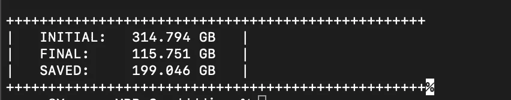

# 这段简单的代码可以节省 50%的 MacBook 空间

> 原文：<https://levelup.gitconnected.com/this-simple-code-can-save-50-of-your-macbook-space-763cdbc02415>

## 大型 Final Cut Pro X 项目的解决方案

照片由 [Noom Peerapong](https://unsplash.com/@imnoom?utm_source=medium&utm_medium=referral) 在 [Unsplash](https://unsplash.com?utm_source=medium&utm_medium=referral) 拍摄

几个月前，我创建了我的 YouTube 频道，在那里我发布与编程和技术相关的内容。为了编辑我的视频，我别无选择，只能使用 Final Cut Pro X，因为我的低规格 13 英寸 2015 MacBook Pro。在那台机器上编辑大量的项目简直是疯了。

最终削减是惊人的，它是像我这样的低规格设备最好的。唯一的问题是，它就像我吃巧克力松露蛋糕一样耗尽内存，在项目结束之前，内存是。我的每个项目需要大约 50 到 70 千兆字节。

我显然使用外部 SSD，但这还不够。大约 15 个项目之后，它就结束了，你不想删除你的旧项目。

# 关于 Final Cut Pro X 的文件结构

要编辑视频，您需要首先创建一个库。每个资源库都附带一个事件，如果需要，您可以创建更多事件。要处理该项目，您必须导入媒体和所有必要的文件。

“导入”会在 ***中创建一个名为“转码媒体”的文件夹。fcpbundle*文件。要查看它，右击 ***。fcpbundle*** 文件，进入事件文件夹。在事件文件夹中，将有一个原始媒体文件夹、渲染文件文件夹和转码媒体文件夹。**

原始媒体文件夹有原始文件的替身，当您在 Final Cut 中更改时间线时会创建“渲染文件”文件夹，转码后的媒体文件夹是原始媒体的副本，但它会针对 Final Cut Pro 优化文件。

我们可以安全地删除“渲染文件”文件夹，一旦您在 Final Cut 中打开项目，转码后的媒体文件夹就可以重新生成。这两个文件夹占据了项目中的大部分空间。

***注意:-如果原始媒体不在同一根项目文件夹中，请勿删除转码后的媒体文件夹。这是因为 Final Cut 在时间线中使用转码后的媒体。如果您删除它，而 Final Cut 找不到原始媒体，您的项目将被破坏。如果你不知道你在做什么，从下面的代码中删除第 24 行的这部分*** `***or each == “Transcoded Media”***` ***。***

# 以下是解决方案

做这件事有两种方法。

您可以手动操作，也可以创建一个程序来操作。如果您有一个庞大的项目，资源库中有许多事件，那么进入每个项目并删除每个渲染文件文件夹和转码后的媒体文件夹会很乏味。所以，我创造了一个程序来帮我做这件事。

## 代码解释

fcpxstorage.py 删除 FCPX 项目中的“渲染文件”文件夹和转码后的媒体文件夹。

首先，我们导入所需的库:`**os**` 到访问文件夹，`**sys**`读取命令行参数，`**shutil**`删除文件夹。

`**def get_size()**` 函数使用`[os.walk](https://docs.python.org/3/library/os.html)`遍历一个目录中的所有文件，并计算它们的大小。该函数返回文件夹的总大小。

现在我们需要删除渲染文件和转码媒体文件夹。为此，我们再次检查主文件夹中的每个文件夹，并检查是否匹配。如果有，`[shutil.rmtree()](https://docs.python.org/3/library/shutil.html)`命令删除它。

最后，我们再次计算文件夹的大小来计算差异。然后，我们使用花哨的 print 语句打印文件夹的初始大小和最终大小及其差异。

## 如何使用它

打开终端，输入`python3`，把代码拖到这里，按空格键。现在拖动保存所有项目的文件夹，然后按 enter 键。就是这样！在你的终端里你会变成这样。

电脑截图

享受额外的记忆。如果你知道更好的方法或者遇到任何问题，请告诉我。